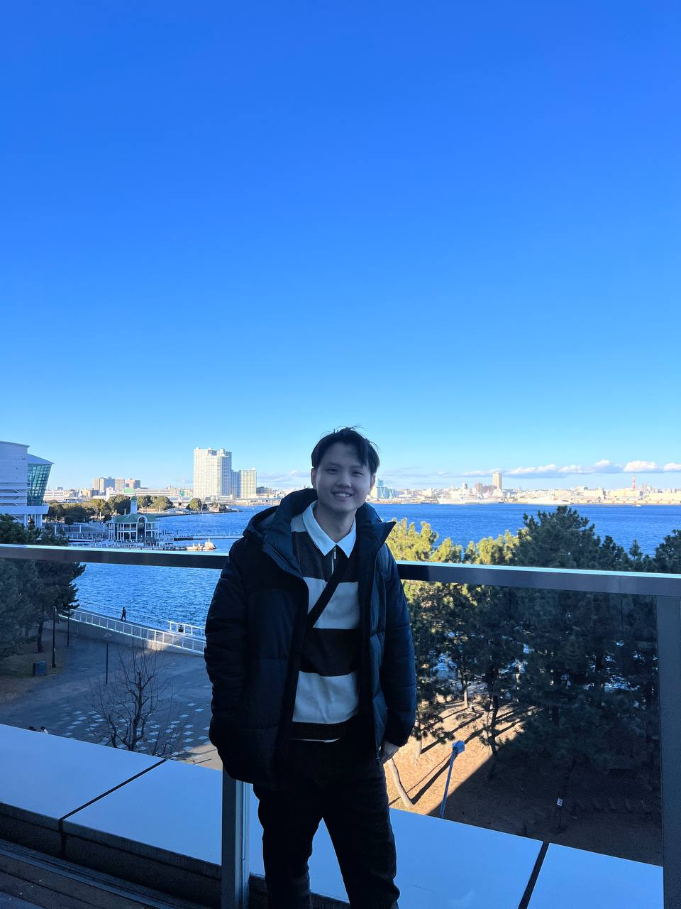
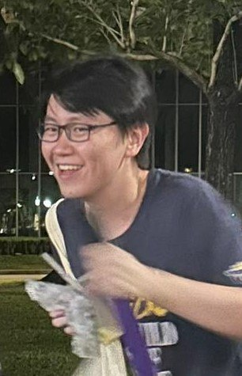
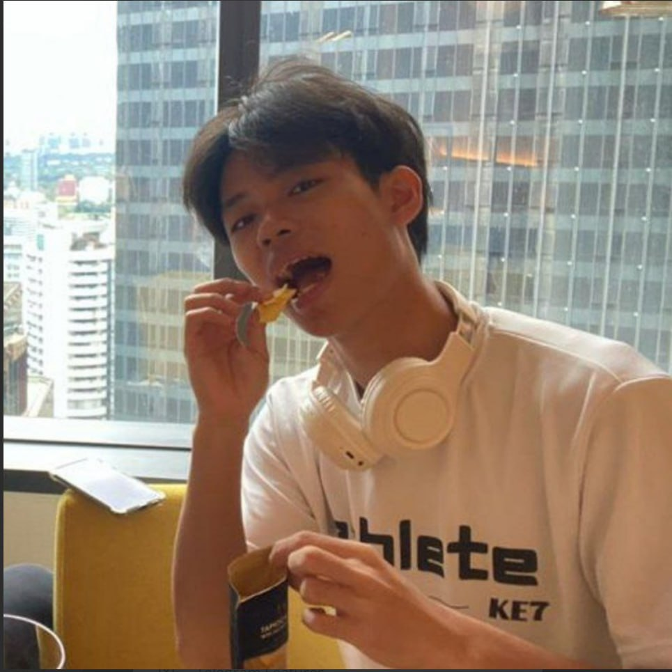
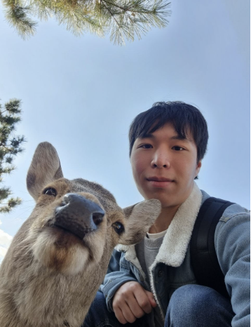
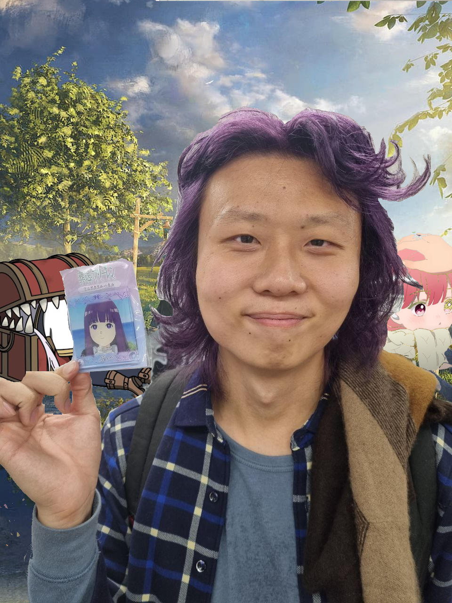

# About Us

We are a team based in the [School of Computing, National University of Singapore](http://www.comp.nus.edu.sg).

## Project team

### Cheah Tze Juen

[[github](https://github.com/cheahTJ)]
[[portfolio](team/cheahtj.md)]

* Roles: Team Lead
* Responsibilities:
    * Dedicates tasks among team and facilitate coordination among team members

### Tan Hong Jun

[[github](http://github.com/hjuntan)]
[[portfolio](team/hjuntan.md)]

* Role: Documentation
* Responsibilities: Ensures that all documentation are up-to-date and are specific to the user

### Loh Jin Hun

[[github](http://github.com/Ragnapop)] [[portfolio](team/ragnapop.md)]

* Role: Testing
* Responsibilities: Ensures that all features are properly tested, even on edge cases

### Chen Kuan Min

[[github](http://github.com/Rikko1204)]
[[portfolio](team/rikko1204.md)]

* Role: Scheduling and tracking
* Responsibilities: Ensures that the team is on pace with the 2 weeks sprint and helps assign
  task equally to members

### Guo Yuhao

[[github](http://github.com/RingoftheKing)]
[[portfolio](team/ringoftheking.md)]

* Role: Deliverables and deadlines
* Responsibilities: Ensures that the team is focussed on the individual task and is able to deliver the intended feature

