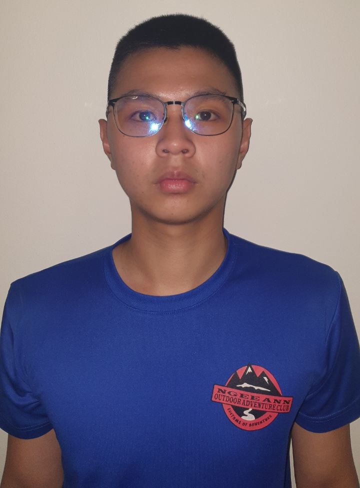
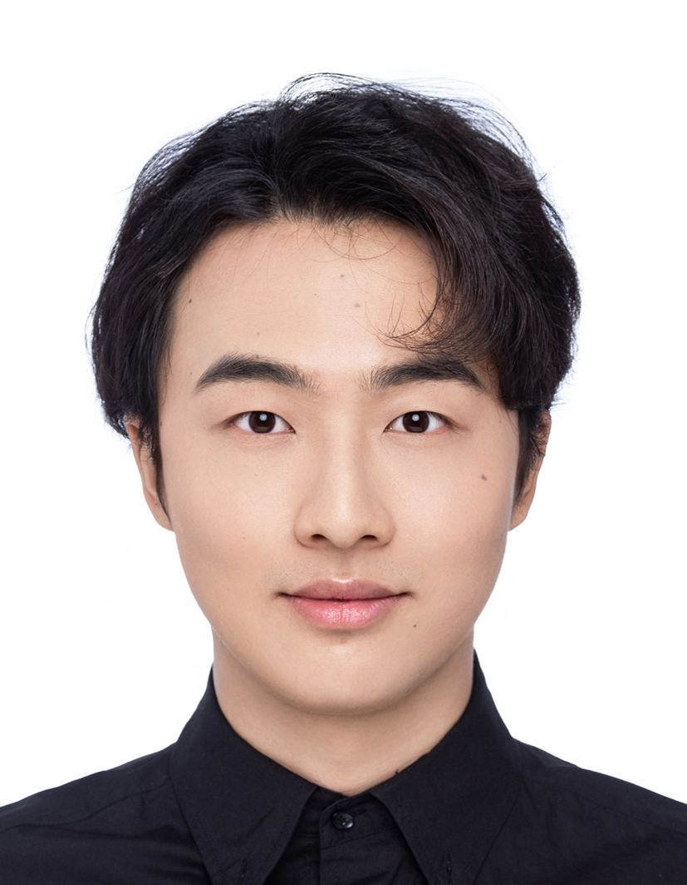
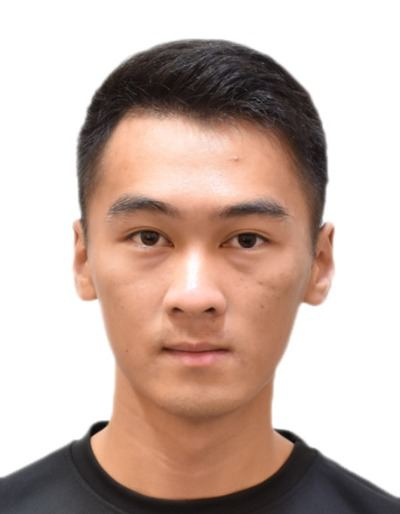
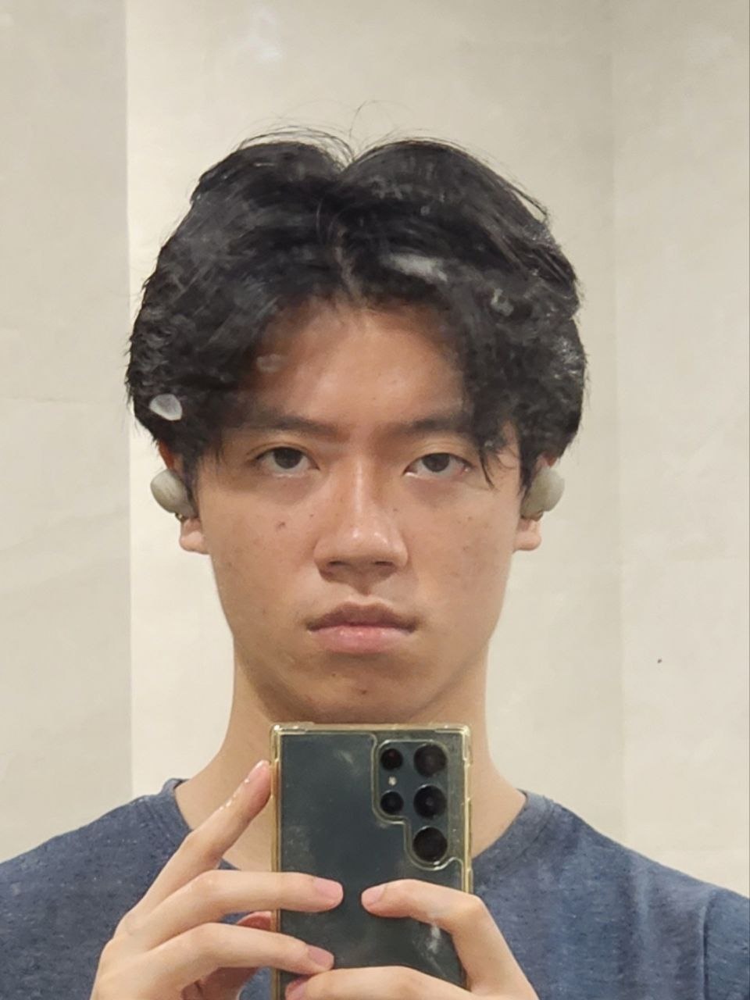
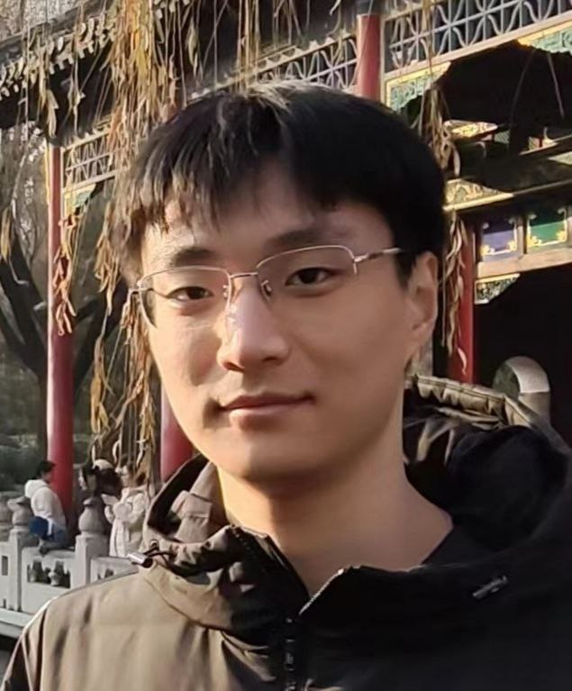

# About Us

We are a team based in the [School of Computing, National University of Singapore](http://www.comp.nus.edu.sg).

You can reach us at the email `seer[at]comp.nus.edu.sg`

## Project team

### Ng Hong Ray

<!-- [[homepage](http://www.comp.nus.edu.sg/~damithch)] -->
[[GitHub](https://github.com/HongRay)]
[[Portfolio](../members/hongRay.md)]

* Role: Developer
* Responsibility: UI

### Chen Xiao Yang

[[Github](http://github.com/ChenXy128)]
[[Portfolio](../members/Xiaoyang.md)]

* Role: Developer
* Responsibilities: UI

### Zhou Xuyan

[[Github](http://github.com/Xuyan0518)]
[[Portfolio](../members/Xuyan.md)]

* Role: Developer
* Responsibilities: Data

### Tan Jun Jia Cedric

[[Github](http://github.com/Cedricaca)]
[[Portfolio](../members/Cedricaca.md)]

* Role: Developer
* Responsibilities: Dev Ops + Threading

### Li Cheng Zhen

[[Github](http://github.com/NusMinato)]
[[Portfolio](../members/Chengzhen.md)]

* Role: Developer
* Responsibilities: UI
