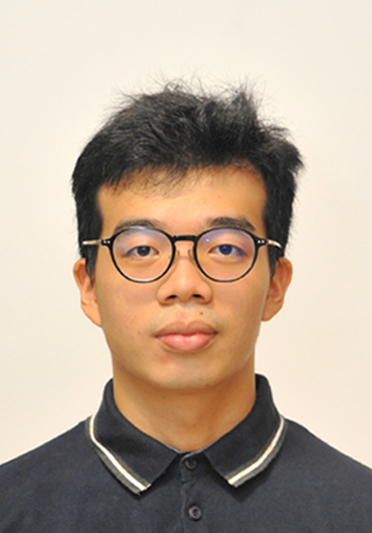
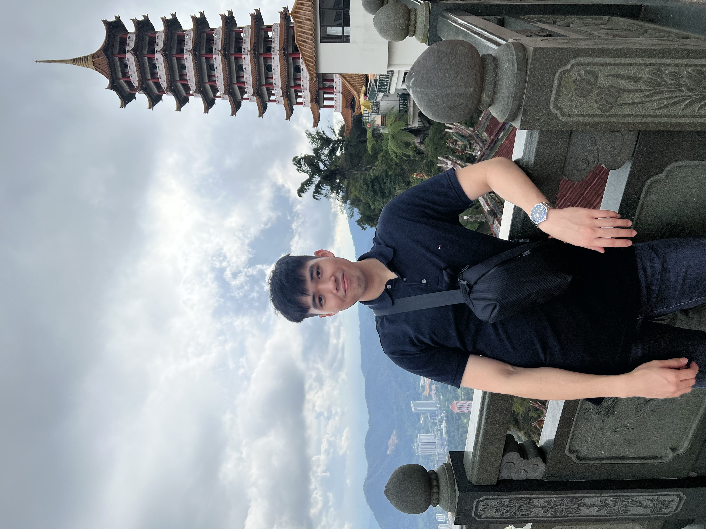
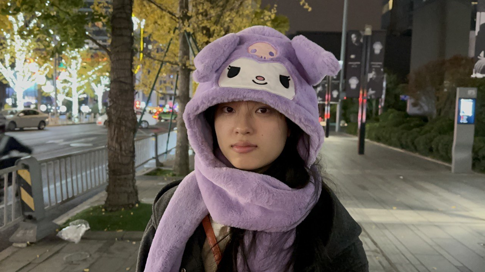
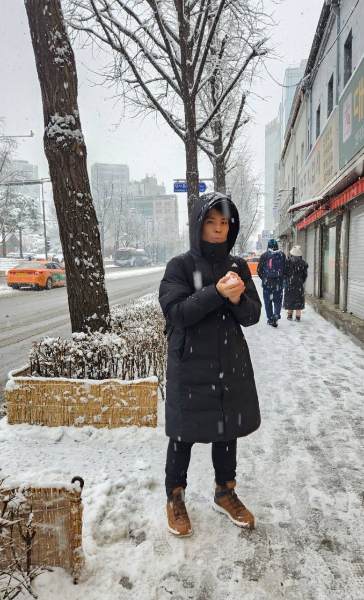

# About Us

We are a team based in the [School of Computing, National University of Singapore](http://www.comp.nus.edu.sg).

You can reach us at the email `felixchanyy.22@u.nus.edu`

## Project team

### Felix Chan

[[homepage](https://nus-cs2103-ay2324s2.github.io/website)]
[[github](https://github.com/felixchanyy)]
[[portfolio](https://www.linkedin.com/in/felixchanyy)]

* Role: Team Lead, Scheduling and Tracking, Git Expert
* Responsibilities: Responsible for overall project coordination,  in charge of defining, assigning, and tracking 
project tasks, helps other team members with matters related to Git

### Yek Khoon Sun

[[github](http://github.com/khoonsun47)]
[[portfolio](https://sg.linkedin.com/in/yek-khoon-sun-2b2270177)]

* Role: Testing
* Responsibilities: Ensures the testing of the project is done properly and on time

### Carl Lim

[[github](http://github.com/lokidoki102)] 
[[portfolio](https://www.linkedin.com/in/carl-lim-483980152/)]

* Role: Code Quality, IntelliJ expert
* Responsibilities: Looks after code quality and code review, ensures adherence to coding standards, 
helps other team members with matters related to IntelliJ

### Zeng Zihui

[[github](http://github.com/zengzihui)]
[[portfolio](https://www.linkedin.com/in/zeng-zihui)]

* Role: Documentation, In charge of UI
* Responsibilities: Responsible for the quality of various project documents,
review changes done to UI, act as the gate keeper of its quality, help others when they face
difficulties while modifying UI

### Liu Zhengyang

[[github](http://github.com/redcolorbicycle)]
[[portfolio](https://www.linkedin.com/in/liu-zhengyang)]

* Role: Deliverables and deadlines
* Responsibilities: Ensure project deliverables are done on time and in the right format
