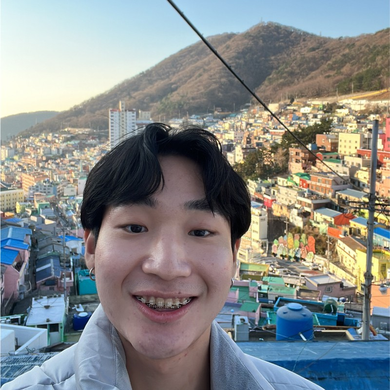
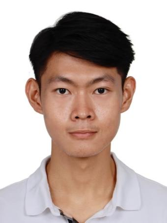
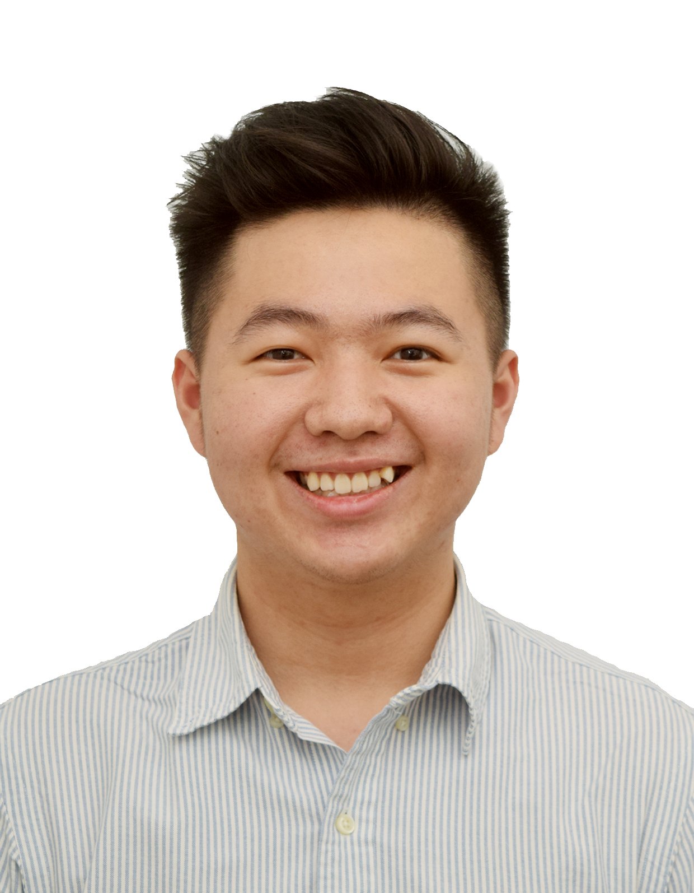
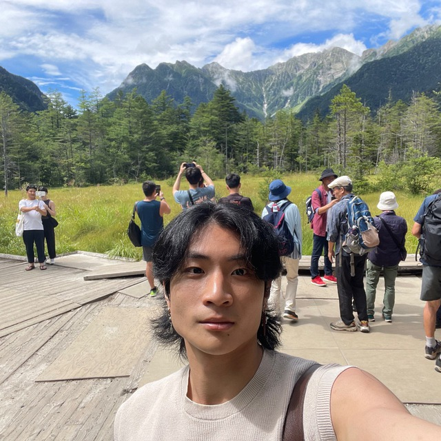

We are a team based in the [School of Computing, National University of Singapore](http://www.comp.nus.edu.sg).

You can reach us at the email `seer[at]comp.nus.edu.sg`

## Project team

### Jerome Goh

[[github](https://github.com/jaejayrome)]
[[portfolio](team/timothy)]

- Role: Developer
- Responsibilities: Model

### Timothy Chan

[[github](http://github.com/timothysashimi)]
[[portfolio](team/timothy)]

- Role: Developer
- Responsibilities: UI

### Kenneth Seet

[[github](http://github.com/itstrueitstrueitsrealitsreal)] [[portfolio](team/kenneth.md)]

- Role: Developer
- Responsibilities: Project Management

### Teo Hong Rui

[[github](https://github.com/sethteo)]
[[portfolio](team/hongrui.md)]

- Role: Developer
- Responsibilities: UI

### Chew Zi Xuan

[[github](http://github.com/chewbum)]
[[portfolio](team/timothy)]

- Role: Developer
- Responsibilities: Model
