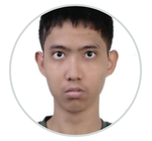
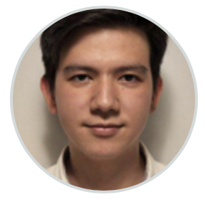
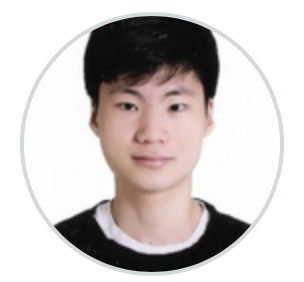
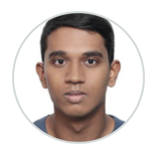

# About Us

We are a team based in the [School of Computing, National University of Singapore](http://www.comp.nus.edu.sg).

## Project team

### Aung Ko Khant

[[github](https://github.com/Ko-Khan)]

* Role: Developer
* Responsibilities: Testing

### Benny Loh Choon Keong

[[github](https://github.com/bennyLCK)]

* Role: Team Lead
* Responsibilities: Integration

### Hamish Stewart Dawe

[[github](https://github.com/H4mes)]

* Role: Developer
* Responsibilities: Deliverables + Deadlines
### Hyun Eunkyu

[[github](https://github.com/Howlong11)]

* Role: Developer
* Responsibilities: Scheduling + Tracking

### Murugan Maniish

[[github](https://github.com/Murugan-Maniish)]

* Role: Developer
* Responsibilities: Code Quality
