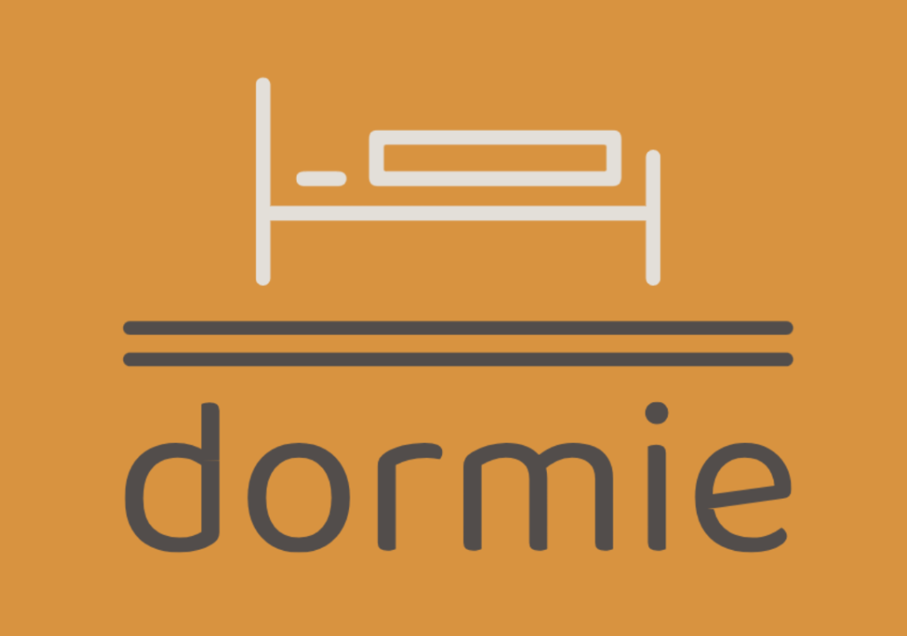
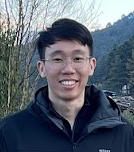
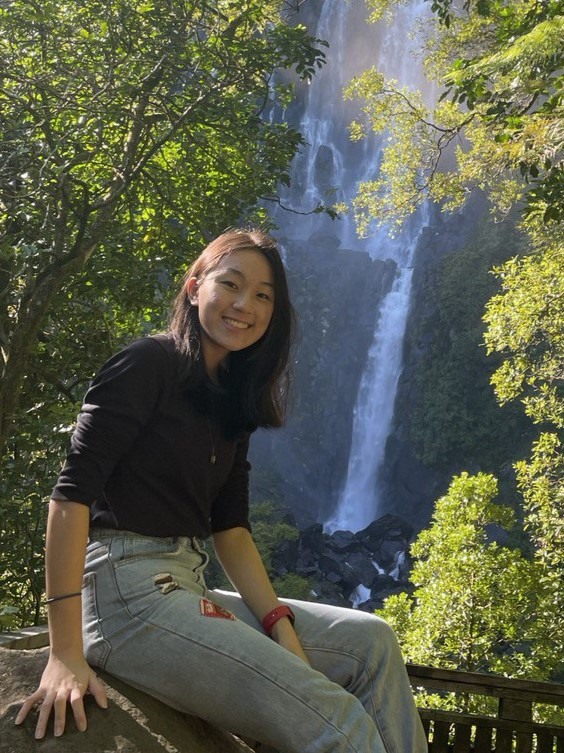
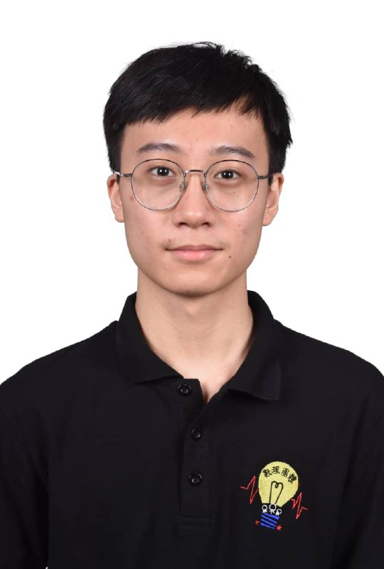
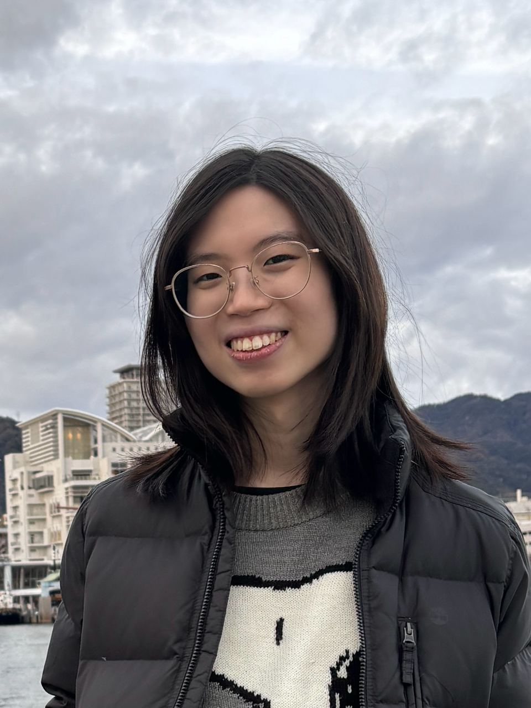

# About Us

We are a team based in the [School of Computing, National University of Singapore](http://www.comp.nus.edu.sg).

You can reach us at the email `dormie.cs2103T@gmail.com`

## Project team

### Donavon

Hi, I am Donavon, currently a Year 2 Computer Science student. I enjoy bouldering in my free time.

[[projects]()]
[[github](https://github.com/donwong2308)]
[[portfolio]()]

* Role: Developer
* Responsibilities: TBC

### Laraine

Hi, I’m Laraine, a year 2 Computer Science student. I like to wake up early to run! 

[[projects](https://larainelwx.wixsite.com/digitalportfolio)]
[[github](http://github.com/larainezo)]
[[portfolio]()]

* Role: Developer
* Responsibilities: TBC

### Pallon

Hi, I’m Chee Xiang, a year 2 Computer Science student. I’m from a country at North of Singapore, which is Malaysia. My hobby will be travelling around different countries (or locally), but I’m currently earning my travel expenses by studying (for a good income in the future) and working part-time.  

[[projects]()]
[[github](http://github.com/PallonCX)]
[[portfolio](team/johndoe.md)]

* Role: Developer
* Responsibilities: TBC

### Wei Hao

Hi, I’m Wei Hao, a year 2 Computer Science Student. I’m from Malaysia. I play video games and watch animes during my free time.  

[[projects]()]
[[github](http://github.com/JustWeiHao)]
[[portfolio]()]

* Role: Developer
* Responsibilities: TBC

### Zoe

I’m a Y2 CS & Psych double major. I like to sleep at least 8hrs :) 

[[projects]()]
[[github](http://github.com/nyankoclaws)]
[[portfolio]()]

* Role: Developer
* Responsibilities: TBC
