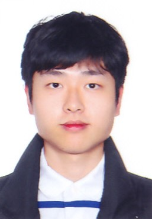

We are a team based in the [School of Computing, National University of Singapore](http://www.comp.nus.edu.sg).

## Project team

### Yu Zizhen

[[github](https://github.com/YuZizhen)]

* Role: Developer
* Responsibilities: Deliverables and deadlines

### Koh Guan Zeh

[[github](https://github.com/KohGuanZeh)]

* Role: Developer
* Responsibilities: Testing

### Javier Yong

[[github](https://github.com/Javiery3889)]

* Role: Developer
* Responsibilities: Scheduling and Tracking

### Lim Yong En, Dominic

[[github](http://github.com/Arixeyeion)]

* Role: Developer
* Responsibilities: Documentation

### David Zhu

[[github](http://github.com/Dethada)]

* Role: Developer
* Responsibilities: Code quality
