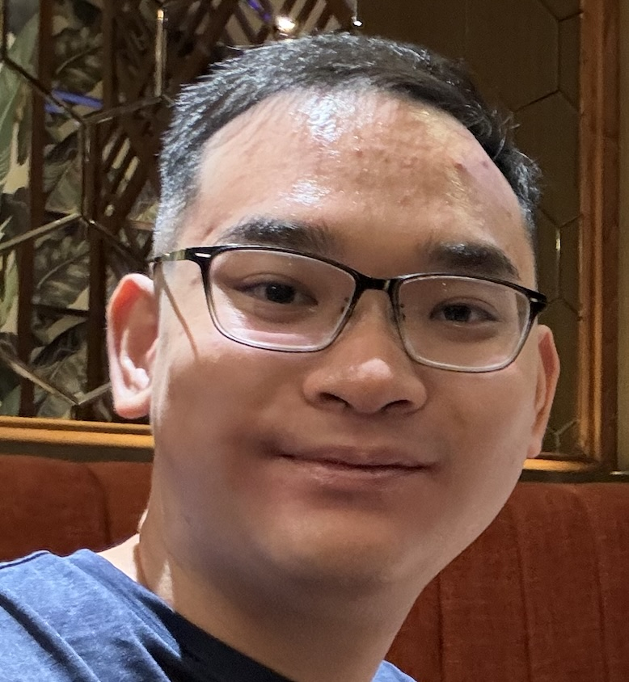
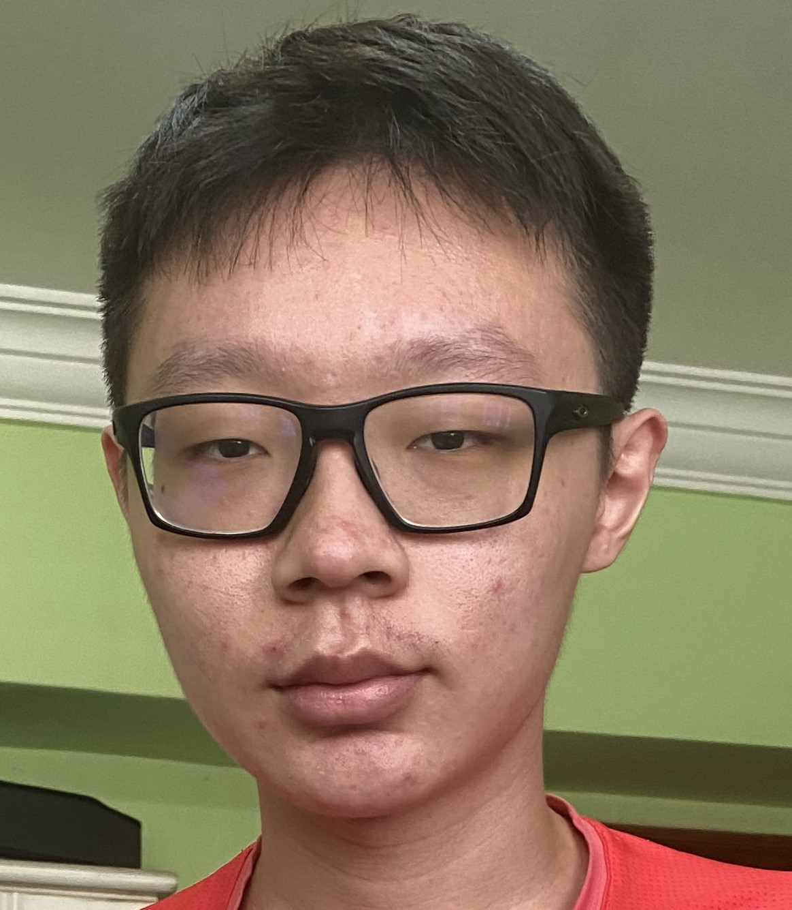

# About Us

We are a team based in the [School of Computing, National University of Singapore](http://www.comp.nus.edu.sg).

You can reach us at the email `seer[at]comp.nus.edu.sg`

## Project team

### John Doe

[[homepage](http://www.comp.nus.edu.sg/~damithch)]
[[github](https://github.com/johndoe)]
[[portfolio](team/johndoe.md)]

* Role: Project Advisor

### Jane Doe

[[github](http://github.com/johndoe)]
[[portfolio](team/johndoe.md)]

* Role: Team Lead
* Responsibilities: UI

### Johnny Doe

[[github](http://github.com/johndoe)] [[portfolio](team/johndoe.md)]

* Role: Developer
* Responsibilities: Data

### Wilson Widyadhana

[[github](https://github.com/wilsonwid)]
[[portfolio](team/wilsonwid.md)]

* Role: Team leader, Developer
* Responsibilities: Importing data, DevOps, User Guide, Developer Guide

### Chua Zi Long

<<<<<<< HEAD

=======

>>>>>>> master

[[github](https://github.com/ChuaZiLong)]
[[portfolio](team/zilong.md)]

* Role: Developer
* Responsibilities: README + Site-wide Settings + Exporting Data
