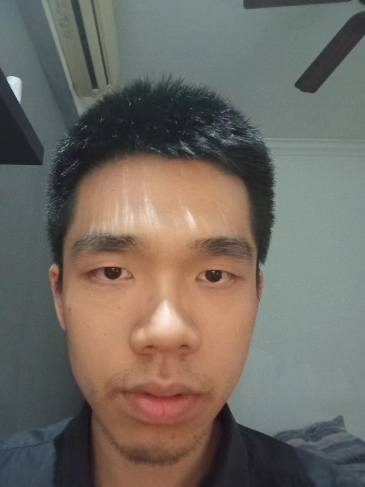
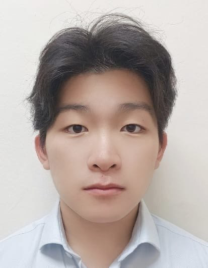
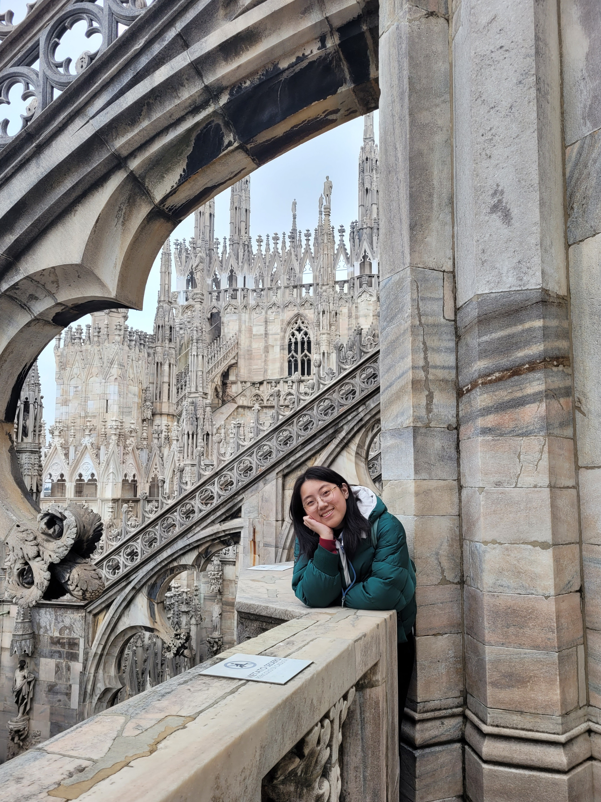

# About Us

We are a team based in the [School of Computing, National University of Singapore](http://www.comp.nus.edu.sg).

You can reach us at the email `seer[at]comp.nus.edu.sg`

## Project team

### Baizhou

[[github](https://github.com/windofbitter)]
[[portfolio](team/baizhou.md)]

* Role: Project Advisor

### Ho Kin Tat

[[github](http://github.com/kintatho)]
[[portfolio](team/kintat.md)]

* Role: Developer
* Responsibilities: Integration

### Liu Yiyang

[[github](https://github.com/0nesheep/)]
[[portfolio](team/yiyang.md)]

* Role: Developer
* Responsibilities: UI

### Marcus

[[github](http://github.com/marcusgitty)]
[[portfolio](team/marcus.md)]

* Role: Developer
* Responsibilities: Data

### Wu Yizheng

[[github](http://github.com/jessicawyz)]
[[portfolio](team/jessica.md)]

* Role: Developer
* Responsibilities: Deliverables
