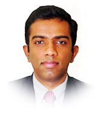

# About Us

We are a team based in the [School of Computing, National University of Singapore](http://www.comp.nus.edu.sg). 
We are passionate and deeply committed to using technology to create positive social impact.
We hope to alleviate some of the burdens social workers carry by streamlining their workflow 
and simplifying administrative tasks. Our goal is to free up valuable time and energy for 
social workers to focus on the most important aspects of their work.

You can reach us at the email `connect_care[at]comp.nus.edu.sg`

## Project team

### Damith C. Rajapakse

[[homepage](http://www.comp.nus.edu.sg/~damithch)]
[[github](https://github.com/damithc)]
[[portfolio](http://www.comp.nus.edu.sg/~damithch)]

* Role: Project Advisor

### P J Anthony

[[github](http://github.com/pjanthony2001)]
[[portfolio](team/anthony.md)]

* Role: Team Lead
* Responsibilities: Manages the project

### Au Jun Ming Jeremiah

[[github](http://github.com/jolonauh)]
[[portfolio](team/jeremiah.md)]

* Role: Developer
* Responsibilities: Testing

### Rishit Khandelwal

[[github](http://github.com/rishit02)] [[portfolio](team/rishit.md)]

* Role: Developer
* Responsibilities: Code Quality

### Eliot Lee Leong Wern

[[github](http://github.com/eliotlee68)]
[[portfolio](team/eliot.md)]

* Role: Developer
* Responsibilities: Deliverables and deadlines

### Tejas Sadasivam

[[github](http://github.com/tejas-1405)]
[[portfolio](team/tejas.md)]

* Role: Developer
* Responsibilities: Documentation
