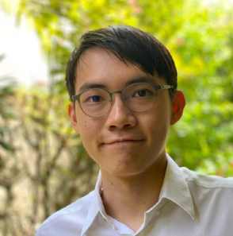

We are a team based in the [School of Computing, National University of Singapore](http://www.comp.nus.edu.sg).

You can reach us at the email `seer[at]comp.nus.edu.sg`

## Project team

### Yong Yu Sian

[[github](https://github.com/ys112)]
[[portfolio](team/ys112.md)]

* Role: Software Engineer
* Responsibilities: Deliverables and deadlines, Integration

### Yuv Bindal

[[github](http://github.com/YuvBindal)]
[[portfolio](team/yuvbindal.md)]

* Role: Software Engineer
* Responsibilities: Testing

### Lee Xin En

[[github](http://github.com/xinen26)]
[[portfolio](team/xinen26.md)]

* Role: Software Engineer
* Responsibilities: Scheduling and tracking

### Ho Wei Herng, Christopher

[[github](http://github.com/ChrisHo1341)]
[[portfolio](team/chrisho1341.md)]

* Role: Software Engineer
* Responsibilities: Documentation and code quality

### Li Haoquan

[[github](http://github.com/lihaoquan)]
[[portfolio](team/lihaoquan.md)]

* Role: Software Engineer
* Responsibilities: Integration, UI
