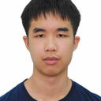
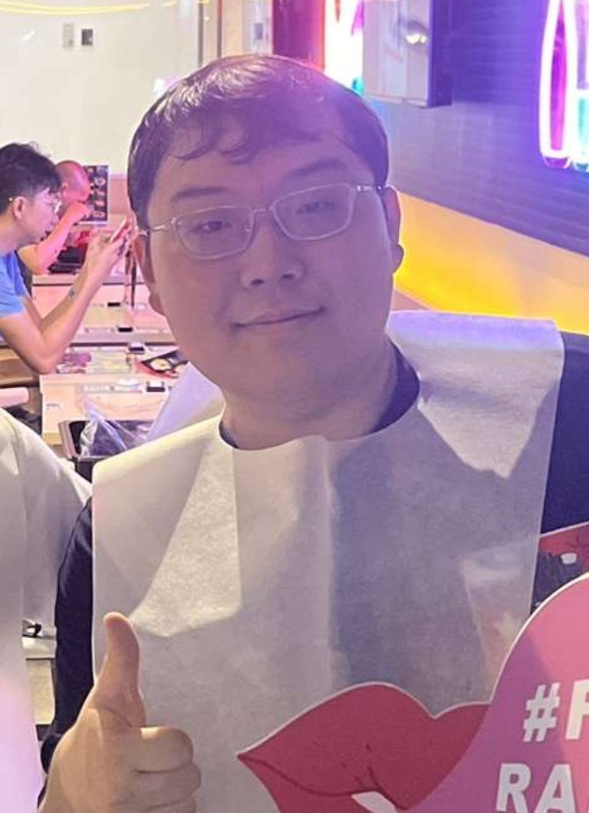

We are a team based in the [School of Computing, National University of Singapore](http://www.comp.nus.edu.sg).

You can reach us at the email `seer[at]comp.nus.edu.sg`

## Project team

### Ryan Tan

[[github](https://github.com/chiralcentre)]
[[portfolio](team/ryan.md)]

* Role: Developer
* Responsibilities: Backend, DevOps, Code Reviews, Project Coordination

### Lee Wei Ming

[[github](https://github.com/leeweiming3)]
[[portfolio](team/leeweiming3.md)]

* Role: Developer
* Responsibilities: Frontend, Backend, DevOps, Code Reviews

### Jane Doe

[[github](http://github.com/johndoe)]
[[portfolio](team/johndoe.md)]

* Role: Team Lead
* Responsibilities: UI

### Ikhoon Eom

[[github](https://github.com/acekhoon)] [[portfolio](team/ikhoon.md)]

* Role: Developer
* Responsibilities: Data

### Jean Doe

[[github](http://github.com/johndoe)]
[[portfolio](team/johndoe.md)]

* Role: Developer
* Responsibilities: Dev Ops + Threading

### Oliver Kong

[[github](http://github.com/0liverkong)]
[[portfolio](team/0liverkong.md)]

* Role: Developer
* Responsibilities: UI
