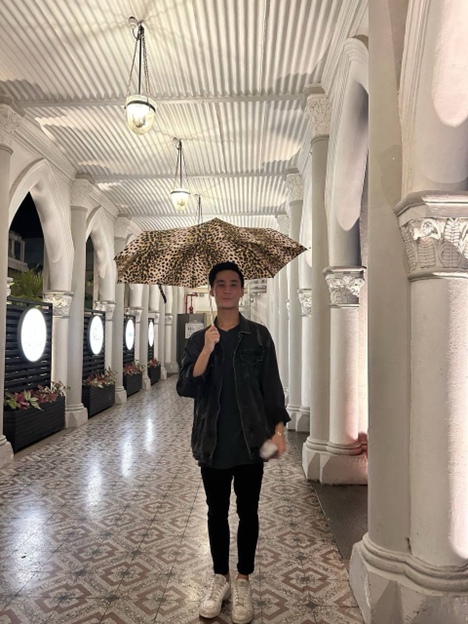
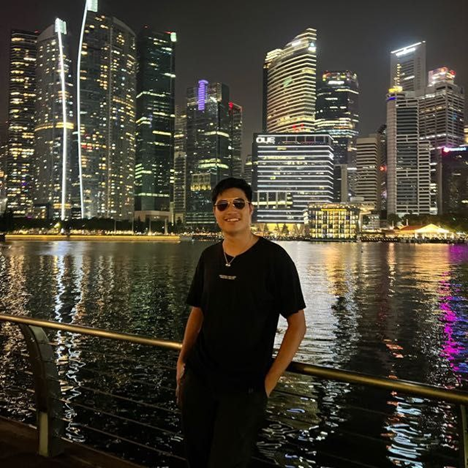
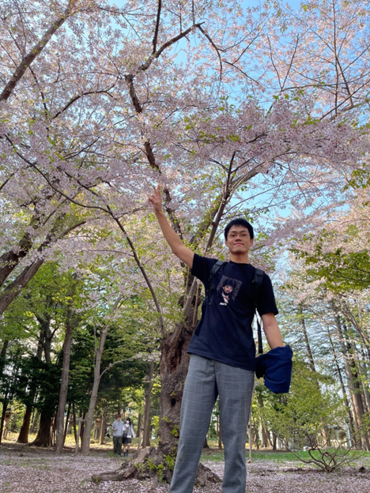
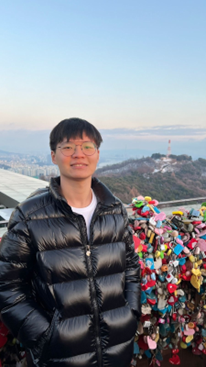

# About Us

We are a team based in the [School of Computing, National University of Singapore](http://www.comp.nus.edu.sg).
We are a group of Computer Science students undertaking CS2103T.

LookMeUp is an address book application that allows students to seamlessly save contacts of their peers in school. The team hopes that
this product will serve student better convenience in connecting with their friends!
For more enquiries, you can reach us at the email:
1. Koo Zhuo Hui `e0959005@u.nus.edu`
2. Kervyn Tan `e0941855@u.nus.edu`
3. Lynnette Ong Xin Hui `e0968030@u.nus.edu`
4. Aiden Lee Yuan Ting `aidenlyt@u.nus.edu`
5. Chen Runjia `runjia@u.nus.edu`

## Project Team

### Zhuo Hui Koo (Ivan)

[[Github](http://github.com/smolegz)]

Y2 CS student. My hobby is to drink w/ my besties; I am always the “take care of other ppl” 😊

* Role: Team Lead
* Responsibilities: Testing

### Kervyn Tan

[[Github](http://github.com/kervyntan)]

Y2, CS Major.
Love cycling on the weekends and playing LoL when I have time (basically never)

* Role: Developer
* Responsibilities: Integration

### Lynnette Ong

[[Github](http://github.com/lynnetteeee)]

Y2, CS, I love to travel (esp cold weather) and play squash!
I think coding without a deadline is >>>>>>>> ! Lowkey therapeutic... but once theres deadline... >.<

* Role: Developer
* Responsibilities: Code Quality

### Aiden Lee

[[Github](http://github.com/aidenlyt)]

Year 2 CS student. I eat ice cream with chopsticks.

* Role: Developer
* Responsibilities: Scheduling & Tracking

### RunJia Chen

[[Github](http://github.com/RunjiaChen)]

Y1 CS, like to watch Marvel shows like Loki, What if

* Role: Developer
* Responsibilities: Documentation
