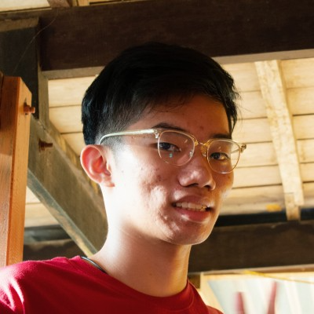

We are a team based in the [School of Computing, National University of Singapore](http://www.comp.nus.edu.sg).

## Project team

### John Doe

[[homepage](http://www.comp.nus.edu.sg/~damithch)]
[[github](https://github.com/johndoe)]
[[portfolio](team/johndoe.md)]

* Role: Project Advisor

### Koh Guan Zeh

[[github](https://github.com/KohGuanZeh)]

* Role: Developer
* Responsibilities: Testing

### Javier Yong

[[github](https://github.com/Javiery3889)]

* Role: Developer
* Responsibilities: Scheduling and Tracking

### Lim Yong En, Dominic

[[github](http://github.com/Arixeyeion)]

* Role: Developer
* Responsibilities: Documentation

### James Doe

[[github](http://github.com/johndoe)]
[[portfolio](team/johndoe.md)]

* Role: Developer
* Responsibilities: UI
