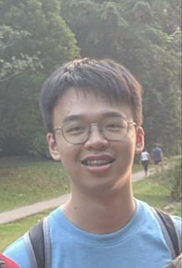

# About Us

We are a team based in the [School of Computing, National University of Singapore](http://www.comp.nus.edu.sg).

You can reach us at the email `seer[at]comp.nus.edu.sg`

## Project team

### Tang Yetong

[[homepage](https://darkvoid32.github.io/)]
[[github](https://github.com/darkvoid32)]
[[portfolio](team/darkvoid32.md)]

* Roles: Developer & Tester
* Responsibilities: Full-stack development and writing tests.

### Leong Heng Yew

[[github](http://github.com/aureliony)]
[[portfolio](team/aureliony.md)]

* Roles: Java Expert
* Responsibilities: Helps other team members with matters related to the Java programming language.

### Yee Jun Hyeok Bryan

[[github](http://github.com/bryanyee33)]
[[portfolio](team/bryanyee33.md)]

* Roles: UI & UX expert
* Responsibilities: Manages things related to the UI & UX such as JavaFX and design.

### Muhammad Rizki Bayuaji

[[github](http://github.com/rizkidelta)]
[[portfolio](team/rizkidelta.md)]

* Roles: Developer & Designer
* Responsibilities: Full-stack development and designing UI mockups or other components 
that are used in the application.

### Guk Yi Siong

[[github](http://github.com/yisiox)]
[[portfolio](team/yisiox.md)]

* Role: Developer & Taskmaster
* Responsibilities: Full-stack development and documentation.
In charge of defining, assigning, and tracking project tasks.

