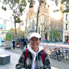

We are a team based in the [School of Computing, National University of Singapore](http://www.comp.nus.edu.sg).

You can reach the original AB3 team at the email `seer[at]comp.nus.edu.sg`

## Project team

### Camille Chin Rui Bin

[[github](https://github.com/camille-readbean)]

* Role: Team lead
* Responsibilities: Documentation, Testing, Code quality, Deliverables and deadlines, Integration, Scheduling and tracking

### Giselle Tan Yi Xi

[[github](http://github.com/GiselleTan)]

* Role: Team lead
* Responsibilities: Documentation, Testing, Code quality, Deliverables and deadlines, Integration, Scheduling and tracking

### Kin Wei Qi Vanessa

[[github](http://github.com/vannykin)]

* Role: Team lead
* Responsibilities: Documentation, Testing, Code quality, Deliverables and deadlines, Integration, Scheduling and tracking

### Koo Shu Jun, Theodore

[[github](http://github.com/TheodoreKooo)]

* Role: Team lead
* Responsibilities: Documentation, Testing, Code quality, Deliverables and deadlines, Integration, Scheduling and tracking

### Vatsal Vitosh

[[github](http://github.com/VatsalVitosh)]

* Role: Team lead
* Responsibilities: Documentation, Testing, Code quality, Deliverables and deadlines, Integration, Scheduling and tracking
