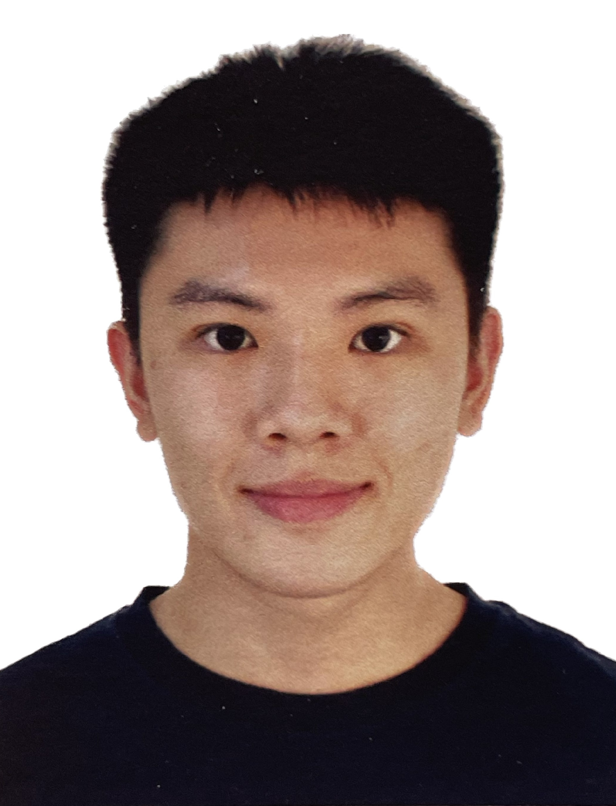

<!-- @format -->

We are a team based in the [School of Computing, National University of Singapore](http://www.comp.nus.edu.sg).

## ClickConnect

### Tan Kah Ho Dillon

[[github](https://github.com/dillontkh)]
[[portfolio](team/johndoe.md)]

- Role: Team Lead
- Responsible for overall project coordination.

### Baskar Gopinath

[[github](http://github.com/johndoe)]
[[portfolio](team/johndoe.md)]

- Role: Developer
- Responsibilities:

### Ng Wei Han, Ryan

[[github](http://github.com/ryanngwh)]
[[linkedin](https://www.linkedin.com/in/ryan-ngwh)]
[[portfolio](team/johndoe.md)]

- Role: Testing Lead
- Responsible for the quality and timeliness of the project testing.

### Chee Jing Jie

[[github](http://github.com/johndoe)]
[[portfolio](team/johndoe.md)]

- Role: Developer
- Responsibilities:

### Tay Rui-Jie

[[github](http://github.com/ruijietay)]
[[linkedin](https://www.linkedin.com/in/tayruijie/)]
[[portfolio](team/johndoe.md)]

- Role: Documentation Lead
- Responsible for the quality of the project website as well as various project documents.
