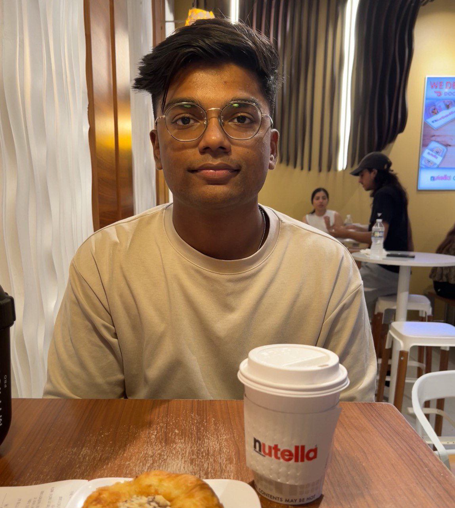
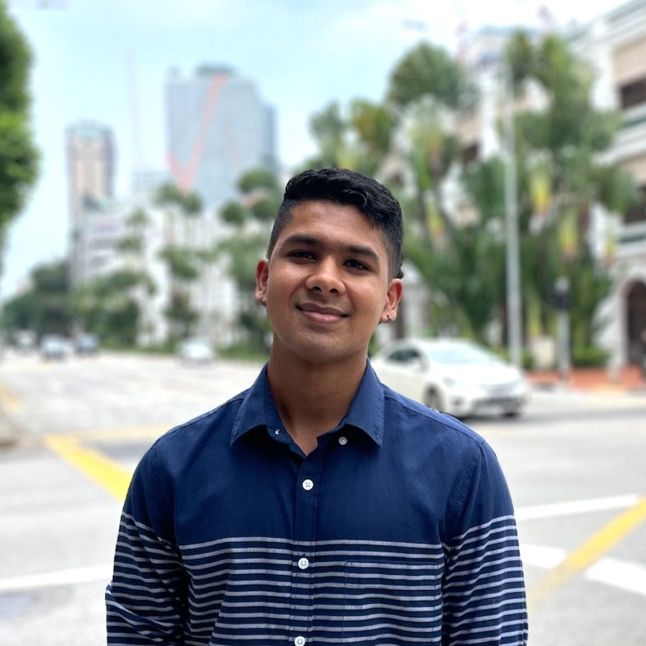
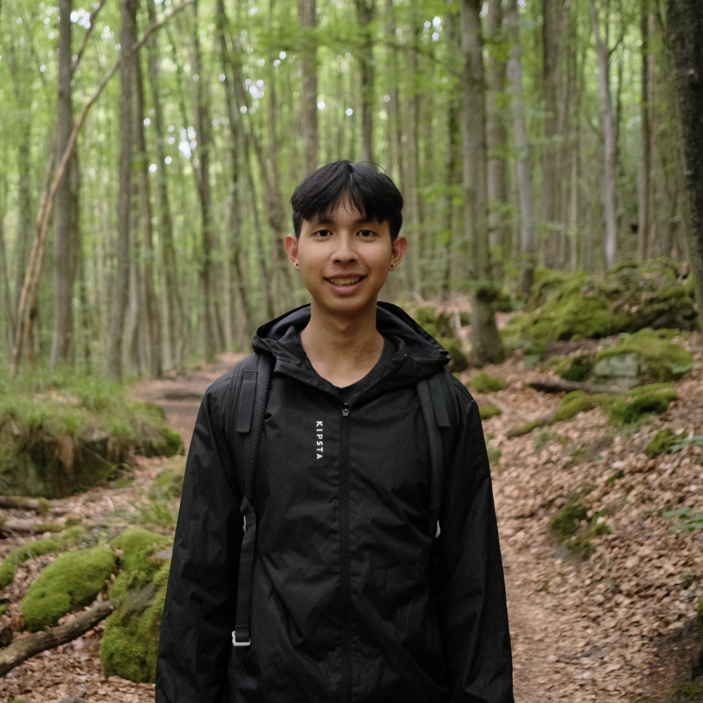
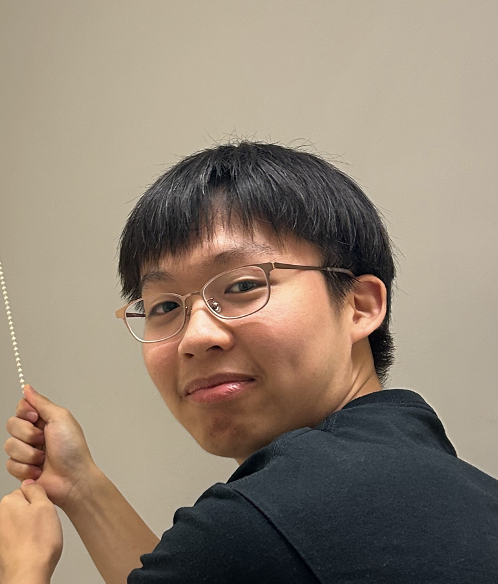

# About Us

We are a team based in the [School of Computing, National University of Singapore](http://www.comp.nus.edu.sg).

You can reach us at the email `seer[at]comp.nus.edu.sg`

## Project team

### Tejas Garrepally

[[homepage](http://www.gtejas.com)]
[[github](https://github.com/g-tejas)]
[[portfolio](team/johndoe.md)]

* Role:

### Gautham Kailash

[[homepage](https://www.kailashgautham.com)]
[[github](http://github.com/kailashgautham)]
[[portfolio](team/kailashgautham.md)]

* Role: TBC
* Responsibilities: TBC

### Ivan Ang

[[homepage](https://www.ivan-ang.com)]
[[github](https://github.com/hiivan)]
[[portfolio](team/ivan.md)]

* Role: TBC
* Responsibilities: TBC

### Axel Teo

[[github](http://github.com/teojunda)]
[[portfolio](team/teojunda.md)]

* Role: Developer
* Responsibilities: Dev Ops + Threading

### Ng Yu Soon

[[github](http://github.com/yusoonz)]
[[portfolio](team/ngyusoon.md)]

* Role: Developer
* Responsibilities: TBC
