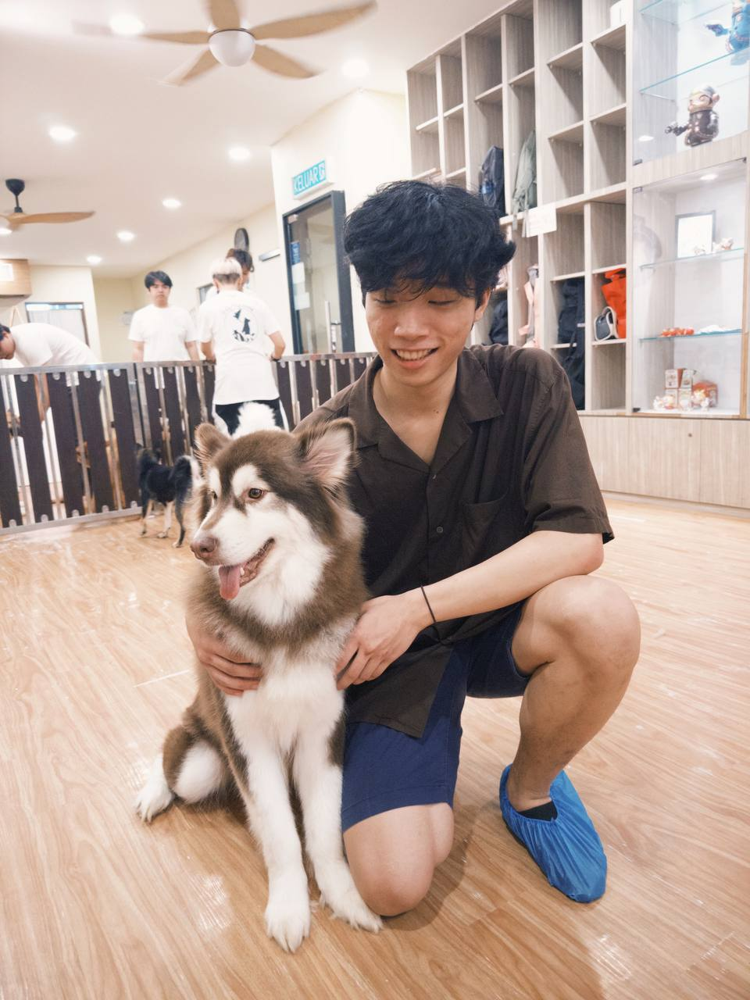

# About Us

We are a team based in the [School of Computing, National University of Singapore](http://www.comp.nus.edu.sg).

## Project team

### John Doe

[[homepage](http://www.comp.nus.edu.sg/~damithch)]
[[github](https://github.com/johndoe)]
[[portfolio](team/johndoe.md)]

* Role: Project Advisor

### Jane Doe

[[github](http://github.com/johndoe)]
[[portfolio](team/johndoe.md)]

* Role: Team Lead
* Responsibilities: UI

### Tsui Yi Wern

[[github](http://github.com/yiwern5)] [[portfolio](team/johndoe.md)]

* Role: Developer
* Responsibilities: Scheduling and tracking, Deliverables and deadlines, UI

### Yong Li An

[[github](http://github.com/wolffe88)]
[[portfolio](team/johndoe.md)]

* Role: Developer
* Responsibilities: Task Management, Deliverables and deadlines, UI

### James Doe

[[github](http://github.com/johndoe)]
[[portfolio](team/johndoe.md)]

* Role: Developer
* Responsibilities: UI
