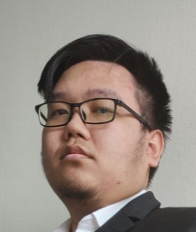

# About Us

We are a team based in the [School of Computing, National University of Singapore](http://www.comp.nus.edu.sg).

You can reach us at the email `seer[at]comp.nus.edu.sg`

## Project team

### Abdul Khaliq

[[github](https://github.com/breezetall)]

* Role: Project Advisor

### Chong Chin Herng

[[github](http://github.com/chin-herng)]
[[portfolio](team/johndoe.md)]

* Role: Team Lead
* Responsibilities: UI

### Dinh Tran Hai Chien

[[github](http://github.com/Kaya3842)]
[[portfolio](team/johndoe.md)]

* Role: Developer
* Responsibilities: Dev Ops + Threading

### Tang Hao Liang

[[github](http://github.com/nobodyishappy)]

* Role: Developer
* Responsibilities: Mark/Unmark Feature

### Yong Shi Kang

[[github](http://github.com/yskie)]

* Role: Developer
* Responsibilities: Deletion Feature
