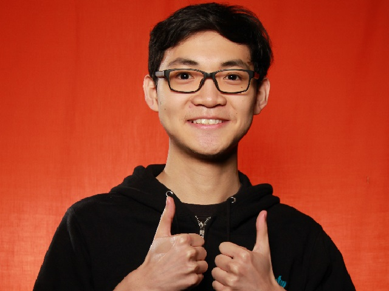

We are a team based in the [School of Computing, National University of Singapore](http://www.comp.nus.edu.sg).

You can reach us at the email `seer[at]comp.nus.edu.sg`

## Project team

### Ng Wei Chong Javier

[[github](https://github.com/javierng2knus)]
[[portfolio](team/javier.md)]

* Role: Team lead
* Responsibilities: <Will be reassigned on a later date>

### Ma Yuehan

[[github](https://github.com/MaYuehan)]
[[portfolio](team/mayuehan.md)]

* Role: Developer
* Responsibilities: Command implementation, documentation, Ui

### Mu Zhaoyu

[[github](http://github.com/Ella-e)] 
[[portfolio](team/ella-e.md)]

* Role: Developer
* Responsibilities: Command implementation, documentation

### Lai Yiwen

[[github](http://github.com/johndoe)]
[[portfolio](team/seahogs.md)]

* Role: Developer
* Responsibilities: Command implementation, documentation
