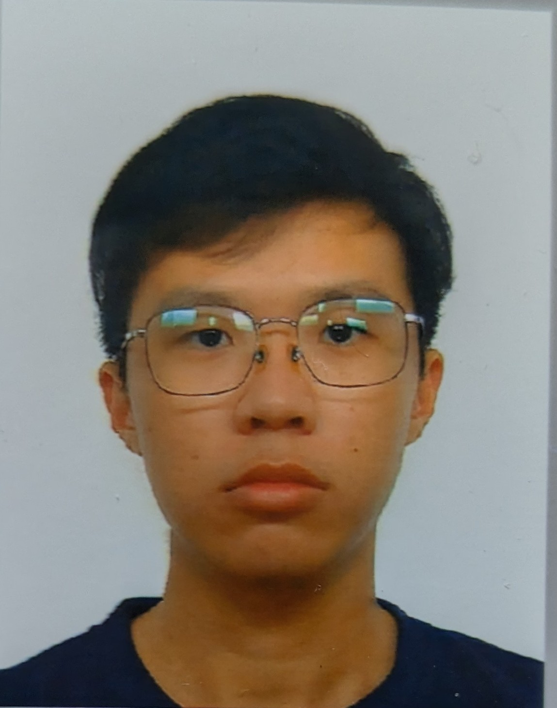

# About Us

We are a team based in the [School of Computing, National University of Singapore](http://www.comp.nus.edu.sg).

## Project team

### Sim Han Kiong

[[github](https://github.com/SimHanKiong)]
[[portfolio](team/simhankiong.md)]
[[email](e0957654@u.nus.edu)]

* Role: Team Lead
* Responsibilities: Code quality

### Tan Yun Chao

[[github](http://github.com/tanyunchao)]
[[portfolio](team/tanyunchao.md)]
[[email](tanyunchao@u.nus.edu)]

* Role: Developer, Git expert
* Responsibilities: Integration

### Tiong Chuan Yao

[[github](http://github.com/Colex2000)] 
[[portfolio](team/tiongchuanyao.md)]
[[email](tiongchuanyao@u.nus.edu)]

* Role: Developer
* Responsibilities: Testing + Scheduling and tracking

### Tan Zi Yang

[[github](http://github.com/ziyang27)]
[[portfolio](team/tanziyang.md)]
[[email](tan.ziyang@u.nus.edu)]

* Role: Developer
* Responsibilities: Documentation + Deliverables and deadlines
