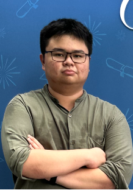
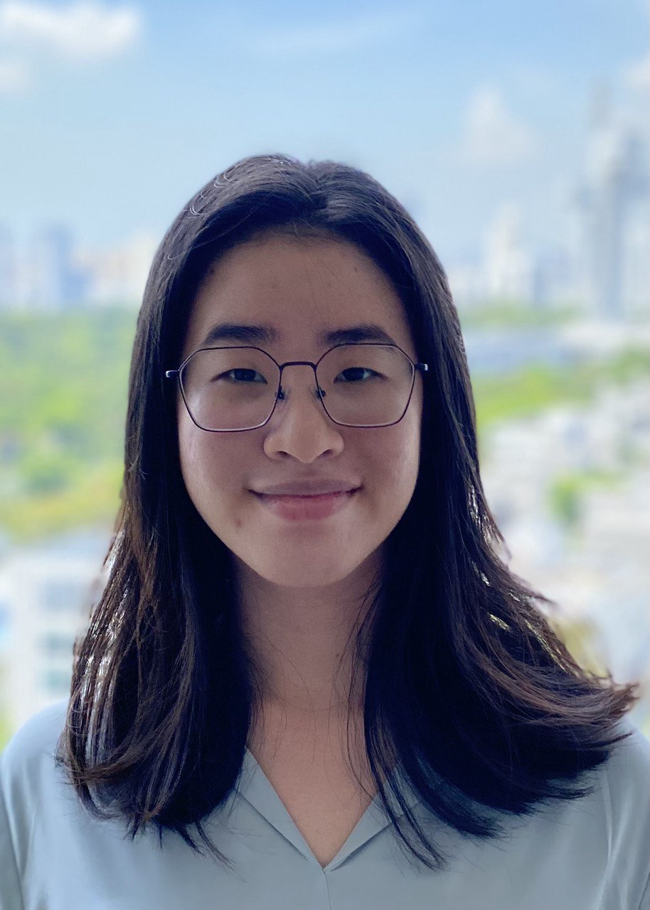

We are a team based in the [School of Computing, National University of Singapore](http://www.comp.nus.edu.sg).

You can reach us at the email `seer[at]comp.nus.edu.sg`

## Project team

### John Doe

[[homepage](http://www.comp.nus.edu.sg/~damithch)]
[[github](https://github.com/johndoe)]
[[portfolio](team/johndoe.md)]

* Role: Project Advisor

### Jane Doe

[[github](http://github.com/johndoe)]
[[portfolio](team/johndoe.md)]

* Role: Team Lead
* Responsibilities: UI

### Jerome Chua

[[github](http://github.com/Jerome-j] [[portfolio](team/vnnamng.md)]

* Role: Developer
* Responsibilities: Integration

### Nguyen Xuan Nam

[[github](http://github.com/vnnamng)] [[portfolio](team/vnnamng.md)]

* Role: Developer
* Responsibilities: Integration

### Caitlyn Tang

[[github](http://github.com/caitlyntang)]
[[portfolio](team/caitlyntang.md)]

* Role: Developer
* Responsibilities: Dev Ops + Threading

### Tan Khang Hou

[[github](http://github.com/tankh99)]
[[portfolio](team/tankh99.md)]

* Role: Developer
* Responsibilities: Code quality
