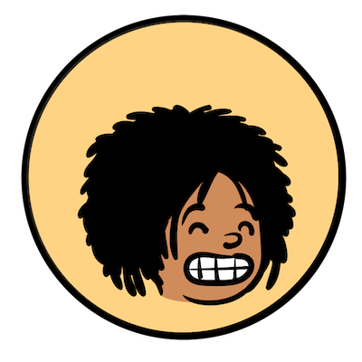

---
<h1 align=center><i>ABOUT US</i></h1>

---

We are a team based in the [School of Computing, National University of Singapore] (http://www.comp.nus.edu.sg). 
You can reach us at the email <code>seer[at]comp.nus.edu.sg</code>

<h2 align=center><i>Project team</I></h2>

### ReflectiveObsidian

[[github](https://github.com/ReflectiveObsidian)]

* Role: Developer
* Responsibilities: Data, Logic

### Bandov

[[github](https://github.com/Bandov)]

* Role: Developer
* Responsibilities: UI, Model

### Tsenrae

[[github](https://github.com/Tsenrae)]

* Role: Developer
* Responsibilities: Data, Storage

### Jean Doe

[[github](http://github.com/johndoe)]
[[portfolio](team/johndoe.md)]

* Role: Developer
* Responsibilities: Dev Ops + Threading

### DingBao-sys

[[github](http://github.com/DingBao-sys)]

* Role: Developer
* Responsibilities: UI
