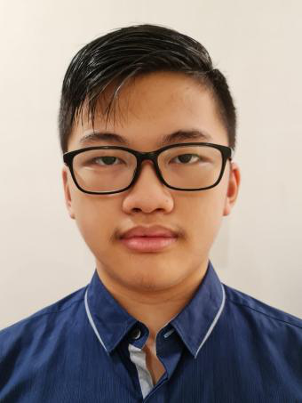

# About Us

We are a team based in the [School of Computing, National University of Singapore](http://www.comp.nus.edu.sg).

You can reach us at the email `seer[at]comp.nus.edu.sg`

## Project team

### Yeung Man Tsung (Benson)

[[github](https://github.com/benson1029)]

* Role: Team Lead
* Responsibilities: Scheduling and tracking, Deliverables and deadlines

### Maximilliano Utomo Quok

[[github](https://github.com/tzaph)]

* Role: Developer
* Responsiblities: Code Quality, Integration

### Narita Yuhi

[[github](https://github.com/yuhinarita)]

* Role: Team Lead
* Responsibilities: UI

### Ryan Reno Lim

[[github](https://github.com/Ryan-Reno)]

* Role: Developer
* Responsibilities: Documentation

### Tan Frederick Ivan Tiong

[[github](https://github.com/ivan24004)]

* Role: Developer
* Responsibilities: Testing, Integration