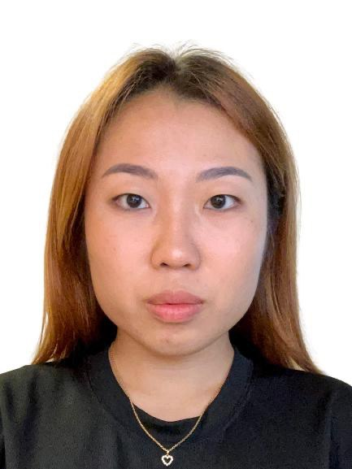

We are a NUS based software development team.

You can contact us individually through our portfolios

## ImmuniMate Project Team

### Alex Setyawan

[[github](http://github.com/johndoe)]
[[portfolio](team/johndoe.md)]

* Role: Team Lead
* Responsibilities: Project Manager, Back-end

### Tan Jovan

[[homepage](http:/jovantanyk.dev)]
[[github](https://github.com/jovantanyk)]
[[portfolio](team/jovantanyk.md)]

* Role: Developer
* Responsibilities: Back-end, Documentation

### Zhang Lanyu

[[github](http://github.com/laney0808)] [[portfolio](team/laney0808.md)]

* Role: Developer
* Responsibilities: Front-end, Documentation, UI Designer

### Natalie Leong

[[github](http://github.com/NatLeong)]
[[portfolio](team/johndoe.md)]

* Role: Developer
* Responsibilities: Front-end, Documentation
