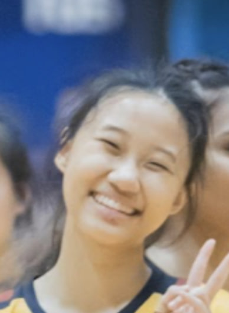

We are a team based in the [School of Computing, National University of Singapore](http://www.comp.nus.edu.sg).

You can reach us at the email `e0970466@comp.nus.edu.sg`

## Project team

### Yeo Jun Teng Drustan

[[github](https://github.com/drustanyjt)]
[[linkedin](https://www.linkedin.com/in/drustan/)]

* Role: Team Lead

### Chen Jiaying Jayne

[[github](http://github.com/Jayne1010)]

* Role: Developer
* Responsibilities: Documentation

### Song Jia Hui

[[github](http://github.com/jiahui0309)] 
[[linkedin](https://www.linkedin.com/in/song-jia-hui/)]

* Role: Developer
* Responsibilities: Integration

### Teng Shi Rou Charmaine

[[github](http://github.com/tengcharmaine)]
[[linkedin](https://www.linkedin.com/in/charmaine-teng/)]

* Role: Developer
* Responsibilities: Scheduling and tracking
