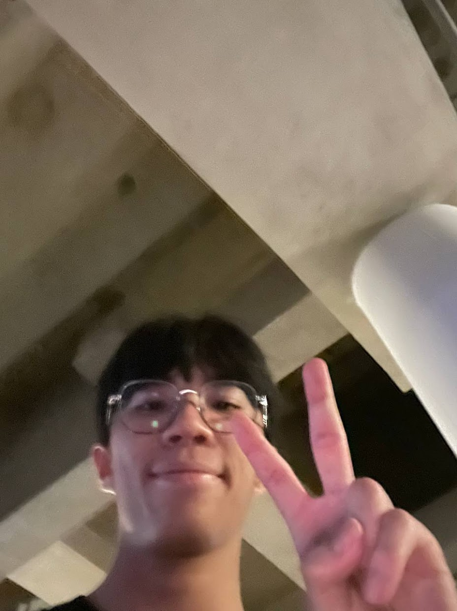

We are a team based in the [School of Computing, National University of Singapore](http://www.comp.nus.edu.sg).

You can reach us at the email `seer[at]comp.nus.edu.sg`

## Project team

### John Doe

[[homepage](http://www.comp.nus.edu.sg/~damithch)]
[[github](https://github.com/johndoe)]
[[portfolio](team/johndoe.md)]

* Role: Project Advisor

### Brandon Lau

[[github](http://github.com/blaukc)]
[[portfolio](team/blaukc.md)]

* Role: Developer
* Responsibilities: Code Quality

### Yadunand Prem

[[homepage](https://gitea.ts.yadunut.com)]
[[github](http://github.com/yadunut)] 
[[portfolio](team/yadunut.md)]

* Role: Developer
* Responsibilities: Code Writer

### Jean Doe

[[github](http://github.com/johndoe)]
[[portfolio](team/johndoe.md)]

* Role: Developer
* Responsibilities: Dev Ops + Threading
