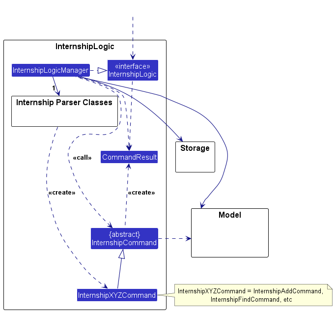
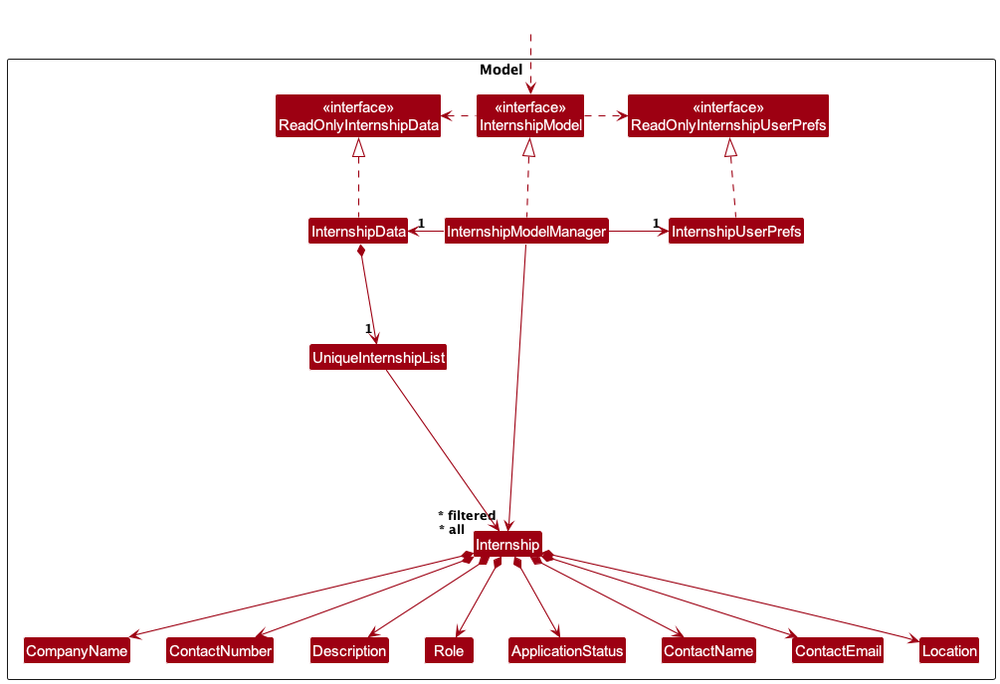
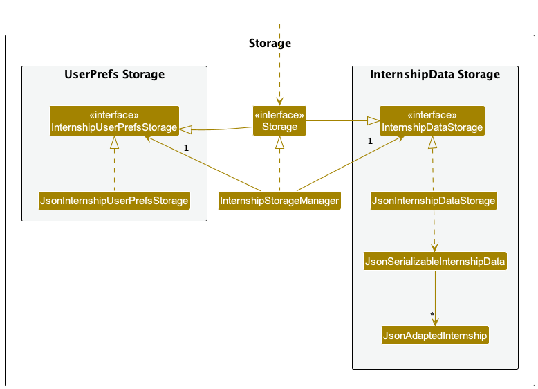

* Table of Contents
  {:toc}

--------------------------------------------------------------------------------------------------------------------

## **Acknowledgements**

* {list here sources of all reused/adapted ideas, code, documentation, and third-party libraries -- include links to the original source as well}

--------------------------------------------------------------------------------------------------------------------

## **Setting up, getting started**

Refer to the guide [_Setting up and getting started_](SettingUp.md).

--------------------------------------------------------------------------------------------------------------------

## **Design**

<div markdown="span" class="alert alert-primary">

:bulb: **Tip:** The `.puml` files used to create diagrams in this document `docs/diagrams` folder. Refer to the [_PlantUML Tutorial_ at se-edu/guides](https://se-education.org/guides/tutorials/plantUml.html) to learn how to create and edit diagrams.
</div>

### Architecture


c
The ***Architecture Diagram*** given above explains the high-level design of the App.

Given below is a quick overview of main components and how they interact with each other.

**Main components of the architecture**

**`Main`** (consisting of classes [`Main`](https://github.com/AY2324S2-CS2103T-W11-1/tp/blob/master/src/main/java/seedu/address/Main.java) and [`MainApp`](https://github.com/AY2324S2-CS2103T-W11-1/tp/blob/master/src/main/java/seedu/address/MainApp.java)) is in charge of the app launch and shut down.
* At app launch, it initializes the other components in the correct sequence, and connects them up with each other.
* At shut down, it shuts down the other components and invokes cleanup methods where necessary.

The bulk of the app's work is done by the following four components:

* [**`UI`**](#ui-component): The UI of the App.
* [**`InternshipLogic`**](#internshiplogic-component): The command executor.
* [**`InternshipModel`**](#internshipmodel-component): Holds the data of the App in memory.
* [**`Storage`**](#storage-component): Reads data from, and writes data to, the hard disk.

[**`Commons`**](#common-classes) represents a collection of classes used by multiple other components.

**How the architecture components interact with each other**

The *Sequence Diagram* below shows how the components interact with each other for the scenario where the user issues the command `delete 1`.


Each of the four main components (also shown in the diagram above),

* defines its *API* in an `interface` with the same name as the Component.
* implements its functionality using a concrete `{Component Name}Manager` class (which follows the corresponding API `interface` mentioned in the previous point.

For example, the `InternshipLogic` component defines its API in the `InternshipLogic.java` interface and implements its functionality using the `InternshipLogicManager.java` class which follows the `InternshipLogic` interface. Other components interact with a given component through its interface rather than the concrete class (reason: to prevent outside component's being coupled to the implementation of a component), as illustrated in the (partial) class diagram below.


The sections below give more details of each component.

### UI component

The **API** of this component is specified in [`Ui.java`](https://github.com/AY2324S2-CS2103T-W11-1/tp/blob/master/src/main/java/seedu/address/ui/Ui.java)


The UI consists of a `MainWindow` that is made up of parts e.g.`CommandBox`, `ResultDisplay`, `InternshipListPanel`, `StatusBarFooter` etc. All these, including the `MainWindow`, inherit from the abstract `UiPart` class which captures the commonalities between classes that represent parts of the visible GUI.

The `UI` component uses the JavaFx UI framework. The layout of these UI parts are defined in matching `.fxml` files that are in the `src/main/resources/view` folder. For example, the layout of the [`MainWindow`](https://github.com/AY2324S2-CS2103T-W11-1/tp/blob/master/src/main/java/seedu/address/ui/MainWindow.java) is specified in [`MainWindow.fxml`](https://github.com/AY2324S2-CS2103T-W11-1/tp/blob/master/src/main/resources/view/MainWindow.fxml)

The `UI` component,

* executes user commands using the `InternshipLogic` component.
* listens for changes to `Model` data so that the UI can be updated with the modified data.
* keeps a reference to the `InternshipLogic` component, because the `UI` relies on the `InternshipLogic` to execute commands.
* depends on some classes in the `Model` component, as it displays `Person` object residing in the `Model`.

### InternshipLogic component

**API** : [`InternshipLogic.java`](https://github.com/AY2324S2-CS2103T-W11-1/tp/blob/master/src/main/java/seedu/address/InternshipLogic/InternshipLogic.java)

Here's a (partial) class diagram of the `InternshipLogic` component:



The sequence diagram below illustrates the interactions within the `InternshipLogic` component, taking `execute("delete 1")` API call as an example.


<div markdown="span" class="alert alert-info">:information_source: **Note:** The lifeline for `DeleteCommandParser` should end at the destroy marker (X) but due to a limitation of PlantUML, the lifeline continues till the end of diagram.
</div>

How the `InternshipLogic` component works:

1. When `InternshipLogic` is called upon to execute a command, it is passed to an `InternshipDataParser` object which in turn creates a parser that matches the command (e.g., `DeleteCommandParser`) and uses it to parse the command.
1. This results in a `Command` object (more precisely, an object of one of its subclasses e.g., `DeleteCommand`) which is executed by the `InternshipLogicManager`.
1. The command can communicate with the `Model` when it is executed (e.g. to delete a person).<br>
   Note that although this is shown as a single step in the diagram above (for simplicity), in the code it can take several interactions (between the command object and the `Model`) to achieve.
1. The result of the command execution is encapsulated as a `CommandResult` object which is returned back from `InternshipLogic`.

Here are the other classes in `InternshipLogic` (omitted from the class diagram above) that are used for parsing a user command:


How the parsing works:
* When called upon to parse a user command, the `InternshipDataParser` class creates an `XYZCommandParser` (`XYZ` is a placeholder for the specific command name e.g., `AddCommandParser`) which uses the other classes shown above to parse the user command and create a `XYZCommand` object (e.g., `AddCommand`) which the `InternshipDataParser` returns back as a `Command` object.
* All `XYZCommandParser` classes (e.g., `AddCommandParser`, `DeleteCommandParser`, ...) inherit from the `Parser` interface so that they can be treated similarly where possible e.g, during testing.

### InternshipModel component
**API** : [`InternshipModel.java`](https://github.com/AY2324S2-CS2103T-W11-1/tp/blob/master/src/main/java/seedu/address/model/InternshipModel.java)




The `Model` component,

* stores the internship data i.e., all `Internship` objects (which are contained in a `UniqueInternshipList` object).
* stores the currently 'selected' `Internship` objects (e.g., results of a search query) as a separate _filtered_ list which is exposed to outsiders as an unmodifiable `ObservableList<Internship>` that can be 'observed' e.g. the UI can be bound to this list so that the UI automatically updates when the data in the list change.
* stores a `InternshipUserPref` object that represents the user’s preferences. This is exposed to the outside as a `ReadOnlyInternshipUserPref` objects.
* does not depend on any of the other three components (as the `Model` represents data entities of the domain, they should make sense on their own without depending on other components)

### Storage component

**API** : [`Storage.java`](https://github.com/AY2324S2-CS2103T-W11-1/tp/blob/master/src/main/java/seedu/address/storage/Storage.java)



The `Storage` component,
* can save both internship data and user preference data in JSON format, and read them back into corresponding objects.
* inherits from both `InternshipDataStorage` and `InternshipUserPrefsStorage`, which means it can be treated as either one (if only the functionality of only one is needed).
* depends on some classes in the `Model` component (because the `Storage` component's job is to save/retrieve objects that belong to the `Model`)

### Common classes

Classes used by multiple components are in the `seedu.addressbook.commons` package.

--------------------------------------------------------------------------------------------------------------------

## **Implementation**

This section describes some noteworthy details on how certain features are implemented.

### \[Proposed\] Undo/redo feature

#### Proposed Implementation

The proposed undo/redo mechanism is facilitated by `VersionedInternshipData`. It extends `InternshipData` with an undo/redo history, stored internally as an `internshipDataStateList` and `currentStatePointer`. Additionally, it implements the following operations:

* `VersionedInternshipData#commit()` — Saves the current address book state in its history.
* `VersionedInternshipData#undo()` — Restores the previous address book state from its history.
* `VersionedInternshipData#redo()` — Restores a previously undone address book state from its history.

These operations are exposed in the `InternshipModel` interface as `InternshipModel#commitInternshipData()`, `InternshipModel#undoInternshipData()` and `InternshipModel#redoInternshipData()` respectively.

Given below is an example usage scenario and how the undo/redo mechanism behaves at each step.

Step 1. The user launches the application for the first time. The `VersionedInternshipData` will be initialized with the initial internship data state, and the `currentStatePointer` pointing to that single internship data state.


Step 2. The user executes `delete 5` command to delete the 5th person in the internship data. The `delete` command calls `InternshipModel#commitInternshipData()`, causing the modified state of the internship data after the `delete 5` command executes to be saved in the `internshipDataStateList`, and the `currentStatePointer` is shifted to the newly inserted internship data state.


Step 3. The user executes `add n/David …​` to add a new internship. The `add` command also calls `InternshipModel#commitInternshipData()`, causing another modified internship data state to be saved into the `internshipDataStateList`.


<div markdown="span" class="alert alert-info">:information_source: **Note:** If a command fails its execution, it will not call `InternshipModel#commitInternshipData()`, so the address book state will not be saved into the `internshipDataStateList`.

</div>

Step 4. The user now decides that adding the internship was a mistake, and decides to undo that action by executing the `undo` command. The `undo` command will call `InternshipModel#undoInternshipData()`, which will shift the `currentStatePointer` once to the left, pointing it to the previous internship data state, and restores the internship data to that state.


<div markdown="span" class="alert alert-info">:information_source: **Note:** If the `currentStatePointer` is at index 0, pointing to the initial InternshipData state, then there are no previous InternshipData states to restore. The `undo` command uses `InternshipModel#canUndoInternshipData()` to check if this is the case. If so, it will return an error to the user rather
than attempting to perform the undo.

</div>

The following sequence diagram shows how an undo operation goes through the `InternshipLogic` component:


<div markdown="span" class="alert alert-info">:information_source: **Note:** The lifeline for `UndoCommand` should end at the destroy marker (X) but due to a limitation of PlantUML, the lifeline reaches the end of diagram.

</div>

Similarly, how an undo operation goes through the `Model` component is shown below:


The `redo` command does the opposite — it calls `InternshipModel#redoInternshipData()`, which shifts the `currentStatePointer` once to the right, pointing to the previously undone state, and restores the internship data to that state.

<div markdown="span" class="alert alert-info">:information_source: **Note:** If the `currentStatePointer` is at index `internshipDataStateList.size() - 1`, pointing to the latest internship data state, then there are no undone InternshipData states to restore. The `redo` command uses `InternshipModel#canRedoInternshipData()` to check if this is the case. If so, it will return an error to the user rather than attempting to perform the redo.

</div>

Step 5. The user then decides to execute the command `list`. Commands that do not modify the internship data, such as `list`, will usually not call `InternshipModel#commitInternshipData()`, `InternshipModel#undoInternshipData()` or `InternshipModel#redoInternshipData()`. Thus, the `internshipDataStateList` remains unchanged.


Step 6. The user executes `clear`, which calls `InternshipModel#commitInternshipData()`. Since the `currentStatePointer` is not pointing at the end of the `internshipDataStateList`, all internship data states after the `currentStatePointer` will be purged. Reason: It no longer makes sense to redo the `add n/David …​` command. This is the behavior that most modern desktop applications follow.


The following activity diagram summarizes what happens when a user executes a new command:


#### Design considerations:

**Aspect: How undo & redo executes:**

* **Alternative 1 (current choice):** Saves the entire internship data.
    * Pros: Easy to implement.
    * Cons: May have performance issues in terms of memory usage.

* **Alternative 2:** Individual command knows how to undo/redo by
  itself.
    * Pros: Will use less memory (e.g. for `delete`, just save the person being deleted).
    * Cons: We must ensure that the implementation of each individual command are correct.

_{more aspects and alternatives to be added}_

### \[Proposed\] Data archiving

_{Explain here how the data archiving feature will be implemented}_


--------------------------------------------------------------------------------------------------------------------

## **Documentation, logging, testing, configuration, dev-ops**

* [Documentation guide](Documentation.md)
* [Testing guide](Testing.md)
* [Logging guide](Logging.md)
* [Configuration guide](Configuration.md)
* [DevOps guide](DevOps.md)

--------------------------------------------------------------------------------------------------------------------

## **Appendix: Requirements**

### Product scope

**Target user profile**: People sourcing for internships (specifically, CS students)

* has a need to manage a significant number of internship applications
* prefer desktop apps over other types
* can type fast
* prefers typing to mouse interactions
* is reasonably comfortable using CLI apps

**Value proposition**:

``` plaintext
Effortlessly manage, search, and sift through your various internship applications.
Enter details rapidly using CLI, and avoid losing track of crucial information.
Targeted to those with numerous applications to keep track of and prefer using CLI.
Your all-in-one solution for seamless application management.
```

### User stories

Priorities: High (Must-Have) - `* * *`, Medium (Nice-To-Have) - `* *`, Low (Not Useful) - `*`

| Priority | As a/an …​      | I want to …​                                     | So that I can…​                                               |
|----------|-----------------|--------------------------------------------------|---------------------------------------------------------------|
| `* * *`  | impatient user  | Enter internship information from the main page  | Quickly note down potential internships at a career fair      |
| `* * *`  | savvy user      | Access all commands via a text-based input       | Add, delete, and modify entries without using my mouse        |
| `* * *`  | beginner user   | Access sample data in the app                    | Play around with the features to get the hang of them         |
| `* * *`  | up-to-date user | Modify internship details                        | Keep myself updated on changing details                       |
| `* * *`  | regular user    | View all internship details                      | Easily view all details in one screen.                        |
| `* * *`  | detailed user   | Add information to the notes section of an entry | Customise to see internships that fall under specific fields. |

*{More to be added}*

### Use cases

(For all use cases below, the **System** is `CareerSync` and the **Actor** is the `user`, unless specified otherwise)

**Use case: Enter Internship Information From The Main Page**

**MSS**

1. User accesses the main page. 
2. User selects the option to enter internship information. 
3. System prompts the user to input internship details such as title, company, start/end dates, etc. 
4. User inputs the required internship details. 
5. System validates the input data. 
6. System saves the internship information. 
7. System displays a confirmation message indicating successful submission.

    Use case ends.

**Extensions**

* 1a. User is unable to access the main page.
    *1a1. System displays an error message.
* 2a. User cancels entering internship information.
  * 2a1. System cancels the entry process and returns the user to the main page.
* 5a. User inputs invalid internship details.
  * 5a1. System displays an error message indicating the specific validation error(s).
* 6a. System fails to save the internship information.
  * 6a1. System displays an error message and prompts the user to retry or cancel the submission.

    Use case ends.

**Use case: Access All Commands Via A Text-Based Input**

**MSS**

1. User accesses the main page. 
2. System displays a prompt for text-based input. 
3. User enters a command using text-based input. 
4. System recognizes and processes the entered command. 
5. System executes the requested action corresponding to the entered command. 
6. User receives feedback or output based on the executed command.

    Use case ends.

**Extensions**

* 1a. User is unable to access the main page.
  * 1a1. System displays an error message.
* 3a. User enters an invalid command.
  * 3a1. System displays an error message indicating that the command is not recognized.
* 4a. System fails to recognize or process the entered command.
  * 4a1. System displays an error message and prompts the user to retry or enter a different command.
* 5a. System encounters an error while executing the requested action.
  * 5a1. System displays an error message and prompts the user to retry or perform a different action.

    Use case ends.

**Use case: Access Sample Data In The App**

**MSS**

1. User accesses the main page. 
2. User selects the option to access sample data. 
3. System retrieves and displays sample internship data. 
4. User views the sample internship data presented by the system.

    Use case ends.

**Extensions**

* 1a. User is unable to access the main page.
  * 1a1. System displays an error message.
* 2a. User cancels accessing sample data.
  * 2a1. System cancels the process and returns the user to the main page.
* 3a. System fails to retrieve sample data.
  * 3a1. System displays an error message and prompts the user to retry or exit.
* 4a. User encounters issues while viewing the sample data.
  * 4a1. System displays an error message and prompts the user to retry or exit.

    Use case ends.

**Use case: Modify Internship Details**

**MSS**

1. User accesses the main page. 
2. User selects the option to view all internship details. 
3. System retrieves and displays a list of all entered internship details. 
4. User selects the internship entry to be modified. 
5. System presents the selected internship details for editing. 
6. User modifies the necessary internship details. 
7. System validates the modified data.
8. System saves the updated internship information. 
9. System displays a confirmation message indicating successful modification.

    Use case ends.

**Extensions**

* 1a. User is unable to access the main page.
  * 1a1. System displays an error message.
* 2a. User cancels viewing all internship details.
  * 2a1. System cancels the process and returns the user to the main page.
* 4a. User cancels selecting the internship entry to be modified.
  * 4a1. System cancels the modification process and returns the user to the list of internship details.
* 6a. User inputs invalid internship details.
  * 6a1. System displays an error message indicating the specific validation error(s).
* 7a. System fails to validate the modified data.
  * 7a1. System displays an error message and prompts the user to correct the data.
* 8a. System fails to save the updated internship information.
  * 8a1. System displays an error message and prompts the user to retry or exit.

    Use case ends.

**Use case: View All Internship Details**

**MSS**

1. User accesses the main page. 
2. User selects the option to view all internship details. 
3. System retrieves and displays a list of all entered internship details. 
4. User views the list of internship details presented by the system.

    Use case ends.

**Extensions**

* 1a. User is unable to access the main page.
  * 1a1. System displays an error message.
* 2a. User cancels viewing all internship details.
  * 2a1. System cancels the process and returns the user to the main page.
* 3a. System fails to retrieve all internship details.
  * 3a1. System displays an error message and prompts the user to retry or exit.

    Use case ends.

**Use case: Add Information To The Notes Section Of An Entry**

**MSS**

1. User accesses the main page. 
2. User selects the option to view all internship details.
3. System retrieves and displays a list of all entered internship details.
4. User selects the internship entry to which notes will be added.
5. System presents the selected internship details along with the current notes section.
6. User enters additional information in the notes section.
7. System saves the updated notes.
8. System displays a confirmation message indicating successful addition of notes.

   Use case ends.

**Extensions**

* 1a. User is unable to access the main page.
  * 1a1. System displays an error message.
* 2a. User cancels viewing all internship details.
  * 2a1. System cancels the process and returns the user to the main page.
* 4a. User cancels selecting the internship entry to add notes.
  * 4a1. System cancels the process and returns the user to the list of internship details.
* 6a. User encounters an error while adding notes.
  * 6a1. System displays an error message and prompts the user to retry or exit.
* 7a. System fails to save the updated notes.
  * 7a1. System displays an error message and prompts the user to retry or exit.

    Use case ends.

*{More to be added}*

### Non-Functional Requirements

1.  Should work on any _mainstream OS_ as long as it has Java `11` or above installed.
2.  Should be able to hold up to 100 internship entries without a noticeable sluggishness in performance for typical usage.
3.  A user with above average typing speed for regular English text (i.e. not code, not system admin commands) should be able to accomplish most of the tasks faster using commands than using the mouse.
4.  Storage of data should be in a format that is easy to read and write by humans, and easy to parse by machines.
5.  System should be backward compatible with data produced by earlier versions of the system.
6.  System is expected to be used by a single user on a machine, and does not need to support multiple users on the same machine.
7.  System should launch within 2 seconds on any modern machine.

*{More to be added}*

### Glossary

* **API**: Application Programming Interface. The entirety of published methods, properties and other means for software developers to access an application through software they write using this application.
* **GUI**: Graphical User Interface.  A graphical user interface uses graphical representations of commands, status feedbacks and data of an application, and offers methods to interact with it through graphical devices, such as a mouse or tablets.
* **Mainstream OS**: Mainstream Operating Systems. Refers to Windows, Linux, Unix and MacOS.
* **Private contact detail**: A contact detail that is not meant to be shared with others
* **UI**: User Interface. The point where a user and a software application meet and interact.

--------------------------------------------------------------------------------------------------------------------

## **Appendix: Instructions for manual testing**

Given below are instructions to test the app manually.

<div markdown="span" class="alert alert-info">:information_source: **Note:** These instructions only provide a starting point for testers to work on;
testers are expected to do more *exploratory* testing.

</div>

### Launch and shutdown

1. Initial launch

    1. Download the jar file and copy into an empty folder

    1. Double-click the jar file Expected: Shows the GUI with a set of sample contacts. The window size may not be optimum.

1. Saving window preferences

    1. Resize the window to an optimum size. Move the window to a different location. Close the window.

    1. Re-launch the app by double-clicking the jar file.<br>
       Expected: The most recent window size and location is retained.

1. _{ more test cases …​ }_

### Deleting a person

1. Deleting a person while all persons are being shown

    1. Prerequisites: List all persons using the `list` command. Multiple persons in the list.

    1. Test case: `delete 1`<br>
       Expected: First contact is deleted from the list. Details of the deleted contact shown in the status message. Timestamp in the status bar is updated.

    1. Test case: `delete 0`<br>
       Expected: No person is deleted. Error details shown in the status message. Status bar remains the same.

    1. Other incorrect delete commands to try: `delete`, `delete x`, `...` (where x is larger than the list size)<br>
       Expected: Similar to previous.

1. _{ more test cases …​ }_

### Saving data

1. Dealing with missing/corrupted data files

    1. _{explain how to simulate a missing/corrupted file, and the expected behavior}_

1. _{ more test cases …​ }_
