- Table of Contents
  {:toc}

---

## **Acknowledgements**

- {list here sources of all reused/adapted ideas, code, documentation, and third-party libraries -- include links to the original source as well}

---

## **Setting up, getting started**

Refer to the guide [_Setting up and getting started_](SettingUp.md).

---

## **Design**

:bulb: **Tip:** The `.puml` files used to create diagrams in this document `docs/diagrams` folder. Refer to the [_PlantUML Tutorial_ at se-edu/guides](https://se-education.org/guides/tutorials/plantUml.html) to learn how to create and edit diagrams.

### Architecture

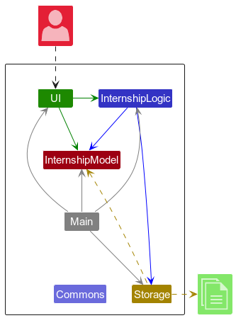

The **_Architecture Diagram_** given above explains the high-level design of the App.

Given below is a quick overview of main components and how they interact with each other.

**Main components of the architecture**

**`Main`** (consisting of classes [`Main`](https://github.com/se-edu/addressbook-level3/tree/master/src/main/java/seedu/address/Main.java) and [`MainApp`](https://github.com/se-edu/addressbook-level3/tree/master/src/main/java/seedu/address/MainApp.java)) is in charge of the app launch and shut down.

- At app launch, it initializes the other components in the correct sequence, and connects them up with each other.
- At shut down, it shuts down the other components and invokes cleanup methods where necessary.

The bulk of the app's work is done by the following four components:

- [**`UI`**](#ui-component): The UI of the App.
- [**`Logic`**](#logic-component): The command executor.
- [**`Model`**](#model-component): Holds the data of the App in memory.
- [**`Storage`**](#storage-component): Reads data from, and writes data to, the hard disk.

[**`Commons`**](#common-classes) represents a collection of classes used by multiple other components.

**How the architecture components interact with each other**

The _Sequence Diagram_ below shows how the components interact with each other for the scenario where the user issues the command `delete 1`.

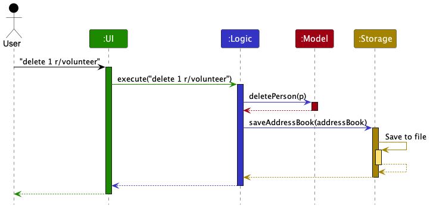

Each of the four main components (also shown in the diagram above),

- defines its _API_ in an `interface` with the same name as the Component.
- implements its functionality using a concrete `{Component Name}Manager` class (which follows the corresponding API `interface` mentioned in the previous point.

For example, the `Logic` component defines its API in the `Logic.java` interface and implements its functionality using the `LogicManager.java` class which follows the `Logic` interface. Other components interact with a given component through its interface rather than the concrete class (reason: to prevent outside component's being coupled to the implementation of a component), as illustrated in the (partial) class diagram below.

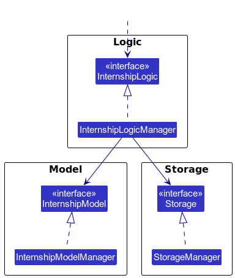

The sections below give more details of each component.

### UI component

The **API** of this component is specified in [`Ui.java`](https://github.com/se-edu/addressbook-level3/tree/master/src/main/java/seedu/address/ui/Ui.java)

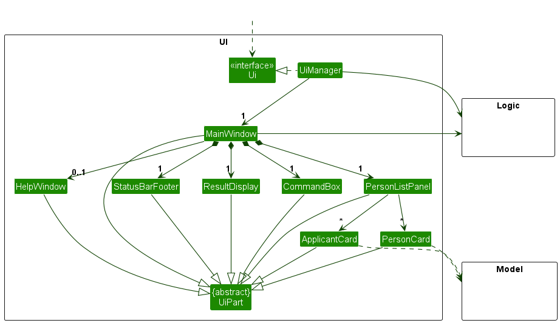

The UI consists of a `MainWindow` that is made up of parts e.g.`CommandBox`, `ResultDisplay`, `PersonListPanel`, `StatusBarFooter` etc. All these, including the `MainWindow`, inherit from the abstract `UiPart` class which captures the commonalities between classes that represent parts of the visible GUI.

The `UI` component uses the JavaFx UI framework. The layout of these UI parts are defined in matching `.fxml` files that are in the `src/main/resources/view` folder. For example, the layout of the [`MainWindow`](https://github.com/se-edu/addressbook-level3/tree/master/src/main/java/seedu/address/ui/MainWindow.java) is specified in [`MainWindow.fxml`](https://github.com/se-edu/addressbook-level3/tree/master/src/main/resources/view/MainWindow.fxml)

The `UI` component,

- executes user commands using the `Logic` component.
- listens for changes to `Model` data so that the UI can be updated with the modified data.
- keeps a reference to the `Logic` component, because the `UI` relies on the `Logic` to execute commands.
- depends on some classes in the `Model` component, as it displays `Person` object residing in the `Model`.

### Logic component

**API** : [`Logic.java`](https://github.com/se-edu/addressbook-level3/tree/master/src/main/java/seedu/address/logic/Logic.java)

Here's a (partial) class diagram of the `Logic` component:

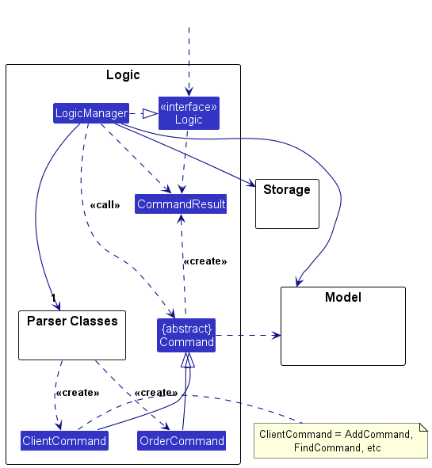

The sequence diagram below illustrates the interactions within the `Logic` component, taking `execute("delete 1")` API call as an example.

:information_source: **Note:** The lifeline for `DeleteCommandParser` should end at the destroy marker (X) but due to a limitation of PlantUML, the lifeline continues till the end of diagram.

How the `Logic` component works:

1. When `Logic` is called upon to execute a command, it is passed to an `AddressBookParser` object which in turn creates a parser that matches the command (e.g., `DeleteCommandParser`) and uses it to parse the command.
1. This results in a `Command` object (more precisely, an object of one of its subclasses e.g., `DeleteCommand`) which is executed by the `LogicManager`.
1. The command can communicate with the `Model` when it is executed (e.g. to delete a person). 
   Note that although this is shown as a single step in the diagram above (for simplicity), in the code it can take several interactions (between the command object and the `Model`) to achieve.
1. The result of the command execution is encapsulated as a `CommandResult` object which is returned back from `Logic`.

Here are the other classes in `Logic` (omitted from the class diagram above) that are used for parsing a user command:

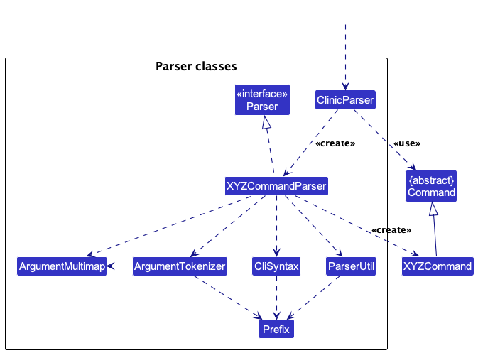

How the parsing works:

- When called upon to parse a user command, the `AddressBookParser` class creates an `XYZCommandParser` (`XYZ` is a placeholder for the specific command name e.g., `AddCommandParser`) which uses the other classes shown above to parse the user command and create a `XYZCommand` object (e.g., `AddCommand`) which the `AddressBookParser` returns back as a `Command` object.
- All `XYZCommandParser` classes (e.g., `AddCommandParser`, `DeleteCommandParser`, ...) inherit from the `Parser` interface so that they can be treated similarly where possible e.g, during testing.

### Model component

**API** : [`Model.java`](https://github.com/se-edu/addressbook-level3/tree/master/src/main/java/seedu/address/model/Model.java)

The `Model` component,

- stores the address book data i.e., all `Person` objects (which are contained in a `UniquePersonList` object).
- stores the currently 'selected' `Person` objects (e.g., results of a search query) as a separate _filtered_ list which is exposed to outsiders as an unmodifiable `ObservableList<Person>` that can be 'observed' e.g. the UI can be bound to this list so that the UI automatically updates when the data in the list change.
- stores a `UserPref` object that represents the user’s preferences. This is exposed to the outside as a `ReadOnlyUserPref` objects.
- does not depend on any of the other three components (as the `Model` represents data entities of the domain, they should make sense on their own without depending on other components)

:information_source: **Note:** An alternative (arguably, a more OOP) model is given below. It has a `Tag` list in the `AddressBook`, which `Person` references. This allows `AddressBook` to only require one `Tag` object per unique tag, instead of each `Person` needing their own `Tag` objects. 

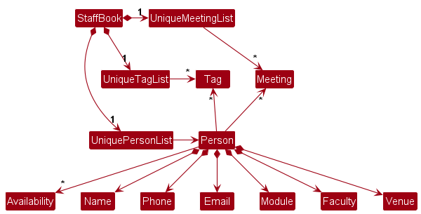

### Storage component

**API** : [`Storage.java`](https://github.com/se-edu/addressbook-level3/tree/master/src/main/java/seedu/address/storage/Storage.java)

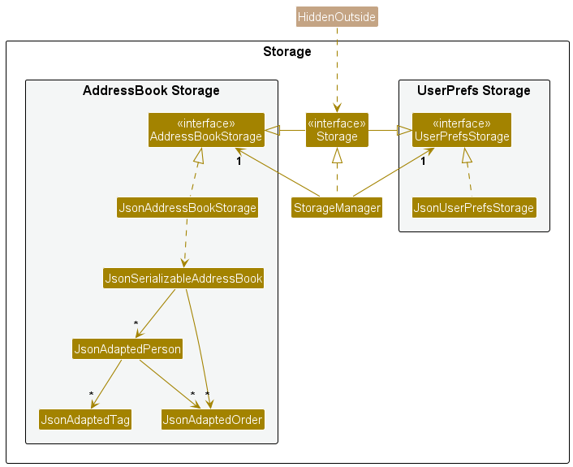

The `Storage` component,

- can save both address book data and user preference data in JSON format, and read them back into corresponding objects.
- inherits from both `AddressBookStorage` and `UserPrefStorage`, which means it can be treated as either one (if only the functionality of only one is needed).
- depends on some classes in the `Model` component (because the `Storage` component's job is to save/retrieve objects that belong to the `Model`)

### Common classes

Classes used by multiple components are in the `seedu.addressbook.commons` package.

---

## **Implementation**

This section describes some noteworthy details on how certain features are implemented.

### Adding a project

#### Implementation

1. The AddressBookParser parses the command string given by the user, and looks for the command word "add project". Then AddProjectCommandParser parse function is called.
2. If the PROJECT_NAME is an empty string, an exception is thrown, else the addProjectCommand execution function is called.
3. The `AddProjectCommand` class is responsible for adding a project to the project list.
   - The constructor of the class takes in a project of type Project.
   - If the same project already exists within the project list, then an exception is thrown to alert users that the project already exists.
   - Else the project is successfully added.

#### Design considerations:

**Aspect of including team members**

- **Alternative 1 (current choice):** Split add project and add team into 2 different commands.

  - Pros: Ensure that command stays short and rather intuitive for users to use, as well as allows users the flexibility to add team members to the project whenever.
  - Cons: Users have to remember more command words, and type more commands.

- **Alternative 2:** Use prefix to indicate the team members that will be added to the project.
  - Example: `add project PROJECT_NAME /t Rachel, Daniel, John`.
  - Pros: Users have 1 less command to remember.
  - Cons: The command syntax is inconsistent with all the other commands as none of them uses prefixes.

**Aspect of command word**

- **Alternative 1:** Command word is `add` and the same command word is used for add tasks, add team, add deadline etc.

  - The different commands are differentiated by the prefix (eg: '/t' for add team, '/p' for add project).
  - Pros: Users have fewer commands to remember, and fewer words to type.
  - Cons: Users have to remember the prefixes for each command and can be confusing.

- **Alternative 2 (current choice):** Command word is `add project` (2 words).
  - There will be different command words for add tasks `add task`, add team `add team` etc.
  - Pros: This is more intuitive for users to use as there will be no need for prefixes.
  - Cons: More words to type for users.

### Deleting a project

#### Implementation

1. The AddressBookParser parses the command string given by the user, and looks for the command word "delete project". Then DeleteProjectCommandParser parse function is called.
2. If the PROJECT_NAME is an empty string, an exception is thrown, else the deleteProjectCommand execution function is called.
3. The `DeleteProjectCommand` class is responsible for adding a project to the project list.
   - The constructor of the class takes in a project of type Project.
     - The project used to construct the command is a new project created using the argument string as the name
   - If the same project doesn't exist within the project list, then an exception is thrown
     - The check is done by using `java.util.stream.Stream.anyMatch(Predicate<? super Person> predicate)`
     - The predicate used is implemented at `seedu.address.model.person.Person.isSamePerson(Person otherProject)` which checks if the two projects are the same using their names
     - As the projects in the list have unique name, we don't need to worry about returning the wrong project
   - Else the project is successfully deleted

### Deleting a task

#### Implementation

1. The AddressBookParser parses the command string given by the user, and looks for the command word "delete task". Then DeleteTaskCommandParser parse function is called.
2. If the PROJECT_NAME or TASK_NAME is an empty string, an exception is thrown, else the deleteTaskCommand execution function is called.
3. The `DeleteTaskCommand` class is responsible for deleting a task within a project.
    - The constructor of the class takes in a project of type Project and a task of type Task.
    - If the project doesn't exist within the project list, then an exception is thrown
        - The check is done by using `java.util.stream.Stream.anyMatch(Predicate<? super Person> predicate)`
        - The predicate used is implemented at `seedu.address.model.person.Person.isSamePerson(Person otherProject)` which checks if the two projects are the same using their names
    - If the task doesn't exist within the project, then an exception is thrown 
        - The check is done by using `Person::hasTask`
    - Else the task is successfully deleted

### \[Proposed\] Undo/redo feature

#### Proposed Implementation

The proposed undo/redo mechanism is facilitated by `VersionedAddressBook`. It extends `AddressBook` with an undo/redo history, stored internally as an `addressBookStateList` and `currentStatePointer`. Additionally, it implements the following operations:

- `VersionedAddressBook#commit()` — Saves the current address book state in its history.
- `VersionedAddressBook#undo()` — Restores the previous address book state from its history.
- `VersionedAddressBook#redo()` — Restores a previously undone address book state from its history.

These operations are exposed in the `Model` interface as `Model#commitAddressBook()`, `Model#undoAddressBook()` and `Model#redoAddressBook()` respectively.

Given below is an example usage scenario and how the undo/redo mechanism behaves at each step.

Step 1. The user launches the application for the first time. The `VersionedAddressBook` will be initialized with the initial address book state, and the `currentStatePointer` pointing to that single address book state.

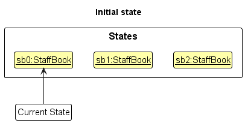

Step 2. The user executes `delete 5` command to delete the 5th person in the address book. The `delete` command calls `Model#commitAddressBook()`, causing the modified state of the address book after the `delete 5` command executes to be saved in the `addressBookStateList`, and the `currentStatePointer` is shifted to the newly inserted address book state.

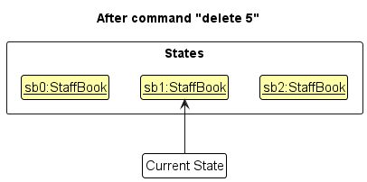

Step 3. The user executes `add n/David …​` to add a new person. The `add` command also calls `Model#commitAddressBook()`, causing another modified address book state to be saved into the `addressBookStateList`.

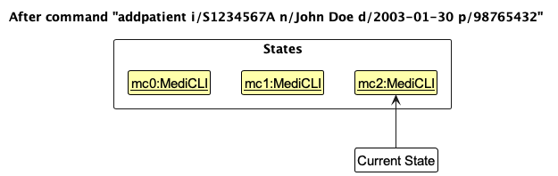

:information_source: **Note:** If a command fails its execution, it will not call `Model#commitAddressBook()`, so the address book state will not be saved into the `addressBookStateList`.

Step 4. The user now decides that adding the person was a mistake, and decides to undo that action by executing the `undo` command. The `undo` command will call `Model#undoAddressBook()`, which will shift the `currentStatePointer` once to the left, pointing it to the previous address book state, and restores the address book to that state.

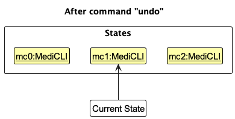

:information_source: **Note:** If the `currentStatePointer` is at index 0, pointing to the initial AddressBook state, then there are no previous AddressBook states to restore. The `undo` command uses `Model#canUndoAddressBook()` to check if this is the case. If so, it will return an error to the user rather
than attempting to perform the undo.

The following sequence diagram shows how an undo operation goes through the `Logic` component:

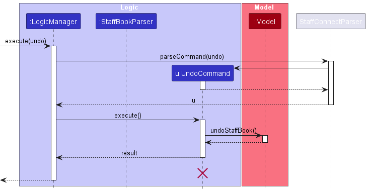

:information_source: **Note:** The lifeline for `UndoCommand` should end at the destroy marker (X) but due to a limitation of PlantUML, the lifeline reaches the end of diagram.

Similarly, how an undo operation goes through the `Model` component is shown below:

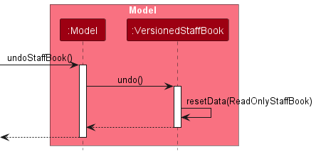

The `redo` command does the opposite — it calls `Model#redoAddressBook()`, which shifts the `currentStatePointer` once to the right, pointing to the previously undone state, and restores the address book to that state.

:information_source: **Note:** If the `currentStatePointer` is at index `addressBookStateList.size() - 1`, pointing to the latest address book state, then there are no undone AddressBook states to restore. The `redo` command uses `Model#canRedoAddressBook()` to check if this is the case. If so, it will return an error to the user rather than attempting to perform the redo.

Step 5. The user then decides to execute the command `list`. Commands that do not modify the address book, such as `list`, will usually not call `Model#commitAddressBook()`, `Model#undoAddressBook()` or `Model#redoAddressBook()`. Thus, the `addressBookStateList` remains unchanged.

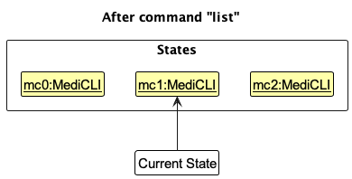

Step 6. The user executes `clear`, which calls `Model#commitAddressBook()`. Since the `currentStatePointer` is not pointing at the end of the `addressBookStateList`, all address book states after the `currentStatePointer` will be purged. Reason: It no longer makes sense to redo the `add n/David …​` command. This is the behavior that most modern desktop applications follow.

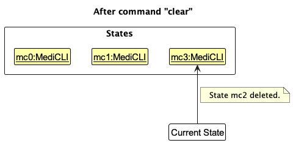

The following activity diagram summarizes what happens when a user executes a new command:

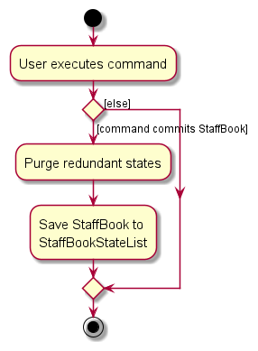

#### Design considerations:

**Aspect: How undo & redo executes:**

- **Alternative 1 (current choice):** Saves the entire address book.

  - Pros: Easy to implement.
  - Cons: May have performance issues in terms of memory usage.

- **Alternative 2:** Individual command knows how to undo/redo by
  itself.
  - Pros: Will use less memory (e.g. for `delete`, just save the person being deleted).
  - Cons: We must ensure that the implementation of each individual command are correct.

_{more aspects and alternatives to be added}_

### \[Proposed\] Data archiving

_{Explain here how the data archiving feature will be implemented}_

---

## **Documentation, logging, testing, configuration, dev-ops**

- [Documentation guide](Documentation.md)
- [Testing guide](Testing.md)
- [Logging guide](Logging.md)
- [Configuration guide](Configuration.md)
- [DevOps guide](DevOps.md)

---

## **Appendix: Requirements**

### Product scope

**Target user profile**:

- has a need to organise various projects and people
- prefer desktop apps over other types
- can type fast
- prefers typing to mouse interactions
- is reasonably comfortable using CLI apps

**Value proposition**: manage projects and tasks faster than a typical mouse/GUI driven app

### User stories

Priorities: High (must have) - `* * *`, Medium (nice to have) - `* *`, Low (unlikely to have) - `*`

| Priority | As a …​              | I want to …​                                                                                     | So that I can…​                                                           |
| -------- | -------------------- | ------------------------------------------------------------------------------------------------ | ------------------------------------------------------------------------- |
| `* * *`  | software developer   | keep track of all my projects’ tasks in the app                                                  | meet all my deadlines on time                                             |
| `* *`    | user                 | sort my tasks by their deadlines                                                                 | see what is the next pending task to complete                             |
| `* *`    | user                 | see what my tasks are due next week                                                              | schedule my timetable accordingly                                         |
| `* *`    | user                 | see who are my teammates for each project                                                        | know who to contact if I have any questions for that project              |
| `* *`    | user                 | mark my completed tasks as completed                                                             | keep them out of sight to prevent confusion                               |
| `* *`    | user                 | mark my tasks as in progress                                                                     | remind myself to come back to it once I have a clearer idea of what to do |
| `*`      | user                 | keep track of all my ongoing projects                                                            | be reminded of what I need to do for the next few weeks/months            |
| `*`      | user                 | see what are the categories for each of my projects                                              | know what knowledge I need to learn and utilize for each of their tasks   |
| `*`      | user                 | delete projects that have been discontinued or completed                                         | know what to focus on                                                     |
| `*`      | user                 | update the deadline of my tasks if it has been brought forward                                   | know exactly when it is due                                               |
| `* *`    | project manager user | keep track of the team members                                                                   |                                                                           |
| `* * *`  | user                 | create new projects                                                                              | manage various tasks and activities                                       |
| `* * *`  | user                 | add team members to projects and assign them specific roles and tasks                            |                                                                           |
| `* *`    | user                 | set deadlines and milestones for subtasks within a project                                       |                                                                           |
| `*`      | user                 | track the progress of tasks and projects through visual representations such as charts or graphs |                                                                           |
| `*`      | user                 | prioritize tasks within a project                                                                | ensure timely completion                                                  |
| `* *`    | user                 | collaborate with team members by sharing files, comments, and updates within the software        |                                                                           |
| `* *`    | user                 | receive notifications and reminders for upcoming deadlines or overdue tasks                      |                                                                           |
| `*`      | user                 | generate reports                                                                                 | analyze project performance and identify areas for improvement            |
| `*`      | user                 | integrate the software with other tools or platforms                                             | have seamless workflow management                                         |
| `* * *`  | user                 | access the software from any device with an internet connection                                  | for convenience                                                           |
| `*`      | user                 | customize project templates or workflows                                                         | suit the specific needs of my team or organization                        |
| `* *`    | user                 | securely store project-related documents and files within the software                           |                                                                           |
| `* * *`  | user                 | communicate with clients or stakeholders and provide them with updates on project progress       |                                                                           |
| `* *`    | user                 | search for specific tasks, projects, or documents within the software                            | for quick access                                                          |
| `* *`    | user                 | archive completed projects or tasks for future reference                                         |                                                                           |
| `*`      | user                 | export data from the software in various formats                                                 | employ further analysis or sharing                                        |
| `*`      | user                 | invite external collaborators                                                                    | they can participate in specific projects or tasks                        |
| `* *`    | user                 | monitor team workload and redistribute tasks                                                     | balance workloads                                                         |
| `*`      | user                 | access historical data and project archives                                                      | learn from past experiences and make informed decisions                   |
| `*`      | user                 | provide feedback or suggestions for improving the software                                       | better meet the needs of myself and my team                               |
| `* * *`  | user                 | set the status of a project to be completed or incompleted                                       |                                                                           |
| `* * *`  | user                 | set the deadline of a project to a specific date                                                 |                                                                           |
| `* *`    | user                 | edit the details of a project                                                                    |                                                                           |
| `* *`    | user                 | filter the projects by their status                                                              |                                                                           |
| `* * *`  | user                 | add tasks to a project (ADD)                                                                     |                                                                           |
| `* *`    | user                 | remove tasks from a project                                                                      |                                                                           |
| `* *`    | user                 | edit the details of a task                                                                       |                                                                           |
| `* *`    | user                 | mark task as not done or completed                                                               |                                                                           |
| `* *`    | user                 | assign tasks to a person                                                                         |                                                                           |
| `* *`    | user                 | filter tasks by completion status                                                                |                                                                           |
| `* *`    | user                 | filter tasks by the person responsible                                                           |                                                                           |
| `* * *`  | user                 | save the project list on my hard drive                                                           |                                                                           |
| `*`      | user                 | share the project list so that other users can import the same list                              |                                                                           |
| `*`      | user                 | import lists from others while keeping my own list or discarding my old list                     |                                                                           |
| `* *`    | user                 | limit the amount of projects I can see on one page                                               |                                                                           |
| `* *`    | user                 | search for projects by name                                                                      |                                                                           |
| `* *`    | user                 | search for tasks by name                                                                         |                                                                           |
| `* * *`  | user                 | access the user guide / command list                                                             |                                                                           |
| `* *`    | forgetful user       | easily use the commands with guidance from the program                                           |                                                                           |
| `* *`    | user                 | change font sizes                                                                                |                                                                           |
| `* * *`  | typely user          | use type commands to do everything a user does                                                   |                                                                           |
| `*`      | user                 | edit details of a person (Optional)                                                              |                                                                           |

### Use cases

(For all use cases below, the **System** is the `DevPlan Pro` and the **Actor** is the `project manager`, unless specified otherwise)

**Use case: UC01 - Create a project**

**MSS**

1.  User inputs the project name to be added.
2.  DevPlan Pro creates a new project with the specified name and adds it to the project list.

    Use case ends.

**Extensions**

- 1a. The name is not unique.

  - 1a1. DevPlan Pro rejects the project creation.
  - 1a2. DevPlan Pro informs the user of the rejection.

    Use case ends.

**Use case: UC02 - Delete a project**

**MSS**

1.  User inputs the project name to be deleted.
2.  DevPlan Pro deletes the project with the specified name and removes it from the project list. (Along with the project's tasks and members)

    Use case ends.

**Extensions**

- 1a. The name is not valid. (No project with such name)

  - 1a1. DevPlan Pro rejects the project deletion.
  - 1a2. DevPlan Pro informs the user of the rejection.

    Use case ends.

**Use case: UC03 - Add task to project**

**MSS**

1.  User inputs the task and the project name.
2.  DevPlan Pro creates a new task with the specified name and adds it to the specified project.

    Use case ends.

**Extensions**

- 1a. The task name is not unique.

  - 1a1. DevPlan Pro rejects the task creation.
  - 1a2. DevPlan Pro informs the user of the rejection.

    Use case ends.

- 1b. The project name is not valid.

  - 1b1. DevPlan Pro rejects the task creation.
  - 1b2. DevPlan Pro informs the user of the rejection.

    Use case ends.

**Use case: UC04 - Remove task from project**

**MSS**

1.  User inputs the task and the project name.
2.  DevPlan Pro removes the task with the specified name from the specified project.

    Use case ends.

**Extensions**

- 1a. The task name is not valid.

  - 1a1. DevPlan Pro rejects the task deletion.
  - 1a2. DevPlan Pro informs the user of the rejection.

    Use case ends.

- 1b. The project name is not valid.

  - 1b1. DevPlan Pro rejects the task deletion.
  - 1b2. DevPlan Pro informs the user of the rejection.

    Use case ends.

**Use case: UC05 - View a project**

**MSS**

1.  User inputs the project name.
2.  DevPlan Pro shows the information of the specified project.

    Use case ends.

**Extensions**

- 1a. The project name is not valid.

  - 1b1. DevPlan Pro rejects showing the project.
  - 1b2. DevPlan Pro informs the user of the rejection.

    Use case ends.

**Use case: UC06 - Add team member to project**

**MSS**

1.  User inputs the member name and the project name.
2.  DevPlan Pro adds a person with the specified name to the specified project's team.

    Use case ends.

**Extensions**

- 1a. The member name is not unique.

  - 1a1. DevPlan Pro rejects the member addition.
  - 1a2. DevPlan Pro informs the user of the rejection.

    Use case ends.

- 1b. The project name is not valid.

  - 1b1. DevPlan Pro rejects the member addition.
  - 1b2. DevPlan Pro informs the user of the rejection.

    Use case ends.

**Use case: UC07 - Remove team member from project**

**MSS**

1.  User inputs the member name and the project name.
2.  DevPlan Pro removes a person with the specified name from the specified project's team.

    Use case ends.

**Extensions**

- 1a. The member name is not valid.

  - 1a1. DevPlan Pro rejects the member deletion.
  - 1a2. DevPlan Pro informs the user of the rejection.

    Use case ends.

- 1b. The project name is not valid.

  - 1b1. DevPlan Pro rejects the member deletion.
  - 1b2. DevPlan Pro informs the user of the rejection.

    Use case ends.

**Use case: UC08 - Assign member to task of project**

**MSS**

1.  User inputs the member name, the task name, and the project name.
2.  DevPlan Pro assign the specified member to the specified task in the specified project.

    Use case ends.

**Extensions**

- 1a. The member name is not valid.

  - 1a1. DevPlan Pro rejects the task assignment.
  - 1a2. DevPlan Pro informs the user of the rejection.

    Use case ends.

- 1b. The task name is not valid.

  - 1b1. DevPlan Pro rejects the task assignment.
  - 1b2. DevPlan Pro informs the user of the rejection.

    Use case ends.

- 1c. The project name is not valid.

  - 1b1. DevPlan Pro rejects the task assignment.
  - 1b2. DevPlan Pro informs the user of the rejection.

    Use case ends.

**Use case: UC09 - Assign deadline to task of project**

**MSS**

1.  User inputs the deadline, the task name, and the project name.
2.  DevPlan Pro assign deadline to the specified task in the specified project.

    Use case ends.

**Extensions**

- 1a. Deadline is not in the “MMM D YYYY” format.

  - 1a1. DevPlan Pro rejects the deadline assignment.
  - 1a2. DevPlan Pro informs the user of the rejection and the correct format.

    Use case ends.

- 1b. The task name is not valid.

  - 1b1. DevPlan Pro rejects the deadline assignment.
  - 1b2. DevPlan Pro informs the user of the rejection.

    Use case ends.

- 1c. The project name is not valid.

  - 1b1. DevPlan Pro rejects the deadline assignment.
  - 1b2. DevPlan Pro informs the user of the rejection.

    Use case ends.

**Use case: UC10 - Assign deadline to project**

**MSS**

1.  User inputs the deadline and the project name.
2.  DevPlan Pro assign deadline to the specified project.

    Use case ends.

**Extensions**

- 1a. Deadline is not in the “MMM D YYYY” format.

  - 1a1. DevPlan Pro rejects the deadline assignment.
  - 1a2. DevPlan Pro informs the user of the rejection and the correct format.

    Use case ends.

- 1b. The project name is not valid.

  - 1b1. DevPlan Pro rejects the deadline assignment.
  - 1b2. DevPlan Pro informs the user of the rejection.

    Use case ends.

**Use case: UC11 - Set project status**

**MSS**

1.  User inputs the status and the project name.
2.  DevPlan Pro set the status of the specified project.

    Use case ends.

**Extensions**

- 1a. The project name is not valid.

  - 1b1. DevPlan Pro rejects the status change.
  - 1b2. DevPlan Pro informs the user of the rejection.

    Use case ends.

**Use case: UC11 - Set task status**

**MSS**

1.  User inputs the status, the task name, and the project name.
2.  DevPlan Pro set the status of the specified task in the specified project.

    Use case ends.

**Extensions**

- 1a. The task name is not valid.

  - 1b1. DevPlan Pro rejects the status change.
  - 1b2. DevPlan Pro informs the user of the rejection.

    Use case ends.

- 1b. The project name is not valid.

  - 1b1. DevPlan Pro rejects the status change.
  - 1b2. DevPlan Pro informs the user of the rejection.

    Use case ends.

### Non-Functional Requirements

- Should work on any _mainstream OS_ as long as it has Java `11` or above installed.
- Should be able to hold up to 1000 projects without a noticeable sluggishness in performance for typical usage.
- Should be able to hold up to 1000 tasks per project without a noticeable sluggishness in performance for typical usage.
- A user with above average typing speed for regular English text (i.e. not code, not system admin commands) should be able to accomplish most of the tasks faster using commands than using the mouse.
- Should respond to user commands within 2 seconds.
- Should be usable by a novice who has never used DevPlan Pro before.
- Documentation should be understandable for a novice user who has never used DevPlan Pro, or any other similar project management application.
- The user interface should be intuitive enough for users who are not IT-savvy.

### Glossary

- **Project Manager**:The individual supervising a project whose role may include planning, executing, and closing a project.
- **Task Status**: A status of a task whether done or not done
- **Project Status**: A status of a project whether Completed or not Completed

---

## **Appendix: Instructions for manual testing**

Given below are instructions to test the app manually.

:information_source: **Note:** These instructions only provide a starting point for testers to work on;
testers are expected to do more *exploratory* testing.

### Launch and shutdown

1. Initial launch

   1. Download the jar file and copy into an empty folder

   1. Double-click the jar file Expected: Shows the GUI with a set of sample contacts. The window size may not be optimum.

1. Saving window preferences

   1. Resize the window to an optimum size. Move the window to a different location. Close the window.

   1. Re-launch the app by double-clicking the jar file. 
      Expected: The most recent window size and location is retained.

1. _{ more test cases …​ }_

### Deleting a person

1. Deleting a person while all persons are being shown

   1. Prerequisites: List all persons using the `list` command. Multiple persons in the list.

   1. Test case: `delete 1` 
      Expected: First contact is deleted from the list. Details of the deleted contact shown in the status message. Timestamp in the status bar is updated.

   1. Test case: `delete 0` 
      Expected: No person is deleted. Error details shown in the status message. Status bar remains the same.

   1. Other incorrect delete commands to try: `delete`, `delete x`, `...` (where x is larger than the list size) 
      Expected: Similar to previous.

1. _{ more test cases …​ }_

### Saving data

1. Dealing with missing/corrupted data files

   1. _{explain how to simulate a missing/corrupted file, and the expected behavior}_

1. _{ more test cases …​ }_
