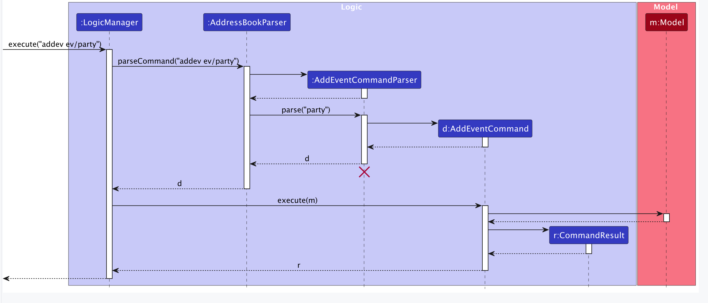
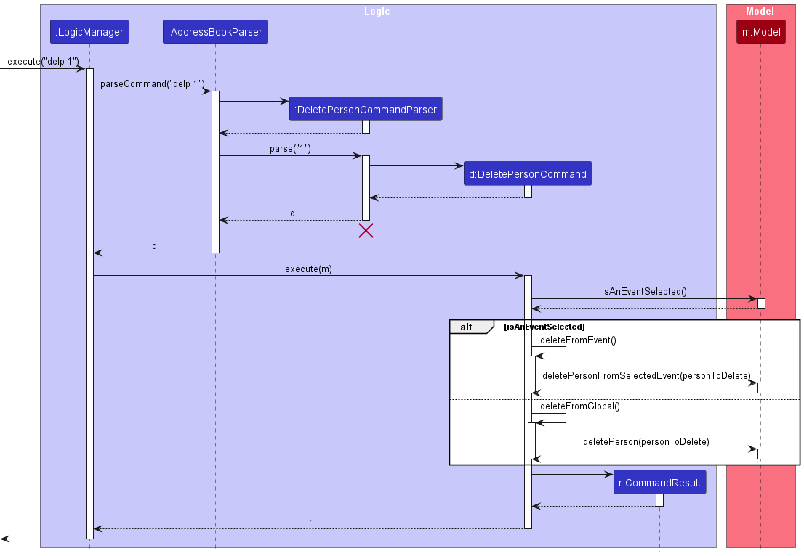

# Eventy Developer Guide

<!-- * Table of Contents -->
<page-nav-print />

--------------------------------------------------------------------------------------------------------------------

## **Acknowledgements**

_{ list here sources of all reused/adapted ideas, code, documentation, and third-party libraries -- include links to the original source as well }_

--------------------------------------------------------------------------------------------------------------------

## **Setting up, getting started**

Refer to the guide [_Setting up and getting started_](SettingUp.md).

--------------------------------------------------------------------------------------------------------------------

## **Design**

### Architecture

<puml src="diagrams/ArchitectureDiagram.puml" width="280" />

The ***Architecture Diagram*** given above explains the high-level design of the App.

Given below is a quick overview of main components and how they interact with each other.

**Main components of the architecture**

**`Main`** (consisting of classes [`Main`](https://github.com/se-edu/addressbook-level3/tree/master/src/main/java/seedu/address/Main.java) and [`MainApp`](https://github.com/se-edu/addressbook-level3/tree/master/src/main/java/seedu/address/MainApp.java)) is in charge of the app launch and shut down.
* At app launch, it initializes the other components in the correct sequence, and connects them up with each other.
* At shut down, it shuts down the other components and invokes cleanup methods where necessary.

The bulk of the app's work is done by the following four components:

* [**`UI`**](#ui-component): The UI of the App.
* [**`Logic`**](#logic-component): The command executor.
* [**`Model`**](#model-component): Holds the data of the App in memory.
* [**`Storage`**](#storage-component): Reads data from, and writes data to, the hard disk.

[**`Commons`**](#common-classes) represents a collection of classes used by multiple other components.

**How the architecture components interact with each other**

The *Sequence Diagram* below shows how the components interact with each other for the scenario where the user issues the command `delete 1`.

<puml src="diagrams/ArchitectureSequenceDiagram.puml" width="574" />

Each of the four main components (also shown in the diagram above),

* defines its *API* in an `interface` with the same name as the Component.
* implements its functionality using a concrete `{Component Name}Manager` class (which follows the corresponding API `interface` mentioned in the previous point.

For example, the `Logic` component defines its API in the `Logic.java` interface and implements its functionality using the `LogicManager.java` class which follows the `Logic` interface. Other components interact with a given component through its interface rather than the concrete class (reason: to prevent outside component's being coupled to the implementation of a component), as illustrated in the (partial) class diagram below.

<puml src="diagrams/ComponentManagers.puml" width="300" />

The sections below give more details of each component.

### UI component

The **API** of this component is specified in [`Ui.java`](https://github.com/se-edu/addressbook-level3/tree/master/src/main/java/seedu/address/ui/Ui.java)

<puml src="diagrams/UiClassDiagram.puml" alt="Structure of the UI Component"/>

The UI consists of a `MainWindow` that is made up of parts e.g.`CommandBox`, `ResultDisplay`, `PersonListPanel`, `StatusBarFooter` etc. All these, including the `MainWindow`, inherit from the abstract `UiPart` class which captures the commonalities between classes that represent parts of the visible GUI.

The `UI` component uses the JavaFx UI framework. The layout of these UI parts are defined in matching `.fxml` files that are in the `src/main/resources/view` folder. For example, the layout of the [`MainWindow`](https://github.com/se-edu/addressbook-level3/tree/master/src/main/java/seedu/address/ui/MainWindow.java) is specified in [`MainWindow.fxml`](https://github.com/se-edu/addressbook-level3/tree/master/src/main/resources/view/MainWindow.fxml)

The `UI` component,

* executes user commands using the `Logic` component.
* listens for changes to `Model` data so that the UI can be updated with the modified data.
* keeps a reference to the `Logic` component, because the `UI` relies on the `Logic` to execute commands.
* depends on some classes in the `Model` component, as it displays `Person` object residing in the `Model`.

### Logic component

**API** : [`Logic.java`](https://github.com/se-edu/addressbook-level3/tree/master/src/main/java/seedu/address/logic/Logic.java)

Here's a (partial) class diagram of the `Logic` component:

<puml src="diagrams/LogicClassDiagram.puml" width="550"/>

The sequence diagram below illustrates the interactions within the `Logic` component, taking `execute("delete 1")` API call as an example.

<puml src="diagrams/DeleteSequenceDiagram.puml" alt="Interactions Inside the Logic Component for the `delete 1` Command" />

<box type="info" seamless>

**Note:** The lifeline for `DeleteCommandParser` should end at the destroy marker (X) but due to a limitation of PlantUML, the lifeline continues till the end of diagram.
</box>

How the `Logic` component works:

1. When `Logic` is called upon to execute a command, it is passed to an `AddressBookParser` object which in turn creates a parser that matches the command (e.g., `DeleteCommandParser`) and uses it to parse the command.
1. This results in a `Command` object (more precisely, an object of one of its subclasses e.g., `DeleteCommand`) which is executed by the `LogicManager`.
1. The command can communicate with the `Model` when it is executed (e.g. to delete a person). 
   Note that although this is shown as a single step in the diagram above (for simplicity), in the code it can take several interactions (between the command object and the `Model`) to achieve.
1. The result of the command execution is encapsulated as a `CommandResult` object which is returned back from `Logic`.

Here are the other classes in `Logic` (omitted from the class diagram above) that are used for parsing a user command:

<puml src="diagrams/ParserClasses.puml" width="600"/>

How the parsing works:
* When called upon to parse a user command, the `AddressBookParser` class creates an `XYZCommandParser` (`XYZ` is a placeholder for the specific command name e.g., `AddCommandParser`) which uses the other classes shown above to parse the user command and create a `XYZCommand` object (e.g., `AddCommand`) which the `AddressBookParser` returns back as a `Command` object.
* All `XYZCommandParser` classes (e.g., `AddCommandParser`, `DeleteCommandParser`, ...) inherit from the `Parser` interface so that they can be treated similarly where possible e.g, during testing.

### Model component
**API** : [`Model.java`](https://github.com/se-edu/addressbook-level3/tree/master/src/main/java/seedu/address/model/Model.java)

<puml src="diagrams/ModelClassDiagram.puml" width="450" />

The `Model` component,

* stores the address book data i.e., all `Person` objects (which are contained in a `UniquePersonList` object).
* stores the currently 'selected' `Person` objects (e.g., results of a search query) as a separate _filtered_ list which is exposed to outsiders as an unmodifiable `ObservableList<Person>` that can be 'observed' e.g. the UI can be bound to this list so that the UI automatically updates when the data in the list change.
* stores a `UserPref` object that represents the user’s preferences. This is exposed to the outside as a `ReadOnlyUserPref` objects.
* does not depend on any of the other three components (as the `Model` represents data entities of the domain, they should make sense on their own without depending on other components)

<box type="info" seamless>

**Note:** An alternative (arguably, a more OOP) model is given below. It has a `Tag` list in the `AddressBook`, which `Person` references. This allows `AddressBook` to only require one `Tag` object per unique tag, instead of each `Person` needing their own `Tag` objects. 

<puml src="diagrams/BetterModelClassDiagram.puml" width="450" />

</box>

### Storage component

**API** : [`Storage.java`](https://github.com/AY2324S2-CS2103T-T10-3/tp/blob/master/src/main/java/seedu/address/storage/Storage.java)

<puml src="diagrams/StorageClassDiagram.puml" width="550" />

The `Storage` component,
* can save both global participant list data in JSON format, and read it back into corresponding objects.
* can save event list data in JSON format, and read it back into corresponding event objects.
* can also save participant list data of all added events in JSON format, and read them back into corresponding objects. 
* inherits from`AddressBookStorage` `EventBook Storage` and `UserPrefStorage`, which means it can be treated as either one (if only the functionality of only one is needed).
* depends on some classes in the `Model` component (because the `Storage` component's job is to save/retrieve objects that belong to the `Model`)

### Common classes

Classes used by multiple components are in the `seedu.addressbook.commons` package.

--------------------------------------------------------------------------------------------------------------------

## **Implementation**

This section describes some noteworthy details on how certain features are implemented.

### Invite Person to Event

The `InvitePersonCommand` allows users to invite a person to the selected event from the global address book.

#### Implementation Details

The `InvitePersonCommand` is implemented by extending the base `Command` class. It uses a `targetIndex`, specifying the desired person's global list index, to identify the person to be added to the selected event. It implements the following operations:

* `execute(Model)` — Checks the current address book state by calling `isAnEventSelected()`, and throws a `CommandException` if no event is selected. 
It also calls `isPersonInSelectedEvent` to ensure the invitee is not already added to the event by throwing a `CommandException` if he is already on the invitee list.
* `addPersonToSelectedEvent(Person)` — Adds the participant to the selected event. in the filtered global participant list. This operation is exposed in the `Model` interface as `Model#addPersonToSelectedEvent(Person)`.

The invite command is initiated by firstly retrieving the filtered person list and locating the `personToInvite` object in it, after which `Model#addPersonToSelectedEvent(Person)(Person)` is called to complete the actual invitation.

Given below is an example usage scenario of how the deletion mechanism behaves when the user tries to delete a participant from the global participant list.

Step 1. The user launches the application, with some events and participants added to the address book already. The `AddressBook` will be initialized with the previously saved address book state, and the `selectedEvent` in the `EventBook` will initially be `null`.

Step 2. The user executes `sel 1` command to select the first event to be modified

Step 3. The user executes `inv 3` command to invite the 5th person in the global list to the selected event. The `InviteCommand` will then call `excecute()`, which checks that an event is selected and the user doesn't already exist in the selected event invitee list before calling `addPersonToSelectedEvent(Person)`.

<box type="info" seamless>

**Note:** If the `targetIndex` provided is invalid, a `CommandException` will be thrown.

</box>

#### Sequence Diagram

#### Design Considerations:

**Aspect 1: How to specify the event the person should be added to:**

* **Alternative 1 (current choice):** Select an event first, then use the `index` in the filtered list
    * Pros: Easier to implement.  Immediate visual reference.
    * Cons: Extra select command is needed before participant can be added
  
* **Alternative 2:** Specify event and person indices in one command
    * Pros: Action can be performed in one command
    * Cons: Requires more complex input parsing, makes the user input longer, and may be confusing for the user

**Rationale:**
The primary rationale for selecting an event first is it lets the user have a clear sense that a certain event is currently being modified.  
This will prevent future errors where the user confuses `invite` and `add` commands.

### Delete Participant

The `DeletePersonCommand` allows users to delete a person either from the global address book or from a specific event, depending on whether an event is selected.

#### Implementation Details

The `DeletePersonCommand` is implemented by extending the base `Command` class. It uses a `targetIndex` to identify the person to be deleted in the filtered person list. It implements the following operations:

* `execute(Model)` — Checks the current address book state by calling `isAnEventSelected()`, and call `deleteFromGlobal` or `deleteFromEvent` accordingly.
* `deleteFromGlobal(Model)` — Deletes the participant in the filtered global participant list. This operation is exposed in the `Model` interface as `Model#deletePerson(Person)`.
* `deleteFromEvent(Model)` — Deletes the participant in the filtered selected event participant list. This operation is exposed in the `Model` interface as `deletePersonFromSelectedEvent(Person)`.

The deletion is initiated by firstly retrieving the filtered person list and locating the `personToDelete` object in it, after which `Model#deletePerson(Person)` /  `Model#deletePersonFromSelectedEvent(Person)` is called to complete the actual deletion. 

Given below is an example usage scenario of how the deletion mechanism behaves when the user tries to delete a participant from the global participant list.

Step 1. The user launches the application, with some events and participants added to the address book already. The `AddressBook` will be initialized with the previously saved address book state, and the `selectedEvent` in the `EventBook` will initially be `null`.

Step 2. The user executes `delp 5` command to delete the 5th person in the address book. The `deletePersonCommand` will then call `excecute()`, which checks that no event is being selected before calling `deleteFromGlobal()`.

<box type="info" seamless>

**Note:** If the `targetIndex` provided is invalid, a `CommandException` will be thrown.

</box>

Step 3. The `deleteFromGlobal()` function calls `Model#deletePerson()` to complete the deletion, and the state of the filtered person list is thereby changed.

#### Sequence Diagram

#### Design Considerations:

**Aspect 1: How to structure the 2 Delete Participant Commands:**

* **Alternative 1 (current choice):** Same command for global and event-specific deletion
    * Pros: Shorter code. The unified `DeletePersonCommand` is easier to learn.  
    * Cons: Slightly harder to implement.

* **Alternative 2:** Separate commands for global and event-specific deletion
    * Pros: Simplifies the implementation of each command. 
    * Cons: Increases the number of commands users need to learn, potentially making the application more cumbersome to use.

**Rationale:**
The choice to unify the deletion process under a single `DeletePersonCommand` stems from a desire to streamline the user experience and reduce the learning curve associated with the application. By minimizing the number of commands a user needs to learn, the application becomes more intuitive, especially for new or infrequent users. The unified command approach emphasizes simplicity from the user's perspective, even if it introduces additional complexity behind the scenes.

**Aspect 2: How to specify the person to be deleted:**

* **Alternative 1 (current choice):** Use the `index` in the filtered list
    * Pros: Easier to implement.  Immediate visual reference.
    * Cons: Limited by Viewport. When the participant list is long and paginated or requires scrolling, users might find it cumbersome to scroll through and find the index of the person they wish to delete.

* **Alternative 2:** Use the `name` of the participant
    * Pros: Direct and intuitive, and can avoid indexing issues.
    * Cons: Requires more complex input parsing, and makes the user input longer.

**Rationale:**
The primary rationale for using an `index` as the specifier is its simplicity and direct mapping to the user interface. Users can easily locate and specify a contact for deletion based on their position in a list, making the command straightforward to implement and understand. This approach is particularly effective in scenarios where users work with relatively short lists where the viewport limitations are minimal. In the scenario where the participant list gets longer, the user can always use the `find` command to filter out the contact they want to delete before making the actual deletion.

### \[Proposed\] Undo/redo feature

#### Proposed Implementation

The proposed undo/redo mechanism is facilitated by `VersionedAddressBook`. It extends `AddressBook` with an undo/redo history, stored internally as an `addressBookStateList` and `currentStatePointer`. Additionally, it implements the following operations:

* `VersionedAddressBook#commit()` — Saves the current address book state in its history.
* `VersionedAddressBook#undo()` — Restores the previous address book state from its history.
* `VersionedAddressBook#redo()` — Restores a previously undone address book state from its history.

These operations are exposed in the `Model` interface as `Model#commitAddressBook()`, `Model#undoAddressBook()` and `Model#redoAddressBook()` respectively.

Given below is an example usage scenario and how the undo/redo mechanism behaves at each step.

Step 1. The user launches the application for the first time. The `VersionedAddressBook` will be initialized with the initial address book state, and the `currentStatePointer` pointing to that single address book state.

<puml src="diagrams/UndoRedoState0.puml" alt="UndoRedoState0" />

Step 2. The user executes `delete 5` command to delete the 5th person in the address book. The `delete` command calls `Model#commitAddressBook()`, causing the modified state of the address book after the `delete 5` command executes to be saved in the `addressBookStateList`, and the `currentStatePointer` is shifted to the newly inserted address book state.

<puml src="diagrams/UndoRedoState1.puml" alt="UndoRedoState1" />

Step 3. The user executes `add n/David …​` to add a new person. The `add` command also calls `Model#commitAddressBook()`, causing another modified address book state to be saved into the `addressBookStateList`.

<puml src="diagrams/UndoRedoState2.puml" alt="UndoRedoState2" />

<box type="info" seamless>

**Note:** If a command fails its execution, it will not call `Model#commitAddressBook()`, so the address book state will not be saved into the `addressBookStateList`.

</box>

Step 4. The user now decides that adding the person was a mistake, and decides to undo that action by executing the `undo` command. The `undo` command will call `Model#undoAddressBook()`, which will shift the `currentStatePointer` once to the left, pointing it to the previous address book state, and restores the address book to that state.

<puml src="diagrams/UndoRedoState3.puml" alt="UndoRedoState3" />

<box type="info" seamless>

**Note:** If the `currentStatePointer` is at index 0, pointing to the initial AddressBook state, then there are no previous AddressBook states to restore. The `undo` command uses `Model#canUndoAddressBook()` to check if this is the case. If so, it will return an error to the user rather
than attempting to perform the undo.

</box>

The following sequence diagram shows how an undo operation goes through the `Logic` component:

<puml src="diagrams/UndoSequenceDiagram-Logic.puml" alt="UndoSequenceDiagram-Logic" />

<box type="info" seamless>

**Note:** The lifeline for `UndoCommand` should end at the destroy marker (X) but due to a limitation of PlantUML, the lifeline reaches the end of diagram.

</box>

Similarly, how an undo operation goes through the `Model` component is shown below:

<puml src="diagrams/UndoSequenceDiagram-Model.puml" alt="UndoSequenceDiagram-Model" />

The `redo` command does the opposite — it calls `Model#redoAddressBook()`, which shifts the `currentStatePointer` once to the right, pointing to the previously undone state, and restores the address book to that state.

<box type="info" seamless>

**Note:** If the `currentStatePointer` is at index `addressBookStateList.size() - 1`, pointing to the latest address book state, then there are no undone AddressBook states to restore. The `redo` command uses `Model#canRedoAddressBook()` to check if this is the case. If so, it will return an error to the user rather than attempting to perform the redo.

</box>

Step 5. The user then decides to execute the command `list`. Commands that do not modify the address book, such as `list`, will usually not call `Model#commitAddressBook()`, `Model#undoAddressBook()` or `Model#redoAddressBook()`. Thus, the `addressBookStateList` remains unchanged.

<puml src="diagrams/UndoRedoState4.puml" alt="UndoRedoState4" />

Step 6. The user executes `clear`, which calls `Model#commitAddressBook()`. Since the `currentStatePointer` is not pointing at the end of the `addressBookStateList`, all address book states after the `currentStatePointer` will be purged. Reason: It no longer makes sense to redo the `add n/David …​` command. This is the behavior that most modern desktop applications follow.

<puml src="diagrams/UndoRedoState5.puml" alt="UndoRedoState5" />

The following activity diagram summarizes what happens when a user executes a new command:

<puml src="diagrams/CommitActivityDiagram.puml" width="250" />

#### Design considerations:

**Aspect: How undo & redo executes:**

* **Alternative 1 (current choice):** Saves the entire address book.
  * Pros: Easy to implement.
  * Cons: May have performance issues in terms of memory usage.

* **Alternative 2:** Individual command knows how to undo/redo by
  itself.
  * Pros: Will use less memory (e.g. for `delete`, just save the person being deleted).
  * Cons: We must ensure that the implementation of each individual command are correct.

_{more aspects and alternatives to be added}_

### \[Proposed\] Data archiving

_{Explain here how the data archiving feature will be implemented}_

### Select Event Feature

The Select Event mechanism is a pivotal part of Eventy's functionality. It's importance can be summarised in 2 main
purposes:
1. Selecting an event (or an event not being selected) affects the functionality of several commands. For example, the 
`Delete a Person` command if an event is not selected, it will delete the person from Eventy as a whole, else if an 
event is selected, it will delete the person only from that selected event
2. The UI will display the person list of the selected event when an event is selected, if no event is selected, 
it will display a message to `Select an event`

The Select Event mechanism is facilitated by `EventBook`. It implements `ReadOnlyEventBook`, and can be thought of 
the counterpart to `AddressBook`, in that while `AddressBook` handles People-related functionality, `EventBook` handles
Event-related functionality. 

To implement the Select Event mechanism, `EventBook` stores internally:
* `selectedEvent` &thinsp;—&thinsp; The event that is currently selected. If no event is selected, it is `null`
* `selectedEventObservable` &thinsp;—&thinsp; A wrapper for `selectedEvent` to allow the UI to update with respect
to the 2nd main purpose, as explained above
* `personsOfSelectedEvent` &thinsp;—&thinsp; Unique person list of the selected event. If no event is selected, it is an 
empty list

Additionally, it implements the following operations:
* `EventBook#isAnEventSelected()` &thinsp;—&thinsp; Returns `true` if an event is selected, else `false`
* `EventBook#selectEvent(Event event)` &thinsp;—&thinsp; Selects the given event 
* `EventBook#deselectEvent()` &thinsp;—&thinsp; Deselect the currently selected event, if any, so that no event is 
selected
* `EventBook#isPersonInSelectedEvent(Person person)` &thinsp;—&thinsp; Returns `true` if the given person is in the 
selected event, else `false`
* `EventBook#getSelectedEvent()` &thinsp;—&thinsp; Returns `selectedEventObservable` as an 

`EventBook` also implements other operations that are specific to certain commands that will not be covered here, as 
they are not directly pertinent to the implementation of the Select Event mechanism. An example of such an operation is
one that adds the given person to the selected event.

These operations are exposed to other components through `ModelManager` with the same names.

In order to select an event and deselect an event, we have the Select command and deselect command respectively.
Both commands function similarly.

The following sequence diagram shows how the Select command works through the `Logic` component:

<puml src="diagrams/SelectEventSequenceDiagram -- Model.puml" width="250" />

Similarly, how the Select command goes through the Model component is shown below:

<puml src="diagrams/SelectEventSequenceDiagram -- Logic.puml" width="250" />

The deselect Command generally does the inverse. For `setPersons` however, it will set it to null instead.

--------------------------------------------------------------------------------------------------------------------

## **Documentation, logging, testing, configuration, dev-ops**

* [Documentation guide](Documentation.md)
* [Testing guide](Testing.md)
* [Logging guide](Logging.md)
* [Configuration guide](Configuration.md)
* [DevOps guide](DevOps.md)

--------------------------------------------------------------------------------------------------------------------

## **Appendix: Requirements**

### Product scope

**Target user profile**:

* Active members of university clubs and societies or school event committees
* Tech-savvy and reasonably comfortable with digital tools
* Fast typer
* Managing multiple events that range from small-scale meetings to large school-wide events
* Frequently communicating and coordinating with a variety of contacts including vendors, participants, volunteers, and school administrators
* Task driven with a need to balance multiple deadlines and responsibilities simultaneously

**Value proposition**:

The evolved AB3 contact management application, tailored specifically for student event organizers, offers a new standard of streamlined and automated contact organization. It serves as your single source of truth for storing,
managing, and retrieving all contact-related information.

### User stories

Priorities: High (must have) - `* * *`, Medium (nice to have) - `* *`, Low (unlikely to have) - `*`

| Priority | As a …​                                    | I want to …​                 | So that I can…​                                                        |
|----------|--------------------------------------------|------------------------------|------------------------------------------------------------------------|
| `* * *`  | user                                       | create a new event           | plan and manage all the events that in one place                       |
| `* * *`  | user                                       | add a new person             | manage all my contacts in one place                                    |
| `* * *`  | user                                       | add participant to an event  | manage and plan all the participant for a specific event               |
| `* * *`  | user                                       | delete a person              | remove contacts that I no longer need                                  |
| `* * *`  | user                                       | remove specific participant  | remove a specific participant from a specific event                    |
| `* *`    | diligent user                              | edit contact information     | update contact information whenever necessary                          |
| `* *`    | user                                       | select a specific event      | search events by name without having to manually search

### Use cases

--------------------------------------------------------

### Creating an Event

**Use Case: UC01 - Create an event**

**Actor:** User

**MSS:**
1. User provides the details of an event to be created.
2. Eventy displays the details of the event added by the User in the Event List.

*Use case ends*

**Extensions:**

1a. Details provided by User are incomplete or invalid.
- 1a1. Eventy displays an error message to alert the User.  
  *Use case ends*

1b. Event to be added already exists in Eventy.
- 1b1. Eventy displays an error message to alert the User.  
  *Use case ends*

### Deleting an event

**Use case: UC02 - Delete an event**

**Actor:** User

**Preconditions:** User has added at least one event.

**Guarantees:**
A successful deletion deletes an event from the event list.

**MSS**

1.  Eventy shows a list of events.
2.  User requests to delete a specific event in the list.
3.  Eventy deletes the event.

*Use case ends*

**Extensions:**

1a. The list is empty.  
- 1a1. Eventy displays an error message to alert the User.  
  *Use case ends*

2a.  Details provided by User are incomplete or invalid.
- 2a1. Eventy displays an error message to alert the User.  
  *Use case resumes at step 2.*

### Adding participants contact to the global list

**Use case: UC03 - Add participants contact**

**Actor:** User

**Guarantees:**
A successful addition adds a participant to the global list.

**MSS**

1.  User provides the detail of the contact to be added.
2.  Eventy displays the details of the contact added by the user.  

*Use case ends*

**Extensions:**

1a.  Details provided by User are incomplete or invalid
- 1a1. Eventy displays an error message to alert the User.  
  *Use case ends*

### Deleting participant

**Use Case: UC04 - Delete a participant from the global participant list**

**Actor:** User

**Preconditions:**
User has added one or more participant to the global participant list.

**Guarantees:**
A successful deletion deletes the participant from both the global list and all the events he participates in.

**MSS:**

1. User deletes a participant.
2. Eventy displays the updated global participant list.  
   *Use case ends*

**Extensions:**

1a. Participant index provided by the User is invalid.
- 1a1. Eventy displays an error message to alert the User.  
  *Use case resumes at step 2.*

### Removing participants from a specific event

**Use case: UC05 - Remove a participant from the specified event**

**Actor:** User

**Preconditions:** User has added one or more participant to the specified event.

**MSS:**
1. User requests to remove a participant from a certain event.
2. Eventy remove the participant from the event.  
   *Use case ends*

**Extensions:**

1a. The event index provided by the User is invalid.
- 1a1. Eventy displays an error message to alert the User.  
  *Use case ends*

1b. Participant index provided by the User is invalid.
- 1a1. Eventy displays an error message to alert the User.  
  *Use case ends*

### Selecting an event

**Use Case: UC06 - Select an event from the event list**

**Actor:** User

**Preconditions:** User has added one or more events to the event list.

**Guarantees:**
A successful selection displays the event details.

**MSS:**

1. User selects an event.
2. Eventy displays the details of the selected event.  
   *Use case ends*

**Extensions:**

1a. Event index provided by User is invalid.
- 1a1. Eventy displays an error message to alert the User.  
  *Use case ends*

### Add a participant to an event

**Use Case: UC07 - Add a participant to an event**

**Actor:** User

**Preconditions:**
User has added one or more contacts to the global contact list.

**Guarantees:**
A successful addition adds a participant from the global list to the selected event.

**MSS:**
1. User inputs the index of participant to be added.
2. Eventy displays the added participant in the panel showing list of participants in selected event.  
   *Use case ends*

**Extensions:**

1a. Index provided by user is invalid/out of range of global contact list.
- 1a1. Eventy displays an error message to alert the User.  
  *Use case ends*

1b. Contact to be added already exists in selected event.
- 1b1. Eventy displays an error message to alert the User.  
  *Use case ends*

1b. User does not provide an index.
- 1b1. Eventy displays an error message to alert the User.  
  *Use case ends*

### Non-Functional Requirements

1. The user should be able to use the application smoothly with a device running mainstream OS with Java 11 or above installed.
2. The application should be able to store up to 1000 participants and 50 events without a reduction in speed.
3. A user familiar with CLI applications with a reasonable typing speed should be able to navigate commands faster than using the mouse.
4. The user interface should be simple, clear, easily understandable and fast to navigate.
5. The application should gracefully handle errors by displaying error messages to prevent system crashes and data corruption.
6. The application should be released as a free application to the general public.
7. The average command response time of Eventy should be less than a second.
8. The application should consume no more than 200Mb of memory when holding less than 1000 participants and 50 events.
9. The application should launch in less than 5 seconds.

### Glossary

* **Mainstream OS:** Windows, Linux, Unix, OS-X
* **Eventy:** Name of the application.
* **Global participant list:** List of participants that are saved in the application.
* **Event list:** List of events created in the application to be managed.
* **Event participant list:** List of participants in the specific event.
* **Participant:** The contact whose information is stored in the application storage.

--------------------------------------------------------------------------------------------------------------------

## **Appendix: Instructions for manual testing**

Given below are instructions to test the app manually.

<box type="info" seamless>

**Note:** These instructions only provide a starting point for testers to work on;
testers are expected to do more *exploratory* testing.

</box>

### Launch and shutdown

1. Initial launch

   1. Download the jar file and copy into an empty folder

   1. Double-click the jar file Expected: Shows the GUI with a set of sample contacts. The window size may not be optimum.

1. Saving window preferences

   1. Resize the window to an optimum size. Move the window to a different location. Close the window.

   1. Re-launch the app by double-clicking the jar file. 
       Expected: The most recent window size and location is retained.

1. _{ more test cases …​ }_

### Deleting a person

1. Deleting a person while all persons are being shown

   1. Prerequisites: List all persons using the `list` command. Multiple persons in the list.

   1. Test case: `delete 1` 
      Expected: First contact is deleted from the list. Details of the deleted contact shown in the status message. Timestamp in the status bar is updated.

   1. Test case: `delete 0` 
      Expected: No person is deleted. Error details shown in the status message. Status bar remains the same.

   1. Other incorrect delete commands to try: `delete`, `delete x`, `...` (where x is larger than the list size) 
      Expected: Similar to previous.

1. _{ more test cases …​ }_

### Saving data

1. Dealing with missing/corrupted data files

   1. _{explain how to simulate a missing/corrupted file, and the expected behavior}_

1. _{ more test cases …​ }_
