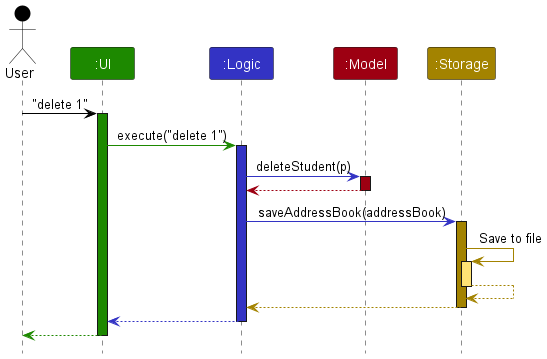
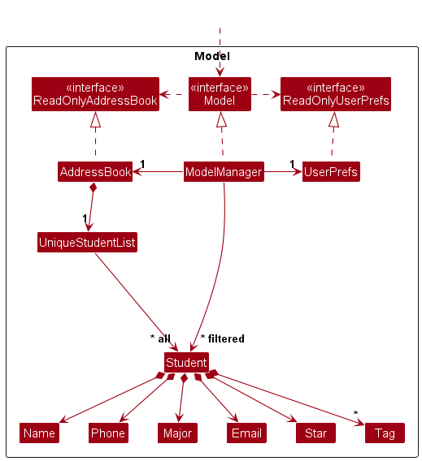

* Table of Contents
{:toc}

--------------------------------------------------------------------------------------------------------------------

## **Acknowledgements**

* {list here sources of all reused/adapted ideas, code, documentation, and third-party libraries -- include links to the original source as well}

--------------------------------------------------------------------------------------------------------------------

## **Setting up, getting started**

Refer to the guide [_Setting up and getting started_](SettingUp.md).

--------------------------------------------------------------------------------------------------------------------

## **Design**

:bulb: **Tip:** The `.puml` files used to create diagrams in this document `docs/diagrams` folder. Refer to the [_PlantUML Tutorial_ at se-edu/guides](https://se-education.org/guides/tutorials/plantUml.html) to learn how to create and edit diagrams.

### Architecture

The ***Architecture Diagram*** given above explains the high-level design of the App.

Given below is a quick overview of main components and how they interact with each other.

**Main components of the architecture**

**`Main`** (consisting of classes [`Main`](https://github.com/se-edu/addressbook-level3/tree/master/src/main/java/seedu/address/Main.java) and [`MainApp`](https://github.com/se-edu/addressbook-level3/tree/master/src/main/java/seedu/address/MainApp.java)) is in charge of the app launch and shut down.
* At app launch, it initializes the other components in the correct sequence, and connects them up with each other.
* At shut down, it shuts down the other components and invokes cleanup methods where necessary.

The bulk of the app's work is done by the following four components:

* [**`UI`**](#ui-component): The UI of the App.
* [**`Logic`**](#logic-component): The command executor.
* [**`Model`**](#model-component): Holds the data of the App in memory.
* [**`Storage`**](#storage-component): Reads data from, and writes data to, the hard disk.

[**`Commons`**](#common-classes) represents a collection of classes used by multiple other components.

**How the architecture components interact with each other**

The *Sequence Diagram* below shows how the components interact with each other for the scenario where the user issues the command `delete 1`.

Each of the four main components (also shown in the diagram above),

* defines its *API* in an `interface` with the same name as the Component.
* implements its functionality using a concrete `{Component Name}Manager` class (which follows the corresponding API `interface` mentioned in the previous point.

For example, the `Logic` component defines its API in the `Logic.java` interface and implements its functionality using the `LogicManager.java` class which follows the `Logic` interface. Other components interact with a given component through its interface rather than the concrete class (reason: to prevent outside component's being coupled to the implementation of a component), as illustrated in the (partial) class diagram below.

The sections below give more details of each component.

### UI component

The **API** of this component is specified in [`Ui.java`](https://github.com/se-edu/addressbook-level3/tree/master/src/main/java/seedu/address/ui/Ui.java)

The UI consists of a `MainWindow` that is made up of parts e.g.`CommandBox`, `ResultDisplay`, `PersonListPanel`, `StatusBarFooter` etc. All these, including the `MainWindow`, inherit from the abstract `UiPart` class which captures the commonalities between classes that represent parts of the visible GUI.

The `UI` component uses the JavaFx UI framework. The layout of these UI parts are defined in matching `.fxml` files that are in the `src/main/resources/view` folder. For example, the layout of the [`MainWindow`](https://github.com/se-edu/addressbook-level3/tree/master/src/main/java/seedu/address/ui/MainWindow.java) is specified in [`MainWindow.fxml`](https://github.com/se-edu/addressbook-level3/tree/master/src/main/resources/view/MainWindow.fxml)

The `UI` component,

* executes user commands using the `Logic` component.
* listens for changes to `Model` data so that the UI can be updated with the modified data.
* keeps a reference to the `Logic` component, because the `UI` relies on the `Logic` to execute commands.
* depends on some classes in the `Model` component, as it displays `Person` object residing in the `Model`.

### Logic component

**API** : [`Logic.java`](https://github.com/se-edu/addressbook-level3/tree/master/src/main/java/seedu/address/logic/Logic.java)

Here's a (partial) class diagram of the `Logic` component:

The sequence diagram below illustrates the interactions within the `Logic` component, taking `execute("delete 1")` API call as an example.

:information_source: **Note:** The lifeline for `DeleteCommandParser` should end at the destroy marker (X) but due to a limitation of PlantUML, the lifeline continues till the end of diagram.

How the `Logic` component works:

1. When `Logic` is called upon to execute a command, it is passed to an `AddressBookParser` object which in turn creates a parser that matches the command (e.g., `DeleteCommandParser`) and uses it to parse the command.
1. This results in a `Command` object (more precisely, an object of one of its subclasses e.g., `DeleteCommand`) which is executed by the `LogicManager`.
1. The command can communicate with the `Model` when it is executed (e.g. to delete a person). 
   Note that although this is shown as a single step in the diagram above (for simplicity), in the code it can take several interactions (between the command object and the `Model`) to achieve.
1. The result of the command execution is encapsulated as a `CommandResult` object which is returned back from `Logic`.

Here are the other classes in `Logic` (omitted from the class diagram above) that are used for parsing a user command:

How the parsing works:
* When called upon to parse a user command, the `AddressBookParser` class creates an `XYZCommandParser` (`XYZ` is a placeholder for the specific command name e.g., `AddCommandParser`) which uses the other classes shown above to parse the user command and create a `XYZCommand` object (e.g., `AddCommand`) which the `AddressBookParser` returns back as a `Command` object.
* All `XYZCommandParser` classes (e.g., `AddCommandParser`, `DeleteCommandParser`, ...) inherit from the `Parser` interface so that they can be treated similarly where possible e.g, during testing.

### Model component
**API** : [`Model.java`](https://github.com/se-edu/addressbook-level3/tree/master/src/main/java/seedu/address/model/Model.java)

The `Model` component,

* stores the address book data i.e., all `Person` objects (which are contained in a `UniquePersonList` object).
* stores the currently 'selected' `Person` objects (e.g., results of a search query) as a separate _filtered_ list which is exposed to outsiders as an unmodifiable `ObservableList<Person>` that can be 'observed' e.g. the UI can be bound to this list so that the UI automatically updates when the data in the list change.
* stores a `UserPref` object that represents the user’s preferences. This is exposed to the outside as a `ReadOnlyUserPref` objects.
* does not depend on any of the other three components (as the `Model` represents data entities of the domain, they should make sense on their own without depending on other components)

:information_source: **Note:** An alternative (arguably, a more OOP) model is given below. It has a `Tag` list in the `AddressBook`, which `Person` references. This allows `AddressBook` to only require one `Tag` object per unique tag, instead of each `Person` needing their own `Tag` objects. 

### Storage component

**API** : [`Storage.java`](https://github.com/se-edu/addressbook-level3/tree/master/src/main/java/seedu/address/storage/Storage.java)

The `Storage` component,
* can save both address book data and user preference data in JSON format, and read them back into corresponding objects.
* inherits from both `AddressBookStorage` and `UserPrefStorage`, which means it can be treated as either one (if only the functionality of only one is needed).
* depends on some classes in the `Model` component (because the `Storage` component's job is to save/retrieve objects that belong to the `Model`)

### Common classes

Classes used by multiple components are in the `seedu.addressbook.commons` package.

--------------------------------------------------------------------------------------------------------------------

## **Implementation**

This section describes some noteworthy details on how certain features are implemented.

### \[Proposed\] Undo/redo feature

#### Proposed Implementation

The proposed undo/redo mechanism is facilitated by `VersionedAddressBook`. It extends `AddressBook` with an undo/redo history, stored internally as an `addressBookStateList` and `currentStatePointer`. Additionally, it implements the following operations:

* `VersionedAddressBook#commit()` — Saves the current address book state in its history.
* `VersionedAddressBook#undo()` — Restores the previous address book state from its history.
* `VersionedAddressBook#redo()` — Restores a previously undone address book state from its history.

These operations are exposed in the `Model` interface as `Model#commitAddressBook()`, `Model#undoAddressBook()` and `Model#redoAddressBook()` respectively.

Given below is an example usage scenario and how the undo/redo mechanism behaves at each step.

Step 1. The user launches the application for the first time. The `VersionedAddressBook` will be initialized with the initial address book state, and the `currentStatePointer` pointing to that single address book state.

Step 2. The user executes `delete 5` command to delete the 5th person in the address book. The `delete` command calls `Model#commitAddressBook()`, causing the modified state of the address book after the `delete 5` command executes to be saved in the `addressBookStateList`, and the `currentStatePointer` is shifted to the newly inserted address book state.

Step 3. The user executes `add n/David …​` to add a new person. The `add` command also calls `Model#commitAddressBook()`, causing another modified address book state to be saved into the `addressBookStateList`.

:information_source: **Note:** If a command fails its execution, it will not call `Model#commitAddressBook()`, so the address book state will not be saved into the `addressBookStateList`.

Step 4. The user now decides that adding the person was a mistake, and decides to undo that action by executing the `undo` command. The `undo` command will call `Model#undoAddressBook()`, which will shift the `currentStatePointer` once to the left, pointing it to the previous address book state, and restores the address book to that state.

:information_source: **Note:** If the `currentStatePointer` is at index 0, pointing to the initial AddressBook state, then there are no previous AddressBook states to restore. The `undo` command uses `Model#canUndoAddressBook()` to check if this is the case. If so, it will return an error to the user rather
than attempting to perform the undo.

The following sequence diagram shows how an undo operation goes through the `Logic` component:

:information_source: **Note:** The lifeline for `UndoCommand` should end at the destroy marker (X) but due to a limitation of PlantUML, the lifeline reaches the end of diagram.

Similarly, how an undo operation goes through the `Model` component is shown below:

The `redo` command does the opposite — it calls `Model#redoAddressBook()`, which shifts the `currentStatePointer` once to the right, pointing to the previously undone state, and restores the address book to that state.

:information_source: **Note:** If the `currentStatePointer` is at index `addressBookStateList.size() - 1`, pointing to the latest address book state, then there are no undone AddressBook states to restore. The `redo` command uses `Model#canRedoAddressBook()` to check if this is the case. If so, it will return an error to the user rather than attempting to perform the redo.

Step 5. The user then decides to execute the command `list`. Commands that do not modify the address book, such as `list`, will usually not call `Model#commitAddressBook()`, `Model#undoAddressBook()` or `Model#redoAddressBook()`. Thus, the `addressBookStateList` remains unchanged.

Step 6. The user executes `clear`, which calls `Model#commitAddressBook()`. Since the `currentStatePointer` is not pointing at the end of the `addressBookStateList`, all address book states after the `currentStatePointer` will be purged. Reason: It no longer makes sense to redo the `add n/David …​` command. This is the behavior that most modern desktop applications follow.

The following activity diagram summarizes what happens when a user executes a new command:

#### Design considerations:

**Aspect: How undo & redo executes:**

* **Alternative 1 (current choice):** Saves the entire address book.
  * Pros: Easy to implement.
  * Cons: May have performance issues in terms of memory usage.

* **Alternative 2:** Individual command knows how to undo/redo by
  itself.
  * Pros: Will use less memory (e.g. for `delete`, just save the person being deleted).
  * Cons: We must ensure that the implementation of each individual command are correct.

_{more aspects and alternatives to be added}_

### \[Proposed\] Data archiving

_{Explain here how the data archiving feature will be implemented}_

--------------------------------------------------------------------------------------------------------------------

## **Documentation, logging, testing, configuration, dev-ops**

* [Documentation guide](Documentation.md)
* [Testing guide](Testing.md)
* [Logging guide](Logging.md)
* [Configuration guide](Configuration.md)
* [DevOps guide](DevOps.md)

--------------------------------------------------------------------------------------------------------------------

## **Appendix: Requirements**

### Product scope

**Target user profile**:

* Has many family members to keep track off
* Wants to keep various information about these different family members
* Wants to visualize connections between family members
* Often only has provisional or partial information about their family members

**Value proposition**: JENGA puts connections between people at the forefront.

### User stories

Priorities: High (must have) - `* * *`, Medium (nice to have) - `* *`, Low (unlikely to have) - `*`

| Priority | As a …​ | I want to …​                    | So that I can…​                                                        |
|----------|--------| ----------------------------- | ---------------------------------------------------------------------- |
| `* * *`  | user   | Create a new person with a Unique User ID        | Ensure every person in my address book is distinct                 |
| `* * *`  | user   | Add custom attributes to each person              |Store personal information relevant to each individual                                                                        |
| `* * *`  | user   | Establish and record relationships between people               | Visualize connections between people                                   |
| `* * *`  | user   | Find the relationship path between people        | Understand how everyone is connected |
| `* *`    | user   | Have clear success or failure messages after actions | Ensure that the intended action has taken place                |
| `* *`    | user   | Sort and search a person by their attributes       | Find specific individuals more easily                                                |
| `* * *`  | user   | Have my data automatically saved once i exit the app and loaded once i start the app        | Seamless experience across different sessions |

*{More to be added}*

### Use cases

(For all use cases below, the **System** is the `AddressBook` and the **Actor** is the `user`, unless specified otherwise)

**Use case: Add a new person**

**MSS**

1.  User requests to add a new person to JENGA.
2.  JENGA prompts user for details of new person.
3.  User enters the necessary information.
4.  JENGA adds person with the provided details.
5.  JENGA displays new person added and confirmation message.

    Use case ends.

**Extensions**

* 3a. User enters incomplete or invalid information.

    * 3a1. JENGA shows an error message.

    * 3a2. JENGA prompts User to enter the correct and complete information.

      Steps 3a1-3a2 are repeated until the data entered are correct.

      Use case resumes from step 4.

**Use case: Delete a person**

**MSS**

1.  User requests to list persons.
2.  JENGA displays a list of persons.
3.  User selects a specific person in the list to delete by providing the person’s UUID.
4.  JENGA deletes the person.
5.  JENGA displays confirmation message.

    Use case ends.

**Extensions**

* 2a. The list is empty.

    * 2a1. JENGA informs the user the list is empty.

      Use case ends.

* 3a. Given UUID is invalid or does not exist.

    * 3a1. JENGA shows an error message.

      Use case resumes at step 4.

**Use case: Add an attribute to a person**

**MSS**

1.  User requests to add an attribute to a person.
2.  JENGA prompts user to enter the person’s UUID and attribute details.
3.  User enters UUID and attribute information.
4.  JENGA adds attribute details to specific person’s profile.
5.  JENGA displays attribute in person’s profile and confirmation message.

    Use case ends.

**Extensions**

* 3a. Attribute details are invalid.

    * 3a1. JENGA shows an error message.

    * 3a2. JENGA prompts User to enter the correct and complete information.

      Steps 3a1-3a2 are repeated until the data entered are correct.

      Use case resumes from step 4.

      Use case ends.

* 3b. Given UUID is invalid or does not exist.

    * 3a1. JENGA shows an error message.

    * 3a2. JENGA prompts User to enter the correct and complete information.

      Steps 3a1-3a2 are repeated until the data entered are correct.

      Use case resumes from step 4.

      Use case ends.

**Use case: Edit to add an attribute to a person**

**MSS**

1.  User requests to edit to add an attribute to a person.
2.  JENGA prompts user to enter the person’s UUID and attribute details to add.
3.  User enters UUID and attribute information.
4.  JENGA adds attribute details to specific person’s profile.
5.  JENGA displays attribute in person’s profile and confirmation message.

    Use case ends.

**Extensions**

* 3a. Attribute details are invalid.

    * 3a1. JENGA shows an error message.

    * 3a2. JENGA prompts User to enter the correct and complete information.

      Steps 3a1-3a2 are repeated until the data entered are correct.

      Use case resumes from step 4.

      Use case ends.

* 3b. Given UUID is invalid or does not exist.

    * 3a1. JENGA shows an error message.

    * 3a2. JENGA prompts User to enter the correct and complete information.

      Steps 3a1-3a2 are repeated until the data entered are correct.

      Use case resumes from step 4.

      Use case ends.

**Use case: Edit to delete an attribute to a person**

**MSS**

1.  User requests to edit to delete an attribute to a person.
2.  JENGA prompts user to enter the person’s UUID and attribute to delete.
3.  User enters UUID and attribute information.
4.  JENGA deletes attribute in specific person’s profile.
5.  JENGA displays confirmation message.

    Use case ends.

**Extensions**

* 3a. Attribute details are invalid.

    * 3a1. JENGA shows an error message.

    * 3a2. JENGA prompts User to enter the correct and complete information.

      Steps 3a1-3a2 are repeated until the data entered are correct.

      Use case resumes from step 4.

      Use case ends.

* 3b. Given UUID is invalid or does not exist.

    * 3a1. JENGA shows an error message.

    * 3a2. JENGA prompts User to enter the correct and complete information.

      Steps 3a1-3a2 are repeated until the data entered are correct.

      Use case resumes from step 4.

      Use case ends.

**Use case: Delete a person**

**MSS**

1.  User requests to delete a person.
2.  JENGA prompts user for details of person.
3.  User enters person’s UUID.
4.  JENGA deletes person.
5.  JENGA displays confirmation message.

    Use case ends.

**Extensions**

* 3a. Given UUID is invalid or does not exist.

    * 3a1. JENGA shows an error message.

    * 3a2. JENGA prompts User to enter the correct and complete information.

      Steps 3a1-3a2 are repeated until the data entered are correct.

      Use case resumes from step 4.

**Use case: Find persons by attribute**

**MSS**

1.  User requests to find persons by attribute.
2.  JENGA prompts user for attribute and attribute value(s).
3.  User enters attribute name and attribute value(s).
4.  JENGA displays list of persons with each of the specified attributes.

    Use case ends.

**Extensions**

* 3a. Attribute details are invalid or does not exist.

    * 3a1. JENGA shows an error message.

    * 3a2. JENGA prompts User to enter the correct and complete information.

      Steps 3a1-3a2 are repeated until the data entered are correct.

      Use case resumes from step 4.

      Use case ends.

* 4a. The list is empty.

    * 4a1. JENGA informs the user the list is empty.

      Use case ends.

**Use case: Find persons by relationship to User**

**MSS**

1.  User requests to find persons by relationship.
2.  JENGA prompts user for relationship to User.
3.  User enters relationship type.
4.  JENGA displays list of persons with specified relationship to User.

    Use case ends.

**Extensions**

* 3a. Relationship is invalid or does not exist.

    * 3a1. JENGA shows an error message.

    * 3a2. JENGA prompts User to enter the correct and complete information.

      Steps 3a1-3a2 are repeated until the data entered are correct.

      Use case resumes from step 4.

      Use case ends.

**Use case: Add a relationship between two persons**

**MSS**

1.  User requests to add a relationship between two persons.
2.  JENGA prompts user for UUIDs of both persons and relationship type.
3.  User enters both persons UUID and relationship type.
4.  JENGA creates a relationship with the provided details.
5.  JENGA displays new relationship added under both persons’ profiles and confirmation message.

    Use case ends.

**Extensions**

* 3a. Relationship type is invalid.

    * 3a1. JENGA shows an error message.

    * 3a2. JENGA prompts User to enter the correct and complete information.

      Steps 3a1-3a2 are repeated until the data entered are correct.

      Use case resumes from step 4.

      Use case ends.

* 3b. Given UUIDs are invalid or does not exist.

    * 3a1. JENGA shows an error message.

    * 3a2. JENGA prompts User to enter the correct and complete information.

      Steps 3a1-3a2 are repeated until the data entered are correct.

      Use case resumes from step 4.

      Use case ends.

**Use case: Edit a relationship between two persons**

**MSS**

1.  User requests to edit a specific relationship between two persons.
2.  JENGA prompts user for UUIDs of both persons and previous and new relationship type.
3.  User enters both persons UUID and previous and new relationship type.
4.  JENGA edits the specified relationship with the provided details.
5.  JENGA displays edited relationship under both persons’ profiles and confirmation message.

    Use case ends.

**Extensions**

* 3a. Relationship types are invalid.

    * 3a1. JENGA shows an error message.

    * 3a2. JENGA prompts User to enter the correct and complete information.

      Steps 3a1-3a2 are repeated until the data entered are correct.

      Use case resumes from step 4.

      Use case ends.

* 3b. Given UUIDs are invalid or does not exist.

    * 3a1. JENGA shows an error message.

    * 3a2. JENGA prompts User to enter the correct and complete information.

      Steps 3a1-3a2 are repeated until the data entered are correct.

      Use case resumes from step 4.

      Use case ends.

**Use case: Delete a relationship between two persons**

**MSS**

1.  User requests to delete a specific relationship between two persons.
2.  JENGA prompts user for UUIDs of both persons and relationship type.
3.  User enters both persons UUID and specified relationship type.
4.  JENGA deletes specified relationship.
5.  JENGA displays confirmation message.

    Use case ends.

**Extensions**

* 3a. Relationship type is invalid.

    * 3a1. JENGA shows an error message.

    * 3a2. JENGA prompts User to enter the correct and complete information.

      Steps 3a1-3a2 are repeated until the data entered are correct.

      Use case resumes from step 4.

      Use case ends.

* 3b. Given UUIDs are invalid or does not exist.

    * 3a1. JENGA shows an error message.

    * 3a2. JENGA prompts User to enter the correct and complete information.

      Steps 3a1-3a2 are repeated until the data entered are correct.

      Use case resumes from step 4.

      Use case ends.

**Use case: Exit JENGA**

**MSS**

1.  User requests to exit JENGA.
2.  JENGA displays goodbye message.
3.  JENGA saves current data.
4.  JENGA closes the application window.

    Use case ends.

*{More to be added}*

### Non-Functional Requirements

1.  Should work on any _mainstream OS_ as long as it has Java `11` or above installed.
2.  Should be able to hold up to 1000 persons and relationships without a noticeable sluggishness in performance for typical usage.
3.  A user with above average typing speed for regular English text (i.e. not code, not system admin commands) should be able to accomplish most of the tasks faster using commands than using the mouse.
4.  User actions should prompt responses within 5 seconds, maintaining acceptable performance standards.
5.  The user interface must be intuitive for users of varying technical proficiency levels, enhancing usability.
6.  The codebase should be well-documented and maintainable to facilitate future updates and enhancements.
7.  Comprehensive documentation should be provided for developers, administrators, and end-users, supporting ease of use.
8.  The system should be able to handle data corruption or loss gracefully, minimizing the impact on users.
9.  The system architecture should support future extensions or customizations, allowing for easy addition of new features.
10. Interoperability with other systems should be supported through standard protocols and formats, promoting seamless integration.
11. The system should be designed with testability in mind, allowing for comprehensive testing of all components, features, and scenarios.

### Glossary

* **Mainstream OS**: Windows, Linux, Unix, MacOS
* **Private contact detail**: A contact detail that is not meant to be shared with others

--------------------------------------------------------------------------------------------------------------------

## **Appendix: Instructions for manual testing**

Given below are instructions to test the app manually.

:information_source: **Note:** These instructions only provide a starting point for testers to work on;
testers are expected to do more *exploratory* testing.

### Launch and shutdown

1. Initial launch

   1. Download the jar file and copy into an empty folder

   1. Double-click the jar file Expected: Shows the GUI with a set of sample contacts. The window size may not be optimum.

1. Saving window preferences

   1. Resize the window to an optimum size. Move the window to a different location. Close the window.

   1. Re-launch the app by double-clicking the jar file. 
       Expected: The most recent window size and location is retained.

1. _{ more test cases …​ }_

### Deleting a person

1. Deleting a person while all persons are being shown

   1. Prerequisites: List all persons using the `list` command. Multiple persons in the list.

   1. Test case: `delete 1` 
      Expected: First contact is deleted from the list. Details of the deleted contact shown in the status message. Timestamp in the status bar is updated.

   1. Test case: `delete 0` 
      Expected: No person is deleted. Error details shown in the status message. Status bar remains the same.

   1. Other incorrect delete commands to try: `delete`, `delete x`, `...` (where x is larger than the list size) 
      Expected: Similar to previous.

1. _{ more test cases …​ }_

### Saving data

1. Dealing with missing/corrupted data files

   1. _{explain how to simulate a missing/corrupted file, and the expected behavior}_

1. _{ more test cases …​ }_
