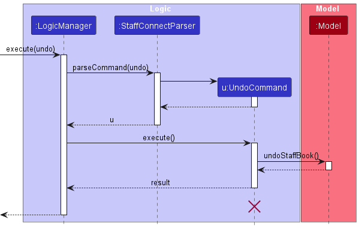

* Table of Contents
{:toc}

--------------------------------------------------------------------------------------------------------------------

## **Acknowledgements**

* {list here sources of all reused/adapted ideas, code, documentation, and third-party libraries -- include links to the original source as well}
* Libraries used: [JavaFX](https://openjfx.io/), [Jackson](https://github.com/FasterXML/jackson), [JUnit5](https://github.com/junit-team/junit5)
* This project is based on the AddressBook-Level3 project created by the [SE-EDU initiative](https://se-education.org).

--------------------------------------------------------------------------------------------------------------------

## **Setting up, getting started**

Refer to the guide [_Setting up and getting started_](SettingUp.md).

--------------------------------------------------------------------------------------------------------------------

## **Design**

:bulb: **Tip:** The `.puml` files used to create diagrams in this document `docs/diagrams` folder. Refer to the [_PlantUML Tutorial_ at se-edu/guides](https://se-education.org/guides/tutorials/plantUml.html) to learn how to create and edit diagrams.

### Architecture

The ***Architecture Diagram*** given above explains the high-level design of the App.

Given below is a quick overview of main components and how they interact with each other.

**Main components of the architecture**

**`Main`** (consisting of classes [`Main`](https://github.com/se-edu/addressbook-level3/tree/master/src/main/java/seedu/address/Main.java) and [`MainApp`](https://github.com/se-edu/addressbook-level3/tree/master/src/main/java/seedu/address/MainApp.java)) is in charge of the app launch and shut down.
* At app launch, it initializes the other components in the correct sequence, and connects them up with each other.
* At shut down, it shuts down the other components and invokes cleanup methods where necessary.

The bulk of the app's work is done by the following four components:

* [**`UI`**](#ui-component): The UI of the App.
* [**`Logic`**](#logic-component): The command executor.
* [**`Model`**](#model-component): Holds the data of the App in memory.
* [**`Storage`**](#storage-component): Reads data from, and writes data to, the hard disk.

[**`Commons`**](#common-classes) represents a collection of classes used by multiple other components.

**How the architecture components interact with each other**

The *Sequence Diagram* below shows how the components interact with each other for the scenario where the user issues the command `delete 1`.

Each of the four main components (also shown in the diagram above),

* defines its *API* in an `interface` with the same name as the Component.
* implements its functionality using a concrete `{Component Name}Manager` class (which follows the corresponding API `interface` mentioned in the previous point.

For example, the `Logic` component defines its API in the `Logic.java` interface and implements its functionality using the `LogicManager.java` class which follows the `Logic` interface. Other components interact with a given component through its interface rather than the concrete class (reason: to prevent outside component's being coupled to the implementation of a component), as illustrated in the (partial) class diagram below.

The sections below give more details of each component.

### UI component

The **API** of this component is specified in [`Ui.java`](https://github.com/se-edu/addressbook-level3/tree/master/src/main/java/seedu/address/ui/Ui.java)

The UI consists of a `MainWindow` that is made up of parts e.g.`CommandBox`, `ResultDisplay`, `PersonListPanel`, `StatusBarFooter` etc. All these, including the `MainWindow`, inherit from the abstract `UiPart` class which captures the commonalities between classes that represent parts of the visible GUI.

The `UI` component uses the JavaFx UI framework. The layout of these UI parts are defined in matching `.fxml` files that are in the `src/main/resources/view` folder. For example, the layout of the [`MainWindow`](https://github.com/se-edu/addressbook-level3/tree/master/src/main/java/seedu/address/ui/MainWindow.java) is specified in [`MainWindow.fxml`](https://github.com/se-edu/addressbook-level3/tree/master/src/main/resources/view/MainWindow.fxml)

The `UI` component,

* executes user commands using the `Logic` component.
* listens for changes to `Model` data so that the UI can be updated with the modified data.
* keeps a reference to the `Logic` component, because the `UI` relies on the `Logic` to execute commands.
* depends on some classes in the `Model` component, as it displays `Person` object residing in the `Model`.

### Logic component

**API** : [`Logic.java`](https://github.com/se-edu/addressbook-level3/tree/master/src/main/java/seedu/address/logic/Logic.java)

Here's a (partial) class diagram of the `Logic` component:

The sequence diagram below illustrates the interactions within the `Logic` component, taking `execute("delete 1")` API call as an example.

:information_source: **Note:** The lifeline for `DeleteCommandParser` should end at the destroy marker (X) but due to a limitation of PlantUML, the lifeline continues till the end of diagram.

How the `Logic` component works:

1. When `Logic` is called upon to execute a command, it is passed to an `AddressBookParser` object which in turn creates a parser that matches the command (e.g., `DeleteCommandParser`) and uses it to parse the command.
1. This results in a `Command` object (more precisely, an object of one of its subclasses e.g., `DeleteCommand`) which is executed by the `LogicManager`.
1. The command can communicate with the `Model` when it is executed (e.g. to delete a person). 
   Note that although this is shown as a single step in the diagram above (for simplicity), in the code it can take several interactions (between the command object and the `Model`) to achieve.
1. The result of the command execution is encapsulated as a `CommandResult` object which is returned back from `Logic`.

Here are the other classes in `Logic` (omitted from the class diagram above) that are used for parsing a user command:

How the parsing works:
* When called upon to parse a user command, the `AddressBookParser` class creates an `XYZCommandParser` (`XYZ` is a placeholder for the specific command name e.g., `AddCommandParser`) which uses the other classes shown above to parse the user command and create a `XYZCommand` object (e.g., `AddCommand`) which the `AddressBookParser` returns back as a `Command` object.
* All `XYZCommandParser` classes (e.g., `AddCommandParser`, `DeleteCommandParser`, ...) inherit from the `Parser` interface so that they can be treated similarly where possible e.g, during testing.

### Model component
**API** : [`Model.java`](https://github.com/se-edu/addressbook-level3/tree/master/src/main/java/seedu/address/model/Model.java)

The `Model` component,

* stores the address book data i.e., all `Person` objects (which are contained in a `UniquePersonList` object).
* stores the currently 'selected' `Person` objects (e.g., results of a search query) as a separate _filtered_ list which is exposed to outsiders as an unmodifiable `ObservableList<Person>` that can be 'observed' e.g. the UI can be bound to this list so that the UI automatically updates when the data in the list change.
* stores a `UserPref` object that represents the user’s preferences. This is exposed to the outside as a `ReadOnlyUserPref` objects.
* does not depend on any of the other three components (as the `Model` represents data entities of the domain, they should make sense on their own without depending on other components)

:information_source: **Note:** An alternative (arguably, a more OOP) model is given below. It has a `Tag` list in the `AddressBook`, which `Person` references. This allows `AddressBook` to only require one `Tag` object per unique tag, instead of each `Person` needing their own `Tag` objects. 

### Storage component

**API** : [`Storage.java`](https://github.com/se-edu/addressbook-level3/tree/master/src/main/java/seedu/address/storage/Storage.java)

The `Storage` component,
* can save both address book data and user preference data in JSON format, and read them back into corresponding objects.
* inherits from both `AddressBookStorage` and `UserPrefStorage`, which means it can be treated as either one (if only the functionality of only one is needed).
* depends on some classes in the `Model` component (because the `Storage` component's job is to save/retrieve objects that belong to the `Model`)

### Common classes

Classes used by multiple components are in the `vitalConnectbook.commons` package.

--------------------------------------------------------------------------------------------------------------------

## **Implementation**

This section describes some noteworthy details on how certain features are implemented.

### \[Proposed\] Undo/redo feature

#### Proposed Implementation

The proposed undo/redo mechanism is facilitated by `VersionedAddressBook`. It extends `AddressBook` with an undo/redo history, stored internally as an `addressBookStateList` and `currentStatePointer`. Additionally, it implements the following operations:

* `VersionedAddressBook#commit()` — Saves the current address book state in its history.
* `VersionedAddressBook#undo()` — Restores the previous address book state from its history.
* `VersionedAddressBook#redo()` — Restores a previously undone address book state from its history.

These operations are exposed in the `Model` interface as `Model#commitAddressBook()`, `Model#undoAddressBook()` and `Model#redoAddressBook()` respectively.

Given below is an example usage scenario and how the undo/redo mechanism behaves at each step.

Step 1. The user launches the application for the first time. The `VersionedAddressBook` will be initialized with the initial address book state, and the `currentStatePointer` pointing to that single address book state.

Step 2. The user executes `delete 5` command to delete the 5th person in the address book. The `delete` command calls `Model#commitAddressBook()`, causing the modified state of the address book after the `delete 5` command executes to be saved in the `addressBookStateList`, and the `currentStatePointer` is shifted to the newly inserted address book state.

Step 3. The user executes `add n/David …​` to add a new person. The `add` command also calls `Model#commitAddressBook()`, causing another modified address book state to be saved into the `addressBookStateList`.

:information_source: **Note:** If a command fails its execution, it will not call `Model#commitAddressBook()`, so the address book state will not be saved into the `addressBookStateList`.

Step 4. The user now decides that adding the person was a mistake, and decides to undo that action by executing the `undo` command. The `undo` command will call `Model#undoAddressBook()`, which will shift the `currentStatePointer` once to the left, pointing it to the previous address book state, and restores the address book to that state.

:information_source: **Note:** If the `currentStatePointer` is at index 0, pointing to the initial AddressBook state, then there are no previous AddressBook states to restore. The `undo` command uses `Model#canUndoAddressBook()` to check if this is the case. If so, it will return an error to the user rather
than attempting to perform the undo.

The following sequence diagram shows how an undo operation goes through the `Logic` component:

:information_source: **Note:** The lifeline for `UndoCommand` should end at the destroy marker (X) but due to a limitation of PlantUML, the lifeline reaches the end of diagram.

Similarly, how an undo operation goes through the `Model` component is shown below:

The `redo` command does the opposite — it calls `Model#redoAddressBook()`, which shifts the `currentStatePointer` once to the right, pointing to the previously undone state, and restores the address book to that state.

:information_source: **Note:** If the `currentStatePointer` is at index `addressBookStateList.size() - 1`, pointing to the latest address book state, then there are no undone AddressBook states to restore. The `redo` command uses `Model#canRedoAddressBook()` to check if this is the case. If so, it will return an error to the user rather than attempting to perform the redo.

Step 5. The user then decides to execute the command `list`. Commands that do not modify the address book, such as `list`, will usually not call `Model#commitAddressBook()`, `Model#undoAddressBook()` or `Model#redoAddressBook()`. Thus, the `addressBookStateList` remains unchanged.

Step 6. The user executes `clear`, which calls `Model#commitAddressBook()`. Since the `currentStatePointer` is not pointing at the end of the `addressBookStateList`, all address book states after the `currentStatePointer` will be purged. Reason: It no longer makes sense to redo the `add n/David …​` command. This is the behavior that most modern desktop applications follow.

The following activity diagram summarizes what happens when a user executes a new command:

#### Design considerations:

**Aspect: How undo & redo executes:**

* **Alternative 1 (current choice):** Saves the entire address book.
  * Pros: Easy to implement.
  * Cons: May have performance issues in terms of memory usage.

* **Alternative 2:** Individual command knows how to undo/redo by
  itself.
  * Pros: Will use less memory (e.g. for `delete`, just save the person being deleted).
  * Cons: We must ensure that the implementation of each individual command are correct.

_{more aspects and alternatives to be added}_

### \[Proposed\] Data archiving

_{Explain here how the data archiving feature will be implemented}_

--------------------------------------------------------------------------------------------------------------------

## **Documentation, logging, testing, configuration, dev-ops**

* [Documentation guide](Documentation.md)
* [Testing guide](Testing.md)
* [Logging guide](Logging.md)
* [Configuration guide](Configuration.md)
* [DevOps guide](DevOps.md)

--------------------------------------------------------------------------------------------------------------------

## **Appendix: Requirements**

### Product scope

**Target user profile**:

* has a need to manage a significant number of patient records and contacts
* need to manage a significant number of appointments
* need to have a reminder of upcoming appointments
* prefer desktop apps over other types
* can type fast
* prefers typing to mouse interactions
* is reasonably comfortable using CLI apps

**Value proposition**:
VitalConnect aims to provide a robust and user-friendly platform for medical professionals to streamline their workflow by effectively managing patient information and appointments. The key value propositions include:

* Efficient Patient Management: Users can easily add, modify, and retrieve patient information, ensuring a comprehensive and organized patient database.

* Seamless Appointment Handling: VitalConnect allows for the effortless creation, modification, and deletion of appointments, ensuring accurate scheduling and coordination.

* CLI Efficiency: The application caters to users who prefer typing commands over graphical interfaces, enabling faster and more precise data entry.

### User stories

Priorities: High (must have) - `* * *`, Medium (nice to have) - `* *`, Low (good to but might not have) - `*`

| Priority | As a …​                                    | I want to …​                     | So that I can…​                                                        |
| -------- | ------------------------------------------ | ------------------------------ | ---------------------------------------------------------------------- |
| `* * *`  | new user | have a comprehensive document that details every possible feature. | learn how to use a particular feature |
| `* * *`  | user | add new patient, either with or without further basic information about the patient | |
| `* * *`  | user | add the basic information of my patient into the database | so that I can better identify who the patient is |
| `* * *`  | user | delete patient | free storage resources |
| `* * *`  | user | list out all of the information about a particular patient | see the detailed information of the patient |
| `* * *`  | user | add the contact information of my patient into the database | get in touch with them when needed or under emergency situation |
| `* * *`  | user | delete the contact information for a particular patient when the information is outdated | free storage resources |
| `* * *`  | user | list out all of the patients and their contact information | |
| `* * *`  | intermediate user | add appointment information for a patient | easily schedule an appointment and find free time slot for it |
| `* * *`  | intermediate user | delete appointment for a patient | free up slots if the patient is unable to attend |
| `* * *`  | intermediate user | list out all of the appointments | |
| `* * *`  | user | list out all of the information about a particular patient | see the detailed information of the patient |
| `* *`  | user | add the medical information for the patient | allow the doctor to better treat the patient |
| `* *`  | user | delete the medical information for a patient when the information is outdated | free storage resources |
| `* *`  | user | list out all of the patients and their medical information | |
| `* *`  | user | modify the medical details of a patient | keep the patient's medical information updated |
| `* *`  | user | modify the basic information of a patient | keep the patient's basic information updated |
| `* *`  | user | modify the contact information of a patient | keep the patient's contact information updated |
| `* *`  | user | modify the appointment details of a patient | keep the patient's appointment information updated |
| `* *`  | user | undo the most recent change or command if possible | fix any errors made |
| `* *`  | user | view all of the appointments for the day | |
| `* *`  | intermediate user | list out specifically the medication that the patient is currently taking | |
| `* *`  | intermediate user | modify the patient's current medication | better track the medication plan of the patient |
| `* *`  | intermediate user | list out specifically the patient's allergies | prescribe the appropriate medication |
| `* *`  | intermediate user | modify the patient's allergies | |
| `* *`  | intermediate user | list out specifically the past illnesses of the patient | assist in the diagnosis process |
| `* *`  | intermediate user | modify the patient's past illnesses upon the previous appointment | |
| `* *`  | expert user | have short forms of existing commands | save time on typing the commands |
| `*`  | new user | have the ability to switch to a more simplified and beginner friendly UI | more effectively learn the basics |
| `*`  | new user | have interactive elements in the user guide | easily understand the app's capabilities |
| `*`  | new user | be given command suggestions for mistyped commands | type the intended command without needing to refer to the user guide |
| `*`  | user | add a reminder for an appointment | be aware of the appointment while busy with work |
| `*`  | user | mark a reminder as done or undone | better track done and undone work |
| `*`  | user | mark some of the patients as the special focus | better track patients in serious conditions |
| `*`  | user | have the ability to leave comments or annotations on shared patient records | communicate specific insights or recommendations to my colleagues |
| `*`  | user | have a way to assign specific colors to specific medical terms | better skim through the information |
| `*`  | user | have a method for showing tooltips of features when hovered | quickly find out information about the feature without needing other references |
| `*`  | user | have a method of giving feedback to the developers | share aspects of the product that I would like changes to |
| `*`  | intermediate user | have an efficient way to export and backup patient data | ensure the safety and accessibility of important information |
| `*`  | intermediate user | export selected patient's information | give the information to the doctor or the patient when needed |
| `*`  | intermediate user | export selected medical instructions | easily share the instructions to the patient|
| `*`  | doctor | be able to set a set of instructions for the assistants for special cases such as performing lung capacity tests for asmatics | make my assistants aware of the procedures to go through before my consultation with the patient |

### Use cases

(For all use cases below, the **System** is the `VitalConnect` and the **Actor** is the `user`, unless specified otherwise)

**Use case: UC1 - Add a patient**
**MSS**
1.  User requests to add a patient by keying the patient's name and NRIC in the command.
2.  VitalConnect adds the patient's name and NRIC.
Use case ends.
**Extensions**
* 1a. The NRIC already exists in the system.
      * 1a1. VitalConnect displays warning message and the existing patient's information.
      Use case ends.
* 1b. The NRIC or name entered is invalid.
      * 1b1. VitalConnect shows an error message.
      Use case ends.

**Use case: UC2 - Delete a patient**
**MSS**
1.  User requests to delete a patient by keying the patient's name or NRIC in the command.
2.  VitalConnect deletes the patient from database.
Use case ends.
**Extensions**
* 1a. The patient doesn't exist in the system.
      * 1a1. VitalConnect displays an error message.
      Use case ends.

**Use case: UC3 - Add an appointment**
**MSS**
1.  User requests to add an appointment for a patient.
2.  VitalConnect add the appointment to the database under this patient's NRIC.
Use case ends.
**Extensions**
* 1a. Critical information (time and doctor) missing in the appointment.
      * 1a1. VitalConnect displays a warning message.
      Use case ends.
* 1b. The assigned patient doesn't exist in the database.
      * 1b1. VitalConnect displays a warning message.
      Use case ends.
* 1c. The appointment time crashes with existing time.
      * 1c1. VitalConnect displays a warning message.
      * 1c1. VitalConnect displays the appointment with crashing time.
      Use case ends.

**Use case: UC4 - Delete an appointment**
**MSS**
1.  User requests to delete an appointment for a patient.
2.  VitalConnect removes the appointment from the database.
Use case ends.
**Extensions**
* 1a. The assigned patient or the appointment doesn't exist in the database.
      * 1a1. VitalConnect displays a warning message.
      Use case ends.

**Use case: UC5 - Modify an appointment**
**MSS**
1.  User requests to modify an appointment for a patient by keying the appointment's id.
2.  VitalConnect displays the detail of the appointment to be modified.
3.  User specify which field to be modified and enters the new information.
4.  VitalConnect saves the new appointment information.
5.  VitalConnect displays the updated detail of the appointment modified.
Use case ends.
**Extensions**
* 1a. The appointment refered by the id doesn't exist in the database.
      * 1a1. VitalConnect displays an error message.
      Use case ends.
* 1b. The id is not a valid number.
      * 1b1. VitalConnect displays an error message.
      Use case ends.
* 3a. The field to be modified is unrecognized.
      * 3a1. VitalConnect displays an error message.
      * 3a2. VitalConnect request for valid field information.
      * 3a3. User enters new field information.
      Steps 3a1-3a3 are repeated until the data entered are correct.
      Use case resumes from step 4.
* 3b. The new information is in invalid form or contains invalid character.
      * 3b1. VitalConnect displays an error message.
      * 3b2. VitalConnect request for valid data entry.
      * 3b3. User enters new field information.
      Steps 3b1-3b3 are repeated until the data entered are valid.
      Use case resumes from step 4.
* 3c. The appointment time crashes with existing time.
      * 3c1. VitalConnect displays an error message.
      * 3c2. VitalConnect displays the appointment with crashing time.
      * 3c3. VitalConnect request for valid data entry.
      * 3c4. User enters new field information.
      Steps 3c1-3c4 are repeated until the time doesn't crash.
      Use case resumes from step 4.

**Use case: UC6 - Add specific information for a patient**
**MSS**
1.  User requests to add specific information for a patient.
2.  VitalConnect save the specific information to the database.
Use case ends.
**Extensions**
* 1a. The patient doesn't exist in the database.
      * 1a1. VitalConnect displays a warning message.
      Use case ends.
* 1b. The information is invalid.
      * 1b1. VitalConnect displays a warning message.
      Use case ends.

**Use case: UC7 - Delete specific information**
**MSS**
1.  User requests to delete specific information for a patient.
2.  VitalConnect remove the specific information to the database.
Use case ends.
**Extensions**
* 1a. The patient or specific information doesn't exist in the database.
      * 1a1. VitalConnect displays a warning message.
      Use case ends.

**Use case: UC8 - Modify specific information**
**MSS**
1.  User requests to modify specific information for a patient.
2.  VitalConnect displays the updated specific information of the patient.
Use case ends.
**Extensions**
* 1a. The patient or specific information doesn't exist in the database.
      * 1a1. VitalConnect displays a warning message.
      Use case ends.
* 1b. The specific information is invalid.
      * 1b1. VitalConnect displays a warning message.
      Use case ends.

### Non-Functional Requirements

# Technical Requirements
1. Should work on any _mainstream OS_ as long as it has Java `11` or above installed.

# Performance Requirements
1. Should be able to hold up to 100 patients with 1000 appointments without a noticeable sluggishness in performance for typical usage.
2. The system should respond within 3 seconds.

# Quality Requirements
1. A user with above average typing speed for regular English text (i.e. not code, not system admin commands) should be able to accomplish most of the tasks faster using commands than using the mouse.
2. System should be robust for any form of data file crashes and invalid user input.

# Scope
1. The product will <strong>NOT</strong> enforce any form of protection of the generated data file containing patients' information. The organization should be responsible for ensuring the safety of their patient's data.

# Process Requirements
1. The project is expected to grow in breadth-first iterative process.

### Glossary

* **Mainstream OS**: Windows, Linux, Unix, MacOS
* **CLI**: Acronym for Command Line Interface, a text-based interface where users interact with the application by typing commands.
* **VitalConnect**: The system being described, representing the medical management application.
* **Use Case**: A specific scenario or situation in which a user interacts with the VitalConnect system to achieve a specific goal.
* **MSS (Main Success Scenario)**: The primary sequence of steps in a use case that represents the successful accomplishment of the user's goal.
* **Extensions**: Additional scenarios that may occur during the execution of a use case, usually describing alternative paths or error-handling situations.
* **NRIC**: National Registration Identity Card, a unique identification number used in some countries.
* **Database**: A structured set of data stored electronically, in this context, referring to the storage system for patient and appointment information.
* **Appointment**: A scheduled meeting or arrangement, often referring to a scheduled medical consultation in the context of VitalConnect.
* **Field**: In the context of modifying an appointment, a specific piece of information within the appointment details that the user can choose to modify (e.g., time, doctor).
* **ID (Identification Number)**: A unique identifier associated with a specific appointment, used to distinguish and reference individual appointments.
* **Warning Message**: An alert displayed by the VitalConnect system to notify the user of a potential issue or discrepancy.
* **Error Message**: A notification displayed by the VitalConnect system to inform the user about a critical issue or mistake.
* **Crashing Time**: A situation where the proposed time for an appointment conflicts with an existing appointment time in the system.
* **Invalid Data Entry**: Information entered by the user that does not meet the required format or criteria.
* **Valid Data Entry**: Information entered by the user that meets the required format or criteria.
* **Tooltip**: A common graphical user interface element in which, when hovering over a screen element or component, a text box displays information about that element.

--------------------------------------------------------------------------------------------------------------------

## **Appendix: Instructions for manual testing**

Given below are instructions to test the app manually.

:information_source: **Note:** These instructions only provide a starting point for testers to work on;
testers are expected to do more *exploratory* testing.

### Launch and shutdown

1. Initial launch

   1. Download the jar file and copy into an empty folder

   1. Double-click the jar file Expected: Shows the GUI with a set of sample contacts. The window size may not be optimum.

1. Saving window preferences

   1. Resize the window to an optimum size. Move the window to a different location. Close the window.

   1. Re-launch the app by double-clicking the jar file. 
       Expected: The most recent window size and location is retained.

1. _{ more test cases …​ }_

### Deleting a person

1. Deleting a person while all persons are being shown

   1. Prerequisites: List all persons using the `list` command. Multiple persons in the list.

   1. Test case: `delete 1` 
      Expected: First contact is deleted from the list. Details of the deleted contact shown in the status message. Timestamp in the status bar is updated.

   1. Test case: `delete 0` 
      Expected: No person is deleted. Error details shown in the status message. Status bar remains the same.

   1. Other incorrect delete commands to try: `delete`, `delete x`, `...` (where x is larger than the list size) 
      Expected: Similar to previous.

1. _{ more test cases …​ }_

### Saving data

1. Dealing with missing/corrupted data files

   1. _{explain how to simulate a missing/corrupted file, and the expected behavior}_

1. _{ more test cases …​ }_
