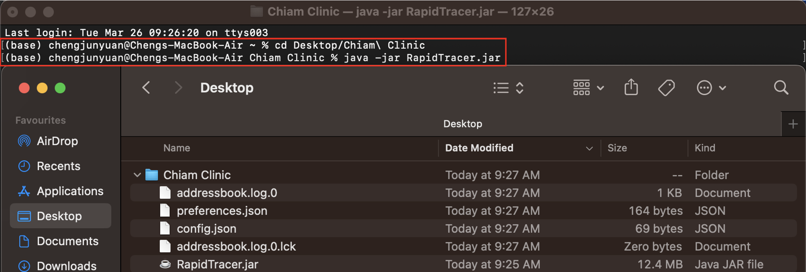

<h1 id="top">
  RapidTracer
</h1>

RapidTracer offers a fast-paced user interface (UI) for clinic managers to handle contacts and appointments. It combines:
- a simple and intuitive UI;
- swift navigation through complex patient data and contact histories;
- the ability to load and store large datasets; and is
- quick to use for fast typers!

This guide provides a walkthrough on how to use RapidTracer to assist you in your clinical workflows, starting from patient in-processing. For experienced users, click the links on the right for quick navigation!

<!-- * Table of Contents -->
<page-nav-print />

--------------------------------------------------------------------------------------------------------------------

## Quick start and installation

This section covers the download and installation process for RapidTracer.

1. Ensure you have Java `11` or above installed on your computer.
2. Download the latest version of `RapidTracer.jar` [here](https://github.com/AY2324S2-CS2103T-T10-2/tp/releases/tag/v1.2).
3. Copy the file to the folder you want to store all RapidTracer data in.
4. Open a command terminal and navigate to the folder where `RapidTracer.jar` is located using the `cd FOLDER_NAME` command. Use the `java -jar RapidTracer.jar` command to start running RapidTracer.
   

If you encounter any issues running RapidTracer, you may refer to the detailed bug fixing [here](https://nus-cs2103-ay2324s2.github.io/website/admin/programmingLanguages.html).

--------------------------------------------------------------------------------------------------------------------

## Using RapidTracer

The clinical workflow is separated into three steps with RapidTracer:
1. [Registering patients and appointments](#patient-in-processing)
2. [Searching existing records](#searching-records)
3. [Editing and deleting records](#editing-records)

For features which don't fall into the above categories, refer [here](#general-help).

<h3 id="patient-in-processing" style="color: #088F8F">
  Registering patients and appointments
</h3>

There are three ways you can register new patients and schedule new appointments.

1. Use the `add` command to register a new patient.
2. Use the `addappt` command to schedule a new appointment for an existing patient.
3. Use the `add` command to register a new patient and schedule an appointment immediately.

<h4 id="add" style="color: #7393B3">
  Registering new patients: `add`
</h4>

You can add new patients to our database with the `add` command. Each patient must minimally have a name and a phone number for administrative purposes.

Format: `add n/NAME p/PHONE_NUMBER [a/ADDRESS] [t/TAG]`

- Commands in [brackets] are optional parameters.
- The name to be added “NAME” can only contain alphanumeric characters.
- Parameters may be typed in any order.

<h4 id="addappt" style="color: #7393B3">
  Scheduling new appointments: `addappt`
</h4>

You can schedule appointments for existing patients using the `addappt` command.

Format: `addappt INDEX d/DATE`

- Adds an appointment to the contact at the specified INDEX.
- INDEX is a positive integer displayed on the screen.
- The format of "DATE_TIME" is `dd/mm/yyyy [x]am-[y]pm`. Examples of accepted "DATE_TIME":
  - `24/03/2024 10am-2pm`
  - `24/03/2024 10AM-2PM`
  - `24/03/2024 10am - 2pm`
  - `today 10am-2pm` (this will create an appointment from 10am to 2pm with today's date)
  - `tdy 10am-2pm` (this will create an appointment from 10am to 2pm with today's date)

<h4 id="add-with-appt" style="color: #7393B3">
  Managing walk-ins: `add`
</h4>

For walk-in appointments, you can also create a new contact and add an appointment with a single command. This command automatically creates an appointment linked to the patient which is being added.

Format: `add n/NAME p/PHONE_NUMBER d/DATE_TIME [a/ADDRESS] [t/TAG]`

<box type="info" seamless>
  <b>Remark:</b> This `add` command is the same as the one above, but with an extra field (the `DATE_TIME`).
</box>

- Commands in [brackets] are optional parameters.
- The name to be added “NAME” can only contain alphanumeric characters.
- Parameters may be typed in any order.
- The format of "DATE_TIME" is `dd/mm/yyyy [x]am-[y]pm`. Examples of accepted "DATE_TIME":
  - `24/03/2024 10am-2pm`
  - `24/03/2024 10AM-2PM`
  - `24/03/2024 10am - 2pm`
  - `today 10am-2pm` (this will create an appointment from 10am to 2pm with today's date)
  - `tdy 10am-2pm` (this will create an appointment from 10am to 2pm with today's date)

<h3 id="searching-records" style="color: #088F8F">
  Searching existing records
</h3>

RapidTracer offers search functions for both patient and appointment data. Beyond searching for specific patients and appointments, RapidTracer offers a list view to see all patient and appointment records.

<h4 id="find" style="color: #7393B3">
  Searching for contacts: `find`
</h4>

Shows a list of contacts in RapidTracer matching the keywords provided. The contact only needs to partially match any of the keywords provided.

Format: `find KEYWORD [MORE_KEYWORDS]`

- The KEYWORD searched is case-insensitive.
- Order of keywords does not matter.
- Possible keyword types:
  - NAME
  - PHONE_NUMBER
  - ADDRESS

<h4 id="findappt" style="color: #7393B3">
  Finding appointment: `findappt`
</h4>

Shows a list of appointments in RapidTracer matching the keywords provided. The appointment only needs to partially match any of the keywords provided.

Format: `findappt KEYWORD [MORE_KEYWORDS]`

- The KEYWORD searched is case-insensitive.
- Order of keywords does not matter.
- Possible keyword types:
  - NAME

<h4 id="list" style="color: #7393B3">
  Listing contacts: `list`
</h4>

Shows a list of all contacts in RapidTracer.

Format: `list`

<h4 id="listappt" style="color: #7393B3">
  Listing appointments: `listappt`
</h4>

Shows a list of all appointments in RapidTracer.

Format: `listappt`

<h3 id="editing-records" style="color: #088F8F">
  Editing and deleting records
</h3>

In the event that patients update their contact details or reschedule an appointment, their details can be updated accordingly. RapidTracer also allows you to cancel appointments and delete patient records.

<h4 id="edit" style="color: #7393B3">
  Editing contacts: `edit`
</h4>

An existing patient's details can be updated in RapidTracer using the `edit` command. This does not deal with user appointments.

Format: `edit INDEX [n/NAME] [p/PHONE_NUMBER] [a/ADDRESS] [t/TAG]`

- Edits the contact at the specified INDEX.
- INDEX is a positive integer that is currently displayed on the screen.
- Only one INDEX can be edited at a time.
- At least one of the optional fields must be provided.
- Existing values will be updated to the input values.

<h4 id="editappt" style="color: #7393B3">
  Editing appointment: `editappt`
</h4>

An appointment can be rescheduled with the `editappt` command to change the date and time of the appointment.

Format: `editappt INDEX d/DATE_TIME`

- INDEX is a positive integer that is currently displayed on the screen.
- Only one INDEX can be edited at a time.
- At least one of the optional fields must be provided.
- Existing values will be updated to the input values.
- The format of "DATE_TIME" is `dd/mm/yyyy [x]am-[y]pm`. Examples of accepted "DATE_TIME":
  - `24/03/2024 10am-2pm`
  - `24/03/2024 10AM-2PM`
  - `24/03/2024 10am - 2pm`
  - `today 10am-2pm` (this will create an appointment from 10am to 2pm with today's date)
  - `tdy 10am-2pm` (this will create an appointment from 10am to 2pm with today's date)

<h4 id="delete" style="color: #7393B3">
  Deleting contacts: `delete`
</h4>

In the event that a patient requests for their data to be deleted, you can use the `delete` command to remove their contact information.

Format: `delete INDEX`

- Deletes the contact at the specified INDEX.
- INDEX is a positive integer that is currently displayed on the screen.
- Only one INDEX can be deleted at a time.

<h4 id="deleteappt" style="color: #7393B3">
  Deleting appointments: `deleteappt`
</h4>

In the event that an appointment is cancelled, you can delete it using the `deleteappt` command.

Format: `deleteappt INDEX`

- Deletes the appointment at the specified INDEX.
- INDEX is a positive integer that is currently displayed on the screen.
- Only one INDEX can be deleted at a time.

<h3 id="general-help" style="color: #088F8F">
  General help
</h3>

<h4 id="help" style="color: #7393B3">
  Viewing help: `help`
</h4>

For general help, type `help` to open the help window. The `help` window will redirect you [here](https://ay2324s2-cs2103t-t10-2.github.io/tp/UserGuide.html).

Format: `help`

<h4 id="exit" style="color: #7393B3">
  Exiting/closing RapidTracer
</h4>

To properly exit RapidTracer, click the `File` option in the top left corner and click `Exit`. This will ensure that the data is saved properly. 

--------------------------------------------------------------------------------------------------------------------

## FAQ

**Q**: How do I upload records into RapidTracer? 
**A**: This feature is currently under development!

**Q**: How do I download all my records from RapidTracer? 
**A**: This feature is currently under development!

**Q**: A command is not working, what am I doing wrong? 
**A**: There's a chance that the feature is still under development. We will fix it!

**Q**: I still have an unanswered question! 
**A**: Please drop us an email at minrei.seah@u.nus.edu

--------------------------------------------------------------------------------------------------------------------

## Known issues

1. **When using multiple screens**, if you move the application to a secondary screen, and later switch to using only the primary screen, the app will open off-screen. The remedy is to delete the `preferences.json` file created by the application before running the application again.

--------------------------------------------------------------------------------------------------------------------

## Command summary

Action     | Format | Examples
-----------|-----------------------------------------|-----------------------------------------------------------------------------------------------------------------------------
Add contacts | `add n/NAME p/PHONE_NUMBER [a/ADDRESS] [t/TAG]` | `add n/Min Rei p/86615076`,  `add n/Min Rei p/86615076 a/UTown RC4`,  `add n/Min Rei p/86615076 d/27/03/2024 2pm-3pm`
Add appointments | `addappt INDEX d/DATE_TIME` | `addappt 1 d/27/03/2024 9am-10am`,  `addappt 1 d/today 9am-10am`,  `addappt 1 d/tdy 9am-10am`
Find contacts | `find KEYWORD [MORE_KEYWORDS]` | `find min`,  `find rc4`
Find appointments | `findappt KEYWORD [MORE_KEYWORDS]` | `findappt min`
List all contacts | `list` |
List all appointments | `listappt` |
Editing contacts | `edit INDEX [n/NAME] [p/PHONE_NUMBER] [a/ADDRESS] [t/TAG]` | `edit 1 n/Seah Min Rei`
Editing appointments | `editappt INDEX d/DATE_TIME` | `editappt 1 30/12/2024 8am-9am`
Help | `help` |
