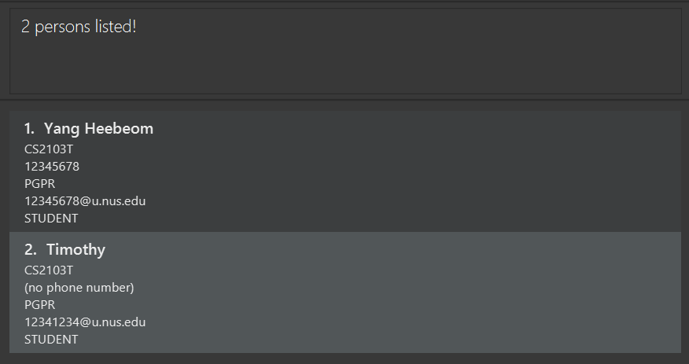

NUSContacts is a **desktop app for managing contacts, optimized for use via a Command Line Interface** (CLI) while still having the benefits of a Graphical User Interface (GUI). If you can type fast, NUSContacts can get your contact management tasks done faster than traditional GUI apps.

* Table of Contents
{:toc}

--------------------------------------------------------------------------------------------------------------------

## Quick start

1. Ensure you have Java `11` or above installed in your Computer.

1. Download the latest `NUSContacts.jar` from [here](https://github.com/AY2324S2-CS2103T-T11-2/tp/releases).

1. Copy the file to the folder you want to use as the _home folder_ for your NUSContacts application.

1. Open a command terminal, `cd` into the folder you put the jar file in, and use the `java -jar NUSContacts.jar` command to run the application. 
   A GUI similar to the below should appear in a few seconds. Note how the app contains some sample data. 
   

1. Type the command in the command box and press Enter to execute it. e.g. typing **`help`** and pressing Enter will open the help window. 
   Some example commands you can try:

   * `list` : Lists all contacts.

   * `add n/John Doe p/98765432 e/johnd@example.com r/STUDENT a/PGPR c/CS2103T` : Adds a contact named `John Doe` to the Address Book.

   * `delete 3` : Deletes the 3rd contact shown in the current list.

   * `clear` : Deletes all contacts.

   * `exit` : Exits the app.

1. Refer to the [Features](#features) below for details of each command.

--------------------------------------------------------------------------------------------------------------------

## Features

**:information_source: Notes about the command format:** 

* Words in `UPPER_CASE` are the parameters to be supplied by the user. 
  e.g. in `add n/NAME`, `NAME` is a parameter which can be used as `add n/John Doe`.

* Items in square brackets are optional. 
  e.g `n/NAME [t/TAG]` can be used as `n/John Doe t/friend` or as `n/John Doe`.

* Items with `…`​ after them can be used multiple times including zero times. 
  e.g. `[t/TAG]…​` can be used as ` ` (i.e. 0 times), `t/friend`, `t/friend t/family` etc.

* If the command you have typed is a prefix of only one existing command, it will be interpreted as that existing command. 
  e.g. if the command is `ad ...`, then it will be interpreted as an `add ...` command.

* Parameters can be in any order. 
  e.g. if the command specifies `n/NAME p/PHONE`, `p/PHONE n/NAME` is also acceptable.

* Extraneous parameters for commands that do not take in parameters (such as `help`, `list`, `exit` and `clear`) will be ignored. 
  e.g. if the command specifies `help 123`, it will be interpreted as `help`.

* If you are using a PDF version of this document, be careful when copying and pasting commands that span multiple lines as space characters surrounding line-breaks may be omitted when copied over to the application.

### Viewing help : `help`

Shows a message explaning how to access the help page.

Format: `help`

### Adding a person: `add`

Adds a person to the address book.

Format: `add n/NAME e/EMAIL r/ROLE a/ADDRESS c/COURSE [p/PHONE] [t/TAG]…​`

:bulb: **Tip:**
A person can have any number of tags (including 0)

Examples:
* `add n/John Doe p/98765432 e/johnd@example.com r/STUDENT a/PGPR c/CS2101`
* `add n/Betsy Crowe t/friend e/betsycrowe@example.com r/TA a/COM2-0102 c/ST2334`

Unlike the `edit` command, `t/` with an empty tag is not supported.
If you want to not include any tag, leave out `t/TAG` entirely.
Similarly, `p/` without any phone number is not supported, if you want to not specify the phone number, leave out `p/PHONE` entirely.

### Listing all persons : `list`

Shows a list of all persons in the address book.

Format: `list`

### Editing a person : `edit`

Edits an existing person in the address book.

Format: `edit INDEX [n/NAME] [p/PHONE] [e/EMAIL] [r/ROLE] [a/ADDRESS] [c/COURSE] [t/TAG]…​`

* Edits the person at the specified `INDEX`. The index refers to the index number shown in the displayed person list. The index **must be a positive integer** 1, 2, 3, …​
* At least one of the optional fields must be provided.
* Existing values will be updated to the input values.
* When editing tags, the existing tags of the person will be removed i.e adding of tags is not cumulative.
* You can remove all the person’s tags by typing `t/` without
    specifying any tags after it.
* You can remove a person's phone number by typing `p/` without specifying any phone number after it.

Examples:
*  `edit 1 p/91234567 e/johndoe@example.com` Edits the phone number and email address of the 1st person to be `91234567` and `johndoe@example.com` respectively.
*  `edit 2 n/Betsy Crower t/` Edits the name of the 2nd person to be `Betsy Crower` and clears all existing tags.
*  `edit 3 p/ t/` Deletes the phone number of the 3rd person and clears all existing tags.

### Locating persons by name: `find`

Finds persons whose names contain any of the given keywords.

Format: `find KEYWORD [MORE_KEYWORDS]`

* The search is case-insensitive. e.g `hans` will match `Hans`
* The order of the keywords does not matter. e.g. `Hans Bo` will match `Bo Hans`
* Only the name is searched.
* Only full words will be matched e.g. `Han` will not match `Hans`
* Persons matching at least one keyword will be returned (i.e. `OR` search).
  e.g. `Hans Bo` will return `Hans Gruber`, `Bo Yang`

Examples:
* `find John` returns `john` and `John Doe`
* `find yang timothy` returns `Yang Heebeom`, `Timothy` 
  

### Deleting a person : `delete`

Deletes the specified person(s) from the address book.

Format: `delete INDEX`

* Deletes the person at the specified `INDEX`.
* The index refers to the index number shown in the displayed person list.
* The index **must be a positive integer** 1, 2, 3, …​

Examples:
* `list` followed by `delete 2` deletes the 2nd person in the address book.
* `find Betsy` followed by `delete 1` deletes the 1st person in the results of the `find` command.

You can also delete multiple people by chaining the indices using a comma.

Format: `delete INDEX1, INDEX2, INDEX3, …​`

* A comma (`,`) must be used to separate each pair of Indices.
* The indices do not need to be listed in order. (i.e. `2, 4, 6` is the same as `6, 2, 4`)
* Listing the same index more than once will result in an error message being displayed.
* Each `INDEX` must still adhere to the points listed above.

Example:
* `delete 3, 1, 7, 8` deletes the first, third, seventh, and eighth person in the address book.

### Clearing all entries : `clear`

Clears all entries from the address book.

Format: `clear`

### Exiting the program : `exit`

Exits the program.

Format: `exit`

### Saving the data

NUSContacts data are saved in the hard disk automatically after any command that changes the data. There is no need to save manually.

### Editing the data file

NUSContacts data are saved automatically as a JSON file `[JAR file location]/data/addressbook.json`. Advanced users are welcome to update data directly by editing that data file.

:exclamation: **Caution:**
If your changes to the data file makes its format invalid, NUSContacts will discard all data and start with an empty data file at the next run. Hence, it is recommended to take a backup of the file before editing it. 
Furthermore, certain edits can cause the NUSContacts to behave in unexpected ways (e.g., if a value entered is outside of the acceptable range). Therefore, edit the data file only if you are confident that you can update it correctly.

### Archiving data files `[coming in v2.0]`

_Details coming soon ..._

--------------------------------------------------------------------------------------------------------------------

## FAQ

**Q**: How do I transfer my data to another Computer? 
**A**: Install the app in the other computer and overwrite the empty data file it creates with the file that contains the data of your previous NUSContacts home folder.

--------------------------------------------------------------------------------------------------------------------

## Known issues

1. **When using multiple screens**, if you move the application to a secondary screen, and later switch to using only the primary screen, the GUI will open off-screen. The remedy is to delete the `preferences.json` file created by the application before running the application again.

--------------------------------------------------------------------------------------------------------------------

## Command summary

| Action     | Format, Examples                                                                                                                                                                |
|------------|---------------------------------------------------------------------------------------------------------------------------------------------------------------------------------|
| **Add**    | `add n/NAME e/EMAIL r/ROLE a/ADDRESS c/COURSE [t/TAG]… [p/PHONE]​`   e.g., `add n/James Ho p/22224444 e/jamesho@example.com r/STUDENT a/PGPR c/CS2103T t/friend t/colleague` |
| **Clear**  | `clear`                                                                                                                                                                         |
| **Delete** | `delete INDEX`  e.g., `delete 3`                                                                                                                                             |
| **Edit**   | `edit INDEX [n/NAME] [p/PHONE] [e/EMAIL] [r/ROLE] [a/ADDRESS] [c/COURSE] [t/TAG]…​`  e.g.,`edit 2 n/James Lee e/jameslee@example.com`                                        |
| **Find**   | `find KEYWORD [MORE_KEYWORDS]`  e.g., `find James Jake`                                                                                                                      |
| **List**   | `list`                                                                                                                                                                          |
| **Help**   | `help`                                                                                                                                                                          |
