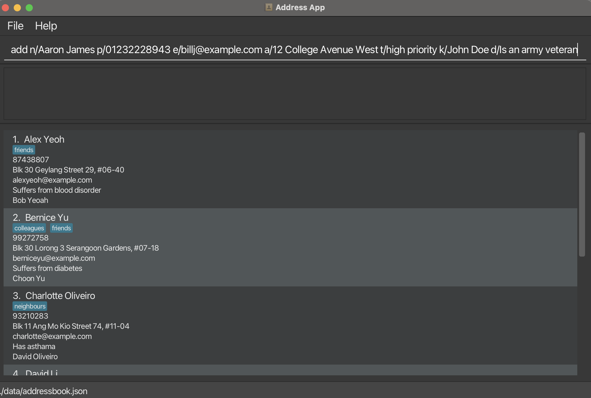
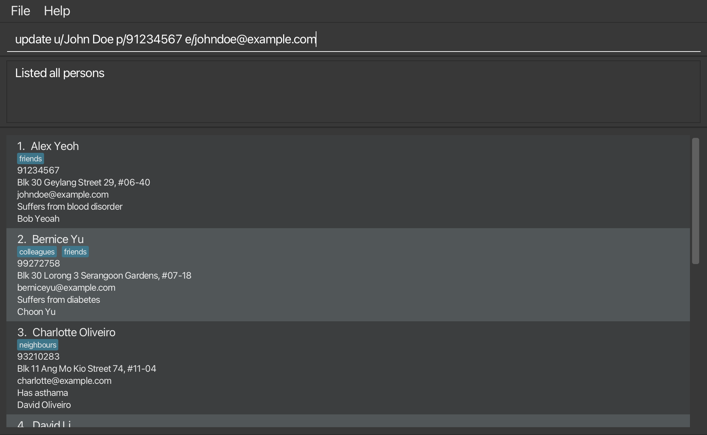

# ConnectCare User Guide

<box type="info" seamless>

_This page is for ConnectCare users. If you're a developer, see also the
[Developer guide](https://ay2324s2-cs2103t-w12-4.github.io/tp/DeveloperGuide.html)._
</box>

<!-- * Table of Contents -->
<page-nav-print />

## Introduction
Welcome to *ConnectCare User Guide*, a guide to use the *ConnectCare* application.
*ConnectCare* helps you manage your client contacts faster and more reliably.

## Who ConnectCare Is For

ConnectCare is a powerful application designed to make social workers' lives easier, especially those juggling high caseloads. It prioritizes keyboard shortcuts, eliminating the need to constantly switch between keyboard and mouse. This focus on keyboard navigation translates to:

* Increased Efficiency: Spend less time navigating the software and more time directly helping clients.
* Reduced Errors: Minimize the possibility of errors caused by switching between input methods.
* Boosted Productivity: Complete tasks faster and free up valuable time for client interaction.

### Embrace a Keyboard-Centric Approach

Social workers often spend significant time documenting and updating client information.  By minimizing the need to use a mouse, ConnectCare allows for a smoother workflow, especially when working remotely or on laptops.

This approach can significantly reduce:

* Hand fatigue and strain.
* Cognitive load from switching between input methods.
* Overall time spent completing tasks.

### Work Offline, Stay Productive

One of the key benefits of ConnectCare is that it doesn't require a constant internet connection. This allows you to work seamlessly even in areas with limited or no internet access.  Whether you're conducting a home visit or working remotely in the field, ConnectCare ensures you can access and update client information efficiently.

### Sensitive Data is kept Secure

We understand that social workers handle sensitive client information. Since ConnectCare functions offline, your data never needs to be transmitted over the internet or stored on remote servers. This significantly reduces the risk of unauthorized access compared to cloud-based solutions. ConnectCare prioritizes data security by storing information [locally](#local) on your device.

### Focus on Your Clients, Not Software

By streamlining workflows and offering social work-specific features, ConnectCare empowers you to focus on what matters most: your clients. You can spend more time building rapport with clients, respond to inquiries and needs more promptly and ultimately focus on delivering high-quality care.

## Who This Guide Is For

This guide does not assume any technical knowledge from users. We just require users to be able to type on a keyboard. As ConnectCare uses a [Command Line Interface (CLI)](#cli), users who are familiar with a CLI would find it easy to transition to this software. However, if you have not used a CLI application before, there would be a step-by-step introduction in this guide for each command.

## How to Use This Guide

There is no wrong way to read this guide: if you want to skip ahead, go for it! Each section is contained in itself, and you can find what you are looking for without needing to read the previous sections. However, we recommend that you read through the entire guide at least once before utilizing the application, so that you would have a more thorough understanding of the all necessary features.

This guide is comprised of 4 main sections:
1. The [**Quick Start**](#quick-start) section, we will walk through you in how to get started installing as well as running the ConnectCare on your own desktop

2. The [**Features Section**](#features) will provide a comprehensive, easy-to-understand guide on how to fully make use of all of ConnectCare's functionalities and commands.

3. The [**FAQ**](#faq) section will answer commonly asked questions, addressing potential further queries you might have!

4. Lastly, the [**Glossary**](#glossary) contains a list of key terms and definitions that might be helpful

<box type="warning" seamless>

**Warning:** If you are using a PDF version of this document, be careful when copying and pasting commands that span multiple lines as space characters surrounding line-breaks may be omitted when copied over to the application.
</box>

## Quick start

1. Ensure Java 11 is installed in your computer. If it's not, install it [here](https://www.oracle.com/sg/java/technologies/javase/jdk11-archive-downloads.html)
2. Download the latest ConnectCare.jar
3. Copy the jar file to the folder you want to use as the home folder
4. Double-click the file to start the application!

___

## Features

### Notes about the command format:
-   Words in `UPPER_CASE` are the parameters to be supplied by the user.
    e.g. in `add n/NAME`, `NAME` is a parameter which can be used as `add n/John Doe`.

-   Items in square brackets are optional.
    e.g `n/NAME [t/TAG]` can be used as `n/John Doe t/friend` or as `n/John Doe`.

-   Items with `…` after them can be used multiple times including zero times.
    e.g. `[t/TAG]…` can be used as (i.e. 0 times), `t/friend`, `t/friend t/family` etc.

-   Parameters can be in any order.
    e.g. if the command specifies `n/NAME p/PHONE_NUMBER`, `p/PHONE_NUMBER n/NAME` is also acceptable.

-   Extraneous parameters for commands that do not take in parameters (such as `help`, `list`, `exit` and `clear`) will be ignored.
    e.g. if the command specifies `help 123`, it will be interpreted as `help`.

### Adding a new client: `add`

_This command adds a new client to your client list._

Format: `add n/NAME p/PHONE_NUMBER e/EMAIL a/ADDRESS k/NEXTOFKIN d/DESCRIPTION [t/TAG]…`

- Name being added must be unique
- All parameters _except tag_ are compulsory

<box type="tip" seamless>

**Tip:** 
A person can have any number of tags (or even 0)

</box>

Examples:

-   `add n/John Doe p/98765432 e/johnd@example.com a/John street, block 123, #01-01 d/Suffers from depression k/Jasmin Doe`
-   `add n/Betsy Crowe t/friend d/Takes anxiety medication k/Bethany Crowe e/betsycrowe@example.com a/Newgate Prison p/1234567 t/criminal`
-   `add n/Aaron James p/01232228943 e/billj@example.com a/12 College Avenue West t/highPriority k/John Doe d/Is an army veteran`

Usage of Add command

### Listing all persons : `list`
Shows a list of all persons.

Format: `list`

### Updating a client : `update`

_This command helps update existing client's information in the client list in the event that something changes._

Format: `update u/existing user [n/NAME] [p/PHONE_NUMBER] [e/EMAIL] [a/ADDRESS] [d/DESCRIPTION] [k/NEXTOFKIN] [t/TAG]…`

- Edits the person with the specified NAME. The NAME provided must be the full name of the person. The NAME must be free of typos.
- At least one of the optional fields must be provided.
- Existing values will be updated to the input values.
- When editing tags, the existing tags of the person will be removed i.e adding of tags is not cumulative.
- You can remove all the person’s tags by typing t/ without specifying any tags after it.

Examples:

-   `update u/Jane Doe n/John Doe p/98765432 e/johnd@example.com a/John street, block 123, #01-011` updates the information of Jane Doe's information to be
    name: John Doe  
    phone no: 98765432
    email: [johnd@example.com](mailto:johnd@example.com)  
    address: John street, block 123, #01-011

Usage of update command

### Locating clients by name: `find`

This command allows you to find a specific client in your client list by their **name**, *and optionally by other fields too*
This command allows you to find a specific client in your client list by their **name**, *and optionally by other fields too*

Format: `find n/NAME… [a/KEYWORD]… [e/KEYWORD]… [t/KEYWORD]… [k/KEYWORD]… [d/KEYWORD]… [p/KEYWORD]…`

Examples: Lets say your contact list contains the following contacts:

-   `find n/alex` would return `Alex Lee` as well as `Alex Chan`
-   `find n/alex p/99824412 ` would return `Alex Chan`
-   `find n/a` would return `Alex Lee` , `Alex Chan`, as well as `Xavier`
-   `find n/a t/important` would return `Alex Lee` as well as `Xavier`

**Note:** you can search for multiple keywords, for example `find n/name1 n/name2` would search for all clients with names that contain name1 OR name2
This also applies to the optional keywords, for example `find n/name1 a/address1 a/address2 would search for all clients with names that contain name1 AND
have an address that contains address1 OR address2, so
-   `find n/alex n/bobby` would return `Alex Lee`, `Alex Chan`, and `Bobby`
-   `find n/a p/86151644 p/12355125` would return `Alex Lee` and `Bobby`

<box type="tip" seamless>

**Tip:**
After searching for clients, you can use the `list`function to view your full list of clients again!

</box>

### Undoing a command : `undo`

_This command allows you to undo your last command, restoring the ConnectCare application to its previous state._

Format: `undo`

<box type="tip" seamless>

**Tip:**
The undo command does not undo every single command, only those that change the address-book in a significant way.
For a comprehensive deep-dive into the undo command, please refer to the [Implementation section of our Developer Guide](https://ay2324s2-cs2103t-w12-4.github.io/tp/DeveloperGuide.html)

</box>

_IMAGE_BEFORE and IMAGE_AFTER TBA_

### Redoing a command : `redo`

_This command allows you to redo your command, reversing any changes that were previously undone._

Format: `redo`

<box type="tip" seamless>

**Tip:**
The redo command does not redo every single command, only those that change the address-book in a significant way.
For a comprehensive deep-dive into the redo command, please refer to the [Implementation section of our Developer Guide](https://ay2324s2-cs2103t-w12-4.github.io/tp/DeveloperGuide.html)
</box>

_IMAGE_BEFORE and IMAGE_AFTER TBA_

### Displaying a client's information : `display`

This command allows you to view a client's information by their **name**.

Format: `display n/NAME`

Examples: `display John` would display all of John's information as a contact card on the application.

### Deleting a client: `delete`

This command allows you to delete a client at a specified `INDEX` from your contact list.

Format: `delete INDEX`

Examples: `delete 1` would delete the first client in your client list.

Usage of delete command

 

### Clearing all entries : `clear`

This command allows you to purge your client list, removing **ALL** clients in your client list.

Format: `clear`

<box type="important" seamless>

**Caution:**
Only use this command if you are **absolutely** sure that you are willing to clear **all** of your clients from the list, as after running this command, any existing clients will be **unrecoverable**.
</box>

### Exiting the program : `exit`

This command allows you to exit the application.

Format: `exit`

<box type="tip" seamless>

**Tip:**
You can simply close the window using the X button too!
</box>

### Shortcuts
_These are a list of helpful actions to facilitate the ease of use of our application_

#### Command Line Shortcuts

<box type="tip" seamless>
**Tip:** These shortcuts only work when the text box is selected
</box>

| Action   | Description                                       |
|----------|---------------------------------------------------|
| `Up`     | Displays to the previous command entered, if any. |
| `Down`   | Displays the next command entered, if any.        |
| `Tab`    | Automatically completes commands, if available.   |

### Saving the data

Your locally saved client list will be updated after any change is made, so no further action needs to be taken when operating the application! On start-up, your existing client list (if it exists) will also be automatically loaded, so don't worry about that!

NOTE: If it is your first time running the program, and there is no existing client list, a new file will automatically be generated to store your new client list!

___

## FAQ

**Q:** How do I transfer my data to another Computer? \
**A:** Install the app in the other computer and overwrite the empty data file it creates with the file that contains the data of your previous AddressBook home folder.

## Command summary

| Action      | Format                                                                            | Examples                                                                                               |
|-------------|-----------------------------------------------------------------------------------|--------------------------------------------------------------------------------------------------------|
| **Add**     | `add n/NAME p/PHONE_NUMBER e/EMAIL a/ADDRESS [t/TAG]… [k/NEXTOFKIN]`              | `add n/James Ho p/22224444 e/jamesho@example.com a/123, Clementi Rd, 1234665 d/Suffers from anxiety k/Jon Ho t/friend t/colleague`     |
| **Update**  | `update u/existing user [n/NAME] [p/PHONE_NUMBER] [e/EMAIL] [a/ADDRESS] [t/TAG]…` | `Update u/Jane Doe n/John Doe p/98765432 e/johnd@example.com a/John street, block 123, #01-011`        |
| **Find**    | `find n/NAME… [a/ADD]… [e/EMAIL]… [t/TAG]… [k/KIN]… [d/DESC]… [p/PHONE]…`         | `find n/James a/clementi e/gmail t/important k/charles d/tall p/123`                                                                                      |
| **Undo**    | `undo`                                                                            |                                                                                                        |
| **Redo**    | `redo`                                                                            |                                                                                                        |
| **Display** | TBD                                                                               |                                                                                                        |
| **Clear**   | `clear`                                                                           |                                                                                                        |
| **Exit**    | `exit`                                                                            |                                                                                                        |

___

## Glossary

##### CLI
CLI stands for Command Line Interface, which is a way for you to interact with the application with only textual
commands, there is no need for a mouse. Once you learn the commands, CLIs can be faster for repetitive tasks than navigating menus with a mouse.
For more information, see also the [Wikipedia article for CLI](https://en.wikipedia.org/wiki/Command-line_interface)

##### Local
Local applications runs on the same computer it is launched on and there is no program or data that is being ran or transferred to another remote machine.
For more information, see also this [Microsoft article for Local and Remote execution](https://learn.microsoft.com/en-us/sql/integration-services/run-manage-packages-programmatically/understanding-the-differences-between-local-and-remote-execution?view=sql-server-ver16)
