# Hi:Re User Guide

Hi:Re is a **desktop app for managing contacts, optimized for use via a Command Line Interface** (CLI) while still having the benefits of a Graphical User Interface (GUI). If you can type fast, AB3 can get your contact management tasks done faster than traditional GUI apps.

<!-- * Table of Contents -->
<page-nav-print />

***

## Quick start

1. Ensure you have Java `11` or above installed in your Computer.

1. Download the latest `HiRe.jar` from [here](https://github.com/AY2324S2-CS2103T-T12-3/tp/releases).

1. Copy the file to the folder you want to use as the _home folder_.

1. Open a command terminal, `cd` into the folder you put the `HiRe.jar` file in, and use the `java -jar HiRe.jar` command to run the application. 

   A GUI similar to the below should appear in a few seconds. 
   
   <box type="info" seamless>Note how the app contains some sample data.</box>

   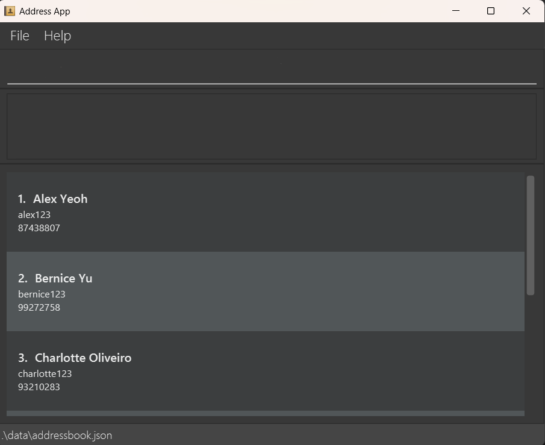 

1. Type the command in the `command box` and press `Enter` to execute it.

1. Refer to the [Commands](#commands) below for details of each command.

1. Refer to the [Features](#features) below for details of built-in features.

***

## Commands

<box type="info" seamless>

**Notes about the command format:** 

* Words in `()` are the parameters to be supplied by the user. 
  e.g. in `- /id (id)`, `(id)` is a parameter which can be used as `- /id johndoe69`.

* If you are using a PDF version of this document, be careful when copying and pasting commands that span multiple lines as space characters surrounding line-breaks may be omitted when copied over to the application.
</box>

<!--
### Viewing help : `help`

Shows a message explaning how to access the help page.

Format: `help`
-->

<panel header="### Adding a contact: <code>+</code>" peek>
  Adds a person to the address book.  

  Format: <code>+ /name (name) /id (id) /hp (handphone)</code> 

  Example: <code>+ /name John Doe /id johndoe41 /hp 98765432</code> 

  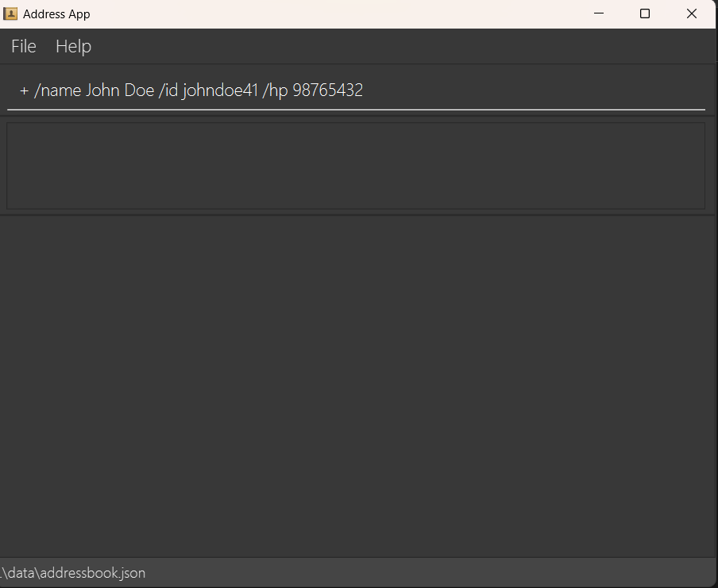 

  <box type="success">
    A GUI similar to below should appear upon successful command input.  
      
  </box>

  <box type="important" seamless>
    All 3 fields must be present and filled in order as specified. 
    ID is <b>unique</b> (i.e. No duplicates of ID is allowed).
  </box>

  <box type="wrong">
    Duplicate ID.  
    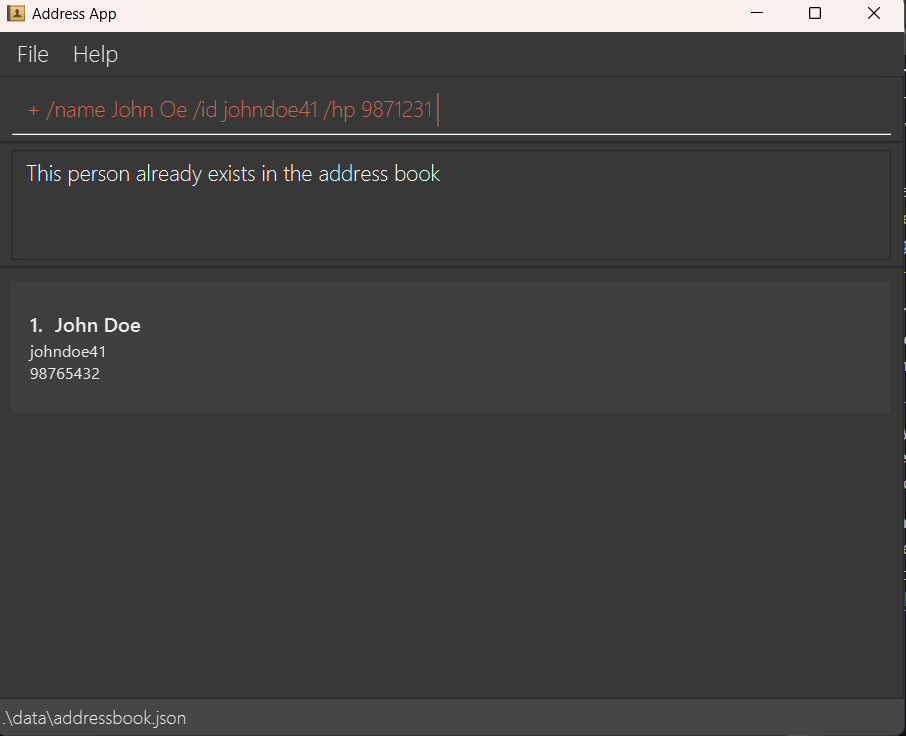  
  </box>

  <box type="wrong">
    Insufficient fields.  
    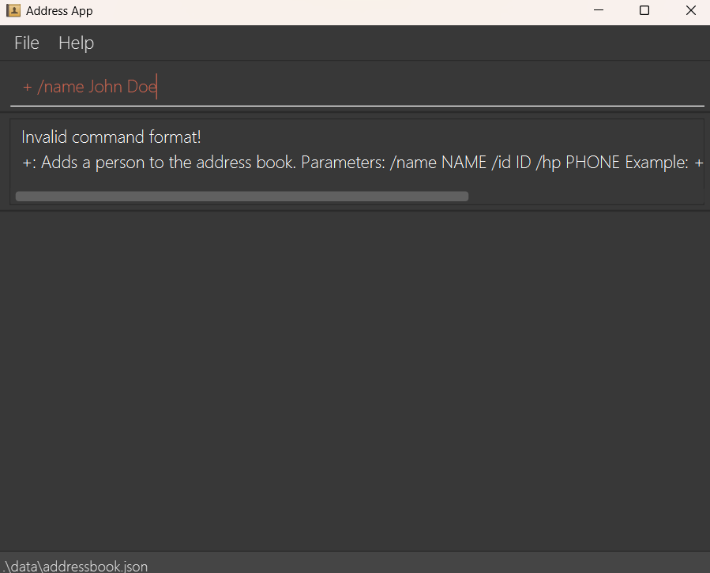  
  </box>

</panel>

<panel header="### Deleting a contact: <code>-</code>" peek>
  Deletes a person with his specified ID.  

  Format: <code>- /id (id)</code> 

  Example: <code>- /id johndoe46</code> 

  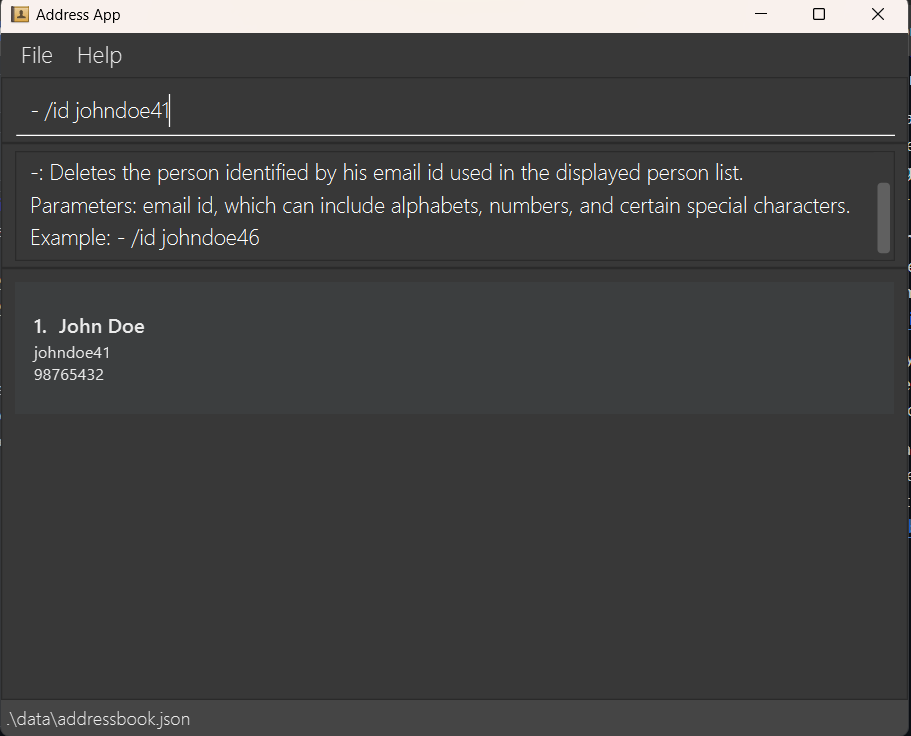 

  <box type="success">
    A GUI similar to below should appear upon successful command input.  
    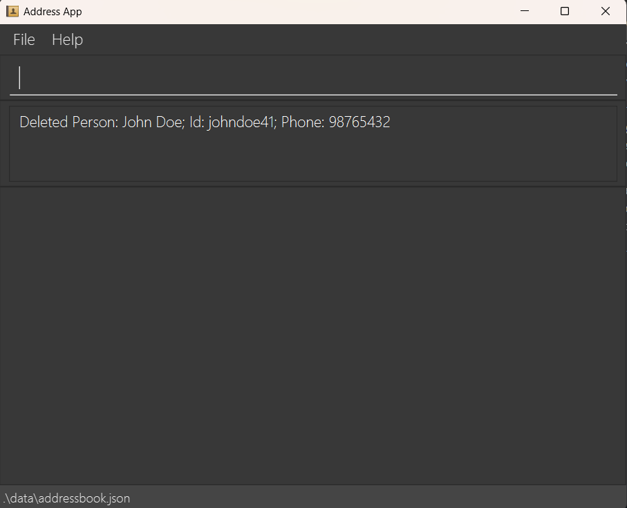  
  </box>

  <box type="wrong">
    Invalid ID.  
    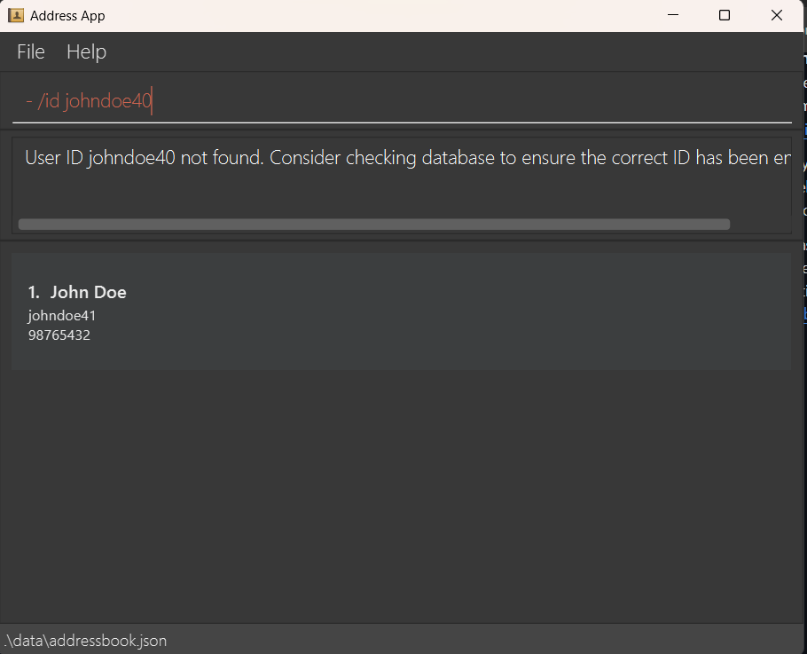  
  </box>

</panel>

<panel header="### Toggle display: <code>$</code>" peek>
  Toggle display to view / hide the addressbook.  

  Format: <code>$</code> 

  <box type="definition">
    Viewing addressbook.  
    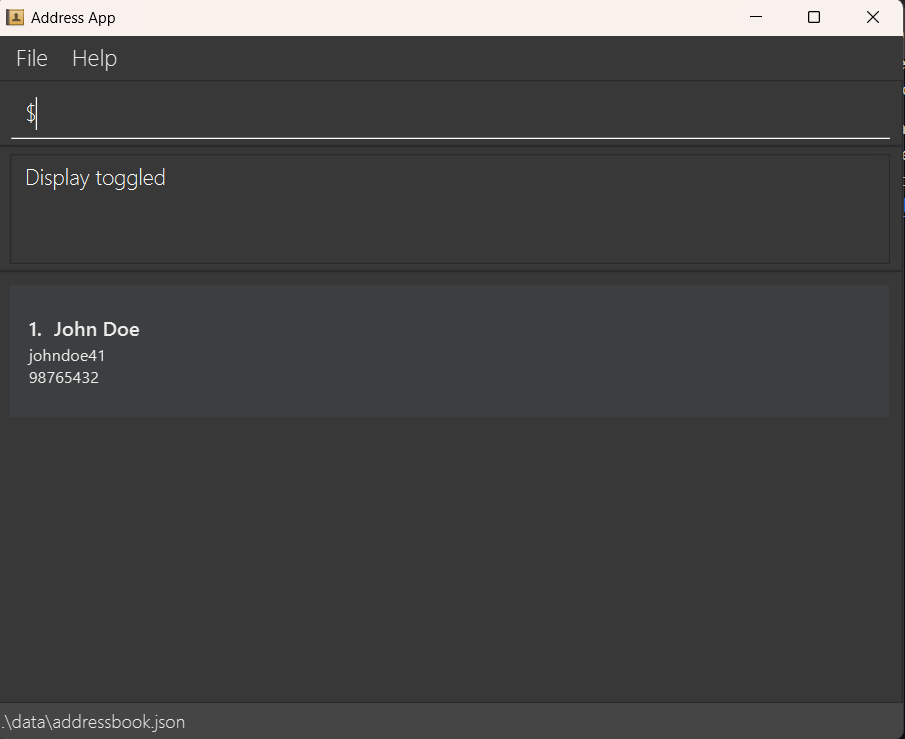  
  </box>

  <box type="definition" theme="info">
    Hiding addressbook.  
    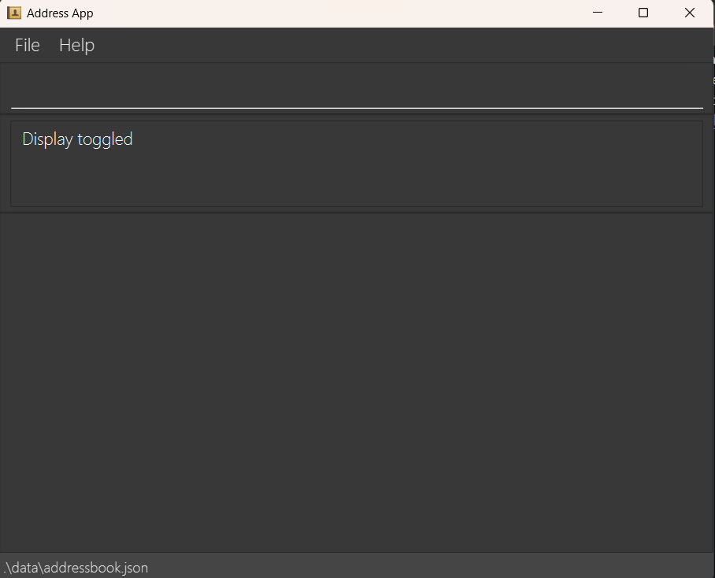  
  </box>

</panel>

<!--
### Adding a person: `add`

Adds a person to the address book.

Format: `add n/NAME p/PHONE_NUMBER e/EMAIL a/ADDRESS [t/TAG]…​`

<box type="tip" seamless>

**Tip:** A person can have any number of tags (including 0)
</box>

Examples:
* `add n/John Doe p/98765432 e/johnd@example.com a/John street, block 123, #01-01`
* `add n/Betsy Crowe t/friend e/betsycrowe@example.com a/Newgate Prison p/1234567 t/criminal`

### Listing all persons : `list`

Shows a list of all persons in the address book.

Format: `list`

### Editing a person : `edit`

Edits an existing person in the address book.

Format: `edit INDEX [n/NAME] [p/PHONE] [e/EMAIL] [a/ADDRESS] [t/TAG]…​`

* Edits the person at the specified `INDEX`. The index refers to the index number shown in the displayed person list. The index **must be a positive integer** 1, 2, 3, …​
* At least one of the optional fields must be provided.
* Existing values will be updated to the input values.
* When editing tags, the existing tags of the person will be removed i.e adding of tags is not cumulative.
* You can remove all the person’s tags by typing `t/` without
    specifying any tags after it.

Examples:
*  `edit 1 p/91234567 e/johndoe@example.com` Edits the phone number and email address of the 1st person to be `91234567` and `johndoe@example.com` respectively.
*  `edit 2 n/Betsy Crower t/` Edits the name of the 2nd person to be `Betsy Crower` and clears all existing tags.

### Locating persons by name: `find`

Finds persons whose names contain any of the given keywords.

Format: `find KEYWORD [MORE_KEYWORDS]`

* The search is case-insensitive. e.g `hans` will match `Hans`
* The order of the keywords does not matter. e.g. `Hans Bo` will match `Bo Hans`
* Only the name is searched.
* Only full words will be matched e.g. `Han` will not match `Hans`
* Persons matching at least one keyword will be returned (i.e. `OR` search).
  e.g. `Hans Bo` will return `Hans Gruber`, `Bo Yang`

Examples:
* `find John` returns `john` and `John Doe`
* `find alex david` returns `Alex Yeoh`, `David Li` 
  

### Deleting a person : `delete`

Deletes the specified person from the address book.

Format: `delete INDEX`

* Deletes the person at the specified `INDEX`.
* The index refers to the index number shown in the displayed person list.
* The index **must be a positive integer** 1, 2, 3, …​

Examples:
* `list` followed by `delete 2` deletes the 2nd person in the address book.
* `find Betsy` followed by `delete 1` deletes the 1st person in the results of the `find` command.

### Clearing all entries : `clear`

Clears all entries from the address book.

Format: `clear`

### Exiting the program : `exit`

Exits the program.

Format: `exit`

### Saving the data

AddressBook data are saved in the hard disk automatically after any command that changes the data. There is no need to save manually.

### Editing the data file

AddressBook data are saved automatically as a JSON file `[JAR file location]/data/addressbook.json`. Advanced users are welcome to update data directly by editing that data file.

<box type="warning" seamless>

**Caution:**
If your changes to the data file makes its format invalid, AddressBook will discard all data and start with an empty data file at the next run.  Hence, it is recommended to take a backup of the file before editing it. 
Furthermore, certain edits can cause the AddressBook to behave in unexpected ways (e.g., if a value entered is outside the acceptable range). Therefore, edit the data file only if you are confident that you can update it correctly.
</box>

### Archiving data files `[coming in v2.0]`

_Details coming soon ..._

--------------------------------------------------------------------------------------------------------------------
-->
***

## Features

Features are built-in for the ease of use. They do not require any commands for it to work.

<panel header="### Sort" peek>
  The addressbook is sorted in alphabetical order every time a new contact is added / deleted.  

  <box type="definition">
    Before.  
    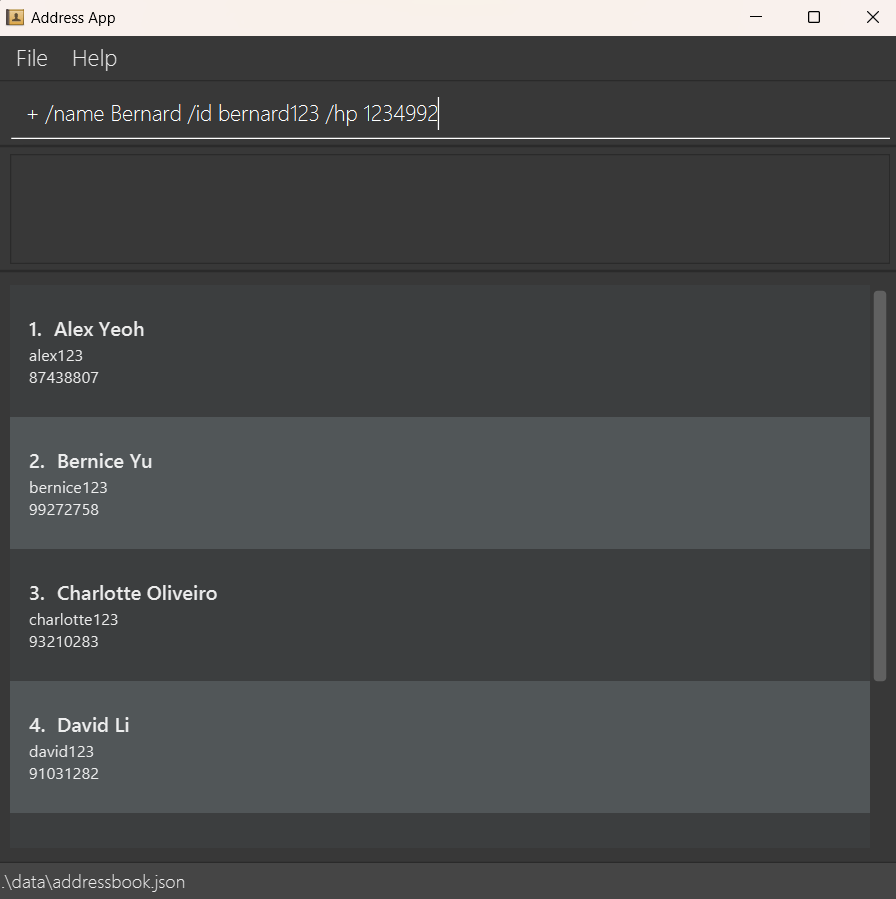  
  </box>

  <box type="definition" theme="info">
    After.  
      
  </box>
   
</panel>

<panel header="### Delete sample data" peek>
  Sample data is deleted when you add the first contact into the addressbook.  

  <box type="definition">
    Before.  
    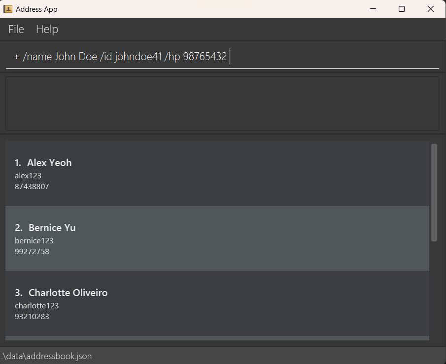  
  </box>

  <box type="definition" theme="info">
    After.  
    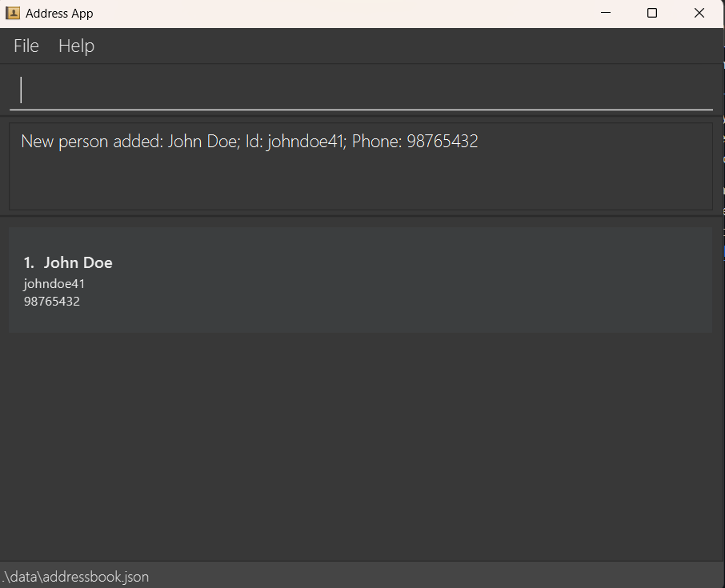  
  </box>
   
</panel>

***

## FAQ

<panel header="**Q**: How do I transfer my data to another Computer?">
**A**: Install the app in the other computer and overwrite the empty data file it creates with the file that contains the data of your previous AddressBook home folder.
</panel>

***

## Known issues

1. **When using multiple screens**, if you move the application to a secondary screen, and later switch to using only the primary screen, the GUI will open off-screen. The remedy is to delete the `preferences.json` file created by the application before running the application again.

***

## Command summary

Action     | Format
-----------|---------
**Add**    | `+ /name (name) /id (id) /hp (handphone)`
**Delete** | `- /id (id)`
**Toggle** | `$`

