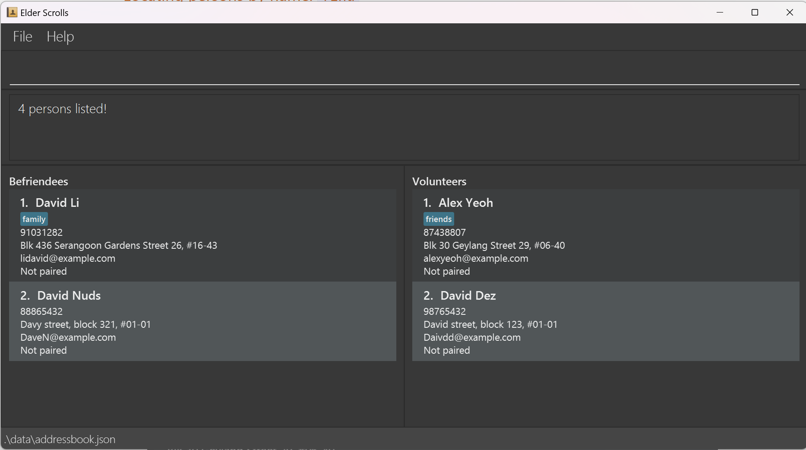

This guide provides and overview and explains the essential features of Dook.

## What is Dook?
An **elegant desktop application** for **NUS computing students** to easily manage consultations. This lightweight platform was enables users to quickly view and manage consultations and
people. Dook blends the power of a nimble [**Command Line Interface (CLI)**](#glossary) together with the intuitive accessibility of a 
[**Graphical User Interface (GUI)**](#glossary). 

Designed for the dynamic needs of the NUS 
School of Computing (SoC) community, Dook centralizes faculty information
in an innovative manner, allowing one to easily find their professors by taking advantage of the basic CLI familiarity of SoC students.

For the quick typist, Dook elevates your ability to swiftly organize your academic consultations with professors
and teaching assistants, outpacing conventional GUI-based applications, making management of consultations a breeze.

We hope that you will find this guide helpful in maximising your Dook experience! :)

--------------------------------------------------------------------------------------------------------------------

## Using the Guide
We hope that this guide will familiarise you with the [CLI](#glossary) commands and [GUI](#glossary) and interface. If you
are unfamiliar with some jargon here, do have a quick look at our [glossary](#glossary) below! :)

* For **first-time users**, please take a look at our [Quick Start](#quick-start) section to start an end-to-end tutorial for Dook.
* For **seasoned users** who have used _Dook_ before, do take a look at our [Command Summary](#command-summary) for a refresher!

Throughout this guide, we also use coloured boxes to provide any important or extra pointers that we hope you would find useful.

<div markdown="block" class="alert alert-info">
:information_source: **Information** 

Content in blue boxes provides additional information and contextual knowledge you need to better understand Dook.
</div>

<div markdown="block" class="alert alert-success">
:bulb: **Tips** 

Content in green boxes provides tips and good practices to help you use the application more efficiently.
</div>

<div markdown="block" class="alert alert-danger">
:exclamation: **Warnings** <br>

Content in red boxes draws your attention to potential pitfalls to avoid and alert you to possible errors.
</div>

--------------------------------------------------------------------------------------------------------------------

## Table of Contents
* Table of Contents
{:toc}

--------------------------------------------------------------------------------------------------------------------

## Installation and Quick start

1. Ensure you have [Java](#faq) `11` or above installed in your Computer.

1. Download the latest `dook.jar` from [here](https://github.com/AY2324S2-CS2103T-W11-3/tp/releases).

1. Copy the file to the folder you want to use as the _home folder_ for your AddressBook.

1. Open a command terminal, `cd` into the folder you put the jar file in, and use the `java -jar dook.jar` command to run the application.<br>
   If you are unfamiliar with the command terminal, follow [this](https://tutorials.codebar.io/command-line/introduction/tutorial.html)
   A GUI similar to the below should appear in a few seconds. Note how the app contains some sample data.<br>
   

1. Type a command in the command box and press Enter to execute it. <br>
   Some example commands you can try:

   * `list` : Lists all contacts.

   * `add -n John Doe -p 98765432 -e johnd@example.com -a John street, block 123, #01-01` : Adds a contact named `John Doe` to the Address Book.

   * `delete 3` : Deletes the 3rd contact shown in the current list.

   * `clear` : Deletes all contacts.

   * `book -n John's Birthday Party -s 2023-12-31 19:00 -e 2023-12-31 23:00` : Adds a new booking for `John's Birthday Party` from `2023-12-31 19:00` to `2023-12-31 23:00`.

   * `cancel 3` : Deletes the 3rd booking shown in the current list.

   * `exit` : Exits the app.

1. Refer to the [Features](#features) below for details of each command.

--------------------------------------------------------------------------------------------------------------------

## Features

<div markdown="block" class="alert alert-info">

**:information_source: Notes about the command format:**<br>

* Words in `UPPER_CASE` are the parameters to be supplied by the user.<br>
  e.g. in `add -n NAME`, `NAME` is a parameter which can be used as `add -n John Doe`.

* Items in square brackets are optional.<br>
  e.g `-n NAME [-t TAG]` can be used as `-n John Doe -t friend` or as `-n John Doe`.

* Items with `…`​ after them can be used multiple times including zero times.<br>
  e.g. `[-t TAG]…​` can be used as ` ` (i.e. 0 times), `-t friend`, `-t friend -t family` etc.

* Parameters can be in any order.<br>
  e.g. if the command specifies `-n NAME -p PHONE_NUMBER`, `-p PHONE_NUMBER -n NAME` is also acceptable.

* Extraneous parameters for commands that do not take in parameters (such as `help`, `list`, `exit` and `clear`) will be ignored.<br>
  e.g. if the command specifies `help 123`, it will be interpreted as `help`.

* If you are using a PDF version of this document, be careful when copying and pasting commands that span multiple lines as space characters surrounding line-breaks may be omitted when copied over to the application.
</div>

### Viewing help : `help`

Shows a message explaning how to access the help page.


Format: `help`


### Adding a person: `add`

```
add -n NAME -p PHONE_NUMBER -e EMAIL -a ADDRESS [t/TAG]…​
```
Adds a new person to the address book.

| Param            | Remarks                                                                                                        |
|------------------|----------------------------------------------------------------------------------------------------------------|
| **NAME**         | Must be non-null and unique                                                                                    |
| **PHONE_NUMBER** | Optional, only numbers and minimum 3 digits                                                                    |
| **EMAIL**        | Optional, follow standard email formats (i.e xxx@xxx)                                                          |
| **ADDRESS**      | Optional                                                                                                       |
| **TAG**          | Optional, each tag should start with -t (i.e. for two tags `friend`, `groupmate` use `-t friend -t groupmate`) |

<div markdown="span" class="alert alert-primary">:bulb: **Tip:**
A person can have any number of tags (including 0)
</div>

Examples:
* `add -n John Doe -p 98765432 -e johnd@example.com -a John street, block 123, #01-01`
* `add -n Betsy Crowe -t friend -e betsycrowe@example.com -a Newgate Prison -p 1234567 -t criminal`

### Listing all persons : `list`

Shows a list of all persons in the address book.

Format: `list`

### Editing a person : `edit`

Edits an existing person in the address book.

Format: `edit INDEX [-n NAME] [-p PHONE] [-e EMAIL] [-a ADDRESS] [-t TAG]…​`

* Edits the person at the specified `INDEX`. The index refers to the index number shown in the displayed person list. The index **must be a positive integer** 1, 2, 3, …​
* At least one of the optional fields must be provided.
* Existing values will be updated to the input values.
* When editing tags, the existing tags of the person will be removed i.e adding of tags is not cumulative.
* You can remove all the person’s tags by typing `-t` without
    specifying any tags after it.

Examples:
*  `edit 1 -p 91234567 -e johndoe@example.com` Edits the phone number and email address of the 1st person to be `91234567` and `johndoe@example.com` respectively.
*  `edit 2 -n Betsy Crower -t` Edits the name of the 2nd person to be `Betsy Crower` and clears all existing tags.

### Locating persons by name: `find`

Finds persons whose names contain any of the given keywords.

Format: `find KEYWORD [MORE_KEYWORDS]`

* The search is case-insensitive. e.g `hans` will match `Hans`
* The order of the keywords does not matter. e.g. `Hans Bo` will match `Bo Hans`
* Only the name is searched.
* Only full words will be matched e.g. `Han` will not match `Hans`
* Persons matching at least one keyword will be returned (i.e. `OR` search).
  e.g. `Hans Bo` will return `Hans Gruber`, `Bo Yang`

Examples:
* `find John` returns `john` and `John Doe`
* `find alex david` returns `Alex Yeoh`, `David Li`<br>

  

### Deleting a person : `delete`

Deletes the specified person from the address book.

Format: `delete INDEX`

* Deletes the person at the specified `INDEX`.
* The index refers to the index number shown in the displayed person list.
* The index **must be a positive integer** 1, 2, 3, …​

Examples:
* `list` followed by `delete 2` deletes the 2nd person in the address book.
* `find Betsy` followed by `delete 1` deletes the 1st person in the results of the `find` command.

### Adding a booking : `book`

Adds the specified booking to the address book.

Format: `-n DESCRIPTION -s START_TIME -e END_TIME`

* Creates a booking with the specified parameters.
* Start and end time formats are in yyyy-mm-d hh:mm.

Examples:
* `book -n John's Birthday Party -s 2023-12-31 19:00 -e 2023-12-31 23:00`

### Cancelling a booking : `cancel`

Cancels the specified booking from the address book.

Format: `cancel INDEX`

* Deletes the booking at the specified `INDEX`.
* The index refers to the index number shown in the displayed booking list.
* The index **must be a positive integer** 1, 2, 3, …​

Examples:
* `cancel 2` cancels the 2nd booking in the booking list.

### Searching for a booking : `search`

Searches for the specified booking from the address book.

Format: `search KEYWORD [MORE_KEYWORDS]`

* The search is case-insensitive. e.g `john` will match `John`
* The order of the keywords does not matter. e.g. `Hans Bo` will match `Bo Hans`
* Persons matching at least one keyword will be returned (i.e. `OR` search).
  e.g. `John` will return `Johns Birthday Party`, `Dinner with John`

### Clearing all contact entries : `clear`

Clears all contact entries from the address book.

Format: `clear`

<div markdown="block" class="alert alert-danger">

**:exclamation: Destructive Command!**<br>

This command is **irreversible**, and all your data will be lost. 
Please use this command with caution!

</div>


### Exiting the program : `exit`

Exits the program.

Format: `exit`

### Saving the data

AddressBook data are saved in the hard disk automatically after any command that changes the data. There is no need to save manually.

### Editing the data file

AddressBook data are saved automatically as a JSON file `[JAR file location]/data/addressbook.json`. Advanced users are welcome to update data directly by editing that data file.

<div markdown="span" class="alert alert-warning">:exclamation: **Caution:**
If your changes to the data file makes its format invalid, AddressBook will discard all data and start with an empty data file at the next run. Hence, it is recommended to take a backup of the file before editing it.<br>
Furthermore, certain edits can cause the AddressBook to behave in unexpected ways (e.g., if a value entered is outside of the acceptable range). Therefore, edit the data file only if you are confident that you can update it correctly.
</div>

### Archiving data files `[coming in v2.0]`

_Details coming soon ..._

--------------------------------------------------------------------------------------------------------------------

## FAQ

**Q**: How do I install Java 11?
**A**: Follow this [link](https://docs.oracle.com/en/java/javase/11/install/overview-jdk-installation.html#GUID-8677A77F-231A-40F7-98B9-1FD0B48C346A) for steps to download Java 11.

**Q**: How do I transfer my data to another Computer?<br>
**A**: Go to the application's home directory and copy the `data/addressbook.json` file containing your data into the empty 
data folder created by Dook on the other computer. 

**Q**: Oh no! I have accidentally closed Dook without using the `exit` command? Do I lose all my data?
**A**: Not to worry! Dook automatically saves all data after every change, so no data will be lost!

**Q**: Do I need Internet connection to use Dook?
**A**: Nope! Dook works fully offline and online!

--------------------------------------------------------------------------------------------------------------------

## Known issues

1. **When using multiple screens**, if you move the application to a secondary screen, and later switch to using only the primary screen, the GUI will open off-screen. The remedy is to delete the `preferences.json` file created by the application before running the application again.

--------------------------------------------------------------------------------------------------------------------

## Command Summary

<div markdown="block" class="alert alert-info">
:information_source: **Note:**

The list of valid commands accept **only lowercase letters**. For example, `Book` will not be accepted. Please use `book` instead.
</div>

### Address Book Command summary

| Action     | Format, Examples                                                                                                                                                                |
|------------|---------------------------------------------------------------------------------------------------------------------------------------------------------------------------------|
| **Add**    | `add -n NAME -p PHONE_NUMBER -e EMAIL -a ADDRESS [-t TAG]…​` <br> e.g., `add -n John Doe -p 22224444 -e jamesho@example.com -a 123, Clementi Rd, 1234665 -t friend t/colleague` |
| **Clear**  | `clear`                                                                                                                                                                         |
| **Delete** | `delete INDEX`<br> e.g., `delete 3`                                                                                                                                             |
| **Edit**   | `edit INDEX [-n NAME] [-p PHONE_NUMBER] [-e EMAIL] [-a ADDRESS] [-t TAG]…​`<br> e.g.,`edit 2 -n James Lee -e jameslee@example.com`                                              |
| **Find**   | `find KEYWORD [MORE_KEYWORDS]`<br> e.g., `find James Jake`                                                                                                                      |
| **List**   | `list`                                                                                                                                                                          |
| **Help**   | `help`                                                                                                                                                                          |

### Booking List Command summary

| Action        | Format, Examples                                                                                                                   |
|---------------|------------------------------------------------------------------------------------------------------------------------------------|
| **Book**      | `book -n DESCRIPTION -s START_TIME -e END_TIME` <br> e.g., `book -n John's Birthday Party -s 2024-03-01 19:00 -e 2024-03-01 23:00` |
| **View**      | `view -b`                                                                                                                          |
| **Cancel**    | `cancel INDEX` or `cancel -a` or `cancel sudo -a` <br> e.g., `cancel 2`                                                            |
| **Edit**      | `edit INDEX [-n DESCRIPTION] [-s START_TIME] [-e END_TIME]`<br> e.g.,`edit 2 -n Prof Aaron's Consultation -s 2024-03-01 14:30`     |
| **Search**    | `search KEYWORD [MORE_KEYWORDS]`<br> e.g., `search Prof Lee's Consultation`                                                        |
| **Free Time** | `check -ft -n NAME`<br> e.g., `check -ft -n Prof Damith`                                                                           |

[Back To ToC](#table-of-contents)

## Glossary

| Term                                                 | Meaning                                                                                                                                                                                                                          |
|------------------------------------------------------|----------------------------------------------------------------------------------------------------------------------------------------------------------------------------------------------------------------------------------|
| CLI (Command Line Interface)                         | A text based interface where users type in commands instead of interacting with the application's graphics.                                                                                                                      |
| CSV                                                  | A text file format that uses commas to separate values. It is supported by a wide range of software, including Microsoft Excel.                                                                                                  |
| Command                                              | A line of instructions that you input into the command box. Also see: Command box                                                                                                                                                |
| Command Box <a name="command-box"></a>               | A box for you to input commands.                                                                                                                                                                                                 |
| Command Output Box <a name="command-output-box"></a> | A box that displays the results of the command you keyed in. It will tell you whether the command you entered has successfully run, or if there is an error in your command that needs to be fixed. Refer to []() for a picture. |
| Contact List <a name="contact-list"></a>             | The Contact list is the list of contacts on the left side of the application.                                                                                                                                                    |
| Booking List <a name="booking-list"></a>             | The Booking list is the list of bookings on the right side of the application.                                                                                                                                                   |
| GUI (Graphic User Interface)                         | A graphical based interface where users interact the the application's graphics like buttons or scrollpanes. Also see: CLI                                                                                                       |
| Prefix                                               | A letter or phrase before an input.                                                                                                                                                                                              |
| Tag                                                  | A text phrase used to categorise employees by. A tag must be either a Student, Professor, or Teaching Assistant (TA)                                                                                                             |
| Index                                                | The number labelling each employee in the employee list.                                                                                                                                                                         |
| Web browser                                          | An application to serve the web like Internet Explorer, Google Chrome or Firefox. In fact, you are probably using one to access this guide right now!                                                                            |

[Back To ToC](#table-of-contents)
