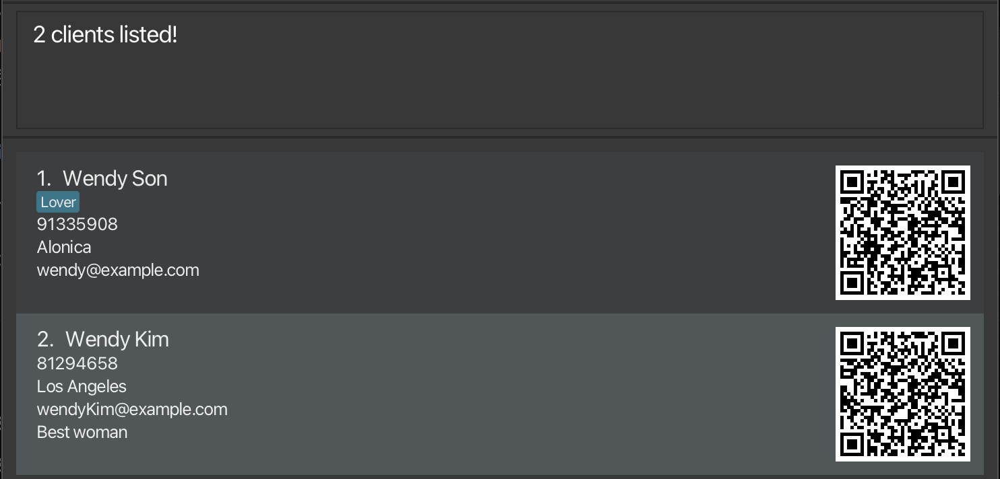
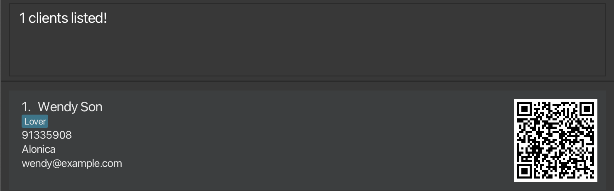
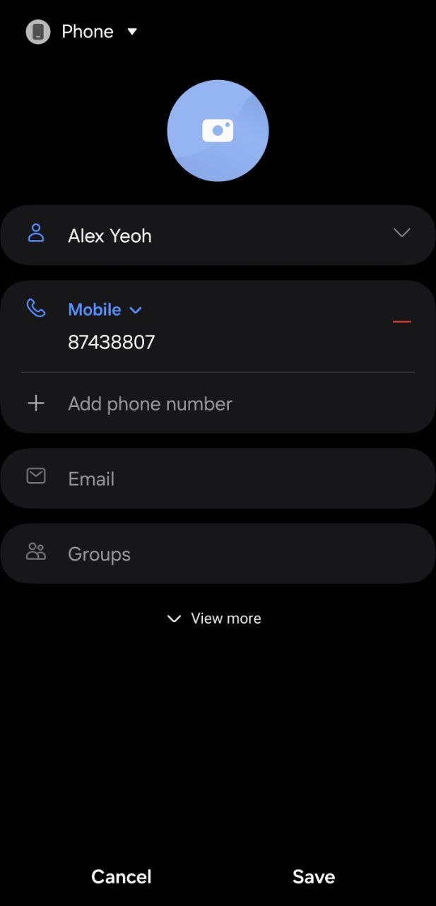

FitBook is a **desktop app for managing clients, optimized for use via a Command Line Interface** (CLI) while still 
having the benefits of a Graphical User Interface (GUI). If you are a personal trainer that prefers typing over mouse 
interactions, FitBook is the perfect application for you to manage your clients!

* Table of Contents
{:toc}

## Quick Start

1. Ensure you have Java `11` or above installed.

2. Download the latest version of `FitBook.jar` from [here](https://github.com/AY2324S2-CS2103T-T17-3/tp/releases).

3. Copy the file to the folder you want to use as the **home folder** for FitBook.

4. Double-click the FitBook.jar file to launch it

5. If (4) doesn't work, open a command terminal, `cd` into the folder with FitBook.jar, and run the 
`java -jar FitBook.jar` command to launch the application. 

5. A GUI similar to the one depicted below should appear in a few seconds. 
The app might contain some sample data. 

   

6. Read through `help`, type any command listed into the input box and press `enter`  
   These are some example commands you can try!
 
   * `add n/John p/98765432` Adds a client named
   `John Doe` with the number `98765432` to FitBook.

   * `clear` : Clears all clients from the list.

   * `delete 3` : Deletes the third client shown in the list.
   
   * `exit` : Exits the app.

   * `list` : Lists all clients.

7. Refer to the [Features](#features) below for details of each command.

--------------------------------------------------------------------------------------------------------------------

## Features

**:information_source: Notes about the command format:** 

* Words in `UPPER_CASE` are the parameters to be supplied by the user. 
  e.g. in `add n/NAME`, `NAME` is a parameter which can be used as `add n/John Doe`.

* Items in square brackets are optional. 
  e.g `n/NAME [t/TAG]` can be used as `n/John Doe t/friend` or as `n/John Doe`.

* Items with `…`​ after them can be used multiple times including zero times. 
  e.g. `[t/TAG]…​` can be used as ` ` (i.e. 0 times), `t/friend`, `t/friend t/family` etc.

* Parameters can be in any order. 
  e.g. if the command specifies `n/NAME p/PHONE_NUMBER`, `p/PHONE_NUMBER n/NAME` is also acceptable.

* Extraneous parameters for commands that do not take in parameters (such as `help`, `list`, `exit` and `clear`) will be ignored. 
  e.g. if the command specifies `help 123`, it will be interpreted as `help`.

* If you are using a PDF version of this document, be careful when copying and pasting commands that span multiple lines as space characters surrounding line-breaks may be omitted when copied over to the application.

### Viewing help : `help`

Launches the help menu depicted below.  
Clicking `Open User Guide` leads to the User Guide website.

Format: `help`

### Adding a client: `add`

Adds a client to the FitBook.

Format: `add n/NAME p/PHONE_NUMBER [e/EMAIL] [a/ADDRESS] [note/NOTE] [t/TAG]…​`

:bulb: **Tip:**
A client can 0 or more tags.

Examples:
* `add n/John Doe p/98765432 e/johnd@gmail.com a/John street, block 123, #01-01 note/john from school`
* `add n/Betsy Crowe t/friend e/betsycrowe@hotmail.com a/Newgate Prison p/1234567 note/likes donuts t/criminal`

### Listing all clients : `list`

Displays an indexed list of all clients in FitBook.

Format: `list`

### Editing a client : `edit`

Edits information tagged to an existing client

Format: `edit INDEX [n/NAME] [p/PHONE] [e/EMAIL] [a/ADDRESS] [note/NOTE] [t/TAG]…​`

* Edits the clients at the specified `INDEX`. The index refers to the index number shown in the displayed client list. 
* The index **must be a positive integer** 1, 2, 3, …​
* At least one of the optional fields must be provided.
* Existing values will be updated to the input values.
* When editing tags, the existing tags of the client will be removed i.e adding of tags is not cumulative.
* You can remove all the client’s tags by typing `t/` without
    specifying any tags after it.

Examples:
*  `edit 1 p/91234567 e/johndoe@example.com` Edits the phone number and email address of the 1st client to be `91234567` and `johndoe@example.com` respectively.
*  `edit 2 n/Betsy Crower t/` Edits the name of the 2nd client to be `Betsy Crower` and clears all existing tags.

### Adding a note to clients : `note`

Format: `note INDEX note/NOTE`

* Edits the note of the client specified by `INDEX`. The index refers to the index number shown in the displayed client list. The index **must be a positive integer** 1, 2, 3, …​
* Existing note will be updated to the input note.

> While this can also be done using the `edit` command, this `note` command serves as a faster way for users to directly modify a note.

Examples:
*  `note 1 note/History of asthma` - Edits the note of the 1st client to `History of asthma`.
*  `note 2 note/Previously sprained both ankles` - Edits the note of the 2nd client to `Previously sprained both ankles`.

### Locating clients by name: `find`

Finds all clients whose specified attribute contains the specified keyword.

Format: `find [n/NAME] [p/PHONE] [e/EMAIL] [a/ADDRESS] [note/NOTE] [t/TAG]…​`

* The search is case-insensitive. e.g `hans` will match `Hans`
* Any fields can be searched.
* Multiple fields can be search in one command
  * All fields must match (e.g `find n/Wendy p/91234567` will match with a contact whose name contains `wendy` and phone number contains `91234567`)
* All fields except `TAG` will be matched based on substring (e.g `Wen` will match `Wendy`)
* `TAG` must be an exact match (case-insensitive)
  * E.g `find t/fri` will not match the tag `friend`

Examples:
* `find n/Wendy` returns `Wendy Son` and `Wendy Kim`
  
* `find n/Wendy t/Lover` returns `Wendy` (`Name` contains `Wendy` and is tagged with `Lover`)
  

### Deleting a client : `delete`

Deletes the specified client from FitBook.

Format: `delete INDEX`

* Deletes the client at the specified `INDEX`.
* The index refers to the index number shown in the displayed client list.
* The index **must be a positive integer** 1, 2, 3, …​

Examples:
* `list` followed by `delete 2` deletes the second client in the list.
* `find Betsy` followed by `delete 1` deletes the first client in the results of the `find` command.

### Clearing all entries : `clear`

Clears all client information from FitBook.

**NOTE: This command is irreversible and should be used with caution.**

If you are sure of your decision to clear all client information, use the `/confirm` prefix with this command to execute it.

Format: `clear /confirm`

### Exiting the program : `exit`

Exits FitBook.

Format: `exit`

### Saving the data

FitBook data is saved in the hard disk automatically after any command that changes the data. 
There is no need to save manually.

### Editing the data file

FitBook data is saved automatically as a JSON file `[JAR file location]/data/addressbook.json`. 
Advanced users are welcome to update data directly by editing that data file.

:exclamation: **Caution:**
If your changes to the data file makes its format invalid, FitBook will discard all data and start with an empty data file at the next run. Hence, it is recommended to take a backup of the file before editing it. 
Furthermore, certain edits can cause FitBook to behave in unexpected ways (e.g., if a value entered is outside of the acceptable range). Therefore, edit the data file only if you are confident that you can update it correctly.

### Save contact to phone

To save a contact to your mobile phone from FitBook, simply scan the QR code next to the contact.

 

### Archiving data files `[coming in v2.0]`

_Details coming soon ..._

--------------------------------------------------------------------------------------------------------------------

## FAQ

**Q**: How do I transfer my data to another Computer? 
**A**: Install FitBook in the other computer and overwrite the empty data file it creates with the file that contains the data of your previous FitBook home folder.

--------------------------------------------------------------------------------------------------------------------

## Known issues

1. **When using multiple screens**, if you move the application to a secondary screen, and later switch to using only the primary screen, the GUI will open off-screen. The remedy is to delete the `preferences.json` file created by the application before running the application again.

--------------------------------------------------------------------------------------------------------------------

## Command summary

Action | Format, Examples
--------|------------------
**Add** | `add n/NAME p/PHONE_NUMBER [e/EMAIL] [a/ADDRESS] [note/NOTE] [t/TAG]…​`   e.g., `add n/James Ho p/22224444 e/jamesho@example.com a/123, Clementi Rd, 1234665 note/likes pizzas t/friend t/colleague`
**Clear** | `clear`
**Delete** | `delete INDEX`  e.g., `delete 3`
**Edit** | `edit INDEX [n/NAME] [p/PHONE_NUMBER] [e/EMAIL] [a/ADDRESS] [note/NOTE] [t/TAG]…​`  e.g.,`edit 2 n/James Lee e/jameslee@example.com`
**Find** | `find KEYWORD [MORE_KEYWORDS]`  e.g., `find James Jake`
**List** | `list`
**Help** | `help`
