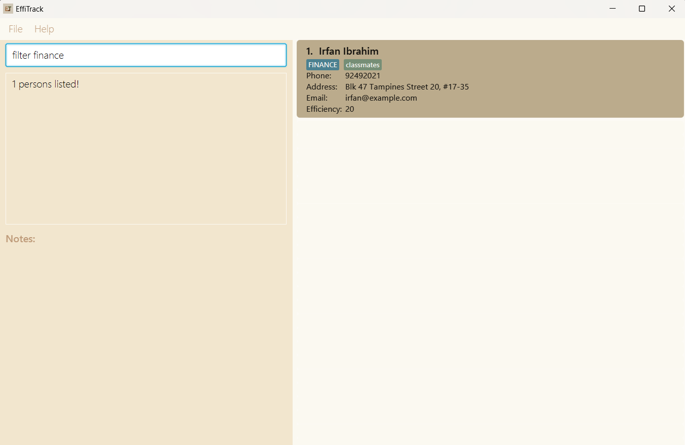

# EffiTrack User Guide

## Introduction

EffiTrack is a **desktop app for managing employees, tracking the efficiency of employees, 
optimized for use via a Command Line Interface** (CLI) while still having the benefits of a Graphical User Interface (GUI). If you can type fast, EffiTrack can get your contact management tasks done faster than traditional GUI apps.

EffiTrack simplifies the task of measuring and monitoring employee efficiency for
HR departments.   Instead of using time-consuming and error-prone methods like manual documentation or
outdated systems, EffiTrack offers a centralized platform for easy and accurate monitoring of employee performance.

<!-- * Table of Contents -->
<page-nav-print />

--------------------------------------------------------------------------------------------------------------------

## Quick start

1. Ensure you have Java `11` or above installed in your Computer.

1. Download the latest `EffiTrack.jar` from [here](https://github.com/AY2324S2-CS2103T-T14-1/tp/releases/tag/v1.2).

1. Copy the file to the folder you want to use as the _home folder_ for EffiTrack.

1. Open a command terminal, `cd` into the folder you put the jar file in, and use the `java -jar EffiTrack.jar` command to run the application. 
   A GUI similar to the below should appear in a few seconds. Note how the app contains some sample data. 
   

1. Type the command in the command box and press Enter to execute it. e.g. typing **`help`** and pressing Enter will open the help window. 
   Some example commands you can try:
   * `list` :  Lists all employees.

   * `add n/John Doe p/98765432 e/johnd@example.com a/John street, block 123, #01-01 d/Finance eff/80` : Adds an employee named `John Doe` to EffiTrack.
   
   * `edit 1 n/Colby Bryan` : Edits the name of the 1st employee shown in the current list to `Colby Bryan`.

   * `delete 3` : Deletes the 3rd employee shown in the current list.
   
   * `find john` : Finds all employees whose name contains `john`.
   
   * `filter finance` : Filters the list to display employees who belong to `finance` department.
   
   * `assign task/Complete Proposal by/20-05-2024 2359 to/1` :Assigns the task `Complete Proposal` with specific deadline to the 1st employee shown in the current list.
   
   * `mark task/Complete Proposal o/1` : Mark the task `Complete Proposal` assigned to the 1st employee as done.

   * `clear` : Deletes all employees.
   
   * `undo`: Undo the previous command.

   * `redo`: Reverses the previous undo command.

   * `history`: Displays the commands executed from most recent to earliest, inclusive of invalid commands.
    
   * `exit` : Exits the app.

1. Refer to the [Features](#features) below for details of each command.

--------------------------------------------------------------------------------------------------------------------

## Features

<box type="info" seamless>

**Notes about the command format:** 

* Words in `UPPER_CASE` are the parameters to be supplied by the user. 
  e.g. in `add n/NAME`, `NAME` is a parameter which can be used as `add n/John Doe`.

* Items in square brackets are optional. 
  e.g `n/NAME [t/TAG]` can be used as `n/John Doe t/friend` or as `n/John Doe`.

* Items with `…`​ after them can be used multiple times including zero times. 
  e.g. `[t/TAG]…​` can be used as ` ` (i.e. 0 times), `t/friend`, `t/friend t/family` etc.

* Parameters can be in any order. 
  e.g. if the command specifies `n/NAME p/PHONE_NUMBER`, `p/PHONE_NUMBER n/NAME` is also acceptable.

* Extraneous parameters for commands that do not take in parameters (such as `help`, `list`, `exit` and `clear`) will be ignored. 
  e.g. if the command specifies `help 123`, it will be interpreted as `help`.

* If you are using a PDF version of this document, be careful when copying and pasting commands that span multiple lines as space characters surrounding line-breaks may be omitted when copied over to the application.
</box>

### Viewing help : `help`

Shows a message explaning how to access the help page.

Format: `help`

### Adding an employee: `add`

Adds an employee to EffiTrack.

Format: `add n/NAME p/PHONE_NUMBER e/EMAIL a/ADDRESS d/DEPARTMENT eff/EFFICIENCY [t/TAG]…​`

<box type="tip" seamless>

**Tip:** An employee can have any number of tags (including 0)
</box>

Examples:
* `add n/John Doe p/98765432 e/johnd@example.com a/John street, block 123, #01-01 d/Finance eff/80`
* `add n/Betsy Crowe t/friend e/betsycrowe@example.com a/Newgate Prison p/1234567 d/Murder eff/10 t/criminal`

### Listing all employees : `list`

Shows a list of all employees in EffiTrack.

Format: `list`

### Editing an employee : `edit`

Edits an existing employee in EffiTrack.

Format: `edit INDEX [n/NAME] [p/PHONE] [e/EMAIL] [a/ADDRESS] [d/DEPARTMENT] [eff/EFFICIENCY] [t/TAG]…​`

* Edits the employee at the specified `INDEX`. The index refers to the index number shown in the displayed employee list. The index **must be a positive integer** 1, 2, 3, …​
* At least one of the optional fields must be provided.
* Existing values will be updated to the input values.
* When editing tags, the existing tags of the employee will be removed i.e adding of tags is not cumulative.
* You can remove all the employee’s tags by typing `t/` without
    specifying any tags after it.

Examples:
*  `edit 1 p/91234567 e/johndoe@example.com` Edits the phone number and email address of the 1st employee to be `91234567` and `johndoe@example.com` respectively.
*  `edit 2 n/Betsy Crower t/` Edits the name of the 2nd employee to be `Betsy Crower` and clears all existing tags.

### Locating employees by name: `find`

Finds employees whose names contain any of the given keywords.

Format: `find KEYWORD [MORE_KEYWORDS]`

* The search is case-insensitive. e.g `hans` will match `Hans`
* The order of the keywords does not matter. e.g. `Hans Bo` will match `Bo Hans`
* Only the name is searched.
* Partial words will be matched e.g. `Han` will match `Hans`
* Persons matching at least one keyword will be returned (i.e. `OR` search).
  e.g. `Hans Bo` will return `Hans Gruber`, `Bo Yang`

Examples:
* `find John` returns `john` and `John Doe`
* `find alex david` returns `Alex Yeoh`, `David Li` 
  

### Locating employees by department: `filter`

Filter employees by their department or tags

Format: `filter KEYWORD [MORE_KEYWORDS]`

* The search is case-insensitive. e.g `finance` will match `Finance`
* The order of the keywords does not matter. e.g. `Quantitative Finance` will match `Finance Quantitative`
* Only the departments and tags are searched.
* Partial words will be matched e.g. `Fin` will match `Finance`
* Persons matching at least one keyword will be returned (i.e. `OR` search).
  e.g. `Marketing Fiance` will return `Quantitative Finance`, `Marketing`

Examples:
* `filter Finance` returns `Finance` and `Quantitative Finance`
* `filter resource` returns `Human Resource`, `Resource Management` 
  

### Deleting a n employee : `delete`

Deletes the specified employee from EffiTrack.

Format: `delete INDEX`

* Deletes the employee at the specified `INDEX`.
* The index refers to the index number shown in the displayed employee list.
* The index **must be a positive integer** 1, 2, 3, …​

Examples:
* `list` followed by `delete 2` deletes the 2nd employee in EffiTrack.
* `find Betsy` followed by `delete 1` deletes the 1st employee in the results of the `find` command.

### Assign a task: `assign`

Assign a task to a specific person.

Format: `assign task/task title by/dd-MM-yyyy HHmm to/INDEX`

* Assigns the task to the person at the specified `INDEX`
* The index refers to the index number shown in the displayed person list.
* The index **must be a positive integer** 1, 2, 3, …​
* The deadline **must be in the correct format**

Examples:
* `assign task/Complete Project Proposal by/20-04-2024 2359 to/1` Assign the 'Complete Project Proposal' task to the first person in the address book.

### Marking a task : `mark`

Mark the specified task as done.

Format: `mark task/TASKNAME o/INDEX`

* Mark the specified task with `TASKNAME` as done.
* The index refers to the index number shown in the displayed employee list.
* The index **must be a positive integer** 1, 2, 3, …​

Examples:
* `mark task/Submit Project o/1` mark the task Submit Project assigned to the first employee in EffiTrack as done.

### Clearing all entries : `clear`

Clears all entries from EffiTrack.

Format: `clear`

### Exiting the program : `exit`

Exits the program.

Format: `exit`

### Undoing the previous command : `undo`

Undo the previous command.

Format: `undo`

### Redoing the previous command : `redo`

Reverts the latest undo command.

Format: `redo`

### Displaying the command history : `history`

Displays the commands executed from most recent to earliest, inclusive of invalid commands.

Format: `history`

### Saving the data

EffiTrack data are saved in the hard disk automatically after any command that changes the data. There is no need to save manually.

### Editing the data file

EffiTrack data are saved automatically as a JSON file `[JAR file location]/data/addressbook.json`. Advanced users are welcome to update data directly by editing that data file.

<box type="warning" seamless>

**Caution:**
If your changes to the data file makes its format invalid, EffiTrack will discard all data and start with an empty data file at the next run.  Hence, it is recommended to take a backup of the file before editing it. 
Furthermore, certain edits can cause the EffiTrack to behave in unexpected ways (e.g., if a value entered is outside the acceptable range). Therefore, edit the data file only if you are confident that you can update it correctly.
</box>

### Archiving data files `[coming in v2.0]`

_Details coming soon ..._

--------------------------------------------------------------------------------------------------------------------

## FAQ

**Q**: How do I transfer my data to another Computer? 
**A**: Install the app in the other computer and overwrite the empty data file it creates with the file that contains the data of your previous AddressBook home folder.

--------------------------------------------------------------------------------------------------------------------

## Known issues

1. **When using multiple screens**, if you move the application to a secondary screen, and later switch to using only the primary screen, the GUI will open off-screen. The remedy is to delete the `preferences.json` file created by the application before running the application again.

--------------------------------------------------------------------------------------------------------------------

## Command summary

Action     | Format, Examples
-----------|----------------------------------------------------------------------------------------------------------------------------------------------------------------------
**Add**    | `add n/NAME p/PHONE_NUMBER e/EMAIL a/ADDRESS d/DEPARTMENT [t/TAG]…​`   e.g., `add n/James Ho p/22224444 e/jamesho@example.com a/123, Clementi Rd, 1234665 d/IT t/friend t/colleague`
**Clear**  | `clear`
**Delete** | `delete INDEX`  e.g., `delete 3`
**Edit**   | `edit INDEX [n/NAME] [p/PHONE_NUMBER] [e/EMAIL] [a/ADDRESS] [d/DEPARTMENT] [t/TAG]…​`  e.g.,`edit 2 n/James Lee e/jameslee@example.com`
**Assign Task** | `assign task/TASK TITLE by/dd-MM-yyyy to/INDEX`  e.g., `assign task/Complete Project Proposal by/22-05-2023 2359 to/1`
**Mark Task**   | `mark task/TASK o/INDEX`   e.g. `mark task/Complete Project Proposal o/1`
**Find**   | `find KEYWORD [MORE_KEYWORDS]`  e.g., `find James Jake`
**List**   | `list`
**Help**   | `help`
**Undo**   | `undo`
**Redo**   | `redo`
**History**   | `history`
