## Welcome to PoochPlanner

**PoochPlanner** is ***the quintessential address book*** crafted exclusively for Dog Cafe owners. We understand the unique challenges you face, which is why **PoochPlanner** comes packed with features designed specifically to simplify contact management for Dog Cafe Owners like you.

By seamlessly combining the efficiency of a Command Line Interface (CLI) with the intuitive interface of a Graphical User Interface (GUI), **PoochPlanner** empowers you to effortlessly complete your contact management tasks **_three_** times faster than traditional GUI applications.

Get started by following the steps in this user guide! Experience the ***difference*** today with **PoochPlanner**—the ***ultimate*** solution tailored to your needs. 

* Table of Contents
{:toc}

--------------------------------------------------------------------------------------------------------------------
## Introducing PoochPlanner
PoochPlanner is your go-to address book, ***tailor-made*** for Dog Cafe Owners like you. With four main contact types—**person, staff, supplier, maintainer**—each equipped with its own set of attributes and functions, managing your contacts has never been easier. 

Contact | Definition and Examples
--------|------------------
Person | Any persons that do not hold a special relationship<br> E.g. Neighbours, Work Friends.
Staff | Any full-time or part-time employees that do not do any specialised work.<br> E.g. Waiters, Waitresses, Dishwashers.
Supplier | Add logistics partner that supplies stocks for your Dog Cafe.<br> E.g. Kibbles Supplier, Coffee Beans Supplier.
Maintainer | Any externally hired specialised persons who take care of the Dogs.<br> E.g. Dog Groomers, Vet.


But our commitment to improving your contact management experience doesn't end there. In addition to the essential functionalities like adding, searching, editing, deleting, undoing, and redoing, **PoochPlanner** comes loaded with extra features. You can now pin important contacts, jot down notes, set reminders, and even rate your contacts - all to ensure a ***seamless*** and ***efficient*** workflow tailored to your needs.


Feature | Purpose
--------|------------------
Pin | Pin all your important contacts at the top.
Note | Add additional information you have to a contact.
Remind | Add any reminders you have to do for a contact.
Rating | Rate any of the contacts so you can easily track their performance.

## Useful Notations and Glossary

While exploring PoochPlanner’s features with this user guide, you take note of these symbols used and what they represent.

Symbol | Meaning
--------|------------------
:information_source: | Important Information
:exclamation: | Warning or Caution
:bulb: | Additional Information such as Tips or Notes

The following glossary table provides clarification on commonly-used terms as well as terminology that is possibly unknown to you.

Abbreviation/Nomenclature | Meaning
--------|------------------
GUI | GUI stands for Graphical User Interface and it represents the visual display of PoochPlanner that users can see when the application is run.
GUI Component | A subsection of the GUI. For more information on specific GUI components, refer to this [section](#navigating-the-gui).
CLI | CLI stands for Command Line Interface and it represents a text-based user interface to interact with the application.
Command | An input from the user that tells PoochPlanner to perform an action. View PoochPlanner’s [Command Summary](#command-summary).
Prefix | Prefixes are like fields in a form you are required to fill up. They are information needed to be passed together with the command so that it can be executed. View PoochPlanner’s [Prefix Summary](#prefix-summary).
Case-Sensitive | The casing of the alphabetic characters matters (e.g. “good” is different from “GOOD”).
Case-Insensitive | The casing of the alphabetic characters does not matter (e.g. “good” is taken to be equal to “GOOD”).


## Quick start

1. Ensure you have Java `11` or above installed in your Computer.

1. Download the latest `poochplanner.jar` from [here](https://github.com/AY2324S2-CS2103T-W10-2/tp/releases).

1. Copy the file to the folder you want to use as the _home folder_ for your PoochPlanner.

1. Open a command terminal, `cd` into the folder you put the jar file in, and use the `java -jar poochplanner.jar` command to run the application.<br>
   A GUI similar to the below should appear in a few seconds. Note how the app contains some sample data.<br>
   

1. Type the command in the command box and press Enter to execute it. e.g. typing **`/help`** and pressing Enter will open the help window.<br>
   Some example commands you can try:

   * `/add-staff ; name : Poochie ; phone : 98765435 ; address : Poochie Street 21 ; email : ilovecatstoo@gmail.com ; salary : $50/hr ; employment : part-time`  : Adds a staff contact named `Poochie` to the Pooch Planner.

   * `/add-supplier ; name : PetCo ; phone : 98673098 ; address : Meow Street 24 ; email : ilovewombatstoo@gmail.com ; product : kibble ; price : $98/bag`  : Adds a supplier contact named `PetCo` to the Pooch Planner.

   * `/add-maintenance ; name : Tom Tan  ; phone : 98765435 ; address : Poochie Street 24 ; email : ihelppooches@gmail.com ; skill : trainer ; commission : $60/hr`  : Adds a helper contact named `Tom Tan` to the Pooch Planner.

   * `/delete ; name : Poochie` : Deletes the contact with associated contact name.

   * `/exit` : Exits the app.

1. Refer to the [Features](#features) below for details of each command.

--------------------------------------------------------------------------------------------------------------------

## Navigating the GUI

PoochPlanner has a Graphical User Interface (GUI) that gives our users a pleasant visual experience.
Here's a quick look at the different parts of our GUI and some tips on how to use it.

### Basic Orientation

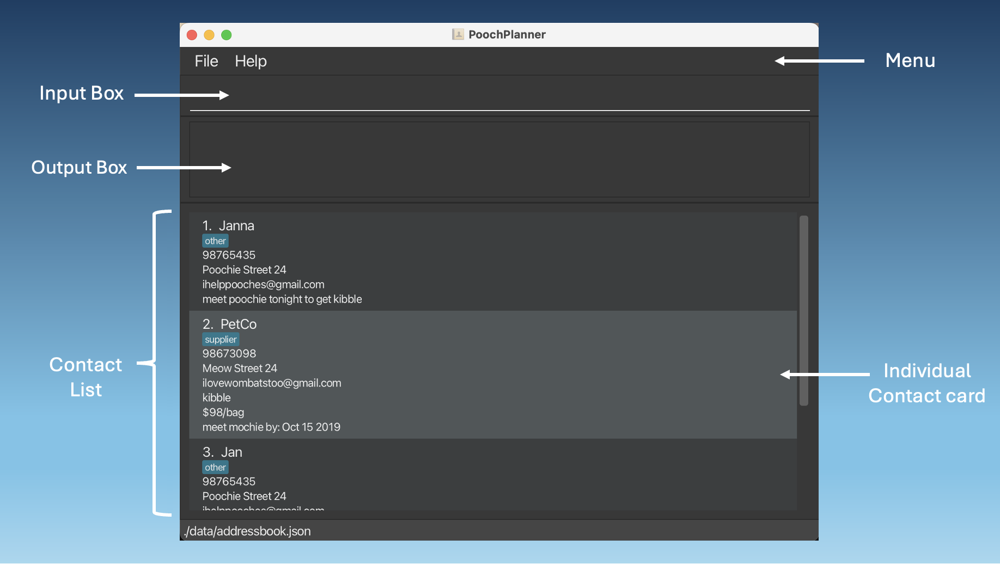

### Contact Card


<div style="page-break-after: always;"></div>

--------------------------------------------------------------------------------------------------------------------

## Features

<div markdown="block" class="alert alert-info">

**:information_source: Notes about the command format:**<br>

* Words in `[parameter name]` are the parameters to be supplied by the user.<br>
  For example, `/add-staff ; name : [name]`, `[name]` is a parameter to be supplied by the user.
  The actual command that the user inputs can be `/add-staff ; name : Poochie`.

* Parameters can be in any order.<br>
  e.g. if the command specifies `address : [address] ; phone : [phone]`, `phone : [phone] ; address : [address]` is also acceptable.

* All command words are case-sensitive.<br>
  e.g. if the command word specifies `\add`, then `\ADD` is invalid.

* If you are using a PDF version of this document, be careful when copying and pasting commands that span multiple lines as space characters surrounding line-breaks may be omitted when copied over to the application.
</div>

### Adding a contact: `add`

Adds a **person/ staff / supplier / maintainer** contact to the Pooch Planner.

<div style="display: flex;">
    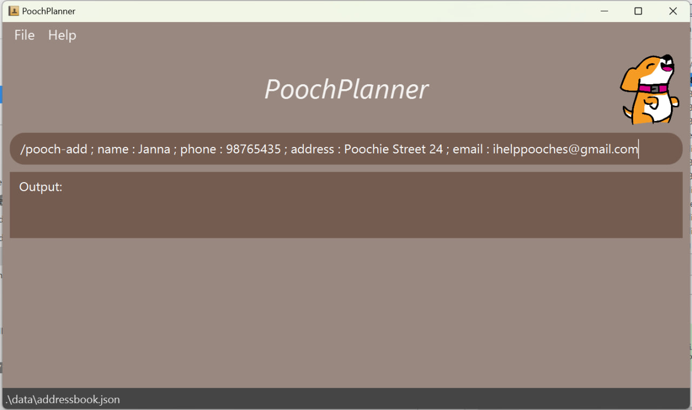
    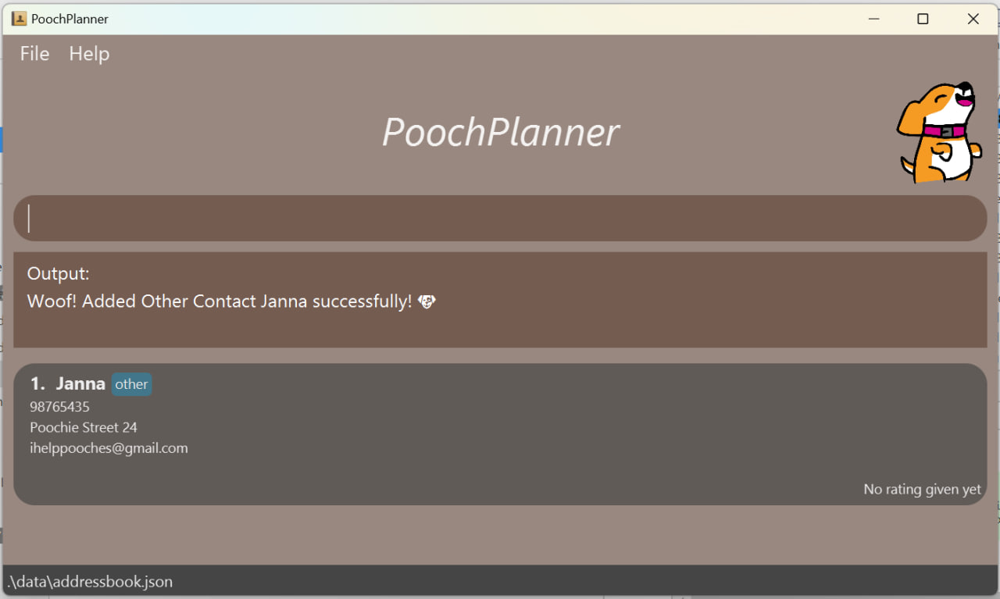
</div>

#### Adds a person
Format: `/add-person ; name : [name] ; phone : [phone] ; address : [address] ; email : [email] ;`

#### Adds a staff
Format: `/add-staff ; name : [name] ; phone : [phone] ; address : [address] ; email : [email] ; salary : [salary/hr]  ; employment : [part/full] ;`

#### Adds a supplier
Format: `/add-supplier ; name : [name] ; phone : [phone] ; address : [address] ; email : [email] ; product : [product] ; price : [price/(quantity)] ;`

#### Adds a maintainer
Format: `/add-maintainer ; name : [name] ; phone : [phone] ; address : [address] ; email : [email] ; skill : [skill] ; commission : [commission/hr] ;`

Examples:
* `/add-person ; name : Janna  ; phone : 98765435 ; address : Poochie Street 24 ; email : ihelppooches@gmail.com`
* `/add-staff ; name : Poochie ; phone : 98765435 ; address : Poochie Street 21 ; email : ilovecatstoo@gmail.com ; salary : $50/hr ; employment : part-time`
* `/add-supplier ; name : PetCo ; phone : 98673098 ; address : Meow Street 24 ; email : ilovewombatstoo@gmail.com ; product : kibble ; price : $98/bag`
* `/add-maintainer ; name : Tom Tan  ; phone : 98765435 ; address : Poochie Street 24 ; email : ihelppooches@gmail.com ; skill : trainer ; commission : $60/hr`

| Adds a ...       | Format & Examples                                                                                                                                                                                                                                                                                                                         |
|------------------|-------------------------------------------------------------------------------------------------------------------------------------------------------------------------------------------------------------------------------------------------------------------------------------------------------------------------------------------|
| **Person**       | Format :<br>`/add-person ; name : [name] ; phone : [phone] ; address : [address] ; email : [email]` <br> Example: <br>`/add-person ; name : Janna  ; phone : 98765435 ; address : Poochie Street 24 ; email : ihelppooches@gmail.com`                                                                                                     |
| **Staff**        | Format : <br>`/add-staff ; name : [name] ; phone : [phone] ; address : [address] ; email : [email] ; salary : [salary/hr]  ; employment : [part/full]` <br> Example: <br>`/add-staff ; name : Poochie ; phone : 98765435 ; address : Poochie Street 21 ; email : ilovecatstoo@gmail.com ; salary : $50/hr ; employment : part-time`       |
| **Supplier**     | Format : <br>`/add-supplier ; name : [name] ; phone : [phone] ; address : [address] ; email : [email] ; product : [product] ; price : [price/(quantity)]` <br> Example: <br>`/add-supplier ; name : PetCo ; phone : 98673098 ; address : Meow Street 24 ; email : ilovewombatstoo@gmail.com ; product : kibble ; price : $98/bag`         |
| **Maintainer**   | Format : <br>`/add-maintainer ; name : [name] ; phone : [phone] ; address : [address] ; email : [email] ; skill : [skill] ; commission : [commission/hr]` <br> Example: <br>`/add-maintainer ; name : Tom Tan  ; phone : 98765435 ; address : Poochie Street 24 ; email : ihelppooches@gmail.com ; skill : trainer ; commission : $60/hr` |

<div markdown="span" class="alert alert-warning">:exclamation: **Constraints:**<br>

* Adding duplicate name will not be allowed.<br>

* Name is case-insensitive but space-sensitive.<br>

* Salary and commission must be in format ${Number}/hr.<br>

* Price must be in format ${Number}/{quantity}.<br>
</div>

<div markdown="span" class="alert alert-primary">:bulb: **Tips:**<br>

* You can undo an add command to revert your changes!<br>

</div>


### Editing a contact : `edit`

Edit a **person / staff / supplier / maintainer** contact in the Pooch Planner.

<div style="display: flex;">
    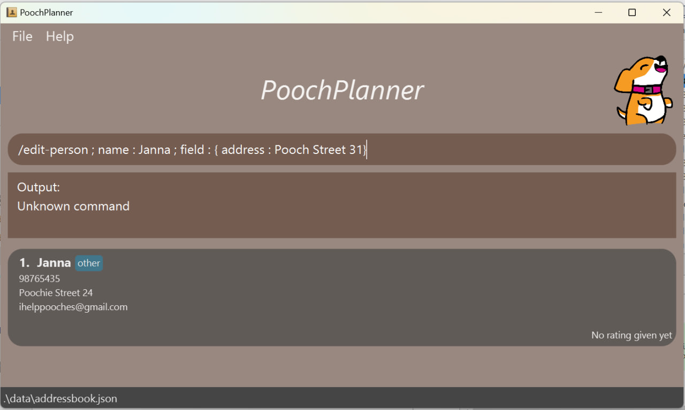
    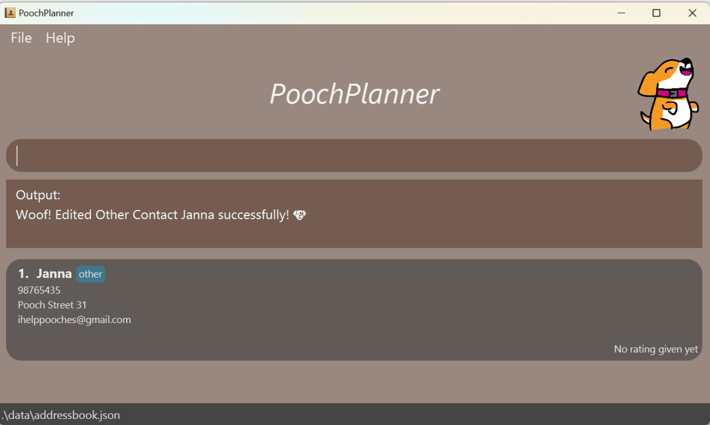
</div>

| Edits a ...    | Format & Examples                                                                                                                                                                                                                                                           |
|----------------|-----------------------------------------------------------------------------------------------------------------------------------------------------------------------------------------------------------------------------------------------------------------------------|
| **Person**     | Format : <br>`/edit-person ; name : [name] ; field : { phone : [phone] ; address : [address] ; email : [email] }` <br> Example:<br> `/edit ; name : Mochie ; field : { address : Pooch Street 31`<br> The above command edits the **address** field of **_Mochie_** to **_Pooch Street 31_**.                                                                                  |
| **Staff**      | Format : <br>`/edit-staff ; name : [name] ; field : { phone : [phone] ; address : [address] ; email : [email] ; salary : [salary]  ; employment : [part/full] }` <br> Example: <br>`/edit-staff ; name : Thomas ; field : { address : Poochie Street 25 ; employment : full-time }` <br> The above command edits the **address and employment** field of **_Thomas_** to **_Poochie Street 25_** and **_full-time_** respectively.|
| **Supplier**   | Format : <br>`/edit-supplier ; name : [name] ; field : { phone : [phone] ; address : [address] ; email : [email] ; product : [product] ; price : [price] }` <br> Example: <br>`/edit-supplier ; name : Supplier1 ; field : { product : kibble ; price : $75/bag}` <br>The above command edits the **product and price** field of **_Supplier1_** to **_kibble_** and **_$75/bag_** respectively.                   |
| **Maintainer** | Format : <br>`/edit-maintainer ; name : [name] ; field : { phone : [phone] ; address : [address] ; email : [email] ; skill : [skill] ; commission : [commission] }` <br> Example: <br>`/edit-maintainer ; name : Maintainer1 ; field : { commission : $10/hr}`<br>The above command edits the **commission** field of **_Maintainer1_** to **_$10/hr_**.                       |

<div markdown="span" class="alert alert-warning">:exclamation: **Constraints:**<br>

* Name is a compulsory field that is case-insensitive but space-sensitive.<br>

* Name must be present in Pooch Planner.<br>

* Contact type, i.e. Person / Staff / Supplier / Maintainer, must match command used. i.e. `/edit`, `edit-staff`, `edit-supplier` and `edit-maintainer`.<br>

* The field(s) to be edited must be a valid field within their contact type, i.e. Person / Staff / Supplier / Maintainer.<br>

* At least one field must be provided.<br>

* Salary and commission must be in format ${Number}/hr.<br>

* Price must be in format ${Number}/{quantity}.<br>
</div>

<div markdown="span" class="alert alert-primary">:bulb: **Tips:**<br>

* You can edit multiple fields at the same time to save time!<br>

</div>

### Searching a contact : `search`

Searches for a **person / staff / supplier / maintainer** contact in the Pooch Planner.

<div style="display: flex;">
    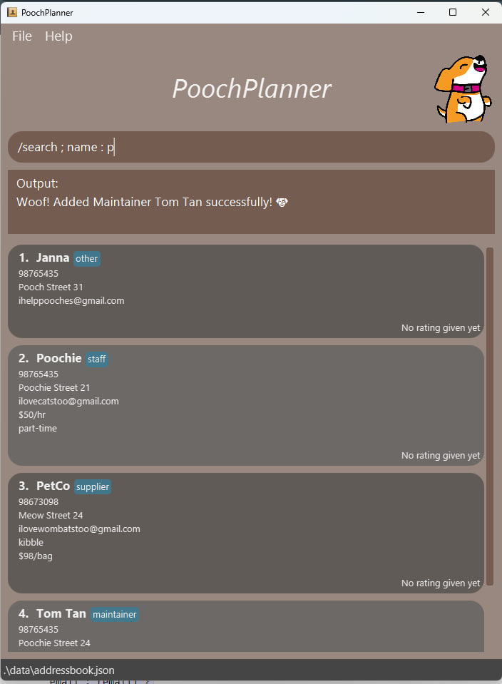
    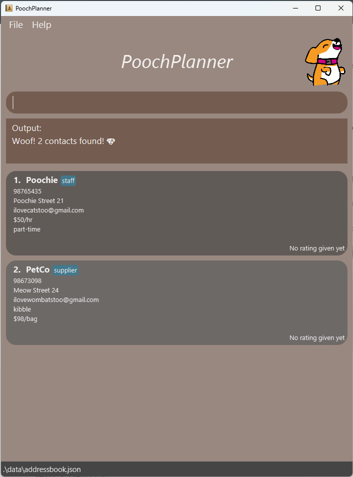
</div>

Format: `/search ; [field] : [full/partial query]`

Examples:
* `/search ; name : Poochie`
* `/search ; phone : 98765432`

<div markdown="span" class="alert alert-warning">:exclamation: **Constraints:**<br>

* Any valid fields, such as `name`, `phone`, `email`, `address`, `salary`, `employment`, `price`, `product`, `skill`, `commission`, `tag` or `note`, can be provided.<br>

* Only one field can be provided.<br>

* Query is case-insensitive but space-sensitive.<br>
</div>

<div markdown="span" class="alert alert-primary">:bulb: **Tips:**<br>

* You can use `/list` to see the full list again after searching for a contact! <br>

</div>

### Sorting the address book : `sort`

Sorts the address book by field in ascending order

Format: `/sort ; [field]`

Examples:
* `/sort ; name`
* `/sort ; phone`

<div markdown="span" class="alert alert-warning">:exclamation: **Constraints:**<br>

* This command sorts the contacts in the address book in ascending lexicographical order (e.g. Alice, Bob, Charlie etc.).<br>

* Sorts by specifying a valid field, such as `name`, `phone`, `email`, `address`, `salary`, `employment`, `price`, `product`, `skill`, `commission`, `tag` or `note`.<br>

* All field input are case-insensitive.<br>
</div>

### Deleting a contact : `delete`

Deletes a **person / staff / supplier / maintainer** contact from the Pooch Planner.

<div style="display: flex;">
    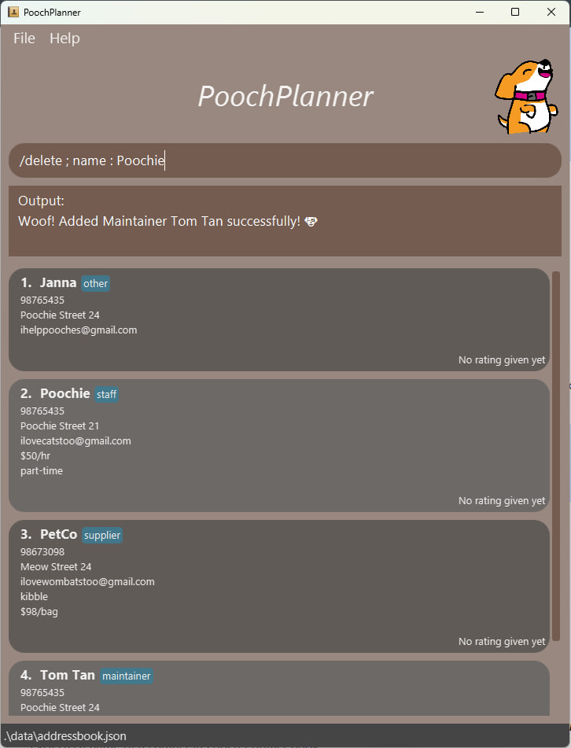
    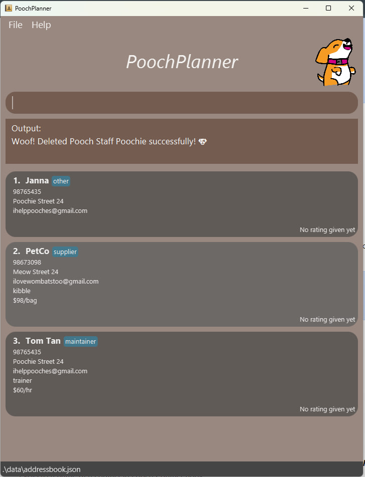
</div>

Format: `/delete ; name : [name]`

Examples:
* `/delete ; name : Poochie`

   The above command deletes the contact with name **_Poochie_**, provided **_Poochie_** exists as a name of a contact in Pooch Contact Book

<div markdown="span" class="alert alert-warning">:exclamation: **Constraints:**<br>

* Name is a compulsory field that is case-insensitive but space-sensitive.<br>

* Name must be present in Pooch Planner.<br>
</div>

### Rating a Contact : `rate`

Gives a **person / staff / supplier / maintainer** contact from the Pooch Planner a performance rating.

<div style="display: flex;">
    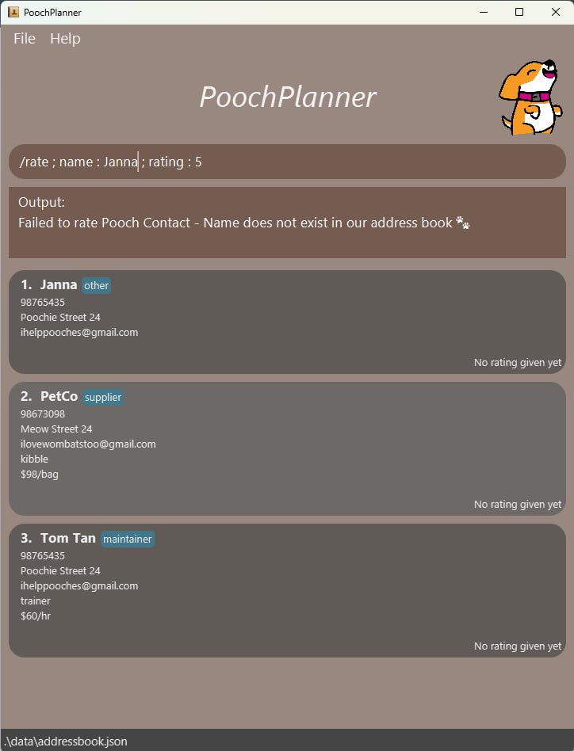
    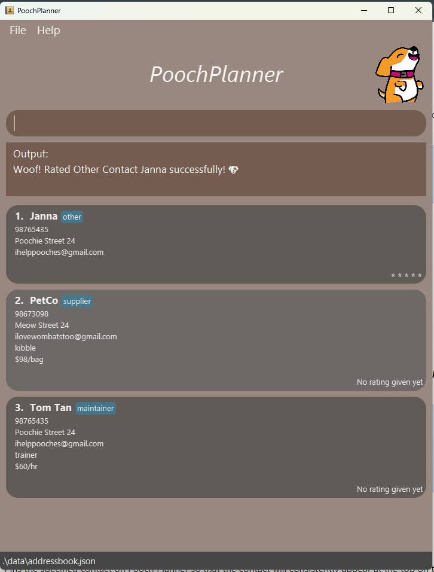
</div>

Format: `/rate ; name : [name] ; rating : [rating value from 1-5]`

Examples:
* `/rate ; name : Poochie ; rating : 5`
  
  The above command rates the contact with the name **_Poochie_** with a rating of `5`, provided **_Poochie_** exists as a name of a contact in Pooch Contact Book


<div markdown="span" class="alert alert-warning">:exclamation: **Constraints:**<br>

* Rating can only accept whole number values from 1 to 5 inclusive.<br>

* Name must be present in Pooch Planner.<br>

* Name and Rating is a compulsory field that is case-insensitive but space-sensitive.<br>

* Rating of 0 will automatically display `No rating given yet`.<br>

</div>

<div markdown="span" class="alert alert-primary">:bulb: **Tips:**<br>

* You can set rating to '0' to reset the rating! <br>

</div>

### Pinning a contact : `pin`

Pins the specified contact on Pooch Planner so that the contact will consistently appear at the top on the contact list.

<div style="display: flex;">
    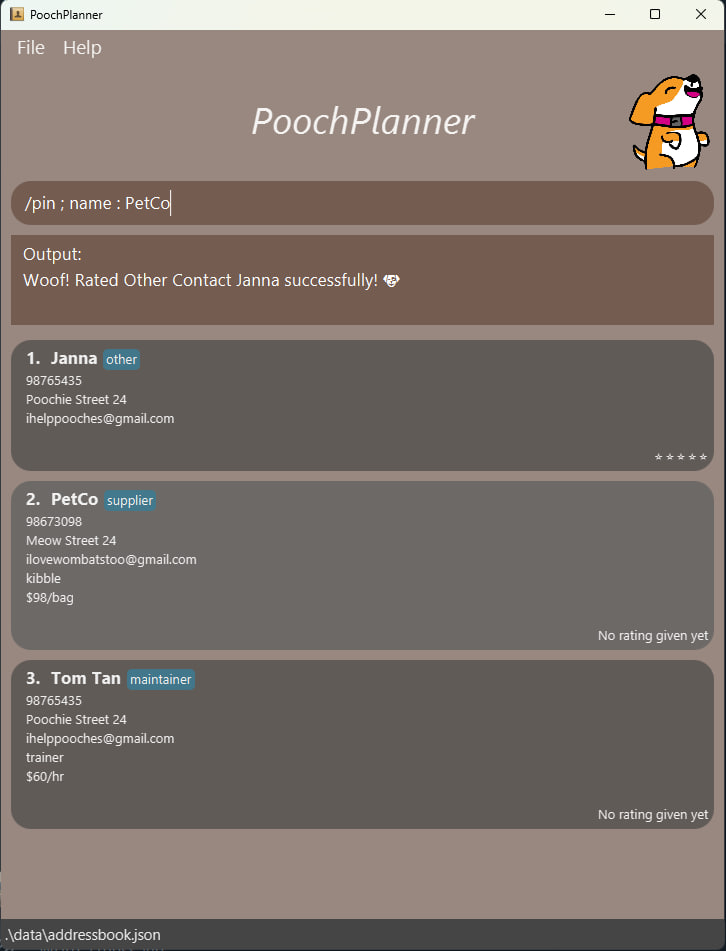
    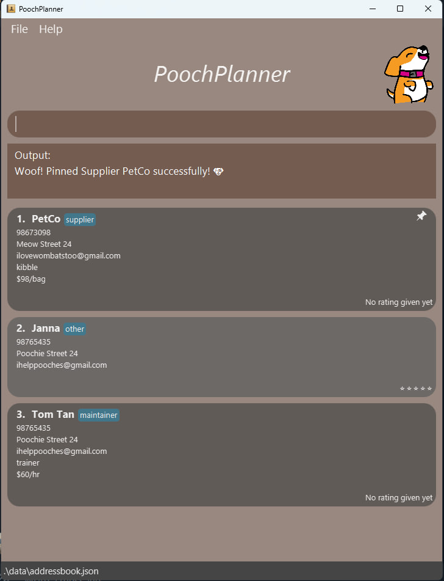
</div>

Format: `/pin ; name : [name]`

Examples:
* `/pin ; name : Poochie`

   The above command unpins the contact with name **_Poochie_**, provided **_Poochie_** exists as a name of a contact in Pooch Contact Book.

<div markdown="span" class="alert alert-warning">:exclamation: **Constraints:**<br>

* Name is a compulsory field that is case-insensitive but space-sensitive.<br>

* Name must be present in Pooch Planner.<br>

* Using pin command on a contact that has been pinned do not make any changes to Pooch Planner.<br>
</div>

<div markdown="span" class="alert alert-primary">:bulb: **Tips:**<br>

* Use the pin command for your frequently contacted addresses! <br>

</div>

### Unpinning a contact : `unpin`

Unpins the specified contact on Pooch Planner so that the contact will consistently appear at the top on the contact list.

<div style="display: flex;">
    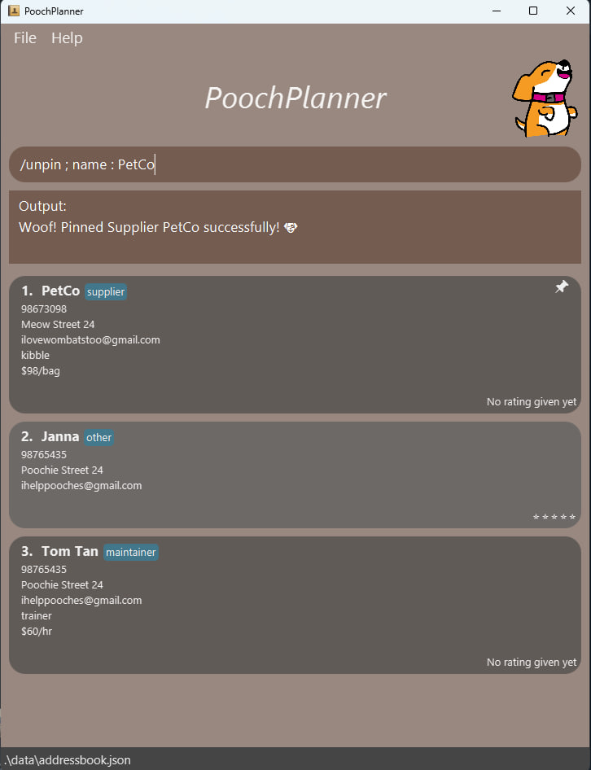
    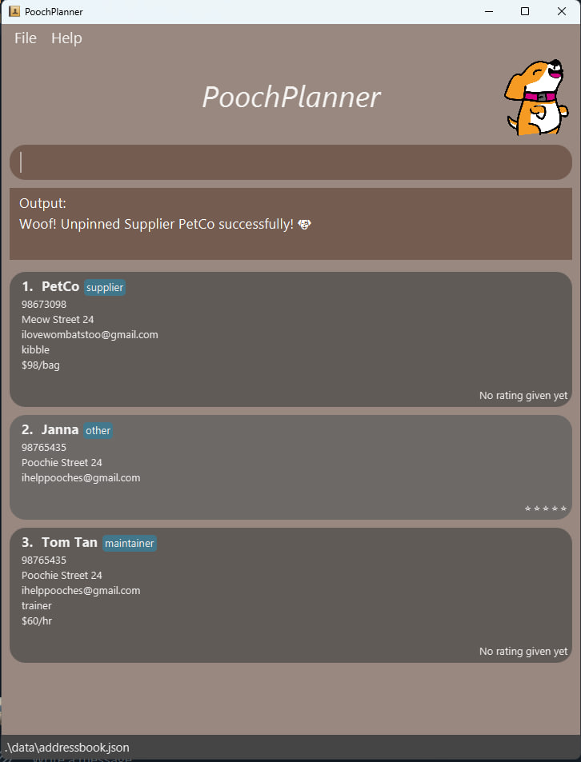
</div>

Format: `/unpin ; name : [name]`

Examples:
* `/unpin ; name : Moochie`

   The above command unpins the contact with name **_Moochie_**, provided **_Moochie_** exists as a name of a contact in Pooch Contact Book.

<div markdown="span" class="alert alert-warning">:exclamation: **Constraints:**<br>

* Name is a compulsory field that is case-insensitive but space-sensitive.<br>

* Name must be present in Pooch Planner.<br>

* Using unpin command on a contact that has been unpinned do not make any changes to Pooch Planner.<br>
</div> 

### Adding a note : `note`

Adds a note to a specified person from the Pooch Planner.

<div style="display: flex;">
    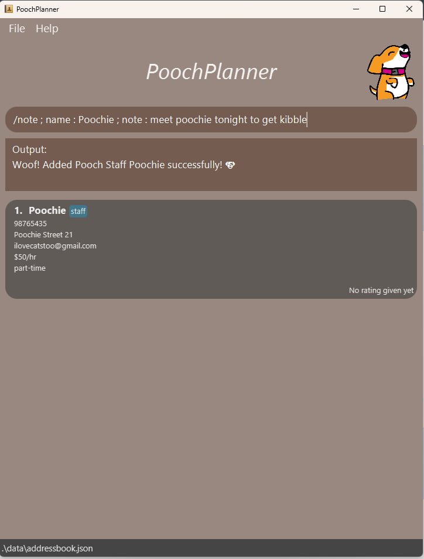
    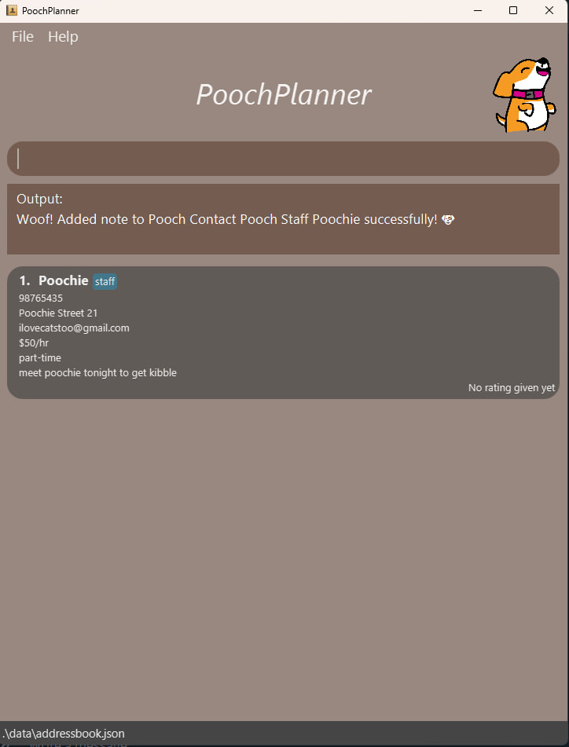
</div>

Format: `/note ; name : [name] ; note : [note message]`

Examples:
* `/note ; name : Poochie ; note : meet poochie tonight to get kibble`

  The above command adds the note "meet poochie tonight to get kibble" to 
  the contact with name **_Poochie_**, provided **_Poochie_** exists as a name of a contact in Pooch Contact Book

<div markdown="span" class="alert alert-warning">:exclamation: **Constraints:**<br>

* Name and Note are compulsory fields that are case-insensitive but space-sensitive.<br>

* Name must be present in Pooch Planner.<br>

* Note can only be added but not deleted.<br>

</div>

<div markdown="span" class="alert alert-primary">:bulb: **Tips:**<br>

* Adding note can be used to add small, additional details! <br>

</div>

### Undoing a command : `undo`

Undo a previous command which made a change to Pooch Planner history.

<div style="display: flex;">
    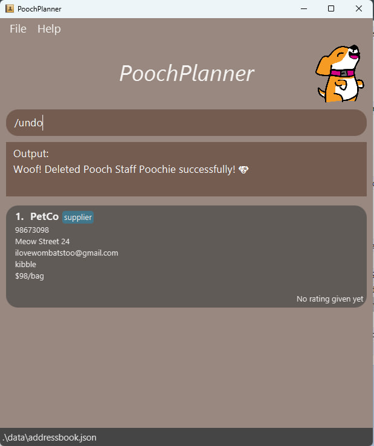
    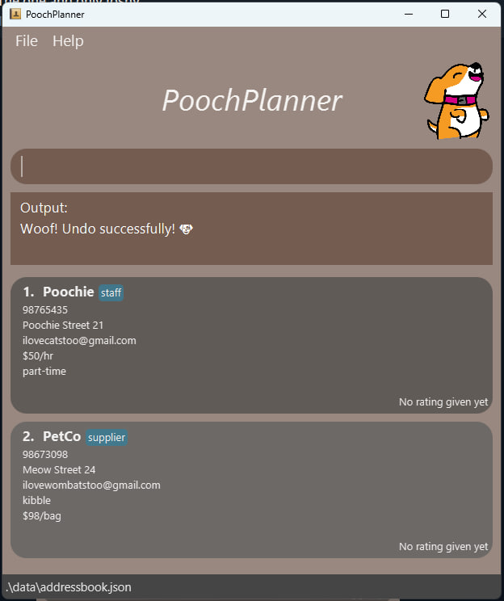
</div>

Format: `/undo`

<div markdown="span" class="alert alert-warning">:exclamation: **Constraints:**<br>

* There is no field required for this command.<br>

* Any unnecessary parameter or value after /undo will simply be ignored.<br>

* This command can only be executed when at least one changes have been made.<br>
</div> 

<div markdown="span" class="alert alert-primary">:bulb: **Tips:**<br>

* `Undo` works on all commands except except `Search` and `Help` commands! <br>

</div>

### Redoing a command : `redo`

Retrieve next state of Pooch Planner

<div style="display: flex;">
    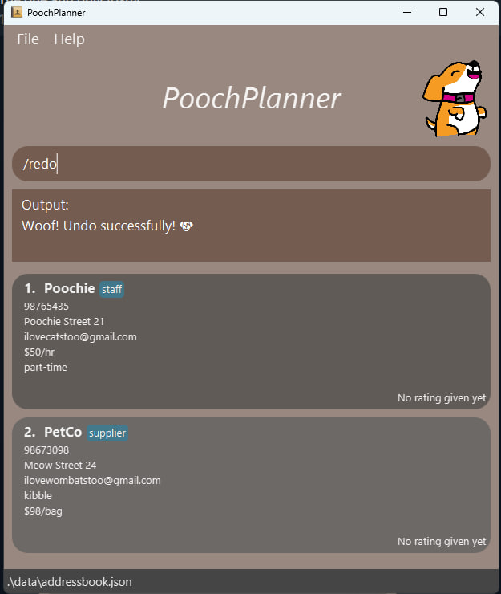
    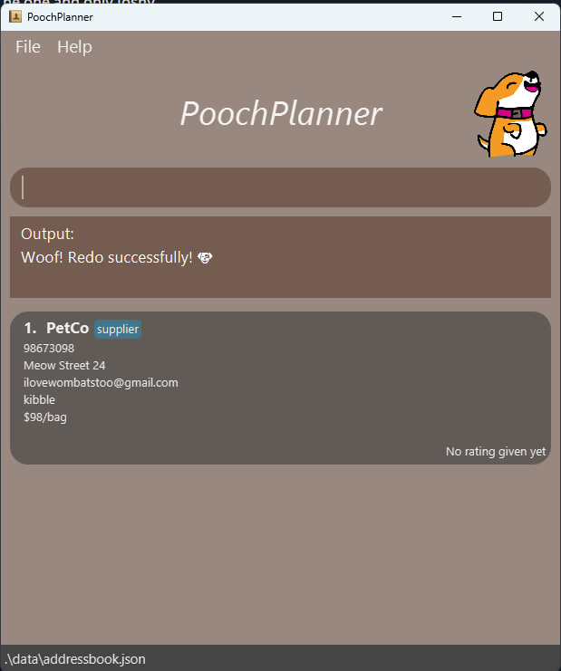
</div>

Format: `/redo`

<div markdown="span" class="alert alert-warning">:exclamation: **Constraints:**<br>

* There is no field required for this command.<br>

* Any unnecessary parameter or value after /redo will simply be ignored.<br>

* This command can only be executed when at least one undo command is executed.<br>

</div>

<div markdown="span" class="alert alert-primary">:bulb: **Tips:**<br>

* `Redo` works on all commands except `Search` and `Help` commands! <br>

</div>

### Viewing help : `help`

Shows a message of how to write commands for all commands or a specfic command.

<div style="display: flex;">
    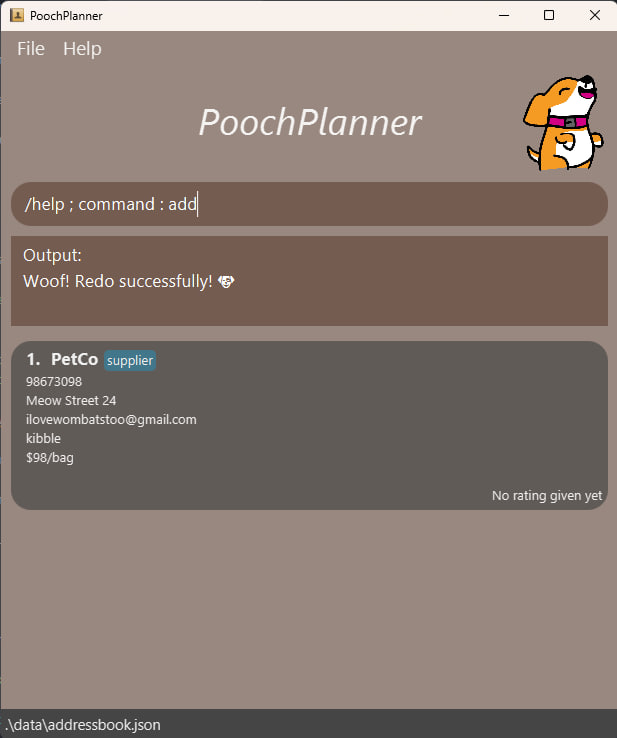
    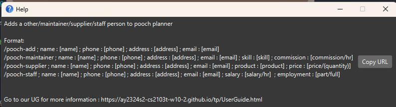
</div>

Format: `/help ; command : [command type]`

Examples:
* `/help ; command : delete`
* `/help ; command : add`

<div markdown="span" class="alert alert-warning">:exclamation: **Constraints:**<br>

* Command must be specified.<br>

* Help is only given for `delete`, `add`, `edit`, `search`.<br>
</div>

<div markdown="span" class="alert alert-primary">:bulb: **Tips:**<br>

* To see help for all commands, the corresponding command field is `general`.<br>

</div>

### Exiting the program : `exit`

Exits the program.

Format: `/exit`

### Saving the data

Pooch Planner data are saved in the hard disk automatically after any command that changes the data. There is no need to save manually.

### Editing the data file

Pooch Planner data are saved automatically as a JSON file `[JAR file location]/data/addressbook.json`. Advanced users are welcome to update data directly by editing that data file.

<div markdown="span" class="alert alert-warning">:exclamation: **Caution:**<br>

If your changes to the data file makes its format invalid, PoochPlanner will discard all data and start with an empty data file at the next run. Hence, it is recommended to take a backup of the file before editing it.<br>
Furthermore, certain edits can cause the PoochPlanner to behave in unexpected ways (e.g., if a value entered is outside of the acceptable range). Therefore, edit the data file only if you are confident that you can update it correctly.
</div>


### Archiving data files `[coming in v2.0]`

_Details coming soon ..._

--------------------------------------------------------------------------------------------------------------------

## Common Errors

### Unknown Command

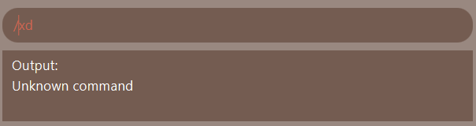

Key in only valid commands as mentioned in this User Guide (eg. `/add`, `/edit`, etc.)

### Invalid Field

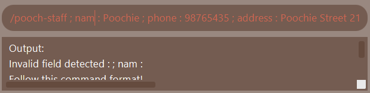

Key in only valid field parameters within the command (e.g. `name`, `phone`, `email` etc.)

### Incorrect formatting

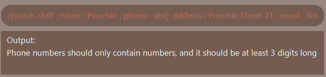

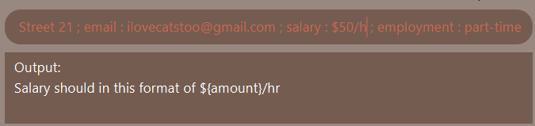

To fix the formatting errors, key in the appropiate syntax based on the error message

Examples:
- `Phone` field accepts only numbers that are at least 3 digits long
- `Salary` field must follow the format `$___/hr`

--------------------------------------------------------------------------------------------------------------------

## FAQ

### Launching PoochPlanner

**Q**: How can I launch PoochPlanner if clicking on the JAR file does not work?<br>
**A**: There are two possible methods to launch PoochPlanner.

**Method 1**: Using the Command Line
1. Open the command line in your operating system's terminal software.
2. Navigate to the directory where the JAR file is located.
3. Enter `java -jar PoochPlanner.jar` and the PoochPlanner Application should launch.

**Method 2**: Using `.bat/.sh` Scripts
1. Create a new text file and paste the following line into the file:
   ```
   java -jar [JAR file location]/PoochPlanner.jar
   ```
2. Save the file as `PoochPlanner.bat` (Windows) or `PoochPlanner.sh` (macOS/Linux).
3. Change the admin settings of the script to allow it to run as a program:
   - Windows: Right-click on the script and select Properties. Under General, check the box that says `Allow this file to run as a program`.
   - macOS/Linux: Open the Terminal and navigate to the directory where the script is located. Type `chmod +x [script name]` and press `Enter`.<br>Note: (`chmod +x` changes permissions of the script to allow it to be executed)
4. Double-click on the script to launch PoochPlanner.

### Checking Java Version

**Q**: How can I check my Java version?<br>
**A**: Open a command line and type `java -version`. If you do not have Java installed, you can insdtall Java 11 using the Oracle guide [here](https://www.oracle.com/java/technologies/downloads/#java11). Alternatively, you can install the OpenJDK version. For macOS users, you may wish to follow the instructions [here](https://nus-cs2103-ay2324s1.github.io/website/admin/programmingLanguages.html).

### Loading Data from Another Computer

**Q**: How can I transfer my PoochContacts to another Computer?<br>
**A**: Install PoochPlanner in your target computer and and overwrite the empty data file it creates with the file that contains the data of your previous PoochPlanner home folder by copying the contents of the `PoochPlanner.json` file from your current computer and pasting it inside the `PoochPlanner.json` file of your target computer.

### Using PoochPlanner

**Q**: What are the available commands in PoochPlanner?<br>
**A**: Please refer to the [Command Summary](#command-summary) for the list of available commands.

**Q**: Do I need an internet connection to use PoochPlanner?<br>
**A**: All of PoochPlanner’s functionality can be used offline! No internet connection is required.

**Q**: How do I save my data?<br>
**A**: Data is saved in the hard disk automatically after any command that changes the data. There is no need to save manually.

**Q**: If I have a lot of PoochContacts, is there a way for me to access my most frequently used PoochContacts easily?<br>
**A**: Yes! You may wish to make use of our `pin` feature, which keeps all of your pinned contacts at the very top of your PoochContact list, ensuring that you are always able to see them!<br><br>The syntax for the `pin` command is as follows:
```
/pin ; name : [name]
```

**Q**: How can I remove a PoochContact's rating?<br>
**A**: In PoochPlanner, a `0` rating corresponds to a non-rating (no rating is provided). Therefore, to remove a PoochContact's rating, simply give the target PoochContact a rating of `0`.<br><br>The syntax for the `rate` command is as follows:
```
/rate ; name : [name] ; rating : [rating]
```

**Q**: Can I append a note to a PoochContact when creating it?<br>
**A**: Yes you can! In fact, you may also rate PoochContacts at their time of creation. Simply enter their respective [prefixes](#prefix-summary) and you should be on your way!<br><br>
Example: Adding a new contact with a note and a rating
```
/add-person ; name : Pooch ; phone : 98883888 ; address : Pooch Street 32 ; email : impooch@gmail.com ; rating : 3 ; note : Hello my name is Pooch!
```

--------------------------------------------------------------------------------------------------------------------

## Known issues

1. **When using multiple screens**, if you move the application to a secondary screen, and later switch to using only the primary screen, the GUI will open off-screen. The remedy is to delete the `preferences.json` file created by the application before running the application again.

--------------------------------------------------------------------------------------------------------------------

## Prefix Summary

A **prefix** is an integral construct of PoochPlanner's commands that allow PoochPlanner to uniquely identify contact fields.

| Prefix                  | Field                                                      | Contact Type   |
|-------------------------|------------------------------------------------------------|----------------|
| `; name :`              | Specifies the name of the PoochContact                     | All            |
| `; phone :`             | Specifies the phone number of the PoochContact             | All            |
| `; address :`           | Specifies the addresss of the PoochContact                 | All            |
| `; email :`             | Specifies the email address of the PoochContact            | All            |
| `; note :`              | Specifies the note appended to the PoochContact            | All            |
| `; rating :`            | Specifies the rating given to the PoochContact             | All            |
| `; salary :`            | Specifies the salary of the PoochContact                   | Staff          |
| `; employment :`        | Specifies the employment of the PoochContact               | Staff          |
| `; product :`           | Specifies the product sold by the PoochContact             | Supplier       |
| `; price :`             | Specifies the price charged by the PoochContact            | Supplier       |
| `; skill :`             | Specifies the type of service offered by the PoochContact  | Maintainer     |
| `; commission :`        | Specifies the commission charged by the PoochContact       | Maintainer     |

## Command Summary

| Action                | Format + Example                                                                                                                                                                                                                                                                                                                              |
|-----------------------|-----------------------------------------------------------------------------------------------------------------------------------------------------------------------------------------------------------------------------------------------------------------------------------------------------------------------------------------------|
| **Add Staff**         | Format : <br>`/add-staff ; name : [name] ; phone : [phone] ; address : [address] ; email : [email] ; salary : [salary]  ; employment : [part/full]`    <br> <br> Example : <br> `/add-staff ; name : Poochie ; phone : 98765435 ; address : Poochie Street 21 ; email : ilovecatstoo@gmail.com ; salary : $50/hr ; employment : part-time`    |
| **Add Supplier**      | Format : <br> `/add-supplier ; name : [name] ; phone : [phone] ; address : [address] ; email : [email] ; product : [product] ; price : [price]`        <br> <br> Example : <br> `/add-supplier ; name : PetCo ; phone : 98673098 ; address : Meow Street 24 ; email : ilovewombatstoo@gmail.com ; product : kibble ; price : $98/bag`         |
| **Add Maintainer**    | Format : <br>`/add-maintainer ; name : [name] ; phone : [phone] ; address : [address] ; email : [email] ; skill : [skill] ; commission : [commission]` <br> <br> Example : <br> `/add-maintainer ; name : Tom Tan  ; phone : 98765435 ; address : Poochie Street 24 ; email : ihelppooches@gmail.com ; skill : trainer ; commission : $60/hr` |
| **Add Other Contact** | Format : <br>`/add-person ; name : [name] ; phone : [phone] ; address : [address] ; email : [email] ; skill : [skill] ; commission : [commission]`        <br> <br> Example : <br> `/add-person ; name : Janna  ; phone : 98765435 ; address : Poochie Street 24 ; email : iamjanna@gmail.com`                                                |
| **Delete**            | Format : <br>`/delete name : [name] `                                                                                                                    <br> <br> Example : <br> `/delete ; name : Poochie`                                                                                                                                  |
| **Edit**              | Format : <br>`/edit-person ; name : [name] ; field : { field : data ; field : data }`                                                                    <br> <br> Example : <br> `/edit-person ; name : Poochie ; field : { address : Poochie Street 25 ; employment : full-time }`                                                          |
| **Search**            | Format : <br>`/search ; parameter : [value]`                                                                                                             <br> <br> Example : <br> `/search ; name : Poochie`                                                                                                                                  |
| **List**              | Format : <br>`/list`                                                                                                                                     <br> <br> Example : <br> `/list`                                                                                                                                                     |
| **Help**              | Format : <br>`/help ; command : [command type]`                                                                                                          <br> <br> Example : <br> `/help ; command : delete`                                                                                                                                  |
| **Rate**              | Format : <br>`/rate ; name : [name] ; rating : [rating]`                                                                                                 <br> <br> Example : <br> `/rate ; name : Poochie ; rating : 5`                                                                                                                       |
| **Undo Command**      | Format : <br>`/undo`                                                                                                                                     <br> <br> Example : <br> `/undo`                                                                                                                                                     |
| **Redo Command**      | Format : <br>`/redo`                                                                                                                                     <br> <br> Example : <br> `/redo`                                                                                                                                                     |
| **Pin**               | Format : <br>`/pin ; name : [name]`                                                                                                                      <br> <br> Example : <br> `/pin ; name : Poochie`                                                                                                                                     |
| **Unpin**             | Format : <br>`/unpin ; name : [name]`                                                                                                                    <br> <br> Example : <br> `/unpin ; name : Poochie`                                                                                                                                   |
| **Sort**              | Format : <br>`/sort ; [field]`                                                                                                                           <br> <br> Example : <br> `/sort ; name`                                                                                                                                              |
| **Exit**              | Format : <br>`exit`                                                                                                                                      <br> <br> Example : <br> `exit`                                                                                                                                                      |
