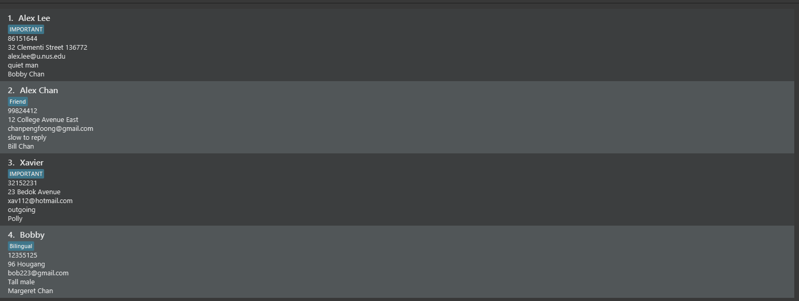

  

# ConnectCare User Guide

<box type="info" seamless>

_This page is for ConnectCare users. If you're a developer, see also the
[Developer guide](https://ay2324s2-cs2103t-w12-4.github.io/tp/DeveloperGuide.html)._
</box>

<!-- * Table of Contents -->
<page-nav-print />

___

## Introduction
Welcome to *ConnectCare User Guide*, your comprehensive resource for efficiently managing client contacts with ease and reliability!
Designed for social workers grappling with demanding caseloads, *ConnectCare* empowers users to navigate their client interactions seamlessly. Whether you're troubleshooting issues, just getting started, or looking to enhance your workflow, this guide is tailored to meet your needs.

## Who ConnectCare is For

ConnectCare caters to the needs of social workers juggling high caseloads, providing a solution that streamlines client management processes. This application is ideal for both new and experienced users, offering intuitive features that prioritize efficiency, accuracy, and productivity. 
Whether you're a seasoned professional or new to social work practice, ConnectCare is designed to enhance your workflow and elevate your client management experience. Furthermore, ConnectCare boasts a range of benefits that directly address the challenges faced by social workers, including: 

* Increased Efficiency: Spend less time navigating the software and more time directly helping clients.
* Reduced Errors: Minimize the possibility of errors caused by switching between input methods.
* Boosted Productivity: Complete tasks faster and free up valuable time for client interaction.

##### Embrace a Keyboard-Centric Approach

Social workers often spend significant time documenting and updating client information.  By minimizing the need to use a mouse, ConnectCare allows for a smoother workflow, especially when working remotely or on laptops.

This approach can significantly reduce:

* Hand fatigue and strain.
* Cognitive load from switching between input methods.
* Overall time spent completing tasks.

##### Work Offline, Stay Productive

One of the key benefits of ConnectCare is that it doesn't require a constant internet connection. This allows you to work seamlessly even in areas with limited or no internet access.  Whether you're conducting a home visit or working remotely in the field, ConnectCare ensures you can access and update client information efficiently.

##### Sensitive Data is kept Secure

We understand that social workers handle sensitive client information. Since ConnectCare functions offline, your data never needs to be transmitted over the internet or stored on remote servers. This significantly reduces the risk of unauthorized access compared to cloud-based solutions. ConnectCare prioritizes data security by storing information [locally](#local) on your device.

##### Focus on Your Clients, Not Software

By streamlining workflows and offering social work-specific features, ConnectCare empowers you to focus on what matters most: your clients. You can spend more time building rapport with clients, respond to inquiries and needs more promptly and ultimately focus on delivering high-quality care.

___

## Who This Guide Is For

This guide caters to users with varying levels of technical proficiency, requiring only basic keyboard typing skills. Whether you're new to ConnectCare or seeking to enhance your skills, this guide provides comprehensive instructions on all functionalities and commands. From basic navigation to advanced features, this guide serves as your definitive resource for optimizing your usage of ConnectCare.

___

## How to Use This Guide

There is no wrong way to read this guide: if you want to skip ahead, go for it! Each section is contained entirely in itself, and you can find what you are looking for without needing to read the previous sections. However, we recommend that you read through the entire guide at least once before utilizing the application, so that you would have a more thorough understanding of the all necessary features.

This guide has 4 main sections:
1. The [**Quick Start**](#quick-start) section, we will walk through you in how to get started installing as well as running the ConnectCare on your own desktop.

2. The [**Features Section**](#features) will provide a comprehensive, easy-to-understand guide on how to fully make use of all of ConnectCare's functionalities and commands.

3. The [**FAQ**](#faq) section will answer commonly asked questions, addressing potential further queries you might have!

4. Lastly, the [**Glossary**](#glossary) contains a list of key terms and definitions that might be helpful.

The various boxes used in this guide:
<box type="tip">

Gives you useful tips that are not entirely necessary to use the application, but help you get the most out of _ConnectCare_.
</box>

<box type="info">

Provides additional information and context that extends your understanding of _ConnectCare_'s features.
</box>

<box type="warning">

Important warnings that you should keep in mind while using this User Guide.
</box>

<box type="warning">

**Warning:** If you are using a PDF version of this document, be careful when copying and pasting commands that span multiple lines as space characters surrounding line-breaks may be omitted when copied over to the application.
</box>

___

## Quick start
<IMPROVE BY ADDING SCREENSHOTS AND LINKS>

This section allows you to start caring for your clients as soon as possible!
It will help you [install](#installation-instructions) and [start](#startup-instructions) using the application as fast as possible.

### Installation instructions
1. To use ConnectCare you will require Java 11 to be installed in your computer.

**If you have Java 11 installed**

2. Check that it is the correct version
    - Windows or macOS users might find [this guide](https://blog.hubspot.com/website/check-java-verison) useful.
    - Linux users might find [this guide](https://phoenixnap.com/kb/check-java-version-linux) useful.
    - If you have the correct version skip ahead to step 4, otherwise, follow step 3 to install Java 11.

**If you do _not_ have Java 11 installed**

3. Install Java 11 based on your Operating System
   - **Windows** users should use [this guide](https://docs.oracle.com/en/java/javase/11/install/installation-jdk-microsoft-windows-platforms.html#GUID-A7E27B90-A28D-4237-9383-A58B416071CA). 
   - **MacOS** users should use [this guide](https://docs.oracle.com/en/java/javase/11/install/installation-jdk-macos.html#GUID-2FE451B0-9572-4E38-A1A5-568B77B146DE).
   - **Linux** users should use [this guide](https://docs.oracle.com/en/java/javase/11/install/installation-jdk-linux-platforms.html#GUID-737A84E4-2EFF-4D38-8E60-3E29D1B884B8).

4. Download the latest release of `addressbook.jar` [here](https://github.com/AY2324S2-CS2103T-W12-4/tp/releases).

    <pic src="images/quickstart/latest-release.png" alt="jar_file">
        <markdown> Find the latest release with the 'Latest tag' </markdown>
    </pic>
    <pic src="images/quickstart/jar-file.png" alt="jar_file">
        <markdown> Click on the `.jar` file at the bottom of the page to download it </markdown>
    </pic>

5. Copy the jar file to the folder you want to use as the home folder.

### Startup instructions

6. Double-click on the `addressbook.jar` file to start the application. 
   - If you are facing issues, you can consult [this guide](https://www.wikihow.com/Run-a-.Jar-Java-File).

**Your first command**
- Type this command to add and manage your first client
    
    `add n/John Doe p/98765432 e/johnd@example.com a/John street, Block 123, #01-01 d/Suffers from depression k/Jasmin Doe t/mentalIllness`
- Go to the [command summary](#command-summary) for a list of different commands to try out!

___

## Features

### Notes about the command format:
-   Words in `UPPER_CASE` are the parameters to be supplied by the user.
    e.g. in `add n/NAME`, `NAME` is a parameter which can be used as `add n/John Doe`.

-   Items in square brackets are optional.
    e.g `n/NAME [t/TAG]` can be used as `n/John Doe t/friend` or as `n/John Doe`.

-   Items with `…` after them can be used multiple times including zero times.
    e.g. `[t/TAG]…` can be used as (i.e. 0 times), `t/friend`, `t/friend t/family` etc.

-   Parameters can be in any order.
    e.g. if the command specifies `n/NAME p/PHONE_NUMBER`, `p/PHONE_NUMBER n/NAME` is also acceptable.

-   Extraneous parameters for commands that do not take in parameters (such as `help`, `list`, `exit` and `clear`) will be ignored.
    e.g. if the command specifies `help 123`, it will be interpreted as `help`.

### Adding a new client: `add`

_This command adds a new client to your client list._

**Format:** `add n/NAME p/PHONE_NUMBER e/EMAIL a/ADDRESS k/NEXT_OF_KIN d/DESCRIPTION [t/TAG]…`

<panel header="Parameter Descriptions and Remarks" alt="Parameters" minimized>
<markdown>

| Parameter      | Description                                        | Remarks                                                                                                                                                                                                                                                                                                                                                                                                                                                                                                                                                                                                                                                                                                         |
|----------------|----------------------------------------------------|-----------------------------------------------------------------------------------------------------------------------------------------------------------------------------------------------------------------------------------------------------------------------------------------------------------------------------------------------------------------------------------------------------------------------------------------------------------------------------------------------------------------------------------------------------------------------------------------------------------------------------------------------------------------------------------------------------------------|
| n/NAME         | Name of client that you want to add                | Name must be unique, alphanumeric and is compulsory                                                                                                                                                                                                                                                                                                                                                                                                                                                                                                                                                                                                                                                             |
| p/PHONE_NUMBER | Phone Number of client that you want to add        | Phone number should only contain numbers and is compulsory                                                                                                                                                                                                                                                                                                                                                                                                                                                                                                                                                                                                                                                      |
| e/EMAIL        | Email of client that you want to add               | Emails is compulsory and should be of the format local-part@domain and adhere to the following constraints: 1. The local-part should only contain alphanumeric characters and these special characters, excluding the parentheses, (+_.-). The local-part may not start or end with any special characters. 2. This is followed by a '@' and then a domain name. The domain name is made up of domain labels separated by periods. The domain name must:   - end with a domain label at least 2 characters long   - have each domain label start and end with alphanumeric characters   - have each domain label consist of alphanumeric characters, separated only by hyphens, if any. |
| a/ADDRESS      | Address of client that you want to add             | Compulsory                                                                                                                                                                                                                                                                                                                                                                                                                                                                                                                                                                                                                                                                                                      |
| k/NEXT_OF_KIN  | Next of Kin details of client that you want to add | Name must be alphanumeric and is compulsory                                                                                                                                                                                                                                                                                                                                                                                                                                                                                                                                                                                                                                                                     |
| d/DESCRIPTION  | Description of client that you want to add         | Description should not be blank and is compulsory                                                                                                                                                                                                                                                                                                                                                                                                                                                                                                                                                                                                                                                               |
| t/TAG          | Tag to identify the client                         | A person can have any number of tags (or even 0)                                                                                                                                                                                                                                                                                                                                                                                                                                                                                                                                                                                                                                                                |

<box type="tip" seamless>
  
**Tip:** If you have difficulty adding clients, check if you have added the correct prefixes

</box>
</markdown>
</panel>

&nbsp;

**Examples:**
-   `add n/John Doe p/98765432 e/johnd@example.com a/57 Ubi Avenue 1 #04-13 Ubi Centre d/Suffers from depression k/Jasmin Doe`
-   `add n/Betsy Crowe t/friend d/Takes anxiety medication k/Bethany Crowe e/betsycrowe@example.com a/Blk 684A Jurong West Central 1 #10-124 p/92748321 t/lowPriority`
-   `add n/Aaron James p/84362143 e/billj@example.com a/400 Balestier Road #02-27 Balestier Plaza t/highPriority k/John Doe d/Has low blood pressure`

**Walkthrough:**

The screenshots below are what you would expect when using the `add` command. In this example, after using the [`list`](https://ay2324s2-cs2103t-w12-4.github.io/tp/UserGuide.html#listing-all-persons-list) command,
the full clients list is displayed. Thereafter, the `add` command was used, using the parameters `n/Aaron James p/84362143 e/billj@example.com a/400 Balestier Road #02-27 Balestier Plaza t/highPriority k/John Doe d/Has low blood pressure`.
After execution, the client `Aaron James` is added successfully with the corresponding parameters!

    <pic src="images/user-guide/add_command/add_command_before.png" alt="add">
        <markdown> Figure 1.2: Before the `add` command is executed </markdown>
    </pic>
    <pic src="images/user-guide/add_command/add_command_after.png" alt="add">
        <markdown> Figure 1.2: After the `add` command is executed </markdown>
    </pic>

&nbsp;

What if the command was used with invalid parameters? In the example on the left, the command `add n/Robert Lee p/92374832` was used, which does not contain all the compulsory parameters.
Here the error message shown tells us that our command format is invalid and shows an example command, which lets you know the correct parameters to use for the command.
In the example on the right, the command `add n/Robert Lee p/abc123 e/rlee@connectmail.com a/65 SIMS AVENUE #06-03 k/Regina Lee d/Short of hearing` is used, which again is invalid. Here the error message shown is `Phone numbers should only contain numbers, and it should be at least 3 digits long` which lets you know specifically that the phone number given was invalid.
As the commands given were invalid, there would be no changes to the client list.

&nbsp;

    <pic src="images/user-guide/add_command/add_command_after_without_all_parameters.png" alt="add"> 
        <markdown> Figure 1.2: After the invalid `add` command without all parameters is executed </markdown>
    </pic>
    <pic src="images/user-guide/add_command/add_command_after_with_incorrect_parameters.png" alt="add">
        <markdown> Figure 1.3: After the invalid  `add` command with incorrect parameters is executed </markdown> 
    </pic>

&nbsp;

### Listing all persons : `list`
_This command shows a list of all persons._

**Format:** `list`

**Examples:**

The screenshots below are what you would expect when using the [`list`](https://ay2324s2-cs2103t-w12-4.github.io/tp/UserGuide.html#listing-all-persons-list) command. In this example, after using the [`find`](https://ay2324s2-cs2103t-w12-4.github.io/tp/UserGuide.html#locating-clients-by-name-find) command,
only `Bernice Yeo` was shown in the list. Thereafter, the `list` command was used, displaying the entire list of client contacts.
&nbsp;  

    <pic src="images/user-guide/list_command_before.png" alt="list">
        Figure 1.1: Before the list command is executed
    </pic>
    <pic src="images/user-guide/list_command_after.png" alt="list">
        Figure 1.2: After the list command is executed
    </pic>

&nbsp;

### Updating a client : `update`

_This command helps update existing client's information in the client list in the event that something changes._

**Format:** `update u/EXISTING_USER [n/NAME] [p/PHONE_NUMBER] [e/EMAIL] [a/ADDRESS] [d/DESCRIPTION] [k/NEXTOFKIN] [t/TAG]…`

<panel header="Parameter Descriptions and Remarks" alt="Parameters" minimized>
<markdown>

| Parameter       | Description                                        | Remarks                                                                                                                                                                                                                                                                                                                                                                                                                                                                                                                                                                                                                                                                                |
|-----------------|----------------------------------------------------|----------------------------------------------------------------------------------------------------------------------------------------------------------------------------------------------------------------------------------------------------------------------------------------------------------------------------------------------------------------------------------------------------------------------------------------------------------------------------------------------------------------------------------------------------------------------------------------------------------------------------------------------------------------------------------------|
| u/EXISTING_USER | Name of client that you want to update             | Name must be unique, alphanumeric and is compulsory                                                                                                                                                                                                                                                                                                                                                                                                                                                                                                                                                                                                                                    |
| n/NAME          | New name of client that you want to add            | Name must be unique, alphanumeric                                                                                                                                                                                                                                                                                                                                                                                                                                                                                                                                                                                                                                                      |
| p/PHONE_NUMBER  | Phone Number of client that you want to add        | Phone number should only contain numbers                                                                                                                                                                                                                                                                                                                                                                                                                                                                                                                                                                                                                                               |
| e/EMAIL         | Email of client that you want to add               | Emails should be of the format local-part@domain and adhere to the following constraints: 1. The local-part should only contain alphanumeric characters and these special characters, excluding the parentheses, (+_.-). The local-part may not start or end with any special characters. . This is followed by a '@' and then a domain name. The domain name is made up of domain labels separated by periods. The domain name must: - end with a domain label at least 2 characters long - have each domain label start and end with alphanumeric characters - have each domain label consist of alphanumeric characters, separated only by hyphens, if any. |
| a/ADDRESS       | Address of client that you want to add             | -                                                                                                                                                                                                                                                                                                                                                                                                                                                                                                                                                                                                                                                                                      |
| k/NEXT_OF_KIN   | Next of Kin details of client that you want to add | Name must be alphanumeric                                                                                                                                                                                                                                                                                                                                                                                                                                                                                                                                                                                                                                                              |
| d/DESCRIPTION   | Description of client that you want to add         | Description should not be blank                                                                                                                                                                                                                                                                                                                                                                                                                                                                                                                                                                                                                                                        |
| t/TAG           | Tag to identify the client                         | Multiple tags can be specified, but they must each be prefixed                                                                                                                                                                                                                                                                                                                                                                                                                                                                                                                                                                                                                         |
</markdown>
</panel>

&nbsp;

**Example:**
-   `update u/Jane Doe n/John Doe p/98765432 e/johnd@example.com a/John street, block 123, #01-011` updates the information of Jane Doe's information to be
    name: John Doe  
    phone no: 98765432
    email: [johnd@example.com](mailto:johnd@example.com)  
    address: John street, block 123, #01-011

**Walkthrough:**

The screenshots below are what you would expect when using the `update` command. In this example, after using the `list` command,
the full clients list is displayed. Thereafter, the `update` command was used, using the parameters `u/Alex Yeoh n/Alex Yeo p/92472563`.
After execution, the client `Alex Yeoh` is updated successfully with the corresponding parameters!

    <pic src="images/user-guide/update_command/update_command_before.png" alt="update">
        <markdown> Figure 1.2: Before the `update command is executed </markdown>
    </pic>
    <pic src="images/user-guide/update_command/update_command_after.png" alt="update">
        <markdown> Figure 1.2: After the `update` command is executed </markdown>
    </pic>

&nbsp;

What if the command was used with invalid parameters? In the example on the left, the command `update u/Unknown Person p/92374832` was used, which specifies a name not in the name list.
Here the error message shown is `The person name provided is invalid` which lets you know that you are trying to update a client that does not exist.
In the example on the right, the command `update u/Alex Yeo p/abc123` is used, which again is invalid. Here the error message shown is `Phone numbers should only contain numbers, and it should be at least 3 digits long` which lets you know specifically that the phone number given was invalid.
As the commands given were invalid, there would be no changes to the client list.

&nbsp;

    <pic src="images/user-guide/update_command/update_command_after_with_invalid_client.png" alt="update"> 
        <markdown> Figure 1.2: After the invalid `update` command with an invalid client is executed </markdown>
    </pic>
    <pic src="images/user-guide/update_command/update_command_after_with_incorrect_parameters.png" alt="update">
        <markdown> Figure 1.3: After the invalid  `update` command with invalid parameters is executed </markdown> 
    </pic>

&nbsp;

### Locating clients by name: `find`

_This command allows you to find a specific client in your client list by their `NAME`, and optionally by other fields too._

**Format:** `find n/NAME… [a/KEYWORD]… [e/KEYWORD]… [t/KEYWORD]… [k/KEYWORD]… [d/KEYWORD]… [p/KEYWORD]…`

<panel header="Parameter Descriptions and Remarks" alt="Parameters" minimized>
<markdown>

| Parameter       | Description                                          | Remarks                                                                         |
|-----------------|------------------------------------------------------|---------------------------------------------------------------------------------|
| n/NAME          | Name or part of name of client that you want to find | Only the letters used in a name needs to match. Lower case letters can be used. |
| p/PHONE_NUMBER  | Phone Number of client that you want to add          | -                                                                               |
| e/EMAIL         | Email of client that you want to add                 | -                                                                               |
| a/ADDRESS       | Address of client that you want to add               | -                                                                               |
| k/NEXT_OF_KIN   | Next of Kin details of client that you want to add   | -                                                                               |
| d/DESCRIPTION   | Description of client that you want to add           | -                                                                               |
| t/TAG           | Tag to identify the client                           | -                                                                               |
</markdown>
</panel>

&nbsp;

**Example:**
- `find n/alex p/99824412`
- `find n/xavier k/polly`
- `find n/bobby`

**Walkthrough:**

Let's say your client list contains the following clients:
 <USE IMAGE LIKE LIST COMMAND HERE>

-   `find n/alex` would return `Alex Lee` as well as `Alex Chan`
-   `find n/alex p/99824412 ` would return `Alex Chan`
-   `find n/a` would return `Alex Lee` , `Alex Chan`, as well as `Xavier`
-   `find n/a t/important` would return `Alex Lee` as well as `Xavier`

<box type="info">

&nbsp;

**Note:** you can search for multiple keywords, for example `find n/name1 n/name2` would search for all clients with names that contain name1 OR name2
This also applies to the optional keywords, for example `find n/name1 a/address1 a/address2 would search for all clients with names that contain name1 AND
have an address that contains address1 OR address2, so
-   `find n/alex n/bobby` would return `Alex Lee`, `Alex Chan`, and `Bobby`
-   `find n/a p/86151644 p/12355125` would return `Alex Lee` and `Bobby`
</box>

<box type="tip">

**Tip:**
After searching for clients, you can use the `list` command to view your full list of clients again!
</box>

### Undoing a command : `undo`

_This command allows you to undo your last command, restoring the ConnectCare application to its previous state._

Format: `undo`

**Walkthrough:**

The screenshots below are what you would expect when using the `undo` command.

In this example, after using the `add` command to add a new client `bertrand`, I wish to undo this addition as bertrand will not be assigned to me.
As seen in the second image, after using the `undo` command, betrand is no longer present in the client list as his addition has been undone.
&nbsp;

    <pic src="images/user-guide/undo_command_before1.png" alt="list">
        Figure 1.1: Before the undo command is executed
    </pic>
    <pic src="images/user-guide/undo_command_after1.png" alt="list">
        Figure 1.2: After the undo command is executed
    </pic>

&nbsp;

<box type="tip">

**Tip:**
The undo command does not undo every single command, only those that change the address-book in a significant way.
For a comprehensive deep-dive into the undo command, please refer to the [Implementation section of our Developer Guide](https://ay2324s2-cs2103t-w12-4.github.io/tp/DeveloperGuide.html)

</box>

### Redoing a command : `redo`

_This command allows you to redo your command, reversing any changes that were previously undone._

Format: `redo`

**Walkthrough:**

The screenshots below are what you would expect when using the `redo` command.

In this example, after undoing an update of my client's name from `Alex Yeoh` to `alex yee`, we can see that the current client list has his name as `Alex Yeoh`
As seen in the second image, after using the `redo` command, the change is redone, and the client list shows the client's name as `alex yee`
&nbsp;

    <pic src="images/user-guide/redo_command_before.png" alt="list">
        Figure 1.1: Before the redo command is executed
    </pic>
    <pic src="images/user-guide/redo_command_after.png" alt="list">
        Figure 1.2: After the redo command is executed
    </pic>

&nbsp;

<box type="tip">

**Tip:**
The redo command does not redo every single command, only those that change the address-book in a significant way.
For a comprehensive deep-dive into the redo command, please refer to the [Implementation section of our Developer Guide](https://ay2324s2-cs2103t-w12-4.github.io/tp/DeveloperGuide.html)

</box>

### Displaying a client's information : `display`

_This command allows you to view a client's information in a more detailed manner_

**Format:** `display n/NAME`

<panel header="Parameter Descriptions and Remarks" alt="Parameters" minimized>
<markdown>

| Parameter | Description                            | Remarks                                  |
|-----------|----------------------------------------|------------------------------------------|
| NAME      | Name of the client you want to display | Name must be present in the client list  |
</markdown>
</panel>

**Examples:**

`display John` would display all of John's information as a contact card on the application.

<panel header="Parameter Descriptions and Remarks" alt="Parameters" minimized>
<markdown>

| Parameter | Description                     | Remarks                            |
|-----------|---------------------------------|------------------------------------|
| NAME      | Name of client you want to view | Name must be unique and compulsory |
</markdown>
</panel>

**Examples:**
- `display John` would display all of John's information as a contact card on the application.

**Walkthrough:**

The screenshots below are what you would expect when using the `display` command. In this example, after using the `list` command,
the full clients list is displayed. Thereafter, the `display John` command was used, displaying John.

_IMAGE_BEFORE and IMAGE_AFTER TBA_

### Deleting a client: `delete`

_This command allows you to delete a client at a specified `INDEX` from your client list._

**Format:** `delete INDEX`

<panel header="Parameter Descriptions and Remarks" alt="Parameters" minimized>
<markdown>

| Parameter | Description                            | Remarks                                                                                            |
|-----------|----------------------------------------|----------------------------------------------------------------------------------------------------|
| INDEX     | Index of the client you want to delete | Index needs to be a number 1 or greater and cannot be more than the number of clients in your list |
</markdown>
</panel>

&nbsp;

**Examples:**
- `delete 1` would delete the first client in your client list.
- `delete 2` would delete the second client in your client list.

**Walkthrough**:

The screenshots below are what you would expect when using the `delete` command. In this example, after using the `list` command,
the full clients list is displayed. Thereafter, the `delete 1` command was used, removing `David Li`, the first person in the list, from the list of client contacts.

    <pic src="images/user-guide/delete_command_before.png" alt="delete">
        <markdown> Figure 1.2: Before the `delete 1` command is executed </markdown>
    </pic>
    <pic src="images/user-guide/delete_command_after.png" alt="delete">
        <markdown> Figure 1.2: After the `delete 1` command is executed </markdown>
    </pic>

&nbsp;  

What if the command was used with an incorrect index? In the example on the left, `delete 0` command was used, which is an invalid index.
Here the error message shown is `Invalid command format! ... Parameters: INDEX (must be a positive integer)` which lets you know to retype the command with a larger index value.
In the example on the right, `delete 5` is used, which again is invalid. Here the error message shown is `The person index provided is invalid` which lets you know to retype the command with a lower index.
As the commands given were invalid, there would be no changes to the client list.

&nbsp;  

    <pic src="images/user-guide/delete_command_after_invalid_0.png" alt="delete"> 
        <markdown> Figure 1.2: After the invalid `delete 0` command is executed </markdown>
    </pic>
    <pic src="images/user-guide/delete_command_after_invalid_5.png" alt="delete">
        <markdown> Figure 1.3: After the invalid  `delete 5` command is executed </markdown> 
    </pic>

&nbsp;  

### Clearing all entries : `clear`

_This command allows you to purge your client list, removing **ALL** clients in your client list._

Format: `clear`

<box type="important">

**Caution:**
Only use this command if you are **absolutely** sure that you are willing to clear **all** of your clients from the list, as after running this command, any existing clients will be **unrecoverable**.
</box>

<box type="tip">

**Tip:**
Accidently cleared your client list? Worry not, the `undo` feature might be able to help you get it back!

</box>

### Exiting the program : `exit`

_This command allows you to exit the application._

Format: `exit`

<box type="tip">

**Tip:**
You can simply close the window using the X button too!
</box>

### Shortcuts
_These are a list of helpful actions to facilitate the ease of use of our application_

#### Command Line Shortcuts

<box type="tip">

**Tip:** These shortcuts only work when the text box is selected.
</box>

| Action | Description                                       |
|--------|---------------------------------------------------|
| `Up`   | Displays to the previous command entered, if any. |
| `Down` | Displays the next command entered, if any.        |
| `Tab`  | Automatically completes commands, if available.   |

### Saving the data

Your locally saved client list will be updated after any change is made, so no further action needs to be taken when operating the application! On start-up, your existing client list (if it exists) will also be automatically loaded, so don't worry about that!

<box type="info">

**Note**: If it is your first time running the program, and there is no existing client list, a new file will automatically be generated to store your new client list!
</box>

___

## FAQ

**Q:** How do I transfer my data to another Computer? \
**A:** Install the app in the other computer and overwrite the empty data file it creates with the file that contains the data of your previous AddressBook home folder.

___

## Command summary

| Action      | Format                                                                            | Examples                                                                                                                           |
|-------------|-----------------------------------------------------------------------------------|------------------------------------------------------------------------------------------------------------------------------------|
| **Add**     | `add n/NAME p/PHONE_NUMBER e/EMAIL a/ADDRESS [t/TAG]… [k/NEXTOFKIN]`              | `add n/James Ho p/22224444 e/jamesho@example.com a/123, Clementi Rd, 1234665 d/Suffers from anxiety k/Jon Ho t/friend t/colleague` |
| **Update**  | `update u/existing user [n/NAME] [p/PHONE_NUMBER] [e/EMAIL] [a/ADDRESS] [t/TAG]…` | `Update u/Jane Doe n/John Doe p/98765432 e/johnd@example.com a/John street, block 123, #01-011`                                    |
| **Find**    | `find n/NAME… [a/ADD]… [e/EMAIL]… [t/TAG]… [k/KIN]… [d/DESC]… [p/PHONE]…`         | `find n/James a/clementi e/gmail t/important k/charles d/tall p/123`                                                               |
| **Undo**    | `undo`                                                                            |                                                                                                                                    |
| **Redo**    | `redo`                                                                            |                                                                                                                                    |
| **Display** | `display n/NAME`                                                                  |                                                                                                                                    |
| **Clear**   | `clear`                                                                           |                                                                                                                                    |
| **Exit**    | `exit`                                                                            |                                                                                                                                    |

___

## Glossary

##### CLI
CLI stands for Command Line Interface, which is a way for you to interact with the application with only textual
commands, there is no need for a mouse. Once you learn the commands, CLIs can be faster for repetitive tasks than navigating menus with a mouse.
For more information, see also the [Wikipedia article for CLI](https://en.wikipedia.org/wiki/Command-line_interface)

##### Local
Local applications runs on the same computer it is launched on and there is no program or data that is being ran or transferred to another remote machine.
For more information, see also this [Microsoft article for Local and Remote execution](https://learn.microsoft.com/en-us/sql/integration-services/run-manage-packages-programmatically/understanding-the-differences-between-local-and-remote-execution?view=sql-server-ver16)
