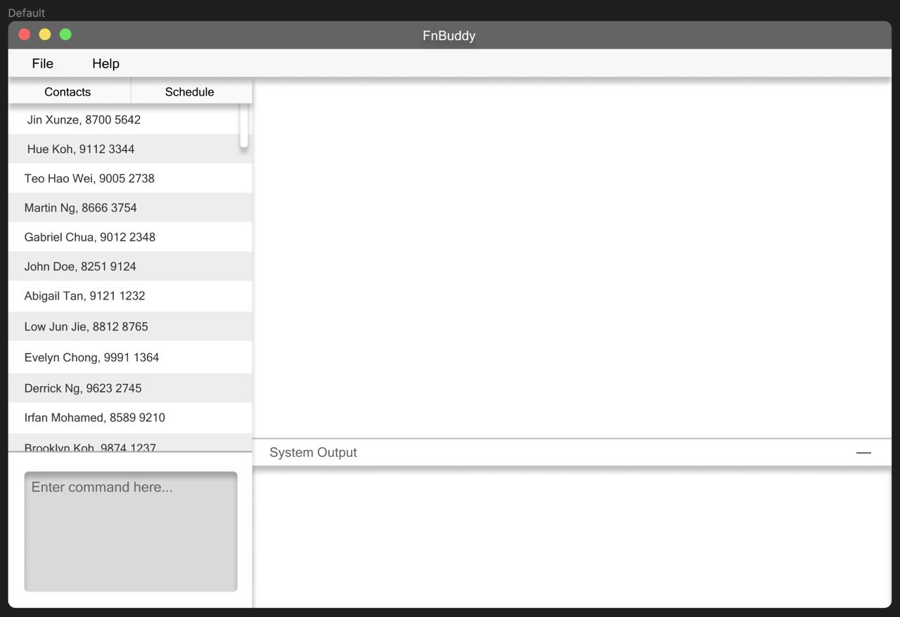
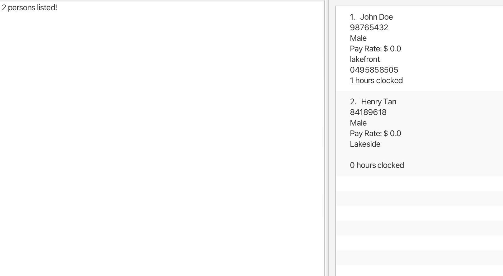

# FnBuddy User Guide

Welcome to the FnBuddy User Guide! This comprehensive guide is designed to help you navigate and utilise the FnBuddy part-time employee contact management application with ease. Whether you're a seasoned restaurant manager or new to the role, this guide will serve as your trusted companion, empowering you to streamline your operations and enhance your team management capabilities. FnBuddy can manage contacts optimised for use via a Command Line Interface (CLI) while still having the benefits of a Graphical User Interface (GUI). If you can type fast, FnBuddy can get your contact management tasks done faster than traditional GUI apps.

This user guide is tailored specifically for restaurant managers who are responsible for liaising with part-time employee records and managing their payroll. We assume that you have a basic understanding of using software applications and are familiar with common restaurant operations and terminology.

## Table of Contents

- [Introduction to FnBuddy](#introduction-to-fnbuddy)
- [Quick start](#quick-start)
- [Features](#features)
    - [Adding a person: `add`](#adding-a-person-add)
    - [Listing all persons: `list`](#listing-all-persons-list)
    - [Deleting a person: `delete`](#deleting-a-person-delete)
    - [Editing a person: `edit`](#editing-a-person-edit)
    - [Clocking an employee’s working hours: `hours`](#clocking-an-employees-working-hours-hours)
    - [Locating a person by name: `find`](#locating-a-person-by-name-find)
    - [Clear all contacts: `clear`](#clear-all-contacts-clear)
    - [Exiting the program: `exit`](#exiting-the-program-exit)
    - [Saving the data](#saving-the-data)
    - [Retrieving payroll: `payroll`](#retrieving-payroll-payroll)
    - [Schedule employees: `schedule`](#schedule-employees-schedule)
- [Known issues](#known-issues)
- [FAQ](#faq)
- [Command summary](#command-summary)

## Introduction to FnBuddy

The primary purpose of this user guide is to provide you with a comprehensive resource that will enable you to fully harness the capabilities of FnBuddy. Whether you need to create, view, update, or delete employee contacts, track working hours, assign roles, or simply navigate the application seamlessly, this guide will be your trusty companion, ensuring that you can effectively manage your team and streamline your restaurant's operations.

FnBuddy is an innovative employee contact management application designed specifically for restaurant managers. It offers a user-friendly interface (both CLI and GUI) that allows you to effortlessly create, manage, and maintain contact records for all your employees. With FnBuddy, you can store essential information such as contact details, banking information, and work schedules, ensuring efficient communication and accurate payroll calculations.

## Quick start

1. Ensure you have Java 11 or above installed on your Computer.
2. Download the latest fnbuddy.jar from [here](https://github.com/AY2324S2-CS2103T-T17-4/tp/releases/tag/v1.2).
3. Copy the file to the folder you want to use as the home folder for your FnBuddy.
4. Open a command terminal, cd (change directory) into the folder you put the jar file in, and use the `java -jar fnbuddy.jar` command to run the application.
5. A GUI similar to the one below should appear in a few seconds. Note how the app contains some sample data.

6. Type the command in the command box and press Enter to execute it. e.g., typing `help` and pressing Enter will open the help window.

Some example commands you can try:
- `add -fn Javier -ln Tan -p 98749874 -s m -pr 10.5 -a 123 Street -b 420053040` : Adds a contact named Javier Tan to FnBuddy.
- `list` : Lists all contacts.
- `delete 98749874` : Deletes the contact associated with the phone number 98749874 from FnBuddy.
- `view Javier Tan` : View Javier Tan’s contact and all associated information in the address book.
- `edit 91234567 -a NUS` : Edits the address of the contact associated with phone number 91234567 to NUS.
- `hours 91234567 50` : Saves the number of hours worked by the employee.
- `find james` : Searches the address book for a person whose name matches “james”.
- `clear` : Deletes all contacts.
- `exit` : Exits the app.

Refer to the [Features](#Features) section below for details of each command.

## Features

### ℹ️ Notes about the command format:

- Words in UPPER_CASE are the parameters to be supplied by the user. e.g., in `add -fn FIRST_NAME -ln LAST_NAME`, FIRST_NAME and LAST_NAME are parameters which can be used as `add -fn Javier -ln Tan`.
- Items in square brackets are optional. e.g., `-fn FIRST_NAME -ln LAST_NAME [-t TAG]` can be used as `-fn Javier -ln Tan -t/waiter` or as `-fn Javier -ln Tan`.
- Items with `…` after them can be used multiple times, including zero times. e.g., `[-t TAG]…` can be used as `-t cook -t waiter -t dishwasher`, etc.
- Parameters can be in any order. e.g., if the command specifies `-fn FIRST_NAME -ln LAST_NAME`, `-ln LAST_NAME -fn FIRST_NAME` is also acceptable.
- Extraneous parameters for commands that do not take in parameters (such as help, list, exit, and clear) will be ignored. e.g., if the command specifies `help 123`, it will be interpreted as `help`.
- If you are using a PDF version of this document, be careful when copying and pasting commands that span multiple lines, as space characters surrounding line-breaks may be omitted when copied over to the application.

### Adding a person `add`

Adds a person’s contact to FnBuddy.

Format: `add -fn FIRST_NAME -ln LAST_NAME -p PHONE_NUMBER -s SEX -pr PAY_RATE [-a ADDRESS] [-b BANK_DETAILS] [-t TAG]…`

Example:
- `add -fn John -ln Doe -p 91860934 -s m -pr 20.50 -a 123 Main St, City`
- `add -fn Jane -ln Smith -p 98765432 -s f -pr 25.50 -a 432 Orchard Road -b 123456789 -t waiter -t bartender`

### Listing all persons `list`

Shows a list of all persons in FnBuddy.

Format: `list`

### Deleting a person `delete`

Deletes the specified person from FnBuddy.

Format: `delete PHONE_NUMBER`

Example:
- `delete 91860934` deletes the person with the number 91860934 from FnBuddy.

### Editing a person `edit`

Edits an existing person in FnBuddy.

Format: `edit PHONE_NUMBER [-fn FIRST_NAME] [-ln LAST_NAME] [-p PHONE_NUMBER] [-s SEX] [-pr PAY_RATE] [-a ADDRESS] [-b BANK_DETAILS] [-t TAG]…`

Example:
- `edit 91860934 -a Room 504, Marina Bay Sands -pr 25` Edits the address of the person with the phone number 91860934 to Room 504 Marina Bay Sands, and their pay rate to 25 dollars per hour, respectively.
- `edit 98765432 -t` Clears all existing tags from the person with the phone number 98765432.

### Clocking an employee’s working hours `hours`

Saves the number of hours worked by an employee to FnBuddy.

Format: `hours PHONE_NUMBER HOURS_WORKED`

Example:
- `hours 12345678 50`

### Locating a person by name `find`

Finds persons whose names contain any of the given keywords.

Format: `find KEYWORD [MORE_KEYWORDS]`

Example:
- `find john tan` returns John Doe and Henry Tan.

### Clear all contacts `clear`

Delete all employee contacts.

Format: `clear`

**WARNING!** This action is permanent and non-reversible! Make sure that you want to clear FnBuddy before you execute the command.

### Exiting the program `exit`

Exits the program.

Format: `exit`

### Saving the data

FnBuddy data is stored in the hard disk automatically after any command that changes the data. Rest assured, there is no need to save manually.

### Retrieving payroll `payroll`

Coming soon!

### Schedule employees `schedule`

Coming soon!

## Known issues

1. When using multiple screens, if you move the application to a secondary screen and later switch to using only the primary screen, the GUI will open off-screen. The remedy is to delete the `preferences.json` file created by the application before running the application again.
   a. Alternatively, for Windows users, you can press Shift and right-click the program icon on the taskbar, Select Move, and use your left or right arrow keys to move the window until the window appears.

## FAQ

- **Q: How is the FnBuddy’s data stored?**
    - A: FnBuddy stores its data in a local file on your computer.
- **Q: I don’t understand the quick start guide
  . Can there be a more detailed guide?**
    - A: Here is a link to a more detailed quick start guide for non-tech-savvy users.

- **Q: I prefer clicking buttons to navigate applications. Will FnBuddy be upgrading its GUI to be friendlier to such users?**
    - A: As FnBuddy is purposefully targeted towards users who prefer typing, there are currently no plans to add features that support GUI interactions to replace the command-line style of the app.

- **Q: Is there any quick referral in the app itself for commands that I forget?**
    - A: Click on the help button at the top left of the application’s window for a commands list dropdown.

- **Q: Can I list down an employee with more than 2 names?**
    - A: As FnBuddy only supports the FIRST_NAME LAST_NAME format, the best solution currently is to list the middle name with either the first or the last. Example: Chua Xun Hao can be saved as -fn Xun Hao -ln Chua.

- **Q: My employee uses a foreign phone number, how can that be reflected in the app?**
    - A: FnBuddy does not currently support phone number region differentiation and only supports 8-digit inputs after the -p flag. In future updates, we will add contact regions as a feature.

- **Q: Do I need to provide all the details of an employee when creating the contact?**
    - A: No, optional details do not need to be added and can be edited into the contact later on if required. Refer to the add contact feature to view which details are compulsory and optional.

## Command summary

| Command | Description | Format | Examples |
|---------|-------------|--------|----------|
| **Adding a person** | Adds a person's contact to FnBuddy. | `add -fn FIRST_NAME -ln LAST_NAME -p PHONE_NUMBER -s SEX -pr PAY_RATE [-a ADDRESS] [-b BANK_DETAILS] [-t TAG]...` | `add -fn John -ln Doe -p 91860934 -s m -pr 20.50 -a 123 Main St City` `add -fn Jane -ln Smith -p 98765432 -s f -pr 25.50 -a 432 Orchard Road -b 123456789 -t waiter -t bartender` |
| **Listing all persons** | Shows a list of all persons in FnBuddy. | `list` | - |
| **Deleting a person** | Deletes the specified person from FnBuddy. | `delete PHONE_NUMBER` | `delete 91860934` |
| **Editing a person** | Edits an existing person in FnBuddy. | `edit PHONE_NUMBER [-fn FIRST_NAME] [-ln LAST_NAME] [-p PHONE_NUMBER] [-s SEX] [-pr PAY_RATE] [-a ADDRESS] [-b BANK_DETAILS] [-t TAG]...` | `edit 91860934 -a Room 504 Marina Bay Sands -pr 25` `edit 98765432 -t` |
| **Clocking an employee's working hours** | Saves the number of hours worked by an employee to FnBuddy. | `hours PHONE_NUMBER HOURS_WORKED` | `hours 12345678 50` |
| **Locating a person by name** | Finds persons whose names contain any of the given keywords. | `find KEYWORD [MORE_KEYWORDS]` | `find john tan` |
| **Clear all contacts** | Delete all employee contacts. | `clear` | - |
| **Exiting the program** | Exits the program. | `exit` | - |
