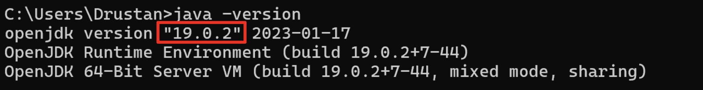
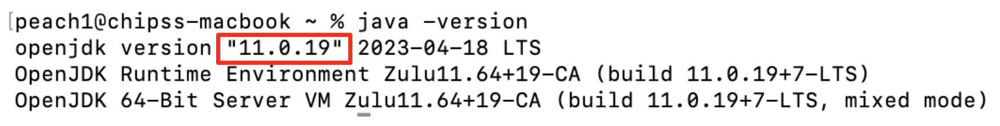

# ClinicMate User Guide

Welcome to ClinicMate, your efficient companion for managing contacts in a clinic! This user guide is designed to help you navigate ClinicMate effortlessly, whether you're a seasoned user or just getting started.

ClinicMate is a **desktop** app for managing contacts in a clinic, optimized for use via a  **Command Line Interface** (CLI) while still having the benefits of a Graphical User Interface (GUI). If you can type fast, ClinicMate can manage your patients' contact faster than traditional GUI apps.

Our target audience includes healthcare professionals and clinic staff who need a streamlined way to manage patient contacts. We assume that users have basic computer literacy and are familiar with using desktop applications.

<!-- * Table of Contents -->
<page-nav-print />

--------------------------------------------------------------------------------------------------------------------

## Quick start

### Prerequisites

1. Open Command Prompt (for Windows) or Terminal (for MacOS and Linux) on your desktop.
2. Run the command `java -version` to check if you have Java 11 or above installed in your computer.
* Assuming that you have Java installed in your computer,
  * If you have a Windows, in this case the Java version is 19.0.2.
       
  * If you have a Mac,  in this case the Java version is 11.0.19.
     
3. If you do not have Java 11 or above installed in your computer, download it from [here](https://www.oracle.com/java/technologies/javase-jdk11-downloads.html).

### Setting up
1. Download the latest `.jar` file [here](https://github.com/AY2324S2-CS2103T-F14-2/tp/releases/latest)
2. Copy the file to the folder you want to use as the _home folder_ for your ClinicMate.
   * e.g. if you want to use the `Documents` folder as the _home folder_ for your ClinicMate, create a new folder named `clinicmate` in the `Documents` folder.
   * You can then copy the `.jar` file to a folder named `clinicmate` in your `Documents` folder.
   

### Running the application
1. Open Command Prompt (for Windows) or Terminal (for MacOS and Linux) on your desktop.
2. Run the `cd` command into the folder you put the jar file in.
   * `cd` is the command to change directory.
   * e.g. `cd Documents/clinicmate`
3. Run the `java -jar clinicmate.jar` command to run the application. 
   A GUI similar to the below should appear in a few seconds. Note how the app contains some sample data. 
   

4. Type the command in the command box and press Enter to execute it. e.g. typing **`help`** and pressing Enter will open the help window. 
   Some example commands you can try:

   * `list` : Lists all contacts.

   * `add n/John Doe p/88888888 e/johndoe@mail.com i/T0123456A ag/12 s/Male a/John street, block 123, #01-01` : Adds a contact named `John Doe` to ClinicMate.

   * `delete T0123456A` : Deletes the contact with the IC 'T0123456A' shown in the current list.

   * `find T0123456A` : Find the contact with the IC 'T0123456A' shown in the current list.

   * `addnote T0123456A n/Patient has diabetes` : Add a note: 'Patient has diabetes' for the contact with the IC 'T0123456A' as shown in current list.
   
   * `addnote T0123456A n/Patient has diabetes -replace` : Replace the note of the contact with the IC 'T0123456A' with 'Patient has diabetes'.
   
   * `exit` : Exits the app.

5. Refer to the [Features](#features) below for details of each command.

--------------------------------------------------------------------------------------------------------------------

## Features

<box type="info" seamless>

**Notes about the command format:** 

* Words in `UPPER_CASE` are the parameters to be supplied by the user. 
  e.g. in `add n/NAME`, `NAME` is a parameter which can be used as `add n/John Doe`.

* Parameters can be in any order. 
  e.g. if the command specifies `n/NAME i/IC_NUMBER`, `i/IC_NUMBER n/NAME` is also acceptable.

* Extraneous parameters for commands that do not take in parameters (such as `help`, `list`, `exit` and `clear`) will be ignored. 
  e.g. if the command specifies `help 123`, it will be interpreted as `help`.

* If you are using a PDF version of this document, be careful when copying and pasting commands that span multiple lines as space characters surrounding line-breaks may be omitted when copied over to the application.
</box>

### Viewing help : `help`

Shows a message explaining how to access the help page.

Format: `help`

### Adding a person: `add`

Adds a person to ClinicMate.

Format: `add n/NAME p/PHONE e/EMAIL i/IC_NUMBER ag/AGE s/SEX a/ADDRESS`

* A person will be uniquely identified by his/her personal identification number.
* Clinic mate does not allow the same identification number to be twice.

<box type="tip" seamless>

**Tip:** A person can have a note included.
</box>

Examples:
* `add n/John Doe p/88888888 e/johndoe@mail.com i/T0123456A ag/12 s/Male a/John street, block 123, #01-01`

### Adding a note : `addnote`

Add a note to an existing person in CLinicMate.

Format: `addnote IC_NUMBER n/NOTE (-replace)`

* Adds a note to the person with the specified `IC_NUMBER`. The IC number refers to the IC number shown in the displayed person list. The IC_NUMBER **must be the FULL IC NUMBER**.
* IC number must be valid and currently exist in the database.
* Existing values will be updated to the input values.
* When adding notes, the new note added will be appended to the current note of the person. i.e. current note is preserved.
* The `-replace` flag can be used to replace the current note with the new note.

Examples:
*  `addnote T0123456A n/Patient has diabetes` Adds a note `Patient has diabetes` to the person with the IC number `T0123456A` in CLinicMate.
* `addnote T0123456A n/Patient has diabetes -replace` Replaces the note of the person with the IC number `T0123456A` with `Patient has diabetes`.

### Locating persons by ic number: `find`

Find an existing person in CinicMate using their IC_NUMBER.

Format: `find IC_NUMBER`

* Finds the person with the specified `IC_NUMBER`.
* The IC_NUMBER refers to the IC number shown in the displayed person list.
* The IC_NUMBER **must be the FULL IC NUMBER**.
* The search is case-insensitive. e.g `t0123456a` will match `T0123456A`.
* Only the IC number is searched.
* Only full IC number will be matched e.g. `T0123456A` will not match `T0123A`.

Examples:
* `find T0123456A` returns `John Doe`.

### Deleting a person : `delete`

Deletes the specified person from ClinicMate using their IC_NUMBER.

Format: `delete IC_NUMBER`

* Deletes the person with the specified `IC_NUMBER`.
* The IC_NUMBER refers to the IC number shown in the displayed person list.
* The IC_NUMBER **must be the FULL IC NUMBER**.
* The search is case-insensitive. e.g `t0123456a` will match `T0123456A`.
* Only the IC number is searched.
* Only full IC number will be matched e.g. `T0123456A` will not match `T0123A`.

Examples:
* `delete T0123456A` deletes `John Doe` who has `IC_NUMBER` of `T0123456A` from ClinicMate.

### Listing all entries : `list`

Lists all entries from the ClinicMate.

Format: `list`

### Clearing all entries : `clear`

Clears all entries from the ClinicMate.

Format: `clear`

### Exiting the program : `exit`

Exits the program.

Format: `exit`

### Saving the data

ClinicMate data are saved in the hard disk automatically after any command that changes the data. There is no need to save manually.

### Editing the data file

ClinicMate data are saved automatically as a JSON file `[JAR file location]/data/clinicmate.json`. Advanced users are welcome to update data directly by editing that data file.

<box type="warning" seamless>

**Caution:**
If your changes to the data file makes its format invalid, ClinicMate will discard all data and start with an empty data file at the next run.  Hence, it is recommended to take a backup of the file before editing it. 
Furthermore, certain edits can cause the ClinicMate to behave in unexpected ways (e.g., if a value entered is outside the acceptable range). Therefore, edit the data file only if you are confident that you can update it correctly.
</box>

### Archiving data files `[coming in v2.0]`

_Details coming soon ..._

--------------------------------------------------------------------------------------------------------------------

## FAQ

**Q**: How do I transfer my data to another Computer? 
**A**: Install the app in the other computer and overwrite the empty data file it creates with the file that contains the data of your previous CLinicMate home folder.

--------------------------------------------------------------------------------------------------------------------

## Known issues

1. **When using multiple screens**, if you move the application to a secondary screen, and later switch to using only the primary screen, the GUI will open off-screen. The remedy is to delete the `preferences.json` file created by the application before running the application again.

--------------------------------------------------------------------------------------------------------------------

## Command summary

Action     | Format, Examples
-----------|----------------------------------------------------------------------------------------------------------------------------------------------------------------------
**[Add](#adding-a-person-add)**    | `add n/NAME p/PHONE e/EMAIL i/IC_NUMBER ag/AGE s/SEX a/ADDRESS`   e.g., `add n/John Doe p/88888888 e/johndoe@mail.com i/T0123456A ag/12 s/Male a/John street, block 123, #01-01`
**[Clear](#clearing-all-entries--clear)**  | `clear`
**[Delete](#deleting-a-person--delete)** | `delete IC_NUMBER`  e.g., `delete T0123456A`
**[Add Note](#adding-a-note--addnote)** | `addnote IC_NUMBER n/NOTE (-replace)`  e.g., `addnote T0123456A n/Patient has diabetes`  e.g., `addnote T0123456A n/Patient has diabetes -replace`
**[Find](#locating-persons-by-ic-number-find)**   | `find IC_NUMBER`  e.g., `find T0123456A`
**[Help](#viewing-help--help)**   | `help`
**[List](#listing-all-entries--list)**   | `list`
**[Exit](#exiting-the-program--exit)**   | `exit`
