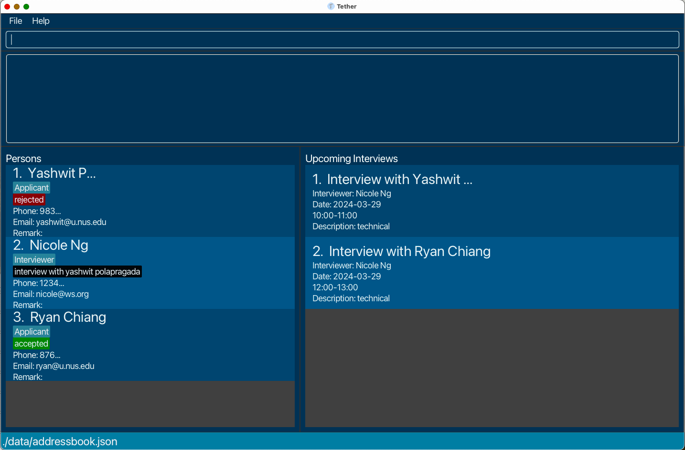
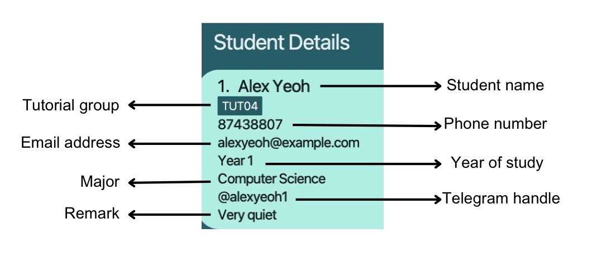
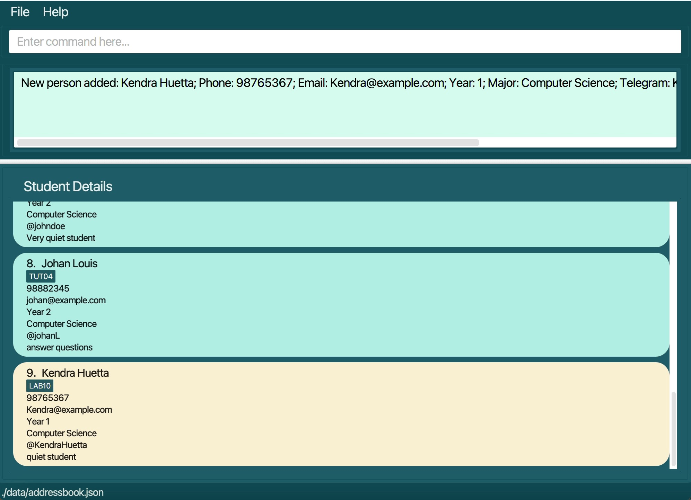
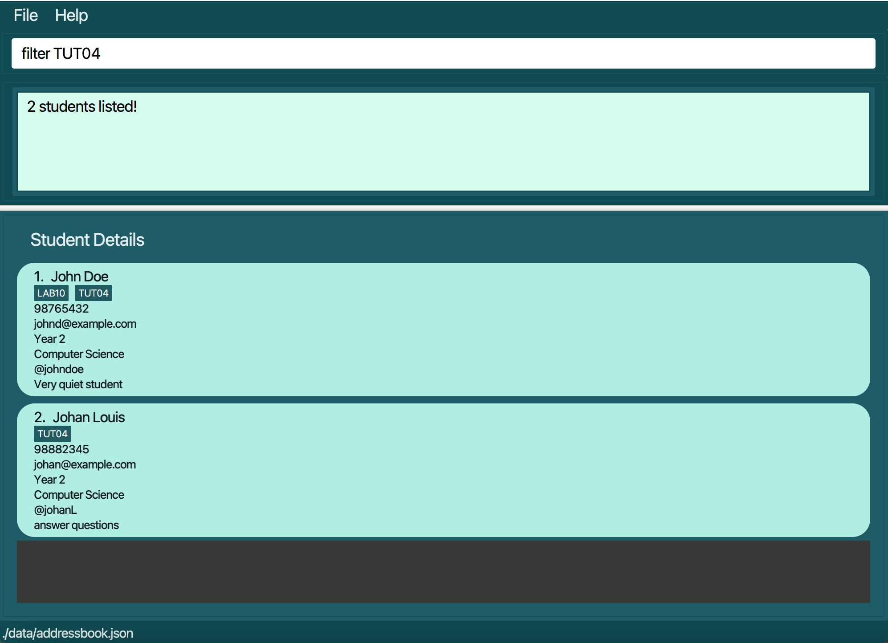
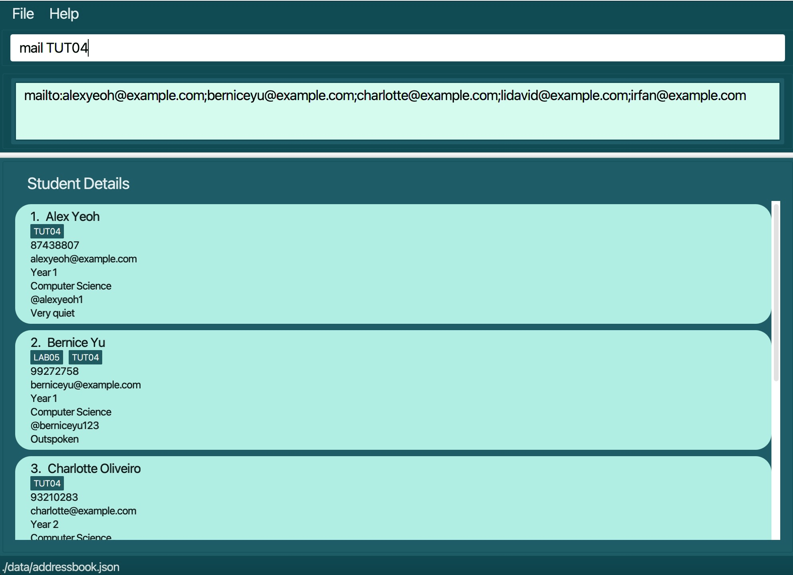

# Table of Contents
<!-- TOC -->
<page-nav-print />

## Quick Overview

* [Introduction ](#feature-introduction)

    * [About TutorsContactsPro ](#feature-about)

    * [About the User Guide](#feature-aboutUG)

    * [Navigating the User Guide ](#navigating-the-user-guide)

* [Getting Started](#feature-gettingStarted)

   * [Installing and Launching TutorsContactsPro ](#feature-install)

   * [Learning about TutorsContactsPro components](#feature-learn)

   * [Learning about TutorsContactsPro User Interface (UI)](#feature-ui)

   * [Quick Start](#feature-quickStart)

* [Features ](#feature-features)

* [Basic Commands](#feature-basicCommand)

  * [Viewing help: `help` ](#feature-help)

  * [Listing all students: `list` ](#feature-list)

  * [Clearing all entries: `clear`](#feature-clear)

  * [Exiting the program: `exit` ](#feature-exit)

* [Student Commands](#feature-studentCommand) 

  * [Adding a student: `add`](#feature-add)

  * [Editing a student: `edit`](#feature-edit)

  * [Locating students using keyword: `find`](#feature-find)

  * [Filtering students using group: `filter`](#feature-filter)

  * [Deleting a student: `delete`](#feature-delete)

* [Group Commands](#feature-groupCommand)

  * [Adding a group: `addgroup`](#feature-addgroup)

  * [Editing a group: `editgroup`](#feature-editgroup)

  * [Deleting a group: `deletegroup`](#feature-deletegroup)

  * [Generating mail: `mail`](#feature-mail)

* [FAQ](#feature-faq)

* [Known issues](#feature-issues)

* [Command Summary](#feature-summary)

* [Appendix A: Installing Java](#feature-appendix-a-installing-java)

--------------------------------------------------------------------------------------------------------------------
# <span id='feature-introduction'> Introduction <span>

# <span id='feature-about'> About TutorsContactsPro <span>

Unlock the full potential of your teaching journey with TutorsContactsPro, the ultimate desktop tool designed for **NUS tutors and teaching assistants in Computer Science courses**. 

Seamlessly navigate through student information with our intuitive blend of **Command Line Interface (CLI)** and **Graphical User Interface (GUI)**.

From effortless attendance tracking to personalized student profiles, TutorsContactsPro streamlines administrative tasks for maximum efficiency. 

Experience the future of teaching management today with TutorsContactsPro!


## <span id='feature-aboutUG'> About the User Guide <span>

This user guide aims to provide you with the information needed to get started with TutorsContactsPro.

Feel free to turn back to this user guide if you encounter any problems or doubts while using TutorsContactsPro. 

* If you are **new** to TutorsContactsPro, you may refer to the **[Navigating the User Guide](#navigating-the-user-guide)** section first, then to the **[Getting Started](#getting-started)** section to start installing and using TutorsContactsPro.

* If you would like to find out more about its **individual features**, you may refer to the **[Features](#feature-features)** section.

* If you are an **experienced user** and want to quickly refer to the various commands, you may refer to the **[Command Summary](#feature-summary)** section.

* If you would like to find out more about the **technical aspects of TutorsContactsPro**, you may refer to our **[Developer Guide](https://ay2324s2-cs2103t-W10-4.github.io/tp/DeveloperGuide.html)**.

* Finally, if you would like an **overview** of this entire user guide, you may refer to our **[Table of Contents](#table-of-contents)**.


## <span id='#navigating-the-user-guide'> Navigating the User Guide <span>
Throughout this user guide, the following symbols and keywords will be utilized for your convenience. 

| Icons/Syntax | Meaning                                    |
|--------------|--------------------------------------------|
| ℹ️           | Information that you should take note of   |
| 💡           | Useful advice and tips                     |
| ⚠️           | Warnings you should read before proceeding |


Below is the glossary for important technical terms that you may find useful. 

| Technical terms | Meaning                                                                                                                                                                      | 
|-----------------|------------------------------------------------------------------------------------------------------------------------------------------------------------------------------|
| CLI             | CLI stands for Command Line Interface. It is a text-based interface used for interacting with computer systems and executing commands by typing them into a terminal window. | 
| GUI             | GUI stands for Graphical User Interface, a visual way of interacting with computers using icons and menus instead of text commands.                                          | 
| Command         | Command refers to a directive or instruction given to a computer system to perform a specific task or function.                                                              |             
| GUI component   | GUI component refers to an element or part of a graphical user interface (GUI) that allows users to interact with the software application.                                  |

[Table Of Contents](#table-of-contents)

--------------------------------------------------------------------------------------------------------------------


# <span id='feature-gettingStarted'>  Getting Started <span>

## <span id='feature-install'> Installing and Launching TutorsContactsPro <span>

### Step 1: Install Java

Ensure you have Java `11` or above installed on your computer. If you don't have Java installed, follow the instructions in [Appendix A: Installing Java](#appendix-a-installing-java).

### Step 2: Download 

Download the latest `TutorsContactsPro.jar` from [here](https://github.com/se-edu/addressbook-level3/releases).

### Step 3: Set up TutorsContactsPro Home Folder

Copy or move the downloaded `TutorsContactsPro.jar` file to the folder you want to use as the _home folder_ for your TutorsContactsPro.

### Step 4: Launch TutorsContactsPro

1. Open a terminal (MacOS) or command prompt (Windows).

2. Navigate to the folder where you placed the `TutorsContactsPro.jar` file using the `cd` command. For example, John Doe has his `TutorsContactsPro.jar` file in `/Users/JohnDoe/Desktop/TutorsContactsPro`, so he'll run:

    ```bash
    cd /Users/JohnDoe/Desktop/TutorsContactsPro
    ```

3. Verify that your working directory contains `TutorsContactsPro.jar` by using the `ls` command. You should see `TutorsContactsPro.jar` in the list of files printed. Here's what our John Doe got when running this command.

    ```bash
    JohnDoe@johndoe TutorsContactsPro % ls
    TutorsContactsPro.jar
    ```
4. Once your terminal's working directory is the folder that contains `TutorsContactsPro.jar`, run the following command to launch TutorsContactsPro:

    ```bash 
    java -jar TutorsContactsPro.jar
    ```

   After executing this command, a graphical user interface (GUI) similar to the one below should appear shortly:

   


   Note: The application comes with some sample data for your reference.  

---

## <span id='feature-learn'> Learning about TutorsContactsPro components <span>

---

### Students
A 'Student' is an individual that you will store in TutorsContactsPro. 
It is an individual that attends one or more [`Groups`](#group) that you teach.
TutorsContactsPro allows you to store essential information or attributes about the student and remarks for them.

#### Attributes:

| Parameter         | Representation                        | Prefix | Constraints                                                                             |
|-------------------|---------------------------------------|--------|-----------------------------------------------------------------------------------------|
| `NAME`            | Name of the student                   | `n/`   | Auto-capitalization will be handled. Extra/trailing/leading spaces will be removed      |
| `PHONE_NUMBER`    | Phone number of the student           | `p/`   | Singapore phone number, 8 digits, without country code                                  |
| `EMAIL`           | Email of the student                  | `e/`   | Must be in email format `username`@`email`.com                                          |
| `YEAR`            | Academic Year of the student          | `y/`   | A number ranging from 1 - 6, inclusive                                                  |
| `MAJOR`           | Academic Major of the student contact | `m/`   | String to represent the major                                                           |
| `TELEGRAM_HANDLE` | Telegram handle of the student        | `tg/`  | Telegram handle format (a-z, 0-9 and underscores, case-insensitive), without prefix “@” |
| `REMARKS`         | Additional remarks of the student     | `r/`   | A case-sensitive string. This can be anything                                           |
| `GROUP`           | Tutorial/Lab/Recitation slot          | `g/`   | Must be in correct slot format `TUT/REC/LAB` + `2-digit number`                         |

### Group

A `Group` is a lesson that is taught by you and attended by students. 
It can be a tutorial/ recitation/ lab. 

#### Attributes:

| Parameter       | Representation             | Prefix | Constraints                                                  |
|-----------------|----------------------------|--------|--------------------------------------------------------------|
| `NAME`          | Name of the group          | `g/`   | Group name must begin with `TUT/REC/LAB` + `2-digit number`  |
| `TELEGRAM_LINK` | Telegram link of the group | `tg/`  | Must be a valid telegram group link                          |


## <span id='feature-ui'> Understanding the User Interface (UI) <span>
TutorsContactsPro's UI consists of 4 main parts that you will be using:

### Menu Bar
* In the menu bar, you can effortlessly exit TutorsContactsPro or access the help window with just a click of your mouse!
* Fear not if you are not well-versed in commands, the menu bar offers a beginner-friendly alternative to exit TutorsContactsPro or open the help window.

### Help:
Upon clicking help on the menu bar or by using the shortcut `F1`, you will be assisted with a help window pop-up. 
More is to be explained in [`help`](#feature-help) feature.

### Command Panel
* The command panel where you will input commands and receive their corresponding results.
* You can type in your command in the upper box.
* And use the lower box to view the results of those commands.

### Student Panel
* The Student panel is a panel that you can use to see the list of students stored in TutorsContactsPro.
* You can see student's name, phone number, year of student, major, email address, group, telegram handle and even whatever remarks that you have for each of them as needed!




## <span id='feature-start'> Quick start <span>
Type the command in the command box and press Enter to execute it. e.g. typing **`help`** and pressing Enter will open the help window.<br>
   Some example commands you can try:

   * [`list`](#feature-list) : Lists all students.

   * [`add n/John Doe p/98765432 e/johnd@example.com y/2 m/Computer Science tg/johndoe r/Very quiet student g/TUT04 g/LAB10 `](#feature-add) : Adds a student named `John Doe` to the list.
   
   * [`edit 1 p/93840823 y/3 tg/jiejfh203`](#feature-edit) : Edits the first student on the current list. 
   
   * [`find John Tan`](#feature-find) : Lists all the students with names that matches 'John' or 'Tan'.

   * [`filter TUT10`](#feature-filter) : Lists all the students in group 'TUT10'

   * [`addgroup g/TUT01`](#feature-addgroup) : Adds the group 'TUT01' to TutorsContactsPro.

   * [`editgroup g/TUT01`](#feature-editgroup) : Edits the group 'TUT01' in TutorsContactsPro.
   
   * [`deletegroup g/TUT01`](#feature-deletegroup) : Deletes the group 'TUT01' in TutorsContactsPro.
   
   * [`mail`](#feature-mail) : Generates a mail link to all the students on the list. 

   * [`delete 3`](#feature-delete) : Deletes the 3rd student shown in the current list.

   * [`clear`](#feature-clear) : Deletes all students on the list.
 
   * [`exit`](#feature-exit) : Exits the app.


5. Refer to the [Command Notes and Features](#features) below for details of each command.

[Table Of Contents](#table-of-contents)

--------------------------------------------------------------------------------------------------------------------

## <span id='feature-features'> Command Notes <span>

[//]: # (<box type="info" seamless>)

**Notes about the command format:**<br>

| Command format        | Representation                                                                                                                  | Examples                                                                                      |
|-----------------------|---------------------------------------------------------------------------------------------------------------------------------|-----------------------------------------------------------------------------------------------|
| `UPPER_CASE`          | Words in `UPPER_CASE` are the parameters to be supplied by the user                                                             | in `add n/NAME`, `NAME` is a parameter which can be used as `add n/John Doe`                  |
| square brackets `[]`  | Items in square brackets are optional                                                                                           | `n/NAME [g/Group]` can be used as `n/John Doe g/TUT` or as `n/John Doe`                       |
| `…`                   | Items with `…`​ after them can be used multiple times including zero times                                                      | `[g/GROUP]…​` can be used as `g/TUT03`, `g/LAB01`, `g/REC08` etc                              |
| Order                 | Parameters can be in any order                                                                                                  | if the command specifies `n/NAME p/PHONE_NUMBER`, `p/PHONE_NUMBER n/NAME` is also acceptable. |
| Extraneous parameters |  Extraneous parameters for commands that do not take in parameters (such as `help`, `list`, `exit` and `clear`) will be ignored | if the command specifies `help 123`, it will be interpreted as `help`                         |                                                                                                 | Singapore phone number, 8 digits, without country code                                        |


> **⚠️Warning:**
If you are using a PDF version of this document, be careful when copying and pasting commands that span multiple lines as space characters surrounding line-breaks may be omitted when copied over to the application. 
</box>

## <span id='feature-basicCommands'> Basic Commands <span>
This section contains the basic commands of TutorsContactsPro.


### <span id='feature-help'> Viewing help : `help` </span>

Allows you to easily access detailed information on how to use the different features in TutorsContactsPro. 


Format: `help`

### <span id='feature-list'> Listing all students : `list` </span>

Shows a list of all your students, so that you can conveniently view all their details.

Format: `list`

> 💡**Tips:**
Auto-capitalization will be handled. Extra/trailing/leading spaces will be removed


### <span id='feature-clear'> Clearing all entries : `clear` <span>

Clears all student entries from TutorsContactsPro, so that you can always start a fresh in the next teaching semester.

Format: `clear`

### <span id='feature-exit'> Exiting the program : `exit` <span>

Exits the program and your changes will be saved automatically.

Format: `exit`

## <span id='feature-studentCommands'> Student Commands <span>

This section contains commands for managing students in TutorsContactsPro.

### <span id='feature-add'> Adding a student: `add` </span>

You can add a student to the list, keeping track of all student details easily. 

Format: `add n/NAME p/PHONE_NUMBER e/EMAIL y/YEAR m/MAJOR tg/TELEGRAM_HANDLE [r/REMARK] [g/Group]`


Examples:
* `add n/John Doe p/98765432 e/johnd@example.com y/2 m/Computer Science tg/johndoe r/Very quiet student g/TUT04 g/LAB10 `
will add a student name John Doe, phone number 98765432, email address of johnd@example.com, year 2 Computer Science student, telegram handle of johndoe who is a very quiet student belonging to groups TUT04 and LAB10 to your student list.


* `add n/Kendra Huetta p/98765367 e/Kendra@example.com y/1 m/Computer Science tg/KendraHuetta r/quiet student g/LAB10 `
  will add a student name Kendra Huetta, phone number 98765367, email address of Kendra@example.com, year 1 Computer Science student, telegram handle of KendraHuetta who is a quiet student belonging to group LAB10 to your student list as shown  in the image below. 



### <span id='feature-edit'> Editing a student : `edit` <span>

Edits an existing student you have selected. This way, you can always keep student details recorded up to date!

Format: `edit INDEX [n/NAME] [p/PHONE_NUMBER] [e/EMAIL] [y/YEAR] [m/MAJOR] [tg/TELEGRAM_HANDLE] [r/REMARK] [g/Group]`

> ℹ️ **Information:** 
> * Edits the student at the specified `INDEX`. The index refers to the index number shown in the displayed student list. The index **must be a positive integer** 1, 2, 3, …​ 
> * At least one of the optional fields must be provided. 


> 💡**Tips:**
> * Existing values will be updated to the input values. <br>
> * When editing groups, the existing groups of the student will be removed i.e adding of groups is not cumulative. <br>
> * You can remove all the student’s groups by typing `g/` without specifying any groups after it. <br>
> * You can remove the remark of a student by typing `r/` without specifying any groups after it. <br>


Examples:
*  `edit 1 n/John e/john01@example.com` Edits the name of the first student to `John` and email to `john01@example.com` respectively.
*  `edit 2 n/Betty tg/` Edits the name of the 2nd student to be `Betty` and clears her telegram handle.

### <span id='feature-find'> Locating students by keyword: `find` <span>
Finds students whose details include any of the specified keywords. 
You can find a student even if the keywords **match only partially**.

Format: `find KEYWORD [MORE_KEYWORDS]`

> ℹ️ **Information:**
> * The search is case-insensitive. e.g `hans` will match `Hans`
> * The order of the keywords does not matter. e.g. `Hans Bo` will match `Bo Hans`
> * Only the student's name is searched.
> * Students matching at least one keyword will be returned (i.e. `OR` search).
  e.g. `Hans Bo` will return `Hans Gruber`, `Bo Yang`

Examples:
* `find John` returns students `john` and `John Doe`.
* `find Jo` returns students `John Doe` and `Johan Louis` as shown in the image below.
  


### <span id='feature-filter'> Filtering students using group: `filter` <span>

Filters and list students belonging to any of the given group name keyword.
You can filter students only when the keywords **match fully**.

Format: `filter KEYWORD [MORE_KEYWORDS]`

> ℹ️ **Information:**
> * The search is case-insensitive. e.g `hans` will match `Hans`
> * The order of the keywords does not matter. e.g. `Hans Bo` will match `Bo Hans`
> * Only student's group name is searched.
> * Students matching at least one keyword will be returned (i.e. `OR` search).
  e.g. `Hans Bo` will return `Hans Gruber`, `Bo Yang`

Examples:
* `filter LAB10` returns only `Kendra Huetta` belonging to group `LAB10`. 
* `filter TUT04 ` returns `John Doe` and `Johan Louis` belonging to group `TUT04` as shown in the image below. 

  


### <span id='feature-delete'> Deleting a student : `delete` <span>

Deletes your specified student from the current list.

Format: `delete INDEX`

> ℹ️ **Information:**
> * Deletes the student at the specified `INDEX`.
> * The index refers to the index number shown in the current displayed student list.
> * The index **must be a positive integer** 1, 2, 3, …​

Examples:
* `list` followed by `delete 2` deletes the 2nd student in the major book.
* `find Betsy` followed by `delete 1` deletes the 1st student in the results of the `find` command.

## <span id='feature-groupCommands'> Group Commands <span>

This section contains commands for managing groups in TutorsContactsPro.

### <span id='feature-addgroup'> Adding a group: `addgroup` <span>

You can add a new group to TutorsContactsPro, so that you can keep track of the groups you currently teach.

format: `addgroup g/[GROUP NAME]`

> ⚠️️ **Constraint:**
> * `GROUP_NAME` must be in the correct format of `TUT/REC/LAB` + `2-digit number`

> ℹ️ **Information:**
> * Adds a group with a given group name.
> * Group names are unique.


Examples:
* `addgroup g/LAB12` Adds the group `LAB12`
  

### <span id='feature-editgroup'> Adding a group: `editgroup` <span>

You can edit an existing group in TutorsContactsPro, so that you can remain up to date with each group's information.

Format: format: `addgroup g/[GROUP NAME] tg/[TELEGRAM INVITE LINK]`

> ⚠️️ **Constraint:**
> * `GROUP_NAME` must be in the correct format of `TUT/REC/LAB` + `2-digit number`
> * The invite link must be a valid Telegram group invite link

> ℹ️ **Information:**
> * Assigns a Telegram group invite link to a group with given group name.


Examples
* `editgroup g/LAB12 tg/https://t.me/abcdefg` Adds the specified link to group `LAB12`.
  

### <span id='feature-deletegroup'> Deleting a group: `deletegroup` <span>

You can delete an existing group in TutorsContactsPro, so that you can start a fresh for the next teaching semester.

format: `deletegroup g/[GROUP NAME]`

> ⚠️️ **Constraint:**
> * `GROUP_NAME` must be in the correct format of `TUT/REC/LAB` + `2-digit number`

Examples:
* `deletegroup g/LAB12` Deletes group `LAB12`.

### <span id='feature-mail'> Mail broadcast : `mail` <span>

You can conveniently generate a mail link with email addresses pre-filled based on specific keyword entered.

Format: `mail [KEYWORD]`

> ℹ️ **Information:**
> * a mail link is generated in the format of `mailto:` + `email address of each student recipient separated by;`
> * `[KEYWORD]` are based on student's group name
> * It requires a **full match** for the keyword 
> * `[KEYWORD]` is optional and when no `[KEYWORD]` is entered, email addresses of all students on the current list will be included
> * If `[KEYWORD]` is entered, only email addresses of students belonging to the group name that fully matches the `[KEYWORD]` will be included

Examples:
* `mail` generates a mail link with email addresses of all students on the current list. 
* `mail LAB05` generates a mail link with email addresses of all students belonging to `LAB05` which is in the format of `mailto:` + `email address of each student` as shown below.




### Saving the data

TutorsContactsPro data are saved in the hard disk automatically after any command that changes the data. There is no need to save manually.

### Editing the data file

TutorsContactsPro data are saved automatically as a JSON file `[JAR file location]/data/TutorsContactsPro.json`. Advanced users are welcome to update data directly by editing that data file.

[//]: # (<box type="warning" seamless>)

> **⚠️ Caution:**
If your changes to the data file makes its format invalid, TutorsContactsPro will discard all data and start with an empty data file at the next run.  Hence, it is recommended to take a backup of the file before editing it.<br>
Furthermore, certain edits can cause the TutorsContactsPro to behave in unexpected ways (e.g., if a value entered is outside the acceptable range). Therefore, edit the data file only if you are confident that you can update it correctly.
</box>

### Archiving data files `[coming in v2.0]`

_Details coming soon ..._

[Table Of Contents](#table-of-contents)

--------------------------------------------------------------------------------------------------------------------

## <span id='feature-faq'> FAQ <span>

**Q**: How do I transfer my data to another computer?<br>
**A**: Install the app in the other computer and overwrite the empty data file it creates with the file that contains the data of your previous TutorsContactsPro home folder.

[Table Of Contents](#table-of-contents)

--------------------------------------------------------------------------------------------------------------------

## <span id='feature-issues'> Known issues <span>

1. **When using multiple screens**, if you move the application to a secondary screen, and later switch to using only the primary screen, the GUI will open off-screen. The remedy is to delete the `preferences.json` file created by the application before running the application again.

[Table Of Contents](#table-of-contents)

--------------------------------------------------------------------------------------------------------------------

## <span id='feature-summary'> Command summary <span>

| Action          | Format, Examples                                                                                                                                                                                                   |
|-----------------|--------------------------------------------------------------------------------------------------------------------------------------------------------------------------------------------------------------------|
| **Help**        | `help`                                                                                                                                                                                                             |
| **List**        | `list`                                                                                                                                                                                                             |
| **Add**         | `add n/NAME p/PHONE e/EMAIL y/YEAR m/MAJOR tg/TELEGRAM [r/REMARK] [g/Group]...` <br> e.g., `add n/John Doe p/98765432 e/johnd@example.com y/2 m/Computer Science tg/johndoe r/Very quiet student g/TUT04 g/LAB10 ` |
| **Edit**        | `edit INDEX [n/NAME] [p/PHONE] [e/EMAIL] [y/NUMBER] [m/MAJOR] [tg/TELEGRAM] [r/REMARK] [g/Group]`<br> e.g., `edit 1 n/John e/john01@example.com`                                                                   |
| **Find**        | `find KEYWORD [MORE_KEYWORDS]`<br> e.g.,`find john tan`                                                                                                                                                            |
| **Filter**      | `filter KEYWORD [MORE_KEYWORDS]`<br> e.g.,`filter TUT01`                                                                                                                                                           |
| **Delete**      | `delete INDEX`<br> e.g., `delete 1`                                                                                                                                                                                |  
| **Addgroup**    | `addgroup g/GROUP_NAME`                                                                                                                                                                                            |
| **editgroup**   | `editgroup g/GROUP_NAME tg/TELEGRAM_LINK`                                                                                                                                                                          |
| **deletegroup** | `deletegroup g/GROUPNAME`                                                                                                                                                                                          |
| **Mail**        | `mail [KEYWORD]`<br> e.g., `mail TUT01`                                                                                                                                                                            |  
| **Clear**       | `clear`                                                                                                                                                                                                            |


[Table Of Contents](#table-of-contents)

--------------------------------------------------------------------------------------------------------------------

## <span id='feature-appendix-a-installing-java'> Appendix A: Installing Java <span>

Follow these steps to install Java on your computer:

1. **Download Java 11:**
- Download Java 11 from [Oracle's website](https://www.oracle.com/sg/java/technologies/javase/jdk11-archive-downloads.html) based on your operating system.

2. **Follow the instructions on Oracle's website**
    - Go to the appropriate guide page and follow the instructions based on your operating system to complete the installation.
        - [MacOS](https://docs.oracle.com/en/java/javase/11/install/installation-jdk-macos.html#GUID-2FE451B0-9572-4E38-A1A5-568B77B146DE)
        - [Windows](https://docs.oracle.com/en/java/javase/11/install/installation-jdk-microsoft-windows-platforms.html#GUID-A7E27B90-A28D-4237-9383-A58B416071CA)
        - [Linux](https://docs.oracle.com/en/java/javase/11/install/installation-jdk-linux-platforms.html#GUID-737A84E4-2EFF-4D38-8E60-3E29D1B884B8)

3. **Verify Installation:**
   After installation, open a terminal (on MacOS) or Command Prompt (on Windows) and run the following commands to verify that Java is installed:

  ```
   java -version
  ```
If installed correctly, you should see version information for both Java and the Java Compiler. The message should look something like this:
```
openjdk version "11.0.20" 2023-07-18 LTS
OpenJDK Runtime Environment Zulu11.66+15-CA (build 11.0.20+8-LTS)
OpenJDK 64-Bit Server VM Zulu11.66+15-CA (build 11.0.20+8-LTS, mixed mode)
```

Now, you're ready to proceed with the launching of TutorsContactsPro. Click [here](#feature-install) to get back to the installation tutorial.

[Table Of Contents](#table-of-contents)
