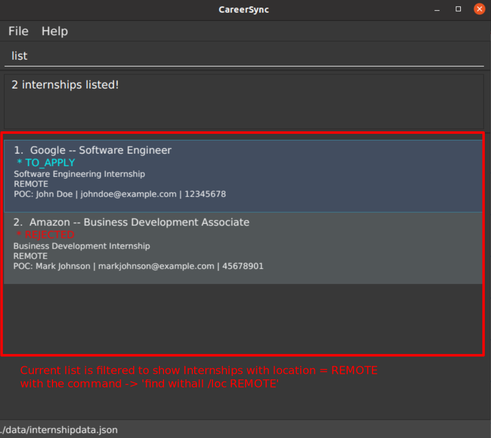
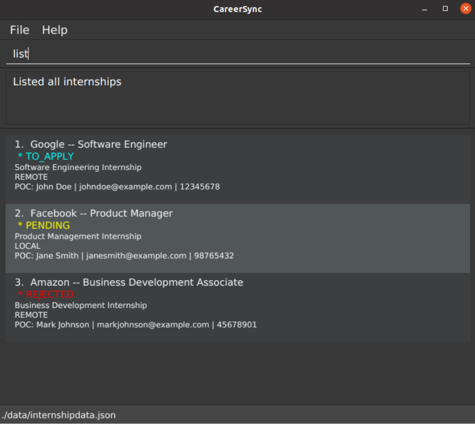
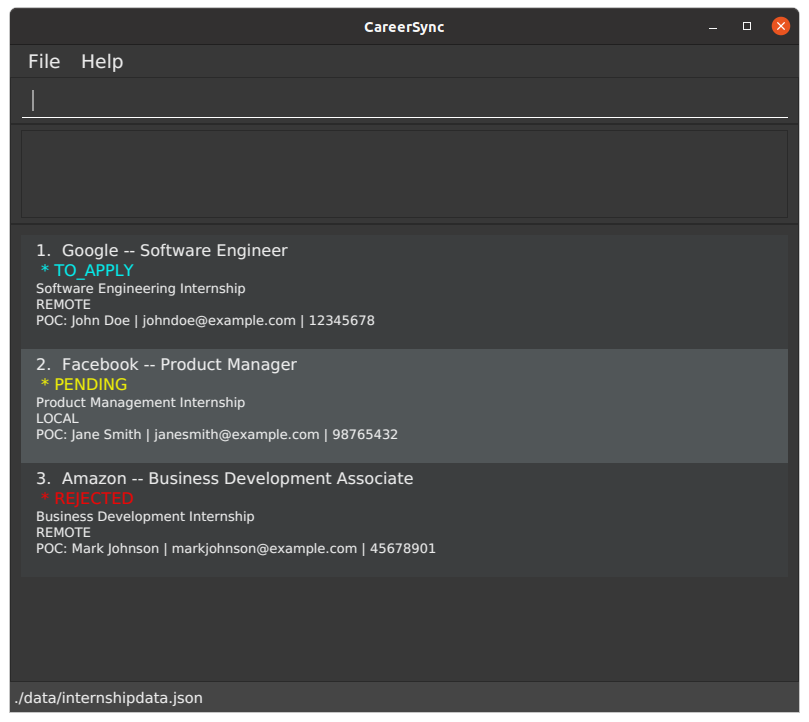
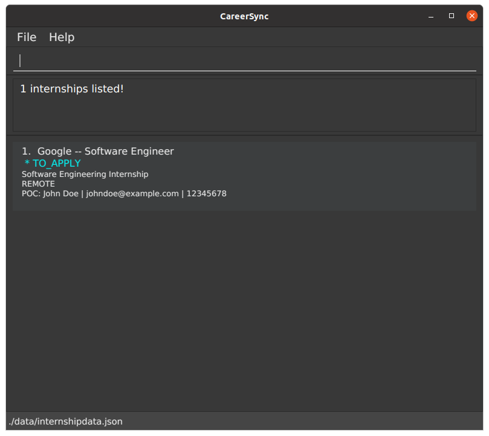
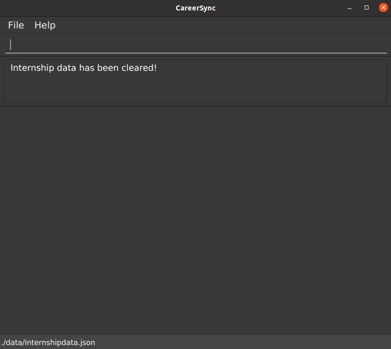

CareerSync is a **desktop app for managing internships, optimized for use via a Command Line Interface** (CLI).

CareerSync is an **internship application tracker** that helps you keep track of all your internship applications in one place.
 Record all the relevant information, such as contact details, application status, and tasks to-do for **all your internships** in one place.

If you are:
1. someone who is applying for many internships
2. someone who is looking for a way to keep track of all your internship applications
3. a Computer Science student
4. a fast typist

Then CareerSync is perfect just for you!

It lets you effortlessly manage, search, and sift through your various internship applications!

Primary features include:
- Add your internship applications in this app to keep track of them easily!
- See all the important details of your internship applications at a glance!
- Edit your application details to keep them up-to-date!
- Search for your internship applications by keywords easily!
- Keep track of your status for each individual internship application!
- Add remarks to your internship applications to remember important details!
- Add tasks to your internship applications to keep track of your progress! (to be added in v1.3)

If you are interested in using CareerSync, head over to the [Quick Start](#quick-start) section to get started!

### Table Of Contents

| Section                             | When Should I Use This?                                                 |
|-------------------------------------|-------------------------------------------------------------------------|
| [Quick Start](#quick-start)         | If you are using the application for the first time or need a refresher |
| [Features](#features)               | If you would like to know the capabilities of the application           |
| [FAQ](#faq)                         | If you have any questions about the application                         |
| [Known Issues](#known-issues)       | If you have a technical problem. We may have the solution!              |
| [Command Summary](#command-summary) | If you would like to find more information about a specific command     |

--------------------------------------------------------------------------------------------------------------------
## Quick Start

Start keeping track of your internships easily with CareerSync!

### Installation

1. Ensure that you have [Java 11 or above](https://www.java.com/en/download/) installed on your computer.
    - If you are a MacOS, follow the instructions [here](https://nus-cs2103-ay2324s2.github.io/website/admin/programmingLanguages.html) instead.
2. Download the latest `CareerSync.jar` file [here](https://github.com/AY2324S2-CS2103T-W11-1/tp/releases/tag/v1.2).
3. Make sure your jar file is located in an empty folder.
4. Start CareerSync.
    - For MacOS:
        - Open up your Terminal by typing <kbd>Command</kbd> + <kbd>Space</kbd>, then type <kbd>Enter</kbd>. 
        - Navigate to the folder containing your jar file using `cd`. If you are not sure how to use `cd`, refer to [this link](https://www.ibm.com/docs/en/aix/7.2?topic=directories-changing-another-directory-cd-command)! 
        - Enter `java -jar CareerSync.jar` and type <kbd>Enter</kbd>.
   - For Windows:
       - Open the folder containing `CareerSync.jar`.
       - Double-click on `CareerSync.jar` to start up our application!
5. The **Graphical User Interace** similar to the image below should pop up on your screen.

   

6. Try typing some of the following commands, then typing <kbd>Enter</kbd> to execute them.
   Some example commands you can try:

    * `list` : Lists all contacts.

   * `add /com Tiktok /desc create new recommendation engine /status ongoing /poc jane yeo /email hr@tiktok.com
      /phone 90890301 /loc remote /role Software Intern` : Adds this internship entry to the CareerSync application.

   * `delete 2` : Deletes the 2nd internship entry shown in the current displayed list.

   * `clear` : Deletes all contacts.

   * `exit` : Exits the app.

7. Refer to the [Features](#features) below for more details, and have fun using CareerSync!

--------------------------------------------------------------------------------------------------------------------

## Commands

**Notes about the command format** 

* Words in `UPPER_CASE` are the parameters to be supplied by the user. 
  e.g. in `add /com COMPANY_NAME`, `COMPANY_NAME` is a parameter which can be used as `add /com Google`.

* Items in square brackets are optional. 
  e.g `/com COMPANY_NAME [/poc NAME_OF_CONTACT]` can be used as `/com Alibaba /poc Jack Ma` or as `/com Alibaba`.

* Parameters can be in any order. 
  e.g. if the command specifies `/com COMPANY_NAME /desc DESCRIPTION`, `/desc DESCRIPTION /com COMPANY_NAME` is also acceptable.

* Extraneous parameters for commands that do not take in parameters (such as `help`, `list`, `exit` and `clear`) will be ignored. 
  e.g. if the command specifies `help 123`, it will be interpreted as `help`.

* If you are using a PDF version of this document, be careful when copying and pasting commands that span multiple lines
  as space characters surrounding line-breaks may be omitted when copied over to the application.

### Viewing help : `help`

Shows a message explaning how to access the help page.

Format: `help`

### Adding an entry: `add`

Adds an internship entry and all the relevant fields

Format: `add /com COMPANY_NAME /desc DESCRIPTION /status STATUS /poc CONTACT_NAME /email CONTACT_EMAIL /phone CONTACT_NUMBER /loc LOCATION_ENUM /role ROLE ​`

Examples:
* `add /com Tiktok /desc create new recommendation engine /status ongoing /poc jane yeo /email hr@tiktok.com
/phone 90890301 /loc remote /role Software Intern`

### Deleting an internship: `delete`

Deletes the internship entry with the corresponding index (based on the displayed list at point of deletion)

Format: `delete INDEX`

* Deletes the internship at the specified `INDEX`.
* The index refers to the index number shown in the displayed list of internship entries at point of deletion.
* The index **must be a positive integer** 1, 2, 3, …​

Examples:
* `list` followed by `delete 7` deletes the 7th entry in the internship entries list.
* `find withall /com Google` followed by `delete 1` deletes the 1st entry in the results of the `find` command.

### Listing all internships: `list`

Shows a list of all internships in the application.

**Format:** `list`

💡 **Tip:** 
When you first start the application, you will see a list of all the internships you have added.  
The [find](#finding-internships-by-keywords-find) command might be used to filter the visible list of internships.  
If you want to see all internships again, simply type `list` and press enter.
  

1. Input: 
   `list` 
   
In this example, the current view shows only internships with location 'REMOTE'.
  

2. Successful Output after executing list:  
   
Any present filter will be removed, and all internships will be displayed in the list.

### Viewing an internship entry's details

This feature is accessible by clicking on an internship entry in the internship list.
Click the back button to return to the previous view of internship entries.

Shows the full details of an internship entry. This replaces the current view of internship entries.

CLI input will be implemented in a future release.

### Editing an internship: `edit`

Edits an existing internship entry in the application.

Format: `edit INDEX [/com COMPANY_NAME] [/poc CONTACT_NAME] [/email CONTACT_EMAIL] [/phone CONTACT_NUMBER] [/loc LOCATION_ENUM] [/status STATUS] [/desc DESCRIPTION] [/role ROLE] …​`

* Edits the internship at the specified `INDEX`. The index refers to the index number shown in the displayed internship list. The index **must be a positive integer** 1, 2, 3, …​
* At least one of the optional fields must be provided. Multiple fields can be edited at once.
* Existing values will be updated to the input values.
* When editing status, only the valid statuses will be accepted. Not-valid statuses will cause the command to be rejected.

Examples:
*  `edit 1  /email nussu@u.nus.edu /number 9666 1666` Edits the email and phone number of the 1st internship to be `nussu@u.nus.edu` and `9666 1666` respectively.

### Adding a remark: `addremark`

Adds a remark to an existing internship in the application.

Format: `addremark INDEX [/remark REMARK]`

* Adds a remark or modifies the existing one, of an existing internship at the specified `INDEX`. The index refers to the index number shown in the displayed internship list. The index **must be a positive integer** 1, 2, 3, …​
* Existing remarks will be updated to the input values.

Examples:
*  `addremark 1 /remark This internship has a behavioural interview!` Adds or modifies the remark of the internship at index 1 to be `This internship has a behavioural interview!`.

### Finding internships by keywords: `find`

Finds internship entries whose specified fields contains the keywords.

**Format:** `find MODE [/com COMPANY_NAME_KEYWORDS] [/poc CONTACT_NAME_KEYWORDS] [/loc LOCATION_KEYWORDS] [/status STATUS_KEYWORDS] [/desc DESCRIPTION_KEYWORDS] [/role ROLE_KEYWORDS]`

* MODE is either 'withall' or 'withany'.
  * 'withall' returns internships that match each prefix-keyword predicate.
    * Within each prefix field, the Internship just has to contain any of the keywords.
  * 'withany' returns internships that match at least one prefix-keyword predicate.
* The search is case-insensitive. e.g `google` will match `Google`
* The order of the keywords does not matter. e.g. `Microsoft Google` will match `Google Microsoft`
* Only the name is searched.
* Only full words will be matched e.g. `Goo` will not match `Google`
* Internship matching at least one keyword will be returned (i.e. `OR` search).
  e.g. `Hewlett Song` will return `Hewlett Packard`, `Song Fa`

💡 **Try It Out:** 

1. Input: 
   `find withall /status to_apply /loc remote` 
     
This will filter the list of internships to show only those with both status `TO_APPLY` and location `REMOTE`.

2. Successful Output after filtering: 
     

3. Other examples: 
   i.`find withany /com Google /loc local` returns Internships with either company name (case-insensitive) `Google` or location `LOCAL` 
   ii.`find withall /poc John /desc paperwork` returns Internships with both contact name (case-insensitive) `John` and description containing `paperwork`

**Common errors:**
1. If no field prefixes are specified to search by, the command will be rejected with error message: 
`At least one field prefix and keyword must be specified to be searched.`
2. MODE must be present, and be either `withall` or `withany`. If not, the command will be rejected with error message: 
`Invalid mode specified. Please specify either 'withall' or 'withany'.`

### Clearing all internships: `clear`

Clears all entries from the application.

**Format:** `clear`

💡 **Try It Out:** 

1. Input: 
   `clear` 
     

2. Successful Output after clearing entries: 
   
There are no more internships in the list.

### Exiting the program: `exit`

Exits the program.

Format: `exit`

### Saving and Editing Your Internship Data

⚠️ Caution:
Users are **NOT** recommended to modify their data file directly, since wrong formatting will cause the app to malfunction.
Only do so if you are an experienced user!  

CareerSync data is saved in the hard disk, as a JSON file at the path `[JAR file location]/data/internship.json`.
After every command that changes the data, CareerSync performs a save automatically. There is no need to save manually.

--------------------------------------------------------------------------------------------------------------------

## FAQ

**Q**: How do I transfer my data to another Computer? 
**A**: Install the app in the other computer and overwrite the empty data file it creates with the file that contains the data of your previous CareerSync home folder.

--------------------------------------------------------------------------------------------------------------------

## Known issues

1. **When using multiple screens**, if you move the application to a secondary screen, and later switch to using only the primary screen, the GUI will open off-screen. 
**The solution** is to delete the `preferences.json` file from the folder where you installed the application. Then, run the application again.

--------------------------------------------------------------------------------------------------------------------

## Command summary

| Action                                        | Description                              |
|-----------------------------------------------|------------------------------------------|
| [add](#adding-an-entry-add)                   | Adds an Internship.                      |
| [delete](#deleting-an-internship-delete)      | Removes a Internship.                    |
| [list](#listing-all-internships-list)         | Removes a Internship.                    |
| [edit](#editing-an-internship-edit)           | Modifies an existing Internship.         |
| [addremark](#adding-a-remark-addremark)       | Adds a remark to an existing Internship. |
| [clear](#clearing-all-internships-clear)      | Removes all Internships from the deck.   |
| [find](#finding-internships-by-keywords-find) | Finds an Internship by keywords.         |
| [exit](#exiting-the-program-exit)             | Exits and closes the application.        |
