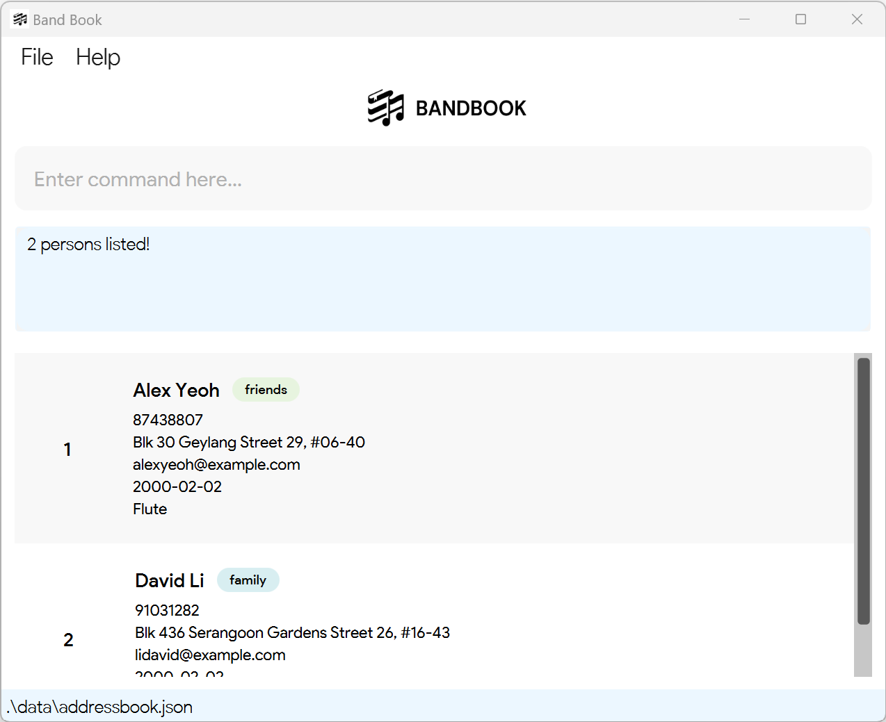

# CLInic User Guide

CLInic is a **desktop app for managing patients and appointments, optimized for use via a  Line Interface** (CLI) while still having the benefits of a Graphical User Interface (GUI). If you can type fast, CLInic can get your patient management tasks done faster than traditional GUI apps.

<!-- * Table of Contents -->
<page-nav-print />

--------------------------------------------------------------------------------------------------------------------

## Quick start

1. Ensure you have Java `11` or above installed in your Computer.

1. Download the latest `addressbook.jar` from [here](https://github.com/se-edu/addressbook-level3/releases).

1. Copy the file to the folder you want to use as the _home folder_ for your AddressBook.

1. Open a command terminal, `cd` into the folder you put the jar file in, and use the `java -jar addressbook.jar` command to run the application. 
   A GUI similar to the below should appear in a few seconds. Note how the app contains some sample data. 
   

1. Type the command in the command box and press Enter to execute it. e.g. typing **`help`** and pressing Enter will open the help window. 
   Some example commands you can try:

   * `list` : Lists all contacts.

   * `add n/John Doe i/T0123456A b/2001-05-02 p/98765432 e/johnd@example.com a/John street, block 123, #01-01` : Adds a contact named `John Doe` to the Address Book.

   * `delete T0123456A` : Deletes patient with NRIC T0123456A and corresponding appointments.

   * `clear` : Deletes all contacts.

   * `exit` : Exits the app.

1. Refer to the [Features](#features) below for details of each command.

--------------------------------------------------------------------------------------------------------------------

## Features

<box type="info" seamless>

**Notes about the command format:** 

* Words in `UPPER_CASE` are the parameters to be supplied by the user. 
  e.g. in `add n/NAME`, `NAME` is a parameter which can be used as `add n/John Doe`.

* Items in square brackets are optional. 
  e.g `n/NAME [t/TAG]` can be used as `n/John Doe t/friend` or as `n/John Doe`.

* Items with `…`​ after them can be used multiple times including zero times. 
  e.g. `[t/TAG]…​` can be used as ` ` (i.e. 0 times), `t/friend`, `t/friend t/family` etc.

* Parameters can be in any order. 
  e.g. if the command specifies `n/NAME p/PHONE_NUMBER`, `p/PHONE_NUMBER n/NAME` is also acceptable.

* Extraneous parameters for commands that do not take in parameters (such as `help`, `list`, `exit` and `clear`) will be ignored. 
  e.g. if the command specifies `help 123`, it will be interpreted as `help`.

* If you are using a PDF version of this document, be careful when copying and pasting commands that span multiple lines as space characters surrounding line-breaks may be omitted when copied over to the application.
</box>

### Viewing help : `help`

Shows a message explaning how to access the help page.

Format: `help`

### Adding a patient: `addPatient`

Adds a patient to the address book.

Format: `addPatient n/NAME i/NRIC b/DOB p/PHONE_NUMBER e/EMAIL a/ADDRESS [t/TAG]…​`

<box type="tip" seamless>

**Tip:** A patient can have any number of tags (including 0)
</box>

Examples:
* `addPatient n/John Doe i/T0123456A b/2001-05-02 p/98765432 e/johnd@example.com a/John street, block 123, #01-01`
* `addPatient n/Betsy Crowe i/S1234567A b/2001-02-03 t/friend e/betsycrowe@example.com a/Newgate Prison p/1234567 t/criminal`

### Listing all patients : `list`

Shows a list of all patients in the address book.

Format: `list`

### Editing a patient : `editPatient`

Edits an existing patient in the address book.

Format: `editPatient NRIC [b/DOB] [n/NAME] [p/PHONE] [e/EMAIL] [a/ADDRESS] [t/TAG]…​`

* Edits the patient with the specified `NRIC`. The NRIC must be valid and must exist in the system.
* At least one of the optional fields must be provided.
* Existing values will be updated to the input values.
* When editing tags, the existing tags of the patient will be removed i.e adding of tags is not cumulative.
* You can remove all the patient’s tags by typing `t/` without
    specifying any tags after it.

Examples:
*  `editPatient T0123456A p/91234567 e/johndoe@example.com` Edits the phone number and email address of the patient with NRIC:`T0123456A` to be `91234567` and `johndoe@example.com` respectively.
*  `editPatient S8765432Z n/Betsy Crower t/` Edits the name of the patient with NRIC:`S8765432Z` to be `Betsy Crower` and clears all existing tags.

### Locating patients by name or nric: `findPatient`

Finds patients whose names contain any of the given keywords OR nric contain the given keyword.

Format: `findPatient n/ KEYWORD [MORE_KEYWORDS]` OR `findPatient i/ KEYWORD`

* The search is case-insensitive. e.g `hans` will match `Hans`
* The order of the keywords does not matter. e.g. `Hans Bo` will match `Bo Hans`
* Only the name OR nric is searched at once. e.g. `n/ Bob i/ T0123456A` is illegal
* Partial words will be matched only if the start of the word is the same e.g. `Han` will match `Hans`
* For name search: patients matching at least one keyword will be returned (i.e. `OR` search).
  e.g. `n/ Hans Bo` will return `Hans Gruber`, `Bo Yang`
* For nric search: patients matching the given keyword will be returned.
  e.g. `n/ T0` will return `T0123456A`, `T0234567B`
  e.g. `n/ T01 T012` will NOT return `T0123456A` as the given keyword is `T01 T012`

Examples:
* `findPatient i/ S9` returns patients with Nrics `S9876543A` and `S9765432A`
* `findPatient n/ John` returns patients with names `john` and `John Doe`
* `findPatient n/ alex david` returns patients with names `Alex Yeoh`, `David Li` 
  

### Deleting a patient : `deletePatient`

Deletes the specified patient (identified by NRIC) from the address book.
Corresponding appointments for the specified patient will be deleted too.

Format: `deletePatient NRIC`

* Deletes the patient with specified `NRIC`.
* The NRIC **must exist within database**.

Examples:
* `delete S1234567A` deletes the patient with NRIC S1234567A in CLInic.

### Adding an Appointment: `addAppt`

Adds an appointment to the address book.

Format: `addAppt i/NRIC d/DATE from/START_TIME to/END_TIME t/APPOINTMENT_TYPE [note/NOTE]`

* Adds an appointment for the patient with specified `NRIC`, on `DATE` from `START_TIME` to `END_TIME`
* Patient with this NRIC **must exist within database**.
* Details of `APPOINTMENT_TYPE` and `NOTE` will be captured for reference
* `note/` is an optional field

Examples:
* `addAppt i/ T0123456A d/ 2024-02-20 from/ 11:00 to/ 11:30 t/ Medical Check-up note/ Routine check-in`
* `addAppt i/ S1234567A d/ 2024-02-20 from/ 15:00 to/ 15:30 t/ Blood Test note/ Follow-up from last consultation`

### Deleting an Appointment: `deleteAppt`

Cancels an appointment from the address book.

Format: `deleteAppt i/NRIC d/DATE from/START_TIME to/END_TIME`

* Deletes an appointment for the patient with specified `NRIC`, on `DATE` from `START_TIME` to `END_TIME`
* Appointment with the following details **must exist within database**.

Examples:
* `deleteAppt i/ S8743880A d/ 2024-02-20 from/ 11:00 to/ 11:30`

### Finding appointments: `findAppt`

Finds appointments based on the given parameters.

Format: `findAppt [i/NRIC] [d/DATE] [from/START_TIME]`

* Filters an appointment with specific `NRIC`, `DATE` or `START_TIME`
* If invalid parameters, error detailing what went wrong will be displayed.
* For argument concerning TIME, all appointments that start at the given time and later than that are returned.
* Fetching for TIME without DATE will return all appointments whose start time >= that time on any date.

### Clearing all entries : `clear`

Clears all entries from CLInic.

Format: `clear`

### Exiting the program : `exit`

Exits the program.

Format: `exit`

### Saving the data

AddressBook data are saved in the hard disk automatically after any command that changes the data. There is no need to save manually.

### Editing the data file

AddressBook data are saved automatically as a JSON file `[JAR file location]/data/addressbook.json`. Advanced users are welcome to update data directly by editing that data file.

<box type="warning" seamless>

**Caution:**
If your changes to the data file makes its format invalid, AddressBook will discard all data and start with an empty data file at the next run.  Hence, it is recommended to take a backup of the file before editing it. 
Furthermore, certain edits can cause the AddressBook to behave in unexpected ways (e.g., if a value entered is outside the acceptable range). Therefore, edit the data file only if you are confident that you can update it correctly.
</box>

### Archiving data files `[coming in v2.0]`

_Details coming soon ..._

--------------------------------------------------------------------------------------------------------------------

## FAQ

**Q**: How do I transfer my data to another Computer? 
**A**: Install the app in the other computer and overwrite the empty data file it creates with the file that contains the data of your previous AddressBook home folder.

--------------------------------------------------------------------------------------------------------------------

## Known issues

1. **When using multiple screens**, if you move the application to a secondary screen, and later switch to using only the primary screen, the GUI will open off-screen. The remedy is to delete the `preferences.json` file created by the application before running the application again.

--------------------------------------------------------------------------------------------------------------------

## Command summary

Action     | Format, Examples
-----------|----------------------------------------------------------------------------------------------------------------------------------------------------------------------
**AddPatient**    | `addPatient n/NAME i/NRIC b/DOB p/PHONE_NUMBER e/EMAIL a/ADDRESS [t/TAG]…​`   e.g., `addPatient n/John Doe i/T0123456A b/2001-05-02 p/98765432 e/johnd@example.com a/John street, block 123, #01-01`
**Clear**  | `clear`
**DeletePatient** | `deletePatient NRIC`  e.g., `deletePatient T0123456A`
**AddAppt** | `addAppt i/NRIC d/DATE from/START_TIME to/END_TIME t/APPOINTMENT_TYPE note/NOTE`  e.g., `addAppt i/ T0123456A d/ 2024-02-20 from/ 11:00 to/ 11:30 t/ Medical Check-up note/ Routine check-in`
**DeleteAppt** | `deleteAppt i/NRIC d/DATE from/START_TIME to/END_TIME`   e.g., `deleteAppt i/ S8743880A d/ 2024-02-20 from/ 11:00 to/ 11:30`
**EditPatient**   | `editPatient NRIC [n/NAME] [p/PHONE_NUMBER] [e/EMAIL] [a/ADDRESS] [t/TAG]…​`  e.g.,`editPatient T0123456A n/James Lee e/jameslee@example.com`
**FindAppt**| `findAppt [i/NRIC] [d/DATE] [from/START_TIME]`   e.g., `findAppt i/ T0123456A d/ 2024-02-20 from/ 11:00`
**FindPatient**   | `findPatient n/ KEYWORD [MORE_KEYWORDS]` OR `findPatient i/ KEYWORD`  e.g., `findPatient n/ James Jake`
**List**   | `list`
**Help**   | `help`
