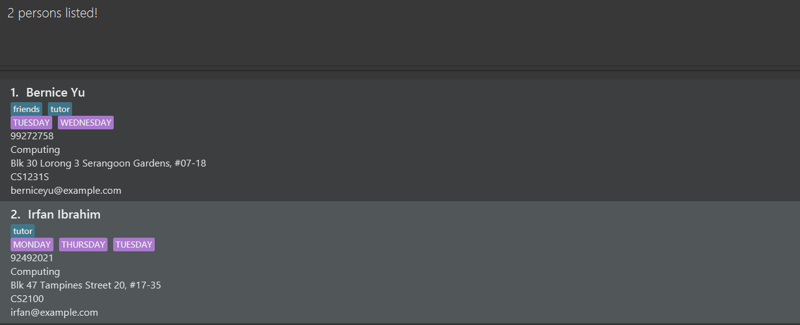
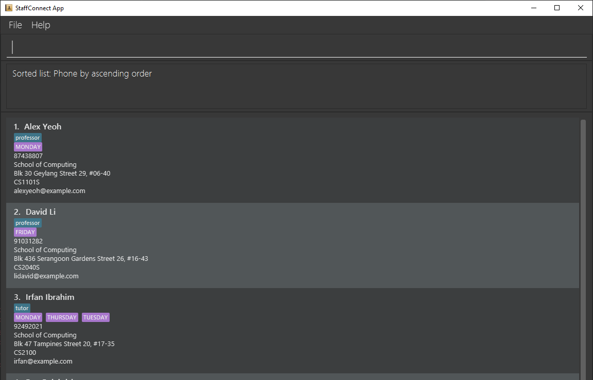
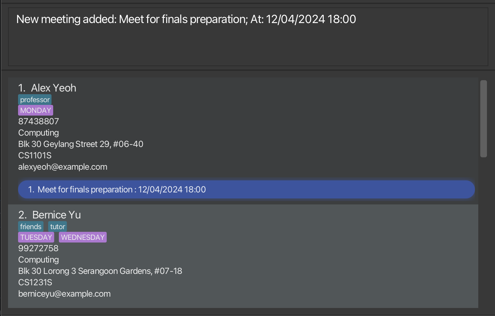

StaffConnect (SC) is a **desktop app for managing contacts of Professors and Tutors, optimized for use via a Command Line Interface** (CLI) while still having the benefits of a Graphical User Interface (GUI). If you can type fast, SC can get your contact management tasks done faster than traditional GUI apps.

* Table of Contents 
{:toc}

--------------------------------------------------------------------------------------------------------------------

## Quick start

1. Ensure you have Java `11` or above installed in your Computer. 

2. Download the latest `StaffConnect.jar` from [here](https://github.com/AY2324S2-CS2103-F08-3/tp/).

3. Copy the file to the folder you want to use as the _home folder_ for your StaffConnect application.

4. Open a command terminal, `cd` into the folder you put the jar file in, and use the `java -jar StaffConnect.jar` command to run the application. 
   A GUI similar to the below should appear in a few seconds. Note how the app contains some sample data. 
   

5. Type the command in the command box and press Enter to execute it. e.g. typing **`help`** and pressing Enter will open the help window. 
   Some example commands you can try:

    * `list` : Lists all contacts.

    * `add n/John Doe p/98765432 e/johnd@example.com m/CS2103 f/Computing v/John street, block 123, #01-01` : Adds a contact named `John Doe` to the contacts list.

    * `delete 3` : Deletes the 3rd contact shown in the current list.

    * `clear` : Deletes all contacts.

    * `exit` : Exits the app.

6. Refer to the [Features](#features) below for details of each command.

--------------------------------------------------------------------------------------------------------------------

## Features

**:information_source: Notes about the command format:** 

* Words in `UPPER_CASE` are the parameters to be supplied by the user. 
  e.g. in `add n/NAME`, `NAME` is a parameter which can be used as `add n/John Doe`.

* Items in square brackets are optional. 
  e.g `n/NAME [t/TAG]` can be used as `n/John Doe t/friend` or as `n/John Doe`.

* Items with `…`​ after them can be used multiple times including zero times. 
  e.g. `[t/TAG]…​` can be used as ` ` (i.e. 0 times), `t/friend`, `t/friend t/family` etc.

* Parameters can be in any order. 
  e.g. if the command specifies `n/NAME p/PHONE_NUMBER`, `p/PHONE_NUMBER n/NAME` is also acceptable.

* Extraneous parameters for commands that do not take in parameters (such as `help`, `list`, `exit` and `clear`) will be ignored. 
  e.g. if the command specifies `help 123`, it will be interpreted as `help`.

* If you are using a PDF version of this document, be careful when copying and pasting commands that span multiple lines as space characters surrounding line-breaks may be omitted when copied over to the application.

### Viewing help : `help`

Shows a message explaining how to access the help page.

Format: `help`

### Adding a person: `add`

Adds a person to the contacts.

Format: `add n/NAME p/PHONE_NUMBER e/EMAIL m/MODULE f/FACULTY v/VENUE [t/TAG]…​ [a/AVAILABILITY]…​`

:bulb: **Tip:**
A person can have any number of tags and availabilities (including 0)

Examples:
* `add n/John Doe p/98765432 e/johnd@example.com f/Computing v/John street, block 123, #01-01 m/CS2103`
* `add n/Betsy Crowe t/friend m/CS2103T e/betsycrowe@example.com f/Computing v/Newgate Prison p/1234567 t/criminal a/monday 11:00 12:00 a/wednesday 14:00 16:00`

### Listing all persons : `list`

Shows a list of all persons in the contacts.

Format: `list`

### Editing a person : `edit`

Edits an existing person in the contacts.

Format: `edit INDEX [n/NAME] [p/PHONE] [e/EMAIL] [m/MODULE] [f/FACULTY] [v/VENUE] [t/TAG]…​ [a/AVAILABILITY]…​`

* Edits the person at the specified `INDEX`. The index refers to the index number shown in the displayed person list. The index **must be a positive integer** 1, 2, 3, …​
* At least one of the optional fields must be provided.
* Existing values will be updated to the input values.
* When editing tags, the existing tags of the person will be removed i.e adding of tags is not cumulative.
* You can remove all the person’s tags by typing `t/` without
    specifying any tags after it.
* When editing availabilities, the existing availabilites of the person will be removed i.e adding of availabilities is not cumulative.
* You can remove all the person’s availabilities by typing `a/` without
  specifying any availabilities after it.

Examples:
*  `edit 1 p/91234567 e/johndoe@example.com` Edits the phone number and email address of the 1st person to be `91234567` and `johndoe@example.com` respectively.
*  `edit 2 n/Betsy Crower t/` Edits the name of the 2nd person to be `Betsy Crower` and clears all existing tags.

### Filtering persons by attribute: `filter`

Filters persons whose module, faculty or tags match the given filtering criteria.

format: `filter [m/MODULE] [f/FACULTY] [t/TAG]…`

* At least one of the optional fields must be provided.
* Only module, faculty and tags can be filtered.
* The filter is case-sensitive for modules. e.g `hsi1000` is an invalid module value
* The filter only accepts a single module to filter from.
* The filter only accepts valid values for faculty. e.g `school of business` is an invalid faculty value.
* The filter only accepts a single faculty to filter from.
* The filter is case-insensitive for tags. e.g `tUTOR` will match `tutor`
* The filter accepts single or multiple tags to filter from.
* Persons matching all fields will be returned (i.e. `AND` search).
  e.g. `filter m/CS2030S f/Computing` will return `Charlotte Oliveiro`

Examples:
* `filter m/CS1101S` returns `Alex Yeoh`
* `filter t/tutor` returns `Bernice Yu`, `Irfan Ibrahim` 
  

### Locating persons by name: `find`

Finds persons whose names contain any of the given keywords.

Format: `find KEYWORD [MORE_KEYWORDS]`

* The search is case-insensitive. e.g `hans` will match `Hans`
* The order of the keywords does not matter. e.g. `Hans Bo` will match `Bo Hans`
* Only the name is searched.
* Only full words will be matched e.g. `Han` will not match `Hans`
* Persons matching at least one keyword will be returned (i.e. `OR` search).
  e.g. `Hans Bo` will return `Hans Gruber`, `Bo Yang`

Examples:
* `find John` returns `john` and `John Doe`
* `find alex david` returns `Alex Yeoh`, `David Li` 
  

### Sorting persons by attribute: `sort`

Sorts the list of persons based on specified attribute.

Format: `sort [ATTRIBUTE]`

* By default, sorting is done in alphanumeric order.
* The order of character priority would be letters (A-Z), numbers (0-9), special characters (!@#$%^&*).
* The capitalisation of the letters do not affect their priority such that `Aaron` will have same priority as `aaron`.
* For attribute with exact same values, the tie-breaker is determined by their added order.
* `[ATTRIBUTE]` is to be noted by their prefix. e.g `name` will be `n/`.

Examples:
* `sort n/` returns person by ascending names `Alex`, `Bernice` followed by `Charlotte`
* `sort p/` returns person by ascending phone numbers `87438807`, `91031282` followed by `92492021` 
  

### Adding a meeting to a person: `meeting`

Add a meeting to a person based on specified description and date.

Format: `meeting INDEX [d/DESCRIPTION] [s/DATETIME]`

* Adds a meeting to the person at the specified `INDEX`. The index refers to the index number shown in the displayed person list. The index **must be a positive integer** 1, 2, 3,…​ and tally within range index of the displayed list.
* Both of the fields must be provided and valid values.
* A valid `DESCRIPTION` of the meeting can only contain latin alphanumeric characters.
* A valid `DATETIME` of the meeting can only contain valid date and 24 hour time values with a single space to separate the date and time in the format of `dd/MM/yyyy HH:mm`.
* Duplicate meetings with the same `DESCRIPTION` and `DATETIME` in the same person is not allowed.

Examples:
* `meeting 1 d/ Meet for finals preparation s/ 12/04/2024 18:00` adds a meeting to the first person with the description of `Meet for finals preparation` and the date and time of `12/04/2024 18:00` 
* `meeting 2 d/ Meet for practical exam s/ 20/04/2024 15:00` adds a meeting to the second person with the description of `Meet for practical exam` and the date and time of `20/04/2024 15:00`
  

### Deleting a person : `delete`

Deletes the specified person from the contacts.

Format: `delete INDEX`

* Deletes the person at the specified `INDEX`.
* The index refers to the index number shown in the displayed person list.
* The index **must be a positive integer** 1, 2, 3, …​

Examples:
* `list` followed by `delete 2` deletes the 2nd person in the contacts.
* `find Betsy` followed by `delete 1` deletes the 1st person in the results of the `find` command.

### Clearing all entries : `clear`

Clears all entries from the contacts.

Format: `clear`

### Exiting the program : `exit`

Exits the program.

Format: `exit`

### Saving the data

StaffConnect data are saved in the hard disk automatically after any command that changes the data. There is no need to save manually.

### Editing the data file

StaffConnect data are saved automatically as a JSON file `[JAR file location]/data/staffconnect.json`. Advanced users are welcome to update data directly by editing that data file.

:exclamation: **Caution:**
If your changes to the data file makes its format invalid, StaffConnect will discard all data and start with an empty data file at the next run. Hence, it is recommended to take a backup of the file before editing it. 
Furthermore, certain edits can cause the StaffConnect to behave in unexpected ways (e.g., if a value entered is outside of the acceptable range). Therefore, edit the data file only if you are confident that you can update it correctly.

--------------------------------------------------------------------------------------------------------------------

## FAQ

**Q**: How do I transfer my data to another Computer? 
**A**: Install the app in the other computer and overwrite the empty data file it creates with the file that contains the data of your previous StaffConnect home folder.

--------------------------------------------------------------------------------------------------------------------

## Known issues

1. **When using multiple screens**, if you move the application to a secondary screen, and later switch to using only the primary screen, the GUI will open off-screen. The remedy is to delete the `preferences.json` file created by the application before running the application again.
2. **Restrictions on the valid user input of `Faculty` values**: For the current version, a valid user input for `Faculty` with prefix `f/` can only match exactly the same string as suggested below. Cases can be ignored though.
   - Faculty of Arts of Social Sciences; Arts and Social Sciences; FASS
   - Business School; Business; Biz School; Biz
   - School of Computing; Computing; SoC
   - School of Continuing and Lifelong Education; Continuing and Lifelong Education; SCALE
   - Faculty of Dentistry; Dentistry
   - School of Design and Environment; Design and Environment; SDE
   - Duke-NUS Medical School; Duke-NUS
   - Faculty of Engineering; Engineering; FoE
   - Integrative Sciences and Engineering; ISEP
   - Faculty of Law; Law
   - Yong Loo Lin School of Medicine; Medicine
   - Yong Siew Toh Conservatory of Music; Music; TST Conservatory of Music
   - Saw Swee Hock School of Public Health; Public Health
   - Lee Kuan Yew School of Public Policy; Public Policy; LKY School of Public Policy
   - Faculty of Science; Science; FoS
   - University Scholars Programme; USP
   - Yale-NUS College; Yale-NUS
--------------------------------------------------------------------------------------------------------------------

## Command summary

Action | Format, Examples
--------|------------------
**Add** | `add n/NAME p/PHONE_NUMBER e/EMAIL m/MODULE f/FACULTY v/VENUE [t/TAG]…​ [a/AVAILABILITY]…​`   e.g., `add n/James Ho p/22224444 e/jamesho@example.com m/CS2103 f/Computing v/123, Clementi Rd, 1234665 t/friend t/colleague a/monday 14:00 16:00`
**Clear** | `clear`
**Delete** | `delete INDEX`  e.g., `delete 3`
**Edit** | `edit INDEX [n/NAME] [p/PHONE_NUMBER] [e/EMAIL] [m/MODULE] [f/FACULTY] [v/VENUE] [t/TAG]…​ [a/AVAILABILITY]…​`  e.g.,`edit 2 n/James Lee e/jameslee@example.com`
**Filter** | `filter [m/MODULE] [f/FACULTY] [t/TAG]…`  e.g., `filter m/CS2100 t/friends`
**Find** | `find KEYWORD [MORE_KEYWORDS]`  e.g., `find James Jake`
**Sort** | `sort [ATTRIBUTE]`  e.g., `sort p/`
**Add Meeting** | `meeting INDEX [d/DESCRIPTION] [s/DATETIME]`  e.g., `meeting 1 d/ Meet for finals preparation s/ 12/04/2024 18:00`
**List** | `list`
**Help** | `help`
