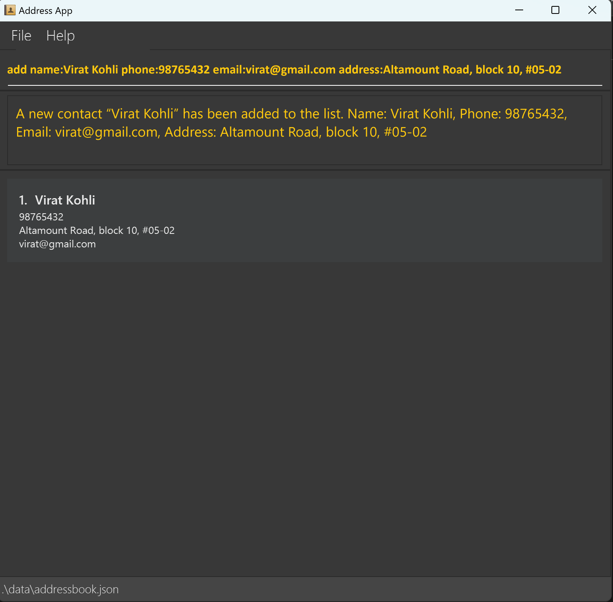
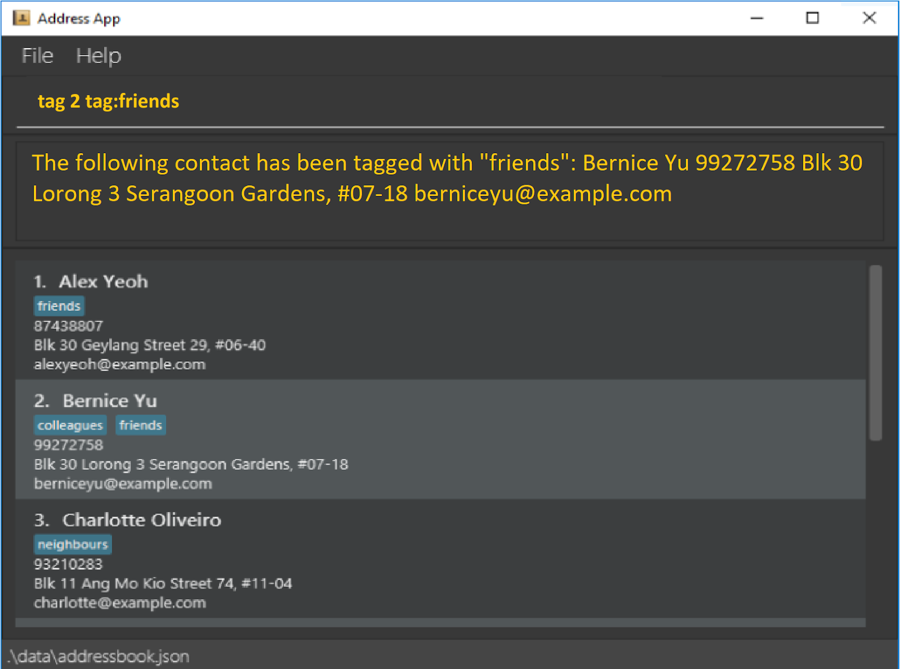
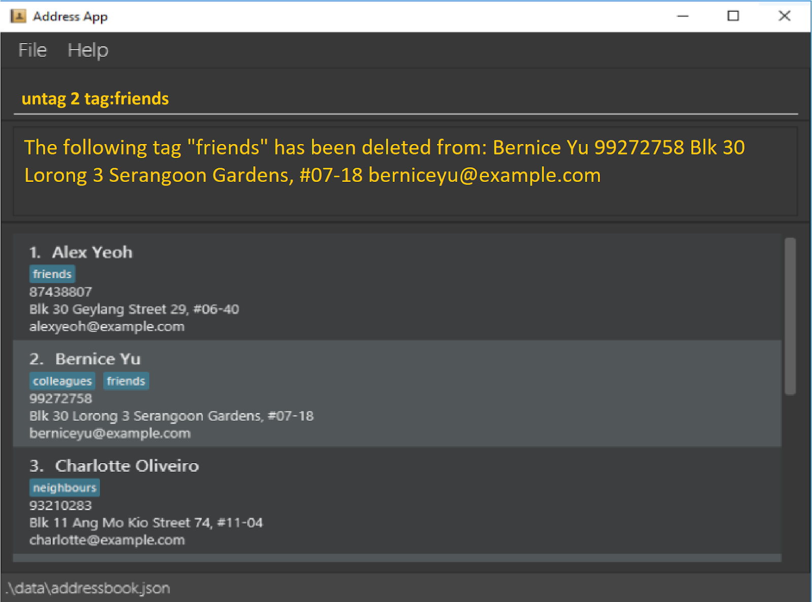

OfficeHarbor (OH) is a **desktop app for managing the contacts of a tech firm's teams, optimized for use via a Command Line Interface** (CLI) while still having the benefits of a Graphical User Interface (GUI). If you can type fast, OH can get your contact management tasks done faster than traditional GUI apps.

* Table of Contents
{:toc}

--------------------------------------------------------------------------------------------------------------------

## Quick start

1. Ensure you have Java `11` or above installed in your Computer.

2. Download the latest `officeharbor.jar` from [here](https://github.com/AY2324S2-CS2103T-W13-2/tp/releases).

3. Copy the file to the folder you want to use as the _home folder_ for your OH.

4. (a) Double-click on the `officeharbor.jar` file to run the application.
   (b) (Or) Open a command terminal, `cd` into the folder you put the jar file in, and use the `java -jar officeharbor.jar` command to run the application. 
   A GUI similar to the below should appear in a few seconds. Note how the app contains some sample data. 
   

5. Type the command in the command box and press Enter to execute it. e.g. typing **`help`** and pressing Enter will open the help window. 
   Some example commands you can try:

   * `list` : Lists all contacts.

   * `add n/John Doe p/98765432 e/johnd@example.com a/John street, block 123, #01-01` : Adds a contact named `John Doe` to OH.

   * `delete 3` : Deletes the 3rd contact shown in the current list.

   * `clear` : Deletes all contacts.

   * `exit` : Exits the app.

6. Refer to the [Features](#features) below for details of each command.

--------------------------------------------------------------------------------------------------------------------

## Features

**:information_source: Notes about the command format:** 

* Words enclosed between diamond brackets `<>`, are the parameters to be supplied by the user. 
  e.g. in `add n/<name>`, `<name>` is a parameter which can be used as `add n/John Doe`.

* Parameters can be in any order for adding a contact. 
  e.g. if the command specifies `n/<name> p/<phone number>`, `p/<phone number> n/<name>` is also acceptable.

* Extraneous parameters for commands that do not take in parameters (such as `help`, `list`, `exit` and `clear`) will be ignored. 
  e.g. if the command specifies `help 123`, it will be interpreted as `help`.

* If you are using a PDF version of this document, be careful when copying and pasting commands that span multiple lines as space characters surrounding line-breaks may be omitted when copied over to the application.

### Viewing help : `help`

Shows a message explaining how to access the help page.

Format: `help`

### Adding a person: `add`

Adds a contact with the input details to OH.

Format: `add n/<name> p/<phone number> e/<email address> a/<address>`

All components are necessary.

Examples:
* `add n/John Doe p/98765432 e/johnd@example.com a/John street, block 123, #01-01`
* `add n/Virat Kohli p/98765432 e/virat@gmail.com a/Altamount Road, block 10, #05-02`

Output:
The message “A new contact `name` has been added to the list. Name: `<name>`, Phone: `<phone number>`, Email: `<email>`, Address: `<address>`.” will be shown. 
A new contact entry with the given user will be displayed in the list.

### Listing all persons : `list`

Shows a list of all contacts in OH.

Format: `list`

Output:
A list of added contacts if any in the form of a scrollable pane will be shown. 
The contacts are listed in the order in which they are added.
The message "Empty list" is shown when there is nothing added.

### Deleting a person : `delete`

Deletes the specified contact from OH.

Format: `delete <id>`

* Deletes the person at the specified `<id>`.
* The id refers to the index number shown in the contact list.
* The id **must be a positive integer** 1, 2, 3, …​

Examples:
* `delete 2` deletes the 2nd person of the contact list from OH.

Output:
The message "Contact `name` has been deleted. Name: `name`, Phone: `phone number`, Email: `email`, Address: `address`.” will be shown.
The entry with the given id will disappear from the list.

### Clearing all entries : `clear`

Clears all entries from OH.

Format: `clear`

Output:
The message "Address book has been cleared!" will be shown.

### Tagging a Contact : `tag`

Tags the specified contact with the input tag name.

* Tags the person at the specified `<id>`.
* The id refers to the index number shown in the displayed person list.
* The id **must be a positive integer** 1, 2, 3, …​

Format: `tag <id> | <tag name>`

Example:
`tag 2 | friends`

Output:
The message "The following contact has been tagged with `<tag name>`: `contact info`.” will be shown, 
where contact info is all the information of the contact.

### Deleting a tag : `delete-tag`

Deletes the specified tag from the specified contact

* Delete the specified tag of the person at the specified `<id>`.
* The id refers to the index number shown in the displayed person list.
* The id **must be a positive integer** 1, 2, 3, …​

Format: `delete-tag <id> | <tag name>`

Output:
The message "The tag `<tag name>` has been removed from contact: `contact info`." will be shown,
where contact info is all the information of the contact. 
The list entry of the user with <id> will not have the tag anymore.

### Exiting the program : `exit`

Exits the program.

Format: `exit`

### Saving the data

OfficeHarbor data are saved in the hard disk automatically after any command that changes the data. There is no need to save manually.

### Editing the data file

OfficeHarbor data are saved automatically as a JSON file `[JAR file location]/data/officeharbor.json`. Advanced users are welcome to update data directly by editing that data file.

:exclamation: **Caution:**
If your changes to the data file makes its format invalid, OfficeHarbor will discard all data and start with an empty data file at the next run. Hence, it is recommended to take a backup of the file before editing it. 
Furthermore, certain edits can cause the OfficeHarbor to behave in unexpected ways (e.g., if a value entered is outside the acceptable range). Therefore, edit the data file only if you are confident that you can update it correctly.

### Filtering tags `[coming in v1.3]`

_Details coming soon ..._

--------------------------------------------------------------------------------------------------------------------

## FAQ

**Q**: How do I transfer my data to another Computer? 
**A**: Install the app in the other computer and overwrite the empty data file it creates with the file that contains the data of your previous OfficeHarbor home folder.

--------------------------------------------------------------------------------------------------------------------

## Known issues

1. **When using multiple screens**, if you move the application to a secondary screen, and later switch to using only the primary screen, the GUI will open off-screen. The remedy is to delete the `preferences.json` file created by the application before running the application again.

--------------------------------------------------------------------------------------------------------------------

## Command summary

| Action     | Format, Examples                                                                                                                                                      |
|------------|-----------------------------------------------------------------------------------------------------------------------------------------------------------------------|
| **Add**    | `add n/NAME p/PHONE_NUMBER e/EMAIL a/ADDRESS [t/TAG]…​`   e.g., `add n/James Ho p/22224444 e/jamesho@example.com a/123, Clementi Rd, 1234665 t/friend t/colleague` |
| **Clear**  | `clear`                                                                                                                                                               |
| **Delete** | `delete INDEX`  e.g., `delete 3`                                                                                                                                   |
| **Edit**   | `edit INDEX [n/NAME] [p/PHONE_NUMBER] [e/EMAIL] [a/ADDRESS] [t/TAG]…​`  e.g.,`edit 2 n/James Lee e/jameslee@example.com`                                           |
| **Find**   | `find KEYWORD [MORE_KEYWORDS]`  e.g., `find James Jake`                                                                                                            |
| **List**   | `list`                                                                                                                                                                |
| **Help**   | `help`                                                                                                                                                                |
