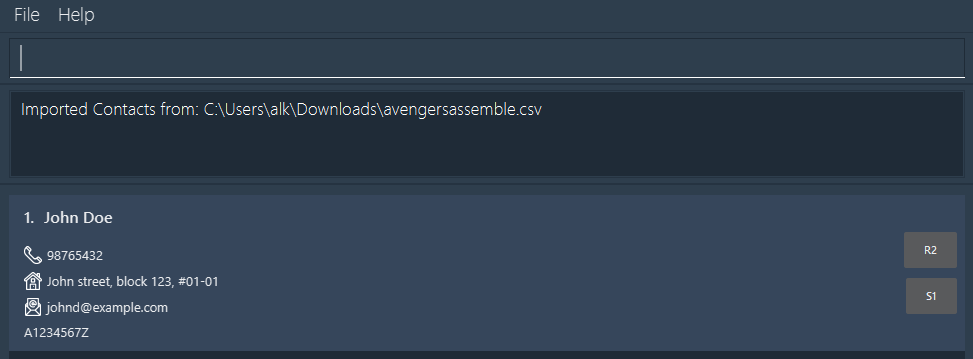

# Avengers Assemble User Guide

Avengers Assemble (AA) is a **desktop app for managing contacts, meant for use with a Command Line Interface** (CLI) 
while still having the benefits of a Graphical User Interface (GUI). 

The application is designed for Head Tutors of the NUS CS1101S Programming Methodology course, who intend to simplify their administrative tasks relating to contact management between students, other teaching assistants, and course instructors.
However, its use cases can be extended to Head Tutors of other courses outside CS1101S. 

Our user guide aims to aid users in understanding how to get started with the application.

<!-- * Table of Contents -->
<page-nav-print />

--------------------------------------------------------------------------------------------------------------------

## Quick Start

1. Ensure you have `Java 11` or above installed in your computer.

1. Download the latest `avengersassemble.jar` [here](https://github.com/AY2324S2-CS2103T-T10-1/tp/releases/tag/v1.2).

1. Copy the file to the folder you want to use as the _home folder_ for our application.

1. Open a command terminal, `cd` into the folder you put the jar file in, and use the `java -jar avengersassemble.jar` command to run the application.<br>
   ```dtd
    cd <path_to_the_folder_containing_the_jar_file>
    java -jar avengersassemble.jar
    ```
   A GUI similar to the below should appear in a few seconds. Note how the app contains some sample data.<br>
   


1. Refer to the [Features](#features) below for details of each command.

--------------------------------------------------------------------------------------------------------------------

## Features

### Getting Help : `help`

Shows a message explaining how to access the help page.


Format: `help`

<box type="info" seamless>

**Note:**

* Words in `UPPER_CASE` are the parameters to be supplied by the user.<br>
  e.g. in `add n/NAME`, `NAME` is a parameter which can be used as `add n/John Doe`.

* Items in square brackets are optional.<br>
  e.g `n/NAME [t/TAG]` can be used as `n/John Doe t/friend` or as `n/John Doe`.

* Items with `…`​ after them can be used multiple times including zero times.<br>
  e.g. `[t/TAG]…​` can be used as ` ` (i.e. 0 times), `t/friend` (i.e 1 time), `t/friend t/family` etc.

* Parameters can be in any order.<br>
  e.g. if the command specifies `n/NAME p/PHONE_NUMBER`, `p/PHONE_NUMBER n/NAME` is also acceptable.

* Extraneous parameters for commands that do not take in parameters (such as `help` , `list`, `exit`, `copy`, `export` and `clear`) will be ignored.<br>
  e.g. if the command specifies `help 123`, it will be interpreted as `help`.

* If you are using a PDF version of this document, be careful when copying and pasting commands that span multiple lines as space characters surrounding line-breaks may be omitted when copied over to the application.

</box>

### Adding a Person: `add`

Adds a person.

Format: `add n/NAME p/PHONE_NUMBER e/EMAIL a/ADDRESS [t/TAG]… [m/MATRICULATION_NUMBER] [s/STUDIO] [r/REFLECTION]​`

<box type="info" seamless>

**Important:** Each person should have an unique email address. AA does not allow for duplicate email addressed to be added.

</box>

<box type="tip" seamless>

**Tip:** A person can have any number of tags (including 0)
</box>

Example:
`add n/John Doe p/98765432 e/johnd@example.com a/John street, block 123, #01-01 m/A1234567Z s/S1 r/R2`

>A success message for the above command will be shown as followed, with the new person in the contact list:
>
>
>


For more details on each parameter, [click here](#command-format-summary).

### Listing All Persons : `list`

Shows a list of all persons.

Format: `list`

>A success message for the above command will be shown as followed, showing all existing persons in the contact list:
>
>
>

### Editing a Person : `edit`

Edits an existing person.


Format: `edit INDEX [n/NAME] [p/PHONE] [e/EMAIL] [a/ADDRESS] [t/TAG]… [m/MATRICULATION_NUMBER] [s/STUDIO] [r/REFLECTION]​`

* Edits the person at the specified `INDEX`. The index refers to the index number shown in the displayed person list. The index **must be a positive integer** 1, 2, 3, …​
* At least one of the optional fields must be provided.
* Existing values will be updated to the input values.
* When editing tags, the existing tags of the person will be removed i.e adding of tags is not cumulative.
* You can remove all the person’s tags by typing `t/` without
    specifying any tags after it.

Examples:
*  `edit 1 p/91234567 e/johndoe@example.com` Edits the phone number and email address of the 1st person to be `91234567` and `johndoe@example.com` respectively.

>A success message for the above command will be shown as followed, indicating the updated details of the person:
>
>

*  `edit 2 n/Betsy Crower t/` Edits the name of the 2nd person to be `Betsy Crower` and clears all existing tags.

For more details on each parameter, [click here](#command-format-summary).

### Filtering Persons: `find`

Filter persons based on specific criteria within their records.

Format: `find PREFIX/KEYWORD`

* This command searches for persons using a specific aspect of their details, as specified by the prefix.
* The search will return any result that contains the keyword as a substring under the indicated prefix. e.g. `find e/john` will find any person that contains `john` in their email.
* The search is case-insensitive. e.g. `hans` will match `Hans`.
* Only one prefix can be used for filtering at a time.

Examples:
* `find n/John` returns `john` and `John Doe`.

>A success message for the above command will be shown as followed, showing all persons that match the search criteria:
>
>

* `find n/alex` returns `Alex Yeoh`, `Davis Alex`.
* `find t/student` returns all persons tagged with `student` or any persons with tags that has `student` as a substring.
* `find p/1423` returns all persons with phone number containing `1423`.

For more details on each parameter, [click here](#command-format-summary).

### Copy Email Addresses: `copy`

Copies the emails of currently displayed persons into your clipboard.

Format: `copy`

>A success message for the above command will be shown as followed, indicating that the details have been copied to the clipboard:
>
>

* Use `list` or `find` to get the list of people you would like to email.
* The emails are copied into your clipboard such that you may easily broadcast emails
  to specific groups of people.

### Deleting a Person : `delete`

Deletes the specified person.

Format: `delete INDEX`

* Deletes the person at the specified `INDEX`.
* The index refers to the index number shown in the displayed person list.
* The index **must be a positive integer** 1, 2, 3, …​

Examples:
* `list` followed by `delete 2` deletes the 2nd person in AA.
* `find Betsy` followed by `delete 1` deletes the 1st person in the results of the `find` command.

>A success message for the above command will be shown as followed, indicating the details of the deleted person:
>
>

### Clearing All Entries : `clear`

Deletes all entries.

Format: `clear`

>A success message for the above command will be shown as followed, indicating all entries have been cleared:
>
>

### Exporting Data to a CSV File : `export`

Exports currently listed persons and their details to a CSV file, `avengersassemble.csv`, which can be found in `addressbookdata`.

**Steps:**
1. Filter out the persons you want to export using the [`find`](#filtering-persons--find) or
[`list`](#listing-all-persons--list) command.
2. Type `export` to export the currently listed persons and their details to a CSV file.
3. Upon export, a folder named `addressbookdata` will be created in the same directory where Avengers Assemble is located. Within this folder, you'll find the CSV file named `avengersassemble.csv`, containing the exported data.

Format: `export`

> A success message for the above command will be shown as followed, indicating that the data has been exported:
>
> 

<box type="info" seamless>

**Important:** When performing an export, the current information will overwrite the existing CSV file named `avengersassemble.csv` located within the `addressbookdata` folder.
A new CSV file will not be created with each export.

Users have the option to manually move the current CSV file out of the `addressbookdata` folder if they do not want the information to be overwritten in the next export.
A new CSV file of the same name in the same location will again be created when performing the next export.

</box>

### Importing Data from a CSV File : `import`

Imports all persons and their details from a CSV file from a specified file path. This filepath should be an
absolute filePath.

Format: `import i/FILEPATH`

Example:

`import i/C:/Users/alk/Downloads/avengersassemble.csv`

> A success message for the above command will be shown as followed, indicating the filepath that has been imported and showing all imported contacts:
> 
> 

imports the persons saved in `FILEPATH` to `avengersassemble.json`

For more details on the input parameter, [click here](#command-format-summary).

### Exiting the Program : `exit`

Exits the program.

Format: `exit`

--------------------------------------------------------------------------------------------------------------------

## Additional Information

### Saving the Data

All data are saved in the hard disk automatically after any command that changes the data. There is no need to save manually.

### Editing the Data File

All data are saved automatically as a JSON file, `[JAR file location]/data/avengersassemble.json`. Advanced users are welcome to update data directly by editing that data file.

<box type="warning" seamless>

**Caution:**
If your changes to the data file makes its format invalid, Avengers Assemble will discard all data and start with an empty data file at the next run.  Hence, it is recommended to take a backup of the file before editing it.<br/>
Furthermore, certain edits can cause the Avengers Assemble application to behave in unexpected ways (e.g., if a value entered is outside the acceptable range). Therefore, edit the data file only if you are confident that you can update it correctly.
</box>

--------------------------------------------------------------------------------------------------------------------

## FAQ

**Q**: How do I transfer my data to another Computer?<br>
**A**: Install the app in the other computer and overwrite the empty data file it creates with the file that contains the data of your previous AA home folder.

--------------------------------------------------------------------------------------------------------------------

## Known Issues

1. **When using multiple screens**, if you move the application to a secondary screen, and later switch to using only the primary screen, the GUI will open off-screen. The remedy is to delete the `preferences.json` file created by the application before running the application again.

--------------------------------------------------------------------------------------------------------------------

## Command Summary

Below is a summary of the commands available in Avengers Assemble. Some examples are included for your convenience.

| Action            | Format, Examples                                                                                                                                                                                                                         |
|-------------------|------------------------------------------------------------------------------------------------------------------------------------------------------------------------------------------------------------------------------------------|
| **Add**           | `add n/NAME p/PHONE_NUMBER e/EMAIL a/ADDRESS [t/TAG]… [m/MATRICULATION_NUMBER] [s/STUDIO] [r/REFLECTION]​` <br><br>• e.g. `add n/James Ho p/22224444 e/jamesho@example.com a/123, Clementi Rd, 1234665 t/friend t/colleague m/A1234567X` |
| **Clear**         | `clear`                                                                                                                                                                                                                                  |
| **Delete**        | `delete INDEX` <br><br>• e.g. `delete 3`                                                                                                                                                                                                 |
| **Edit**          | `edit INDEX [n/NAME] [p/PHONE_NUMBER] [e/EMAIL] [a/ADDRESS] [t/TAG]… [m/MATRICULATION_NUMBER] [s/STUDIO] [r/REFLECTION]​` <br><br>• e.g.`edit 2 n/James Lee e/jameslee@example.com m/A1234567X`                                          |
| **Find**          | `find PREFIX/KEYWORD` <br><br>• e.g. `find n/James`                                                                                                                                                                                      |
| **Copy**          | `copy`                                                                                                                                                                                                                                   |
| **List**          | `list`                                                                                                                                                                                                                                   |
| **Help**          | `help`                                                                                                                                                                                                                                   |
| **Export to CSV** | `export`                                                                                                                                                                                                                                 |
| **Import**        | `import i/FILEPATH` <br><br>• e.g. `import i/C:/Users/alk/Downloads/avengersassemble.csv`                                                                                                                                                |


## Command Format Summary

Some commands require you to include parameters. These parameters are identified by prefixes. Here are a list of valid prefixes and what they each refer to.

<box type="info" seamless>

**Note:** </br>
* Prefixes encased with '[ ]' are optional.
* Prefixes with '…' after them can be used multiple times.

</box>


| Prefix | What it refers to          | Constraints                                                                                                                                                                                                                                                                                                                                                                                                                                                                                                                      |
|--------|----------------------------|----------------------------------------------------------------------------------------------------------------------------------------------------------------------------------------------------------------------------------------------------------------------------------------------------------------------------------------------------------------------------------------------------------------------------------------------------------------------------------------------------------------------------------|
| n/     | Name                       | Should only contain alphanumeric characters and spaces.                                                                                                                                                                                                                                                                                                                                                                                                                                                                          |
| p/     | Phone Number               | Should only contain numbers, and it should be at least 3 digits long.                                                                                                                                                                                                                                                                                                                                                                                                                                                            |
| e/     | Email                      | **Format:** local-part@domain<br/> **Constraints for local part:**<br/> • Should only contain alphanumeric characters, and the characters `+`, `_`, `.` and `-`<br/> • Should not start with special characters<br/> **Constraints for domain:**<br/> • Made up of domain labels followed by periods<br/> • Must end with a domain label of at least 2 characters long<br/> • Should start and end with alphanumeric characters<br/> • Domain label should consists of alphanumeric characters separated only by hyphens, if any |         
| a/     | Address                    | Can take any values.                                                                                                                                                                                                                                                                                                                                                                                                                                                                                                             |
| i/     | Path of CSV file to import | Should be the absolute file path of the CSV file.                                                                                                                                                                                                                                                                                                                                                                                                                                                                                |
| [m/]   | Matriculation ID           | The first letter must be an uppercase 'A', followed by 7 numbers, and end with an uppercase letter.                                                                                                                                                                                                                                                                                                                                                                                                                              |
| [r/]   | Recitation Group           | The first letter must be an uppercase 'R', followed by any number.                                                                                                                                                                                                                                                                                                                                                                                                                                                               |
| [s/]   | Studio Group               | The first letter must be an uppercase 'S', followed by any number.                                                                                                                                                                                                                                                                                                                                                                                                                                                               |
| [t/]…  | Tags                       | Should be alphanumeric, and should not contain spaces.                                                                                                                                                                                                                                                                                                                                                                                                                                                                           |
